# Guarda-Roupa — Catálogo feminino (peças e silhuetas)

**Pasta de imagens:** [imagens/crew/guarda_roupas/](../imagens/crew/guarda_roupas/)  
**Curadoria:** Women Style (~69 → **26** looks) · 13–14/07/2026

> **Foco absoluto: a roupa.**  
> Use este arquivo para descrever **corte, tecido, cor, camadas, calçado e acessórios de vestuário**.  
>
> **Ignore na imagem (não copiar para a cena):**
> - rosto, cabelo, corpo, pose, idade do modelo  
> - **armas, coldres, holsters, drones**  
> - **chrome / cyberarms / implantes** (a menos que a **ficha** do personagem já os tenha)  
>
> Qualquer personagem feminino (crew ou NPC) pode usar qualquer slot se a **cena** pedir.  
> Este catálogo **não** define default por personagem.

**Acessórios que contam como roupa:** cinto, choker, luvas, meias, correntes de cinto, bolsos/cintura utilitária genérica, bolsas de ombro.  
**Não listar:** pistolas, rifles, coldres de arma, chrome da foto.

---

## Índice rápido

| Ocasião | Arquivo | Peças-chave |
| ------- | ------- | ----------- |
| Badlands — tático | `badlands_tactical.jpg` | Trench oliva + top + cargo com joelheiras + botas |
| Badlands — utilitário | `badlands_utility.jpg` | Boné + jaqueta multi-bolsos + cargo oliva + tênis/botas |
| Badlands — casual nomad | `badlands_casual_nomad.jpg` | Top esportivo + jeans + cinto/bolsa de couro + botas marrom |
| Street — cargo atlético | `street_cargo_athletic.jpg` | Crop gola alta + cargo branca + cinto largo |
| Street — all black | `street_allblack_set.png` | Halter lace-up + skinny + hoodie cropped + botas |
| Street — alt plaid | `street_alt_plaid.jpg` | Xadrez roxo cropped + mini saia + meia-arrastão |
| Street — leather trench | `street_leather_trench.jpg` | Trench couro preto + turtleneck + luvas longas |
| Street — hoodie + saia | `street_hoodie_pleat.jpg` | Moletom cropped vermelho/preto + saia plissada + tênis |
| Tech — netrunner | `tech_netrunner_pink.jpg` | Jaqueta rosa + body/catsuit azul + cinto multi-bolsos + botas tech |
| Tech — crop jacket | `tech_crop_jacket.jpg` | Crop zip rosa/preto + jaqueta oversized branca + shorts |
| Club — corset platform | `club_corset_platform.png` | Corset off-shoulder + shorts couro + botas over-knee platform |
| Club — goth plaid | `club_goth_plaid.png` | Vestido/saia xadrez + top preto + botas platform + meias |
| Club — casaco gótico | `club_gothic_coat.jpg` | Sobretudo preto/vermelho + corset + shorts + botas salto |
| Formal — blazer + saia | `formal_blazer_skirt.jpg` | Blazer preto + top burgundy + saia plissada + meias-liga |
| Formal — camisa office | `formal_shirt_office.jpg` | Camisa social escura + calça preta + relógio |
| Formal — roxo elegante | `formal_purple_elegant.jpg` | Conjunto roxo bordado + cargo elegante + saltos |
| Evening — gown preto | `evening_gown_black.jpg` | Vestido longo preto, fenda, cauda |
| Evening — fenda | `evening_slit_dress.jpg` | Vestido preto cruzado, cut-outs, fenda alta |
| Evening — qipao | `evening_qipao_black.jpg` | Qipao preta com motivo dourado, fenda lateral |
| Evening — gown vermelho | `evening_red_gown.jpg` | Vestido vermelho/ouro com cauda |
| Combate — bodysuit | `combat_bodysuit_green.jpg` | Body/tactical top verde + harness + cargo preta |
| Combate — cargo oliva | `combat_cargo_olive.jpg` | Jaqueta militar oliva + crop + cargo oliva |
| Gym | `gym_sportswear.jpg` | Top + short esportivos pretos |
| Treino marcial | `training_martial.jpg` | Top esportivo + calça larga preta/branca |
| Soft / apresentável | `soft_blouse_corset.png` | Blusa clara + corset marrom + calça escura + botas |
| Fantasia steampunk | `steampunk_corset.jpg` | Blusa branca + corset + cauda burgundy |

---

# BADLANDS / CAMPO

## Tático / scav

**Arquivo:** `badlands_tactical.jpg`  
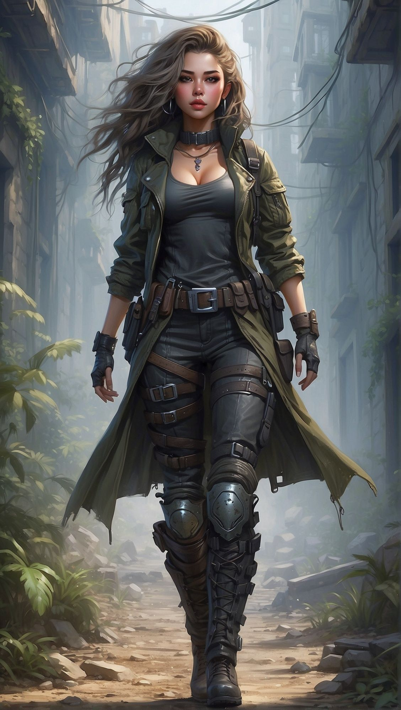

### Descrição visual (roupa)
- Casaco/trench **verde-oliva** longo, aberto, bolsos grandes  
- Top/camiseta cinza justa por baixo  
- Calça tática com tiras e **joelheiras** (peça de vestuário/proteção de roupa)  
- Cinto largo com bolsos/cintura utilitária  
- Botas de combate altas  
- Luvas sem dedos; choker fino (acessório)

### Quando usar
Campo, scav, perímetro, deslocamento em Badlands com visual “pronta para o terreno”.

---

## Utilitário / pack

**Arquivo:** `badlands_utility.jpg`  
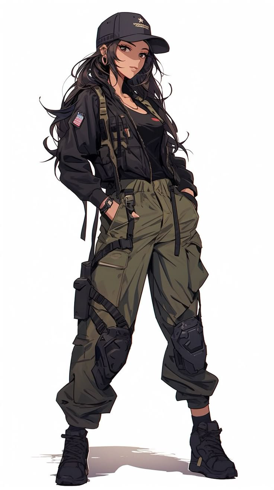

### Descrição visual (roupa)
- Boné  
- Jaqueta utilitária preta com muitos bolsos e zíperes  
- Calça cargo **oliva** volumosa, reforços nos joelhos  
- Tênis ou botas pretas baixas/médias  
- Camadas escuras por baixo da jaqueta

### Quando usar
Dia a dia de acampamento, oficina, patrulha leve, trabalho prático.

---

## Casual nomad

**Arquivo:** `badlands_casual_nomad.jpg`  
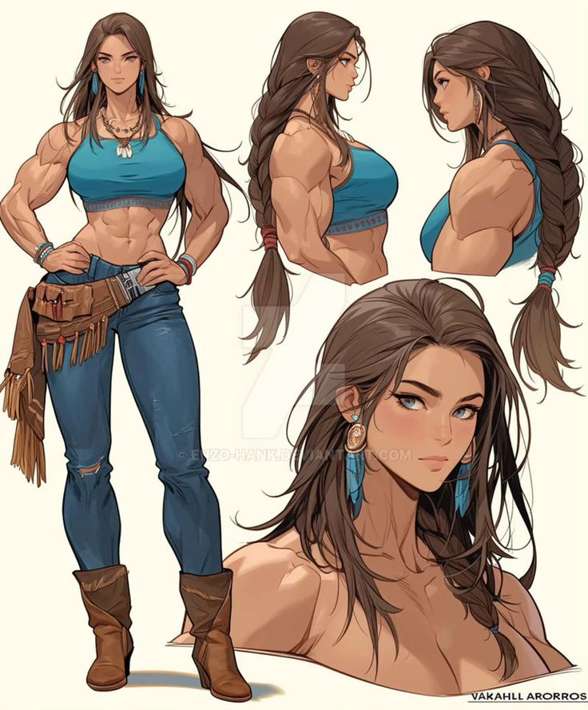

### Descrição visual (roupa)
- Top esportivo / crop sem mangas (azul ou similar)  
- Jeans com desgaste  
- Cinto de couro com **bolsa/pochete** de tecido ou couro na cintura  
- Botas marrom de cano médio  
- Acessórios leves de colar/pulseira se a cena quiser (opcional)

### Quando usar
Folga no pack, fogueira, visual nomad descontraído.

---

# STREET / NIGHT CITY

## Cargo atlético

**Arquivo:** `street_cargo_athletic.jpg`  
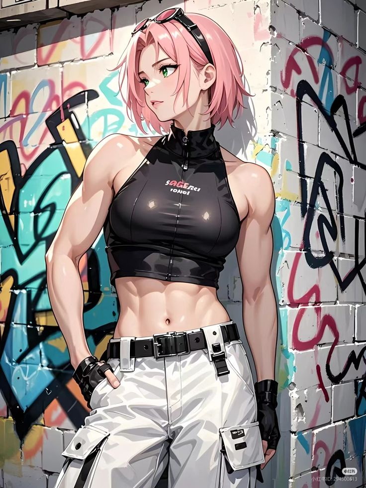

### Descrição visual (roupa)
- Crop top preto, gola alta, costas/ombros descobertos (halter)  
- Calça cargo **clara/branca** com bolsos laterais  
- Cinto preto largo com fivela  
- Luvas curtas sem dedos  
- Óculos de sol no cabelo (acessório)

### Quando usar
Rua, deslocamento urbano, visual street atlético.

---

## All-black set

**Arquivo:** `street_allblack_set.png`  
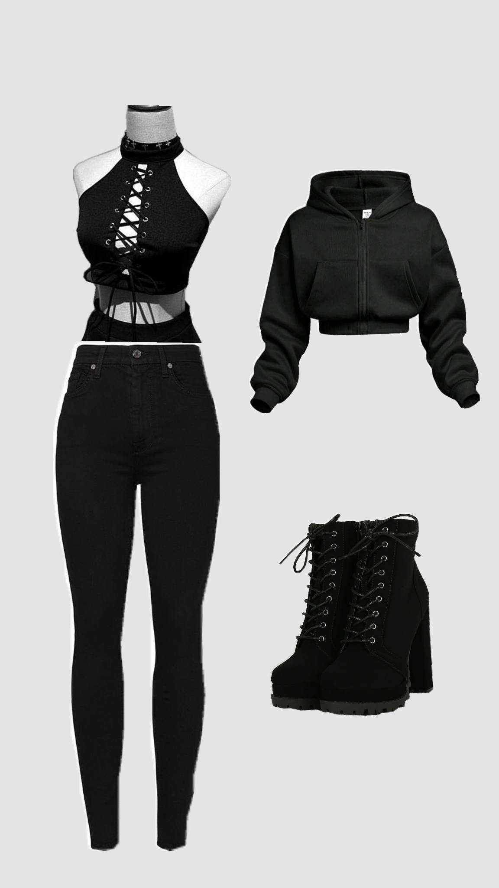

### Descrição visual (roupa)
- Top halter preto com **cadarço/lace-up** na frente  
- Calça jeans skinny preta  
- Moletom/hoodie cropped preto com zíper e capuz  
- Botas pretas de cano médio, salto bloco  
- Choker fino

### Quando usar
Saída urbana “tudo preto”, base de street fashion.

---

## Alt plaid

**Arquivo:** `street_alt_plaid.jpg`  
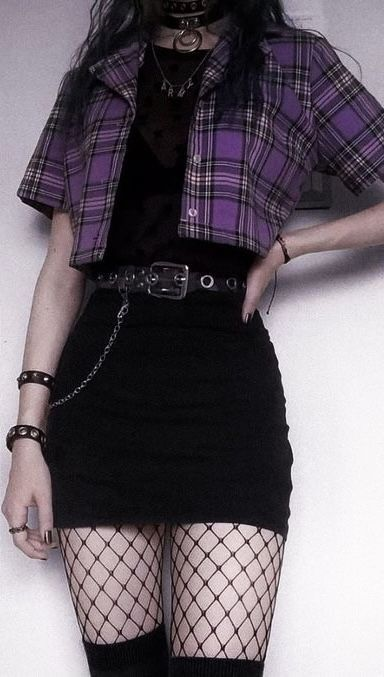

### Descrição visual (roupa)
- Camisa xadrez **roxa/lilás** cropped, aberta  
- Top preto por baixo  
- Mini saia preta justa  
- Cinto com corrente pendente  
- Meia-arrastão; pulseiras/choker

### Quando usar
Night out casual, bar, vibe alt.

---

## Leather trench

**Arquivo:** `street_leather_trench.jpg`  
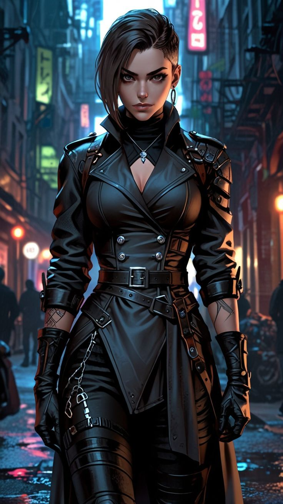

### Descrição visual (roupa)
- Trench/casaco de **couro preto**, botões duplos, ombreiras estruturadas  
- Gola alta / turtleneck por baixo  
- Luvas longas pretas  
- Cinto do próprio casaco; corrente decorativa na cintura  
- Calça/leggings pretas justas (camada inferior)

### Quando usar
Noite em Night City, visual edgerunner elegante, presença forte sem kit de combate completo.

---

## Hoodie + saia

**Arquivo:** `street_hoodie_pleat.jpg`  
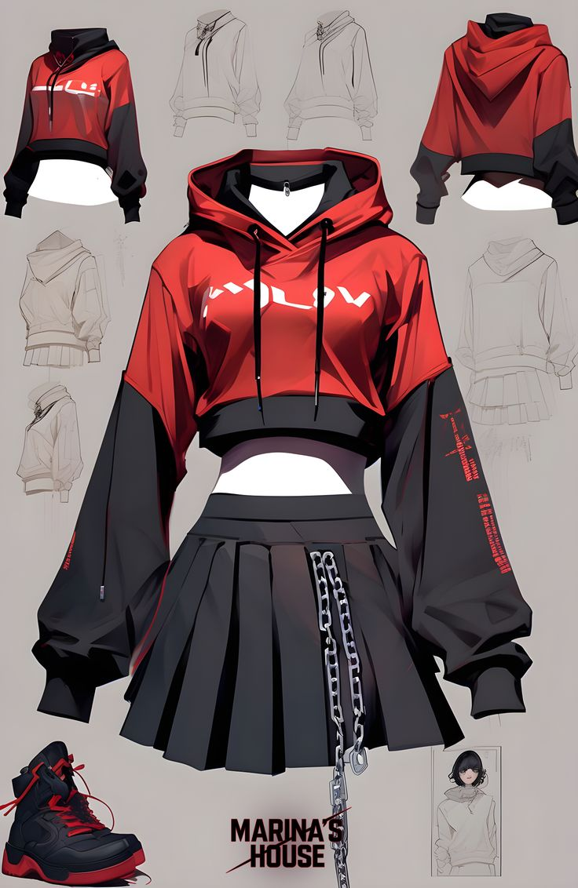

### Descrição visual (roupa)
- Moletom cropped **vermelho e preto**, capuz, cordões  
- Mini saia plissada preta  
- Corrente de cinto/prata pendente  
- Tênis high-top pretos com detalhe vermelho

### Quando usar
Street fashion jovem, folga urbana, visual casual ousado.

---

# TECH

## Netrunner (rosa + body)

**Arquivo:** `tech_netrunner_pink.jpg`  
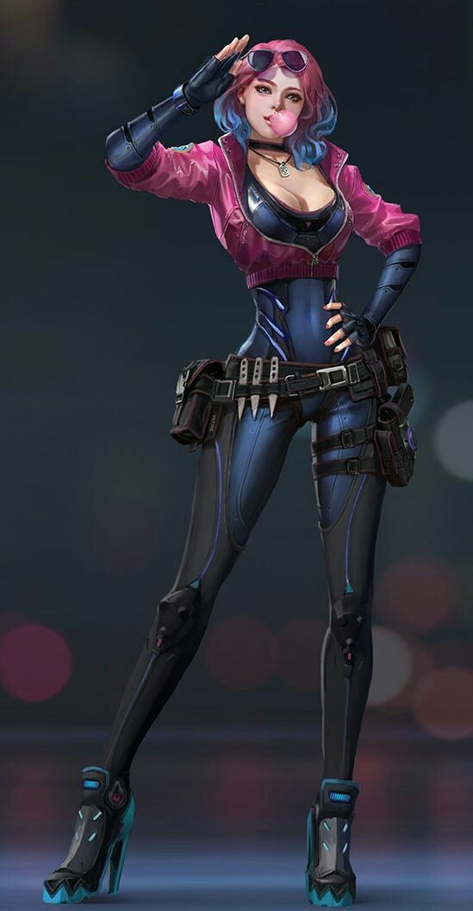

### Descrição visual (roupa)
- Jaqueta curta **rosa**  
- Body / catsuit azul-escuro com linhas claras (tecido tech)  
- Cinto com bolsas e alças (cintura utilitária de roupa)  
- Botas de salto com detalhes coloridos  
- Luvas sem dedos

### Quando usar
Visual tech/netrunner, clube tech, job de rua com estética cyber.

---

## Crop + jaqueta tech

**Arquivo:** `tech_crop_jacket.jpg`  
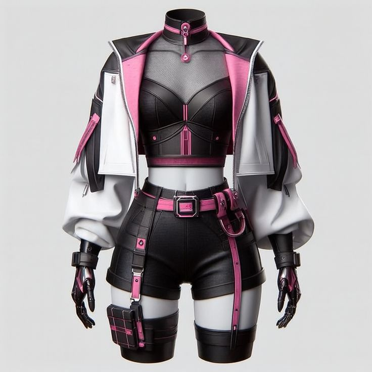

### Descrição visual (roupa)
- Crop top preto com zíperes e detalhes rosa, gola alta  
- Jaqueta oversized **branca** (forro/contraste rosa)  
- Shorts pretos de cintura alta  
- Cinto rosa com alças; pulseiras/luvas pretas

### Quando usar
Variante street-tech, saída fashion cyber.

---

# CLUBE / NOITE

## Corset + platform

**Arquivo:** `club_corset_platform.png`  
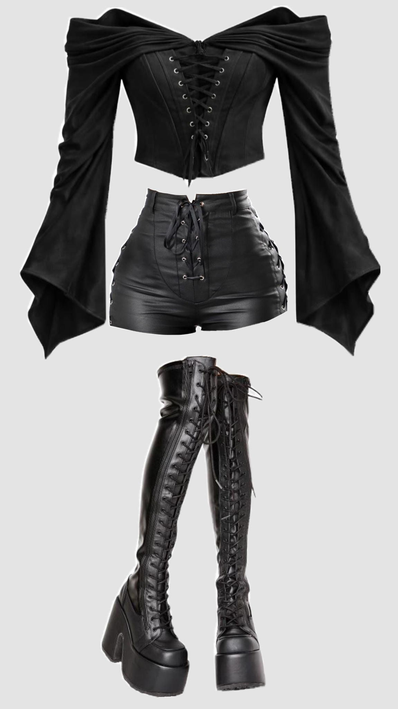

### Descrição visual (roupa)
- Corset/top preto off-shoulder, cadarço frontal, mangas longas tipo sino  
- Shorts de material tipo couro, laterais com lace-up  
- Botas pretas **acima do joelho**, platform, cadarço frontal

### Quando usar
Clube, corpo, noite ousada.

---

## Goth plaid

**Arquivo:** `club_goth_plaid.png`  
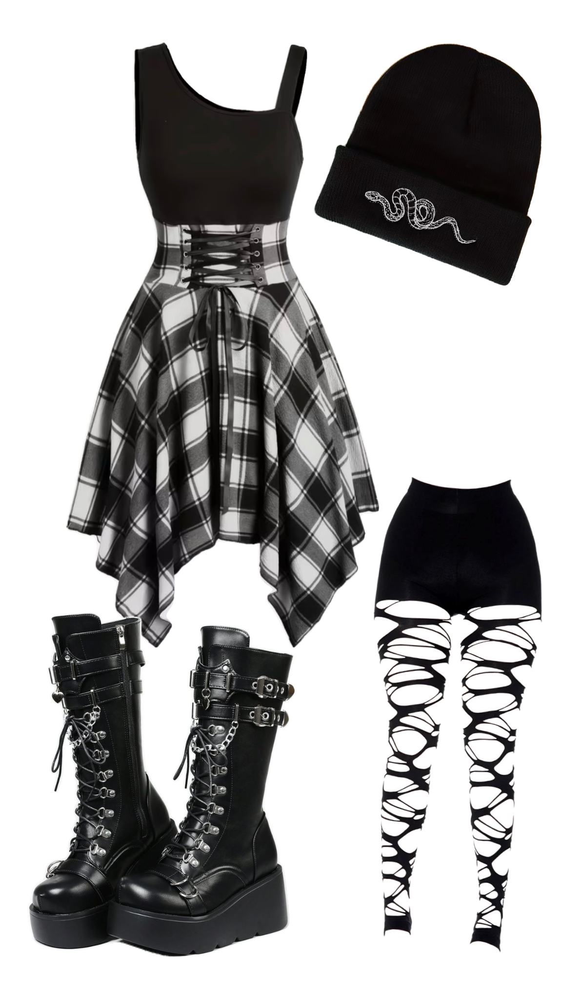

### Descrição visual (roupa)
- Top/vestido com corset e saia **xadrez** assimétrica (preto e cinza)  
- Gorro/beanie preto  
- Meias ou calça legging com recortes  
- Botas platform pretas com fivelas e correntes

### Quando usar
Night out alt/goth.

---

## Casaco gótico

**Arquivo:** `club_gothic_coat.jpg`  
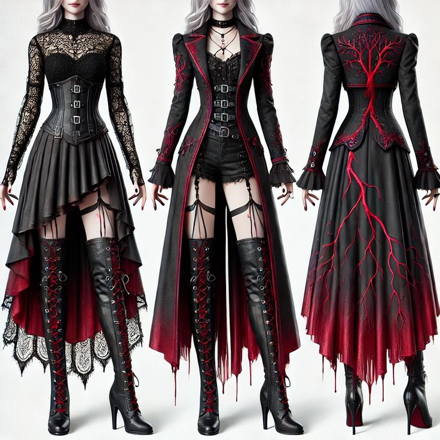

### Descrição visual (roupa)
- Sobretudo longo preto com detalhes/forro **vermelho**  
- Corset + shorts pretos  
- Meias-liga; botas de salto com cadarço colorido  
- Camadas de renda/tecido nas mangas ou saia interna

### Quando usar
Clube high-end, visual dark dramático.

---

# FORMAL

## Blazer + saia

**Arquivo:** `formal_blazer_skirt.jpg`  
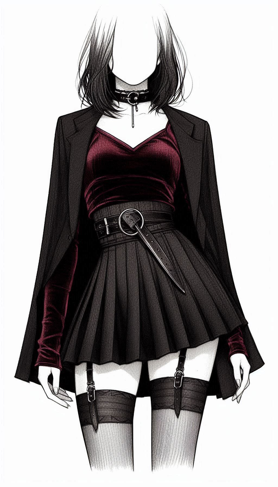

### Descrição visual (roupa)
- Blazer preto aberto  
- Top/camisole **burgundy** ou vinho  
- Saia plissada preta curta  
- Cinto largo com fivela/anel  
- Meias-liga e meia-calça; choker

### Quando usar
Cliente semi-formal, jantar elegante, “arrumada sem ser gala”.

---

## Camisa office

**Arquivo:** `formal_shirt_office.jpg`  
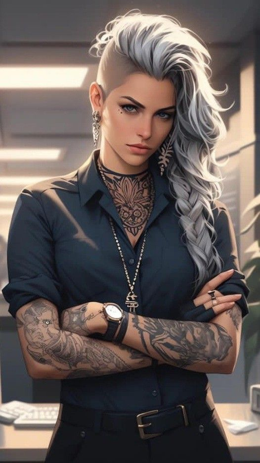

### Descrição visual (roupa)
- Camisa social de colarinho, cor escura (marinho/preto), mangas dobradas  
- Calça preta de cintura definida  
- Cinto fino; relógio de pulso  
- Colares finos (acessório)

### Quando usar
Reunião, clínica, visual profissional de rua.

---

## Roxo elegante

**Arquivo:** `formal_purple_elegant.jpg`  
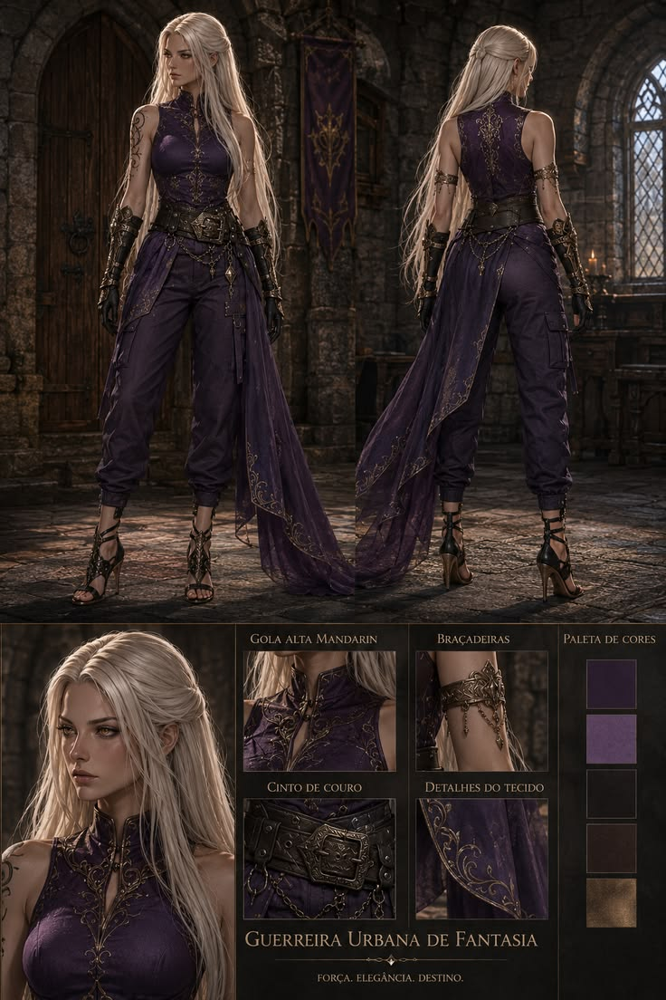

### Descrição visual (roupa)
- Conjunto roxo (top gola alta / mandarim + calça cargo elegante)  
- Bordados dourados; cinto de couro ornamentado  
- Cauda/tecido fluido opcional nas costas  
- Saltos de tiras; braçadeiras decorativas

### Quando usar
Evento de gala com estética “fantasia urbana”.

---

# EVENING / GALA

## Gown preto

**Arquivo:** `evening_gown_black.jpg`  
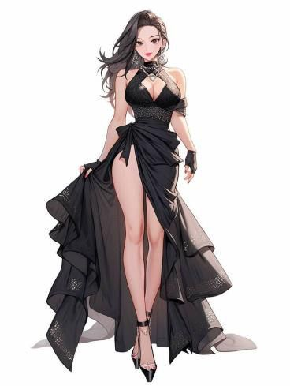

### Descrição visual (roupa)
- Vestido longo preto, decote profundo  
- Fenda alta; tecido fluido com cauda  
- Saltos; luva curta opcional

### Quando usar
Gala, corpo, evento formal de alto nível.

---

## Fenda preta

**Arquivo:** `evening_slit_dress.jpg`  
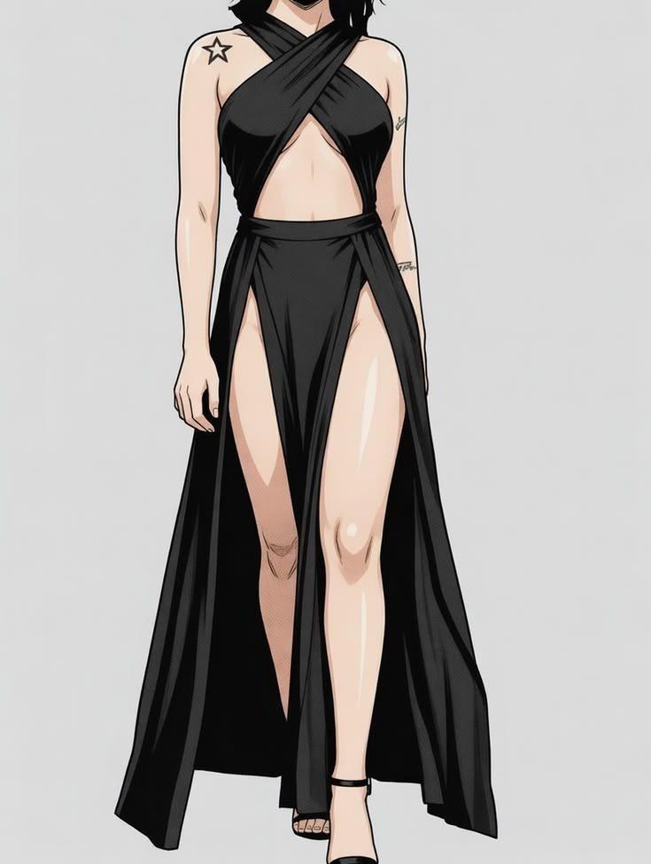

### Descrição visual (roupa)
- Vestido preto com alças cruzadas no peito  
- Aberturas no torso; fendas altas nas pernas  
- Sandálias de tira

### Quando usar
Variante de evening mais ousada e minimalista.

---

## Qipao / cheongsam

**Arquivo:** `evening_qipao_black.jpg`  
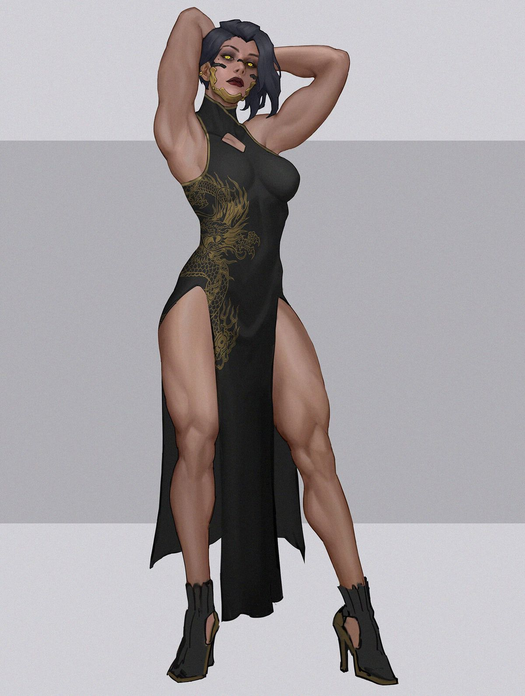

### Descrição visual (roupa)
- Vestido tipo qipao preto, gola alta  
- Motivo dourado (ex. dragão) no tecido  
- Fenda lateral alta; saltos finos

### Quando usar
Evento formal com estética leste-asiática / ousado estruturado.

---

## Gown vermelho

**Arquivo:** `evening_red_gown.jpg`  
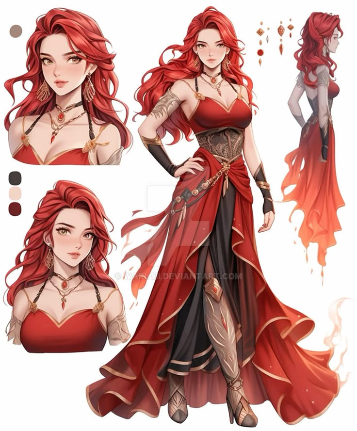

### Descrição visual (roupa)
- Vestido vermelho com detalhes dourados  
- Corset/cintura marcada; cauda longa  
- Saltos; joias de colar/brinco (acessório)

### Quando usar
Gala quente, destaque visual vermelho.

---

# COMBATE / TREINO (roupa tática ou esportiva)

## Bodysuit / tactical top verde

**Arquivo:** `combat_bodysuit_green.jpg`  
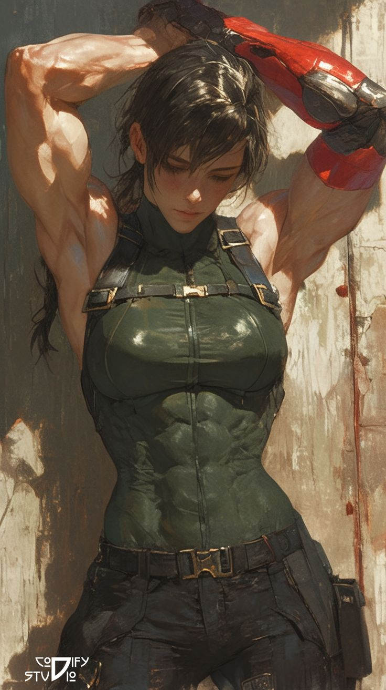

### Descrição visual (roupa)
- Top/body tático **verde-escuro** justo, zíperes e tiras  
- Calça cargo preta  
- Cintos e alças de vestuário no tronco  
- *(Ignorar braço/chrome da foto se não for da ficha.)*

### Quando usar
Combate, treino pesado, visual de campo fechado.

---

## Cargo oliva (ação)

**Arquivo:** `combat_cargo_olive.jpg`  
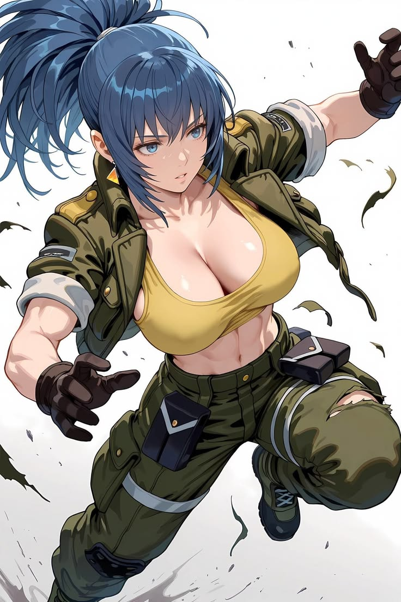

### Descrição visual (roupa)
- Jaqueta militar oliva aberta  
- Crop/top claro por baixo  
- Calça cargo oliva com bolsos  
- Luvas pretas curtas

### Quando usar
Ação, patrulha, visual militar-casual.

---

## Gym

**Arquivo:** `gym_sportswear.jpg`  
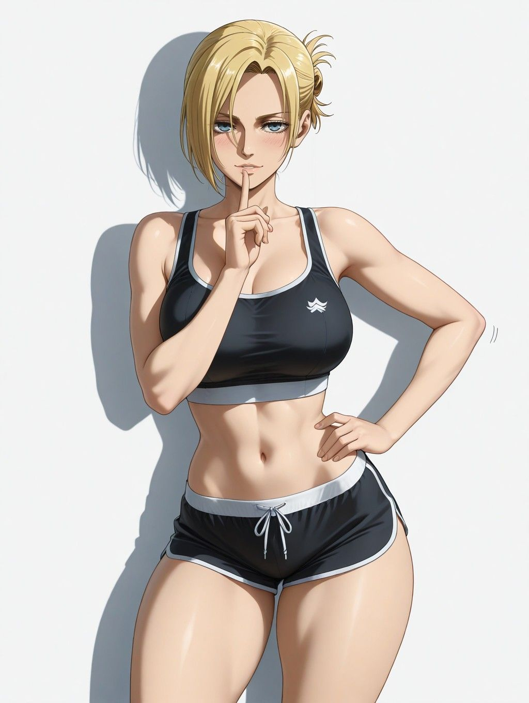

### Descrição visual (roupa)
- Top esportivo preto com borda clara  
- Short esportivo combinando  
- Visual de academia / corrida

### Quando usar
Treino físico, aquecimento.

---

## Marcial

**Arquivo:** `training_martial.jpg`  
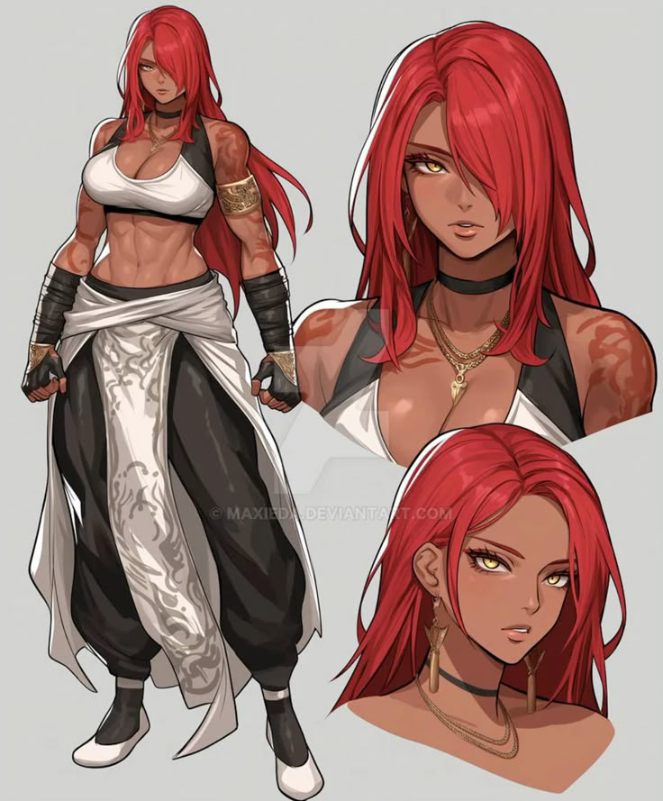

### Descrição visual (roupa)
- Top esportivo / halter  
- Calça larga preta com faixa ou painel branco  
- Luvas sem dedos; calçado leve de treino

### Quando usar
Sparring, dojo, treino marcial.

---

# SOFT / FANTASIA

## Blusa + corset soft

**Arquivo:** `soft_blouse_corset.png`  
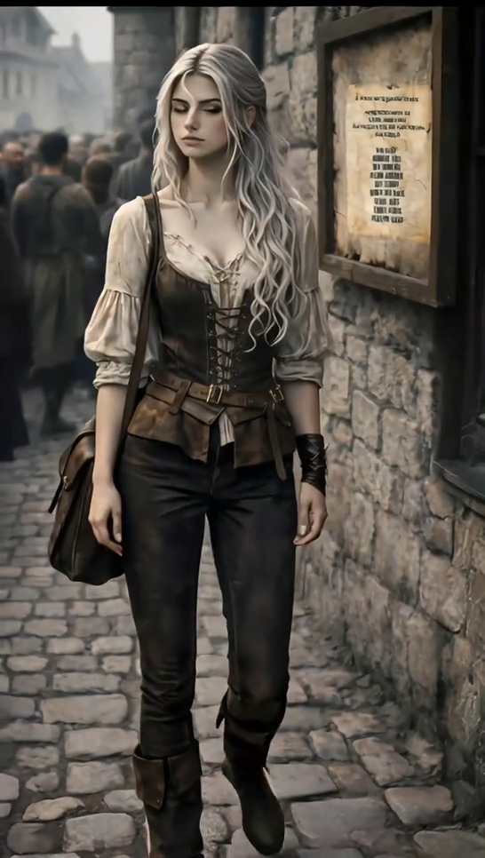

### Descrição visual (roupa)
- Blusa clara, mangas longas levemente bufantes  
- Corset/colete de couro marrom com lace-up  
- Calça escura justa; botas de cano médio  
- Bolsa transversal de couro  
- Braceletes de couro no pulso

### Quando usar
Jantar no pack, “arrumada sem ser clube”, saída apresentável.

---

## Steampunk corset

**Arquivo:** `steampunk_corset.jpg`  
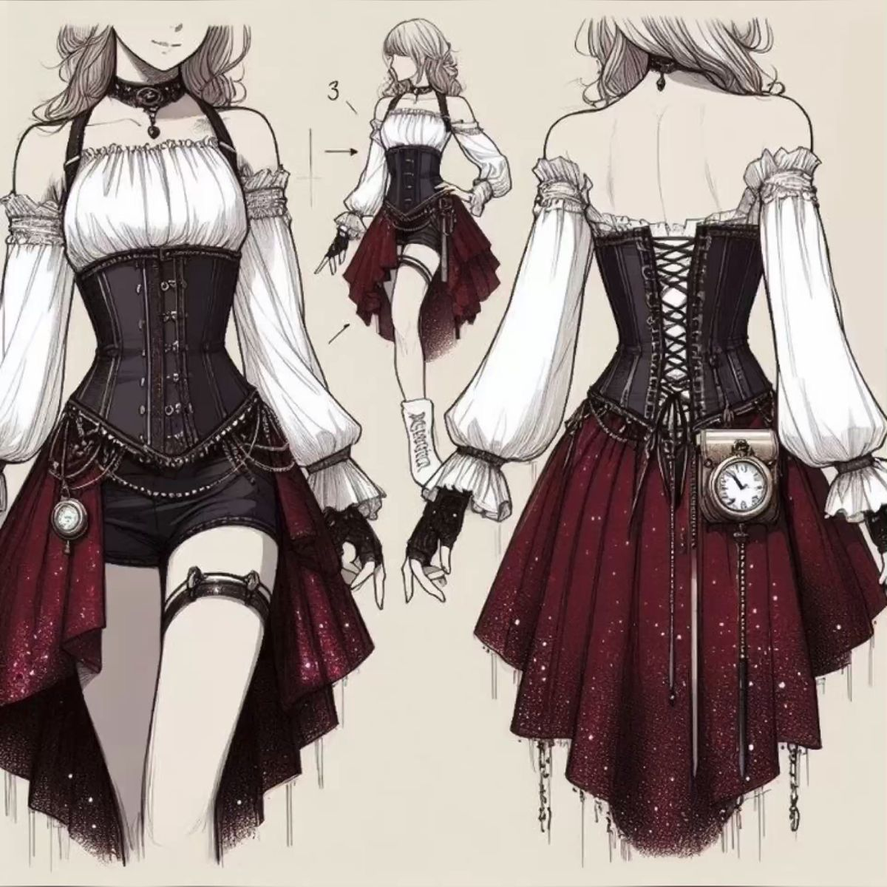

### Descrição visual (roupa)
- Blusa branca ombro a ombro, mangas longas  
- Corset preto com fivelas  
- Cauda/saia burgundy assimétrica  
- Meias-liga; luvas sem dedos; relógio de bolso como acessório  
- Sheet de referência (frente/costas)

### Quando usar
Fantasia, bar temático, evento raro — **não** look de job.

---

## Notas de narração

1. Descreva **só a roupa** a partir do slot escolhido.  
2. Não copie rosto, cabelo ou corpo do modelo da imagem.  
3. Não assuma armas ou chrome só porque aparecem na foto.  
4. **Quem** veste o look é decisão da cena / ficha — não deste arquivo.  
5. Em dúvida de “o que ela está vestindo?”, abra o slot da ocasião e liste 3–5 peças.

---

## Referências

- [Valk](nomad%20-%20lena_valk_kane.md) · [Alex](netrunner%20-%20alex_specter_kane.md) · [Reina](solo%20-%20reina_bearclaw_morales.md) · [Stitch](medtech%20-%20stephania_stitch_voss.md)  
- [Ryan — guarda-roupa](ryan_guarda_roupas.md) · [Mapa](../relacionamentos/mapa_relacional_geral.md) · [Registro](../sistema/registro_arquivos.md)
