# Guarda-Roupa — Catálogo feminino (peças e silhuetas)

**Pasta de imagens:** [imagens/crew/guarda_roupas/](../imagens/crew/guarda_roupas/)  
**Curadoria:** Women Style + lotes pré-selecionados · **26 → ~194 looks** · IDs `#001`–`#194`  
**Exibição:** looks em `` (HTML) — arquivos originais intactos.

> **Foco absoluto: a roupa.**  
> Use este arquivo para descrever **corte, tecido, cor, camadas, calçado e acessórios de vestuário**.  
>
> **Ignore na imagem (não copiar para a cena):**
> - rosto, cabelo, corpo, pose, idade do modelo  
> - **armas, coldres, holsters, drones**  
> - **chrome / cyberarms / implantes** (a menos que a **ficha** do personagem já os tenha)  
> - watermark, UI de loja, character sheet, orelhas/cosplay de personagem  
>
> Qualquer personagem feminino (crew ou NPC) pode usar qualquer slot se a **cena** pedir.  
> Este catálogo **não** define default por personagem.

**Acessórios que contam como roupa:** cinto, choker, luvas, meias, correntes de cinto, bolsos/cintura utilitária genérica, bolsas de ombro.  
**Não listar:** pistolas, rifles, coldres de arma, chrome da foto.

**Combina com (sugestão):** vibe de personalidade/cena — **não** é obrigatório e **não** é default de personagem. Quem veste o look é decisão da **cena / ficha**.

- `intimate_*` e nightwear ousado: ok para intimidade (ex. Ryan/Valk) e para qualquer outra se a cena pedir.
- Club/formal ousado: costuma combinar com **Alex**; gala/soft com **Reina**; utilitário/pack com **Valk** — sempre opcional.

### Dona (habitual) e empréstimo

> **Não** é exclusividade rígida. É “de quem é o armário”.

| Campo | Significado |
| ----- | ----------- |
| **Dona (habitual)** | Quem usa o look com mais frequência; no dia a dia, normalmente só ela |
| **Empréstimo** | `sim` (padrão na casa/polycule) — outra da crew **pode** vestir por ocasião |

- Pick do narrador: **peso alto** se dona = personagem; **peso baixo** se dona = outra (empréstimo); sem dona = pool comum.  
- Empréstimo na prosa (às vezes): *“pegou a camiseta da Reina”*, *“ainda com o perfume dela”*.  
- Estado em cena: [notas_narrador/crew_vestindo_agora.md](notas_narrador/crew_vestindo_agora.md) · Cards: [notas_narrador/roupa_por_ocasiao.md](notas_narrador/roupa_por_ocasiao.md).

Looks **com dona habitual** (atalhos — o resto do catálogo é pool sem dona):

| Dona | Arquivos / tipos típicos |
| ---- | ------------------------ |
| **Valk** | pack/tático, combat, stealth, vários `intimate_*` e sleep ousado |
| **Alex** | all-black, club harness/mini, ternos power, formal harness |
| **Reina** | soft/pack floral, gowns evening/fantasy, nightwear rosa/angelical |
| **Stitch** | medical/scrubs/jaleco (quando em plantão) |
| **Echo** | tech/media jackets |

**Peças incompletas:** slots `piece_*` descrevem só o que a foto mostra e trazem **Completar com:** — combine com outras peças do catálogo ou da cena.

---

## Índice rápido

**Looks catalogados:** 194 · cada **#** é um conjunto (clique no nome → ficha completa).

**Como usar na cena:** diga o número (`#047`) ou o **nome rápido**. Categorias = ocasião. **Vibe** = *Combina com (sugestão)* — **não** default de personagem.

### Categorias (ocasião)

- [Badlands / campo](#cat-badlands-campo) (001–005, 5 looks)
- [Street / Night City](#cat-street-night-city) (006–027, 22 looks)
- [Casual](#cat-casual) (028–037, 10 looks)
- [Combate / stealth / job](#cat-combate-stealth-job) (038–043, 6 looks)
- [Tech / media](#cat-tech-media) (044–049, 6 looks)
- [Gym / treino](#cat-gym-treino) (050–057, 8 looks)
- [Lounge / sleep / casa](#cat-lounge-sleep-casa) (058–083, 26 looks)
- [Íntimo / nightwear](#cat-intimo-nightwear) (084–089, 6 looks)
- [Formal / office](#cat-formal-office) (090–110, 21 looks)
- [Club / noite](#cat-club-noite) (111–121, 11 looks)
- [Evening / gala](#cat-evening-gala) (122–143, 22 looks)
- [Soft / pack / fantasia](#cat-soft-pack-fantasia) (144–168, 25 looks)
- [Medical / clínico](#cat-medical-clinico) (169–178, 10 looks)
- [Swim / praia](#cat-swim-praia) (179–180, 2 looks)
- [Especial / costume](#cat-especial-costume) (181–190, 10 looks)
- [Peças (completar)](#cat-pecas-completar) (191–194, 4 looks)

### Badlands / campo

| # | Nome rápido | Arquivo | Vibe (sugestão) | Quando usar (resumo) |
| -: | ----------- | ------- | --------------- | -------------------- |
| **001** | [Tático / scav](#look-001) | `badlands_tactical.jpg` | Valk / Alex / pack | Campo, scav, perímetro, deslocamento em Badlands com visu… |
| **002** | [Utilitário / pack](#look-002) | `badlands_utility.jpg` | Valk / Alex / pack | Dia a dia de acampamento, oficina, patrulha leve, trabalh… |
| **003** | [Casual nomad](#look-003) | `badlands_casual_nomad.jpg` | Valk / Alex / pack | Folga no pack, fogueira, visual nomad descontraído. |
| **004** | [Macaquinho utilitário oliva](#look-004) | `utility_olive_romper.jpg` | Valk / pack | Trabalho prático, oficina ao ar livre, visual utilitário … |
| **005** | [Maxi floral + botas](#look-005) | `badlands_floral_maxi.jpg` | Valk / Alex / pack | Pack em folga, Badlands “arrumada”, contraste feminino co… |

### Street / Night City

| # | Nome rápido | Arquivo | Vibe (sugestão) | Quando usar (resumo) |
| -: | ----------- | ------- | --------------- | -------------------- |
| **006** | [Cargo atlético](#look-006) | `street_cargo_athletic.jpg` | qualquer | Rua, deslocamento urbano, visual street atlético. |
| **007** | [All-black set](#look-007) | `street_allblack_set.png` | Alex / Valk | Saída urbana “tudo preto”, base de street fashion. |
| **008** | [Alt plaid](#look-008) | `street_alt_plaid.jpg` | qualquer | Night out casual, bar, vibe alt. |
| **009** | [Leather trench](#look-009) | `street_leather_trench.jpg` | Alex / Valk | Noite em Night City, visual edgerunner elegante, presença… |
| **010** | [Hoodie + saia](#look-010) | `street_hoodie_pleat.jpg` | qualquer | Street fashion jovem, folga urbana, visual casual ousado. |
| **011** | [Mocha romper](#look-011) | `street_mocha_romper.jpg` | qualquer | Rua, deslocamento leve, visual bodycon casual sem calça. |
| **012** | [Tee oversized + cinto](#look-012) | `street_tee_belt_dress.jpg` | qualquer | Street minimal, saída rápida, vibe “camiseta virada look”. |
| **013** | [Kimono floral + short](#look-013) | `street_floral_kimono.jpg` | qualquer | Noite de rua, festival, visual boho-urbano. |
| **014** | [Plaid + mini couro + OTK](#look-014) | `street_plaid_leather_mini.jpg` | Alex / Valk | Bar, night out, street ousado com saia (não calça). |
| **015** | [Street — crop + micro short](#look-015) | `street_crop_micro_shorts.jpg` | Alex / Valk | Ação ousada, street edgerunner, calor extremo. |
| **016** | [Street — hoodie + short jeans](#look-016) | `street_hoodie_denim_shorts.jpg` | qualquer | Street alt, night out casual. |
| **017** | [Street — plaid roxo + mini](#look-017) | `street_purple_plaid_mini.jpg` | Alex / Valk | Bar, street alt (variante do street_alt_plaid). |
| **018** | [Street — hoodie + saia bege](#look-018) | `street_hoodie_beige_pleat.jpg` | qualquer | Street fashion, folga urbana. |
| **019** | [Street — mini couro plissada](#look-019) | `street_leather_pleat_mini.jpg` | Alex / Valk | Street/clube; visual “crop + saia couro”. |
| **020** | [Street — grey hoodie + mini preta](#look-020) | `street_grey_hoodie_black_mini.jpg` | Alex / Valk | Street casual ousado, casa/saída. |
| **021** | [Street — red hoodie + pleat](#look-021) | `street_red_hoodie_pleat.jpg` | qualquer | Street fashion (irmão do street_hoodie_pleat). |
| **022** | [Chuva / noite — trench couro pesado](#look-022) | `rain_black_leather_trench.jpg` | qualquer | Chuva, frio urbano, deslocamento noturno (variante mais p… |
| **023** | [Clima / scav — trench oliva](#look-023) | `weather_olive_trench.jpg` | qualquer | Badlands úmido, scav, clima ruim, “pronta pro tempo”. |
| **024** | [Street — robe tinta P&B](#look-024) | `street_ink_robe_gown.jpg` | qualquer | Street fashion, night out artístico, media event. |
| **025** | [Top off + micro denim](#look-025) | `street_bikini_micro_denim.png` | Alex / Valk | Street ousado, verão extremo, intimidade casual. |
| **026** | [Crop roxo + calça](#look-026) | `street_purple_crop_combat.jpg` | qualquer | Street combate fashion, pack ousado. |
| **027** | [Flannel + crop + cargo](#look-027) | `street_plaid_crop_cargo.jpg` | qualquer | Street, pack, dia a dia ousado. |

### Casual

| # | Nome rápido | Arquivo | Vibe (sugestão) | Quando usar (resumo) |
| -: | ----------- | ------- | --------------- | -------------------- |
| **028** | [Plaid + short jeans](#look-028) | `casual_plaid_denim_shorts.jpg` | qualquer | Dia a dia pack/NC, visual “camisa de lenhador + short”. |
| **029** | [Jardineira jeans curta](#look-029) | `casual_denim_overalls.jpg` | qualquer | Folga, oficina leve, visual casual prático. |
| **030** | [Tank + short jeans](#look-030) | `casual_tank_denim_shorts.jpg` | qualquer | Calor, rua casual, pack em folga. |
| **031** | [Tank + short jeans](#look-031) | `casual_tank_denim_shorts_alt.png` | qualquer | Variante limpa do tank + short; verão / Badlands dia. |
| **032** | [Crop off-shoulder + micro short](#look-032) | `casual_offshoulder_microshorts.jpg` | qualquer | Street ousado, clube casual, visual “crop + short” sem ca… |
| **033** | [Plaid + short](#look-033) | `casual_plaid_shorts_video.png` | qualquer | Igual `casual_plaid_denim_shorts` — ref. alternativa do m… |
| **034** | [Casual — skort preto](#look-034) | `casual_black_skort.jpg` | qualquer | Casual, gym fashion, folga. |
| **035** | [Casual — tank + jeans boyfriend](#look-035) | `casual_tank_boyfriend_jeans.jpg` | qualquer | Pack, folga, casual sem cargo. |
| **036** | [Casual — tee + calça simples](#look-036) | `casual_tee_simple_pants.jpg` | qualquer | Downtime, conversa, “só roupa de gente normal”. |
| **037** | [Bermuda cáqui + camisa](#look-037) | `casual_khaki_bermuda_shirt.jpg` | qualquer | Smart casual, deslocamento urbano leve, “arrumada mas de … |

### Combate / stealth / job

| # | Nome rápido | Arquivo | Vibe (sugestão) | Quando usar (resumo) |
| -: | ----------- | ------- | --------------- | -------------------- |
| **038** | [Bodysuit / tactical top verde](#look-038) | `combat_bodysuit_green.jpg` | Valk / Alex / pack | Combate, treino pesado, visual de campo fechado. |
| **039** | [Cargo oliva](#look-039) | `combat_cargo_olive.jpg` | Valk / Alex / pack | Ação, patrulha, visual militar-casual. |
| **040** | [Combate — cargo short + botas](#look-040) | `combat_cargo_shorts_boots.jpg` | Valk / Alex / pack | Ação, street combat, visual “short + botas”. |
| **041** | [Combate — halter + short verde](#look-041) | `combat_halter_green_shorts.jpg` | Valk / Alex / pack | Campo leve, combate hot weather, visual curto. |
| **042** | [Stealth — jumpsuit preto](#look-042) | `stealth_black_jumpsuit.jpg` | Valk / Alex / pack | Job stealth, infiltração, “tudo preto funcional” (não clu… |
| **043** | [Stealth — combat all black](#look-043) | `stealth_black_combat_set.jpg` | Valk / Alex / pack | Operação noturna, close combat discreto. |

### Tech / media

| # | Nome rápido | Arquivo | Vibe (sugestão) | Quando usar (resumo) |
| -: | ----------- | ------- | --------------- | -------------------- |
| **044** | [Netrunner](#look-044) | `tech_netrunner_pink.jpg` | Echo / qualquer | Visual tech/netrunner, clube tech, job de rua com estétic… |
| **045** | [Crop + jaqueta tech](#look-045) | `tech_crop_jacket.jpg` | Echo / qualquer | Variante street-tech, saída fashion cyber. |
| **046** | [Tech — pink short set](#look-046) | `tech_pink_short_set.jpg` | Echo / qualquer | Street-tech, job fashion cyber (variante short do tech_cr… |
| **047** | [Tech — bodysuit + crop branco](#look-047) | `tech_bodysuit_white_crop.jpg` | Echo / qualquer | Netrunner, tech fashion, job leve de rua. |
| **048** | [Media — jaqueta branca + cargo](#look-048) | `media_white_jacket_cargo.jpg` | Echo / qualquer | Rua com câmera, job de media, visual “pronta pra gravação”. |
| **049** | [Media / corp — jaqueta uniforme](#look-049) | `media_corp_uniform_jacket.jpg` | Echo / qualquer | Ambiente corp/segurança, entrevista, “uniforme limpo”. |

### Gym / treino

| # | Nome rápido | Arquivo | Vibe (sugestão) | Quando usar (resumo) |
| -: | ----------- | ------- | --------------- | -------------------- |
| **050** | [Gym](#look-050) | `gym_sportswear.jpg` | qualquer | Treino físico, aquecimento. |
| **051** | [Gym — tennis skirt](#look-051) | `gym_tennis_skirt.jpg` | qualquer | Treino, academia, vibe esportiva **com saia** em vez de c… |
| **052** | [Marcial](#look-052) | `training_martial.jpg` | qualquer | Sparring, dojo, treino marcial. |
| **053** | [Gym — short oliva set](#look-053) | `gym_olive_short_set.jpg` | qualquer | Treino, pack em calor, visual fitness nomad. |
| **054** | [Gym — running preto](#look-054) | `gym_black_running_set.jpg` | qualquer | Academia, corrida, treino limpo. |
| **055** | [Biker black set](#look-055) | `gym_biker_black_set.jpg` | qualquer | Treino, gym, visual “biker short + crop”. |
| **056** | [Biker + top halter](#look-056) | `gym_biker_halter_set.png` | qualquer | Gym fashion, street atlético, short justo. |
| **057** | [Tech romper preto](#look-057) | `gym_tech_romper_black.jpg` | qualquer | Gym tech, street cyber leve, treino. |

### Lounge / sleep / casa

| # | Nome rápido | Arquivo | Vibe (sugestão) | Quando usar (resumo) |
| -: | ----------- | ------- | --------------- | -------------------- |
| **058** | [Conjunto moletom cinza](#look-058) | `lounge_grey_set.jpg` | qualquer | Casa, safehouse, manhã preguiçosa, downtime. |
| **059** | [Hoodie cropped + short moletom](#look-059) | `lounge_hoodie_shorts.jpg` | qualquer | Lounge fashion, casa NC, visual “acordei e saí assim”. |
| **060** | [Lounge — hoodie + calça moletom](#look-060) | `lounge_hoodie_sweatpants.jpg` | qualquer | Safehouse, manhã, downtime (mais “calça lounge” que só sh… |
| **061** | [Tee oversized](#look-061) | `sleep_oversized_tee.jpg` | qualquer | Casa, safehouse, manhã preguiçosa, intimidade casual. |
| **062** | [Roupão branco](#look-062) | `sleep_white_robe.jpg` | qualquer | Pós-banho, manhã, hotel, downtime doméstico. |
| **063** | [Cami cetim + short](#look-063) | `sleep_satin_cami_shorts.jpg` | Valk / intimidade | Sleep ousado-leve, cena íntima em casa. |
| **064** | [Lace azul + robe](#look-064) | `sleep_blue_lace_set.jpg` | qualquer | Sleep fashion, intimidade, “pijama de saída”. |
| **065** | [Lingerie + robe](#look-065) | `sleep_lingerie_robe_set.jpg` | Valk / intimidade | Especial/sleep ousado — só se a cena pedir. |
| **066** | [Onesie plush hearts](#look-066) | `sleep_plush_onesie_hearts.jpg` | qualquer | Casa fofa, humor, downtime pack (Reina vibe opcional). |
| **067** | [Onesie plush bear](#look-067) | `sleep_plush_onesie_bear.jpg` | qualquer | Sleep fofo, humor, intimidade casual. |
| **068** | [Lounge black ruched set](#look-068) | `lounge_black_ruched_set.jpg` | qualquer | Casa, lounge, short set casual. |
| **069** | [Onesie Hello Kitty](#look-069) | `sleep_onesie_hello_kitty.jpg` | qualquer | Sleep fofo, humor, downtime pack. |
| **070** | [Bunny hoodie body](#look-070) | `sleep_bunny_hoodie_body.jpg` | qualquer | Sleep/costume fofo — especial casa. |
| **071** | [Camisetão-vestido azul](#look-071) | `sleep_oversized_tee_dress_blue.jpg` | qualquer | Casa, safehouse, manhã, intimidade casual. |
| **072** | [Onesie plush vaca](#look-072) | `sleep_plush_onesie_cow.jpg` | qualquer | Sleep fofo, humor, downtime pack. |
| **073** | [Cami + short pretos](#look-073) | `sleep_black_cami_shorts.jpg` | Valk / intimidade | Pijama elegante, intimidade. |
| **074** | [Slip branco renda](#look-074) | `sleep_white_lace_slip.jpg` | Valk / intimidade | Sleep ousado-leve, intimidade. |
| **075** | [Babydoll rosa + robe](#look-075) | `sleep_pink_babydoll_robe.jpg` | Valk / intimidade | Sleep fashion, intimidade. |
| **076** | [Babydoll sheer preto](#look-076) | `sleep_black_sheer_babydoll.png` | Valk / intimidade | Intimidade, nightwear ousado. |
| **077** | [Moletom estrela + short](#look-077) | `sleep_star_sweater_set.png` | qualquer | Casa, pijama fofo, qualquer personagem. |
| **078** | [Tee ombro + boyshort](#look-078) | `sleep_black_offshoulder_boyshort.png` | qualquer | Casa, intimidade casual ousada. |
| **079** | [Sutiã lounge + cardigan](#look-079) | `lounge_bra_cardigan_shorts.jpg` | qualquer | Casa, manhã, lounge íntimo. |
| **080** | [Onesie plush panda](#look-080) | `sleep_plush_onesie_panda.jpg` | qualquer | Sleep fofo, humor, downtime pack. |
| **081** | [Robe rosa renda](#look-081) | `sleep_pink_lace_robe_set.jpg` | Reina / Valk | Sleep fashion, intimidade soft. |
| **082** | [Pijama cetim preto](#look-082) | `sleep_black_satin_pj_set.jpg` | qualquer | Casa, safehouse, sleep, pós-banho — não clube. |
| **083** | [Cami floral branca + set](#look-083) | `sleep_white_floral_cami_set.jpg` | Valk / qualquer | Sleep, intimidade leve, casa. |

### Íntimo / nightwear

| # | Nome rápido | Arquivo | Vibe (sugestão) | Quando usar (resumo) |
| -: | ----------- | ------- | --------------- | -------------------- |
| **084** | [Robe sheer + sutiã](#look-084) | `intimate_black_sheer_robe.jpg` | Valk / intimidade | Intimidade, pós-banho ousado. |
| **085** | [Set vinho renda](#look-085) | `intimate_burgundy_lace_set.jpg` | Valk / intimidade | Intimidade Ryan/Valk ou cena íntima; completar com robe s… |
| **086** | [Tricô crop + fio](#look-086) | `intimate_knit_crop_thong.png` | Valk / intimidade | Intimidade / look ousado incompleto (ref). |
| **087** | [Camisa sheer + fio](#look-087) | `intimate_sheer_shirt_thong.png` | Valk / intimidade | Intimidade, manhã ousada. |
| **088** | [Tee branca + calcinha](#look-088) | `intimate_white_tee_panties.jpg` | Valk / intimidade | Intimidade; manhã ousada; completar com robe se quiser. |
| **089** | [Babydoll sheer preto](#look-089) | `intimate_black_sheer_babydoll_ref.jpg` | Valk / intimidade | Intimidade, nightwear ousado. |

### Formal / office

| # | Nome rápido | Arquivo | Vibe (sugestão) | Quando usar (resumo) |
| -: | ----------- | ------- | --------------- | -------------------- |
| **090** | [Blazer + saia](#look-090) | `formal_blazer_skirt.jpg` | qualquer | Cliente semi-formal, jantar elegante, “arrumada sem ser g… |
| **091** | [Camisa office](#look-091) | `formal_shirt_office.jpg` | qualquer | Reunião, clínica, visual profissional de rua. |
| **092** | [Roxo elegante](#look-092) | `formal_purple_elegant.jpg` | qualquer | Evento de gala com estética “fantasia urbana”. |
| **093** | [Cream blazer + saia plissada](#look-093) | `formal_cream_pleat.jpg` | qualquer | Cliente semi-formal, café de negócios, “arrumada clara”. |
| **094** | [Camisa + colete + saia couro](#look-094) | `formal_vest_leather_skirt.jpg` | Alex | Street-formal, entrevista ousada, visual “colete + saia”. |
| **095** | [Wide-leg bege + crop listrado](#look-095) | `formal_wideleg_beige.jpg` | qualquer | Dia elegante em NC, reunião casual, silhueta de calça **a… |
| **096** | [Formal — cape + saia plissada](#look-096) | `formal_cape_pleat_mini.jpg` | qualquer | Semi-formal ousado, jantar, clube elegante. |
| **097** | [Formal — renda + midi bege](#look-097) | `formal_lace_beige_midi.jpg` | qualquer | Jantar, cliente semi-formal, visual elegante com **saia**… |
| **098** | [Formal — pantsuit preto](#look-098) | `formal_black_pantsuit.jpg` | Alex | Reunião, corp, visual profissional completo (além da cami… |
| **099** | [Formal — terno 3 peças](#look-099) | `formal_black_threepiece_suit.jpg` | Alex | Evento formal, corpo andrógino/power suit, cliente high-end. |
| **100** | [Vest + saia plissada bege](#look-100) | `formal_vest_tan_pleat.jpg` | qualquer | Semi-formal, escritório casual, saída apresentável. |
| **101** | [Navy gold mini](#look-101) | `formal_navy_gold_mini.jpg` | qualquer | Evento semi-formal, jantar, fantasia elegante. |
| **102** | [Bermuda terno cinza + blazer](#look-102) | `formal_grey_bermuda_suit.jpg` | Alex | Formal verão, reunião corp, “power suit” sem calça longa. |
| **103** | [Bermuda bege + blazer](#look-103) | `formal_beige_bermuda_blazer.jpg` | qualquer | Dia elegante, cliente semi-formal, street money. |
| **104** | [Culotte bege + camisa crop](#look-104) | `formal_beige_culotte_crop.jpg` | qualquer | Formal verão largo (irmão da bermuda; silhueta mais longa… |
| **105** | [Wide-leg branca crop](#look-105) | `formal_white_wideleg_crop.jpg` | qualquer | Soft formal, pack “arrumada”, **não** é bermuda (calça). |
| **106** | [Camisa + calça couro](#look-106) | `formal_shirt_leather_harness.jpg` | Alex | Formal ousado, job de rua high-end, corpo. |
| **107** | [Terno preto gravata vermelha](#look-107) | `formal_black_red_tie_suit.jpg` | Alex | Formal andrógino, evento, poder. |
| **108** | [Camisa + gravata + harness](#look-108) | `formal_shirt_tie_harness.jpg` | Alex | Formal fetish-light, clube corp. |
| **109** | [Casaco steampunk marrom](#look-109) | `formal_steampunk_brown_coat.jpg` | qualquer | Fantasia steampunk, formal dark. |
| **110** | [Camisa branca + calça preta](#look-110) | `formal_white_shirt_black_pants.jpg` | Valk / qualquer | Office, formal simples, visual limpo. |

### Club / noite

| # | Nome rápido | Arquivo | Vibe (sugestão) | Quando usar (resumo) |
| -: | ----------- | ------- | --------------- | -------------------- |
| **111** | [Corset + platform](#look-111) | `club_corset_platform.png` | Alex | Clube, corpo, noite ousada. |
| **112** | [Goth plaid](#look-112) | `club_goth_plaid.png` | Alex | Night out alt/goth. |
| **113** | [Casaco gótico](#look-113) | `club_gothic_coat.jpg` | Alex | Clube high-end, visual dark dramático. |
| **114** | [Mini preto ombro a ombro](#look-114) | `club_black_minidress.jpg` | Alex | Clube, jantar ousado, night out minimalista. |
| **115** | [Catsuit canelado costas abertas](#look-115) | `club_ribbed_openback_catsuit.png` | Alex | Clube, corpo, visual bodycon ousado (sem calça solta). |
| **116** | [Club — corset + short couro + OTK](#look-116) | `club_corset_leather_shorts.png` | Alex | Clube, noite ousada (parecido com club_corset_platform; s… |
| **117** | [Club — goth short + casaco](#look-117) | `club_goth_leather_shorts.jpg` | Alex | Clube goth, night out dramático **com short**. |
| **118** | [Club — bra + jaqueta + mini](#look-118) | `club_bra_jacket_pleat.jpg` | Alex | Clube ousado — **só se a cena pedir** exposição alta. |
| **119** | [Club strapless mini](#look-119) | `club_black_strapless_mini.jpg` | Alex | Clube, noite minimalista ousada. |
| **120** | [Halter couro + mini](#look-120) | `club_black_leather_harness_mini.png` | Alex | Clube, night out ousado. |
| **121** | [Vestido preto correntes](#look-121) | `club_black_chain_mermaid.jpg` | Alex | Clube high-end, corpo. |

### Evening / gala

| # | Nome rápido | Arquivo | Vibe (sugestão) | Quando usar (resumo) |
| -: | ----------- | ------- | --------------- | -------------------- |
| **122** | [Gown preto](#look-122) | `evening_gown_black.jpg` | Reina | Gala, corpo, evento formal de alto nível. |
| **123** | [Fenda preta](#look-123) | `evening_slit_dress.jpg` | Reina | Variante de evening mais ousada e minimalista. |
| **124** | [Qipao / cheongsam](#look-124) | `evening_qipao_black.jpg` | Reina | Evento formal com estética leste-asiática / ousado estrut… |
| **125** | [Gown vermelho](#look-125) | `evening_red_gown.jpg` | Reina | Gala quente, destaque visual vermelho. |
| **126** | [Purple satin slit](#look-126) | `evening_purple_satin_slit.jpg` | Reina | Gala, jantar alto, destaque roxo. |
| **127** | [Black cross slit](#look-127) | `evening_black_cross_slit.jpg` | Reina | Evening ousado, corpo, gala. |
| **128** | [Cream satin mini](#look-128) | `evening_cream_satin_mini.jpg` | Reina | Date, jantar, evening soft. |
| **129** | [White hooded gown](#look-129) | `evening_white_hooded_gown.png` | Reina | Gala fantasia, evento cerimonial. |
| **130** | [Black hooded gown](#look-130) | `evening_black_hooded_gown.png` | Reina | Evening dark, fantasia, inverno dramático. |
| **131** | [White qipao](#look-131) | `evening_white_qipao.jpg` | Reina | Evening ousado estruturado (variante clara do qipao preto). |
| **132** | [Evening — halter longo fenda](#look-132) | `evening_black_halter_long_slit.jpg` | Reina | Noite elegante, evening com mobilidade, visual “longo mas… |
| **133** | [Velvet black lace](#look-133) | `evening_black_velvet_lace.jpg` | Reina | Gala, evening clássico. |
| **134** | [Sparkle black gown](#look-134) | `evening_black_sparkle_gown.jpg` | Reina | Gala high-end. |
| **135** | [Blue one-shoulder gown](#look-135) | `evening_blue_oneshoulder_gown.jpg` | Reina | Gala, evening colorido. |
| **136** | [Vestido rosa + capa](#look-136) | `evening_pink_nightgown_cape.jpg` | Reina | Gala soft, nightwear elegante. |
| **137** | [Gown preto estrelas](#look-137) | `evening_black_star_gown.jpg` | Reina | Gala, fantasia celestial. |
| **138** | [Gown branco penas](#look-138) | `evening_white_feather_gown.jpg` | Reina | Gala, fantasia angelical. |
| **139** | [Gown lilás estrelas](#look-139) | `evening_lilac_star_gown.jpg` | Reina | Gala, fantasia. |
| **140** | [Gown branco corset](#look-140) | `evening_white_corset_gown.jpg` | Reina | Gala romântica, fantasia. |
| **141** | [Mermaid glitter preta](#look-141) | `evening_black_mermaid_glitter.jpg` | Reina | Gala, evening high-end. |
| **142** | [Cape + corset preto](#look-142) | `evening_black_cape_corset.jpg` | Reina / Alex | Evening dramático, clube high-end, fantasia. |
| **143** | [Mini vinho corset dourado](#look-143) | `evening_wine_corset_mini.jpg` | qualquer | Evening fantasy, evento temático, gala ousada curta. |

### Soft / pack / fantasia

| # | Nome rápido | Arquivo | Vibe (sugestão) | Quando usar (resumo) |
| -: | ----------- | ------- | --------------- | -------------------- |
| **144** | [Blusa + corset soft](#look-144) | `soft_blouse_corset.png` | Reina / qualquer | Jantar no pack, “arrumada sem ser clube”, saída apresentá… |
| **145** | [Sundress floral + botas](#look-145) | `soft_floral_sundress_boots.jpg` | Reina / qualquer | Pack em folga, dia de campo leve, visual soft com bota. |
| **146** | [Mini tricô cut-outs](#look-146) | `soft_knit_minidress.jpg` | Reina / qualquer | Noite soft, date, visual bodycon tricô. |
| **147** | [Mini floral tomara-que-caia](#look-147) | `soft_pink_floral_mini.jpg` | Reina / qualquer | Casa, saída leve, visual “vestido de verão” indoor/outdoor. |
| **148** | [Mini branco lace-up](#look-148) | `soft_white_lace_mini.jpg` | Reina / qualquer | Evento leve, jantar pack, fantasia soft (não job). |
| **149** | [Halter oliva + saia plissada](#look-149) | `soft_olive_pleat_set.jpg` | Reina / qualquer | Street soft, verão, visual saia + crop sem calça. |
| **150** | [Co-ord floral crop + saia](#look-150) | `soft_floral_coord.jpg` | Reina / qualquer | Dia ensolarado, pack em folga, visual verão co-ord. |
| **151** | [Vestido laranja godê](#look-151) | `soft_orange_sundress.jpg` | Reina / qualquer | Folga, visual alegre; anime OK — extrair só corte e cor. |
| **152** | [Vestido renda high-low + botas](#look-152) | `soft_lace_highlow.jpg` | Reina / qualquer | Evento ao ar livre, pack “arrumada”, visual romântico com… |
| **153** | [Vestido-camisa creme + botas](#look-153) | `soft_shirt_dress_boots.jpg` | Reina / qualquer | Cidade, jantar pack, visual apresentável soft. |
| **154** | [Peplum high-low + short + botas](#look-154) | `soft_peplum_boots.jpg` | Reina / qualquer | Pack, visual boho-country, contraste peplum + short. |
| **155** | [Kimono boho + crochê + short](#look-155) | `soft_boho_kimono.jpg` | Reina / qualquer | Pack, verão, visual boho descontraído. |
| **156** | [Blusa branca + saia barroca](#look-156) | `soft_blouse_baroque_skirt.jpg` | Reina / qualquer | Evento semi-formal, jantar, visual “blusa + saia” elegante. |
| **157** | [Crop floral + mini babado branca](#look-157) | `soft_white_floral_crop_skirt.jpg` | Reina / qualquer | Verão, pack, visual soft-branco co-ord. |
| **158** | [Steampunk corset](#look-158) | `steampunk_corset.jpg` | qualquer | Fantasia, bar temático, evento raro — **não** look de job. |
| **159** | [Soft — steampunk short + cauda](#look-159) | `soft_steampunk_shorts_coat.jpg` | Reina / qualquer | Fantasia, bar temático — variante short do steampunk_corset. |
| **160** | [Soft black mini + botas](#look-160) | `soft_black_mini_boots.jpg` | Reina / qualquer | Pack, street soft, visual “vestido + bota”. |
| **161** | [Fantasy orange-white gown](#look-161) | `fantasy_orange_white_gown.jpg` | Reina | Fantasia, gala colorida — **não** job. |
| **162** | [Fantasy green long dress](#look-162) | `fantasy_green_long_dress.jpg` | Reina | Fantasia soft, evento temático. |
| **163** | [Soft pink layered](#look-163) | `soft_pink_layered_skirt.jpg` | Reina / qualquer | Pack soft, fantasia leve, visual boho-rosa. |
| **164** | [Fantasy teal coat + skirt](#look-164) | `fantasy_teal_coat_skirt.jpg` | Reina | Fantasia, cold weather temático. |
| **165** | [Fantasy ice gown](#look-165) | `fantasy_ice_gown_sheet.jpg` | Reina | Fantasia, evento raro — **não** job. |
| **166** | [Fantasy snow coord](#look-166) | `fantasy_snow_coord.jpg` | Reina | Fantasia inverno, costume. |
| **167** | [Gown inverno azul](#look-167) | `fantasy_winter_blue_cape.jpg` | Reina / fantasia | Fantasia inverno, evento raro. |
| **168** | [Vestido branco e vermelho](#look-168) | `fantasy_white_red_rose_gown.jpg` | Reina | Fantasia, evento, gala dramática. |

### Medical / clínico

| # | Nome rápido | Arquivo | Vibe (sugestão) | Quando usar (resumo) |
| -: | ----------- | ------- | --------------- | -------------------- |
| **169** | [Jaleco clássico](#look-169) | `medical_lab_coat_classic.jpg` | Stitch / qualquer | Clínica, Stitch em ambiente limpo, ripperdoc “profissional”. |
| **170** | [Jaleco street / medtech de rua](#look-170) | `medical_street_lab_coat.jpg` | Stitch / qualquer | Medtech em campo, Stitch street, clínica de rua. |
| **171** | [Casaco tech com capuz](#look-171) | `medical_tech_hooded_coat.jpg` | Stitch / qualquer | Lab high-tech, ripperdoc corporativo, medtech “cyber”. |
| **172** | [Uniforme branco](#look-172) | `medical_white_uniform_set.jpg` | Stitch / qualquer | Corp medical, clínica premium, visual limpo all-white. |
| **173** | [Nurse dress branca](#look-173) | `medical_nurse_dress_white.jpg` | Stitch / qualquer | Clínica, hospital, visual “enfermeira clássica”. |
| **174** | [Nurse dress assimétrico](#look-174) | `medical_nurse_dress_asym.jpg` | Stitch / qualquer | Clínica estilizada, Stitch “arrumada” medical. |
| **175** | [Nurse dress rosa](#look-175) | `medical_nurse_dress_pink.jpg` | Stitch / qualquer | Cena estilizada / costume — **não** default realista de h… |
| **176** | [Scrubs azuis clássicos](#look-176) | `medical_scrubs_blue.jpg` | Stitch / qualquer | Hospital, clínica, Stitch em plantão realista. |
| **177** | [Scrubs slate / cinza-azul](#look-177) | `medical_scrubs_slate.jpg` | Stitch / qualquer | Hospital moderno, plantão, visual clean medical. |
| **178** | [Scrubs light blue](#look-178) | `medical_scrubs_light_blue.jpg` | Stitch / qualquer | Clínica estilizada / medical fashion — ainda é scrub, não… |

### Swim / praia

| # | Nome rápido | Arquivo | Vibe (sugestão) | Quando usar (resumo) |
| -: | ----------- | ------- | --------------- | -------------------- |
| **179** | [Swim — sheer coverup](#look-179) | `swim_black_sheer_coverup.jpg` | qualquer | Praia, piscina, resort — **não** job. |
| **180** | [Swim one-piece black/white](#look-180) | `swim_black_white_onepiece.jpg` | qualquer | Praia, piscina (junto com `swim_black_sheer_coverup` se q… |

### Especial / costume

| # | Nome rápido | Arquivo | Vibe (sugestão) | Quando usar (resumo) |
| -: | ----------- | ------- | --------------- | -------------------- |
| **181** | [Latex mini + gravata](#look-181) | `special_latex_mini_tie.jpg` | Alex | Clube ousado, roleplay fashion. |
| **182** | [Navy extreme slit](#look-182) | `special_navy_extreme_slit.jpg` | cena especial | Gala ousada, corpo high-end. |
| **183** | [Latex body + jaqueta vermelha](#look-183) | `special_latex_bodysuit_red.jpg` | Alex | Night out extremo, clube. |
| **184** | [Plaid asymmetric dress](#look-184) | `special_plaid_asymmetric_dress.png` | cena especial | Alt/goth club, fantasia street. |
| **185** | [Sheer cheongsam dourado](#look-185) | `special_sheer_cheongsam.jpg` | cena especial | Evento ousado, corpo temático. |
| **186** | [Purple suit mini](#look-186) | `special_purple_suit_mini.jpg` | cena especial | Clube / formal ousado, presença “power suit” curta. |
| **187** | [Especial — school shirt + saia](#look-187) | `special_school_shirt_pleat.jpg` | cena especial | **Só** fantasia/roleplay — não default de personagem. |
| **188** | [Especial — school vest + saia vermelha](#look-188) | `special_school_vest_red_skirt.jpg` | cena especial | Fantasia/uniforme estilizado — **não** job. |
| **189** | [Mini angelical branca](#look-189) | `special_white_gold_angel_mini.jpg` | cena especial | Costume, especial, clube temático. |
| **190** | [Cosplay borboleta](#look-190) | `special_butterfly_wing_set.jpg` | cena especial | Costume, cosplay, fantasia de evento — **não** default de… |

### Peças (completar)

| # | Nome rápido | Arquivo | Vibe (sugestão) | Quando usar (resumo) |
| -: | ----------- | ------- | --------------- | -------------------- |
| **191** | [Colete crop oliva](#look-191) | `piece_olive_crop_vest.jpg` | qualquer | Camada street/badlands sobre base simples. |
| **192** | [Halter pinstripe](#look-192) | `piece_pinstripe_halter.jpg` | qualquer | Street semi-formal, camada de destaque no tronco. |
| **193** | [Colete oliva + gola alta](#look-193) | `piece_olive_vest_turtleneck.jpg` | qualquer | Camada utilitária urbana / pack. |
| **194** | [Camisa halter listrada](#look-194) | `piece_striped_halter_shirt.jpg` | qualquer | Base de look summer/formal-leve — combine com saia do cat… |

### Índice — Shorts & rompers (atalho)

Mesmos **#** do índice principal — silhueta curta / uma peça curta.

| # | Nome rápido | Arquivo |
| -: | ----------- | ------- |
| **004** | [Macaquinho utilitário oliva](#look-004) | `utility_olive_romper.jpg` |
| **011** | [Mocha romper](#look-011) | `street_mocha_romper.jpg` |
| **015** | [Street — crop + micro short](#look-015) | `street_crop_micro_shorts.jpg` |
| **016** | [Street — hoodie + short jeans](#look-016) | `street_hoodie_denim_shorts.jpg` |
| **028** | [Plaid + short jeans](#look-028) | `casual_plaid_denim_shorts.jpg` |
| **029** | [Jardineira jeans curta](#look-029) | `casual_denim_overalls.jpg` |
| **030** | [Tank + short jeans](#look-030) | `casual_tank_denim_shorts.jpg` |
| **031** | [Tank + short jeans](#look-031) | `casual_tank_denim_shorts_alt.png` |
| **032** | [Crop off-shoulder + micro short](#look-032) | `casual_offshoulder_microshorts.jpg` |
| **033** | [Plaid + short](#look-033) | `casual_plaid_shorts_video.png` |
| **034** | [Casual — skort preto](#look-034) | `casual_black_skort.jpg` |
| **037** | [Bermuda cáqui + camisa](#look-037) | `casual_khaki_bermuda_shirt.jpg` |
| **040** | [Combate — cargo short + botas](#look-040) | `combat_cargo_shorts_boots.jpg` |
| **041** | [Combate — halter + short verde](#look-041) | `combat_halter_green_shorts.jpg` |
| **042** | [Stealth — jumpsuit preto](#look-042) | `stealth_black_jumpsuit.jpg` |
| **046** | [Tech — pink short set](#look-046) | `tech_pink_short_set.jpg` |
| **053** | [Gym — short oliva set](#look-053) | `gym_olive_short_set.jpg` |
| **055** | [Biker black set](#look-055) | `gym_biker_black_set.jpg` |
| **056** | [Biker + top halter](#look-056) | `gym_biker_halter_set.png` |
| **057** | [Tech romper preto](#look-057) | `gym_tech_romper_black.jpg` |
| **059** | [Hoodie cropped + short moletom](#look-059) | `lounge_hoodie_shorts.jpg` |
| **063** | [Cami cetim + short](#look-063) | `sleep_satin_cami_shorts.jpg` |
| **066** | [Onesie plush hearts](#look-066) | `sleep_plush_onesie_hearts.jpg` |
| **067** | [Onesie plush bear](#look-067) | `sleep_plush_onesie_bear.jpg` |
| **069** | [Onesie Hello Kitty](#look-069) | `sleep_onesie_hello_kitty.jpg` |
| **072** | [Onesie plush vaca](#look-072) | `sleep_plush_onesie_cow.jpg` |
| **073** | [Cami + short pretos](#look-073) | `sleep_black_cami_shorts.jpg` |
| **078** | [Tee ombro + boyshort](#look-078) | `sleep_black_offshoulder_boyshort.png` |
| **079** | [Sutiã lounge + cardigan](#look-079) | `lounge_bra_cardigan_shorts.jpg` |
| **080** | [Onesie plush panda](#look-080) | `sleep_plush_onesie_panda.jpg` |
| **102** | [Bermuda terno cinza + blazer](#look-102) | `formal_grey_bermuda_suit.jpg` |
| **103** | [Bermuda bege + blazer](#look-103) | `formal_beige_bermuda_blazer.jpg` |
| **116** | [Club — corset + short couro + OTK](#look-116) | `club_corset_leather_shorts.png` |
| **117** | [Club — goth short + casaco](#look-117) | `club_goth_leather_shorts.jpg` |
| **159** | [Soft — steampunk short + cauda](#look-159) | `soft_steampunk_shorts_coat.jpg` |

---

# BADLANDS / CAMPO

## 001 · Tático / scav

**Arquivo:** `badlands_tactical.jpg`  
**Nome rápido:** Tático / scav · **#001**
**Combina com (sugestão):** Valk / Alex / pack  

### Descrição visual (roupa)
- Casaco/trench **verde-oliva** longo, aberto, bolsos grandes  
- Top/camiseta cinza justa por baixo  
- Calça tática com tiras e **joelheiras** (peça de vestuário/proteção de roupa)  
- Cinto largo com bolsos/cintura utilitária  
- Botas de combate altas  
- Luvas sem dedos; choker fino (acessório)

### Quando usar
Campo, scav, perímetro, deslocamento em Badlands com visual “pronta para o terreno”.

---

## 002 · Utilitário / pack

**Arquivo:** `badlands_utility.jpg`  
**Nome rápido:** Utilitário / pack · **#002**
**Combina com (sugestão):** Valk / Alex / pack  
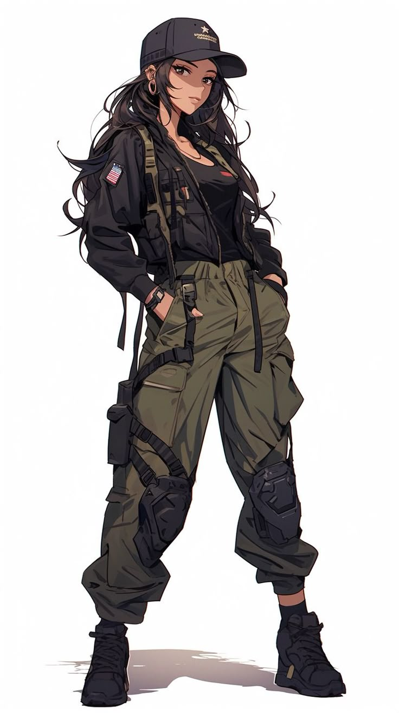

### Descrição visual (roupa)
- Boné  
- Jaqueta utilitária preta com muitos bolsos e zíperes  
- Calça cargo **oliva** volumosa, reforços nos joelhos  
- Tênis ou botas pretas baixas/médias  
- Camadas escuras por baixo da jaqueta

### Quando usar
Dia a dia de acampamento, oficina, patrulha leve, trabalho prático.

---

## 003 · Casual nomad

**Arquivo:** `badlands_casual_nomad.jpg`  
**Nome rápido:** Casual nomad · **#003**
**Combina com (sugestão):** Valk / Alex / pack  
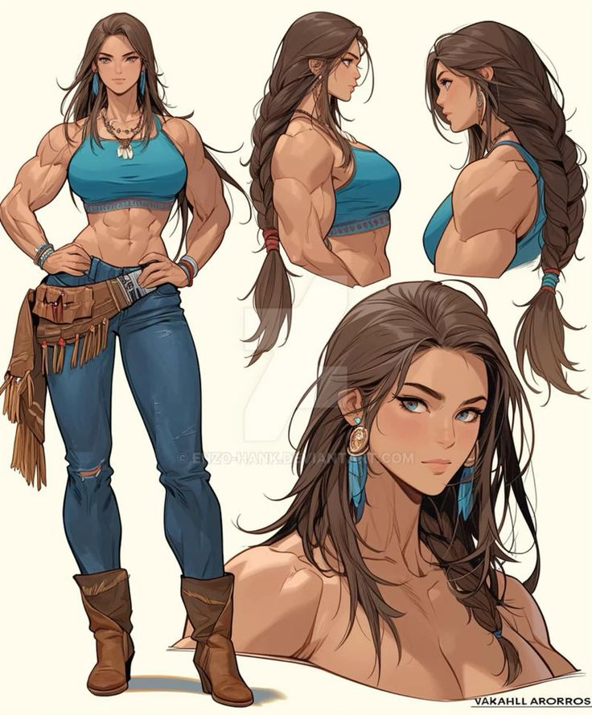

### Descrição visual (roupa)
- Top esportivo / crop sem mangas (azul ou similar)  
- Jeans com desgaste  
- Cinto de couro com **bolsa/pochete** de tecido ou couro na cintura  
- Botas marrom de cano médio  
- Acessórios leves de colar/pulseira se a cena quiser (opcional)

### Quando usar
Folga no pack, fogueira, visual nomad descontraído.

---

## Crop militar + short (frente / costas)

**Arquivos:** `badlands_crop_shorts.jpg` · `badlands_crop_shorts_rear.jpg`  
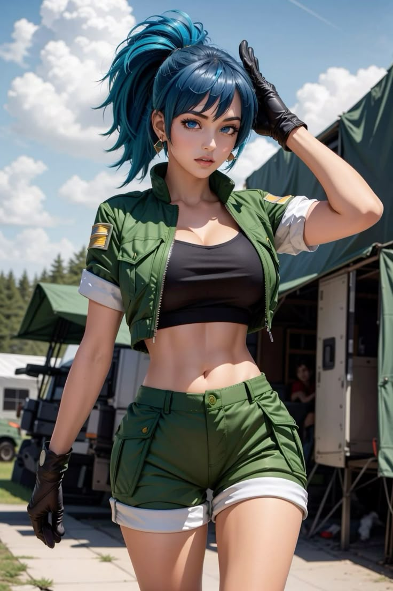  
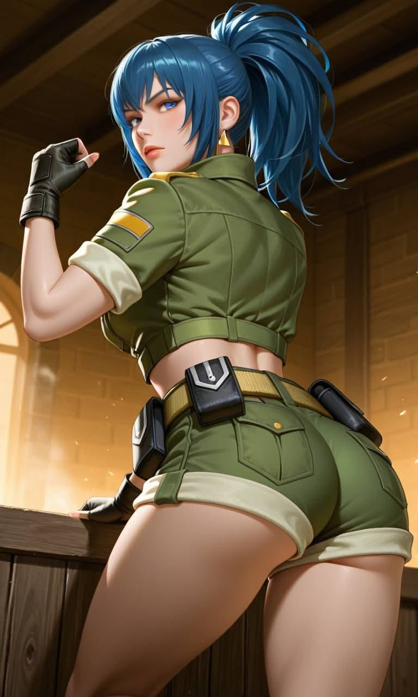

### Descrição visual (roupa)
- Jaqueta **crop** militar verde-oliva, gola, zíper, patches de ombro  
- Top/crop preto justo por baixo  
- Short cargo oliva de cintura alta, barra dobrada clara  
- Cinto com bolsos utilitários laterais/traseiros  
- Luvas pretas sem dedos

### Quando usar
Campo quente, patrulha leve, visual militar-casual **sem calça longa** — silhueta short.

---

## 004 · Macaquinho utilitário oliva

**Arquivo:** `utility_olive_romper.jpg`  
**Nome rápido:** Macaquinho utilitário oliva · **#004**
**Combina com (sugestão):** Valk / pack  
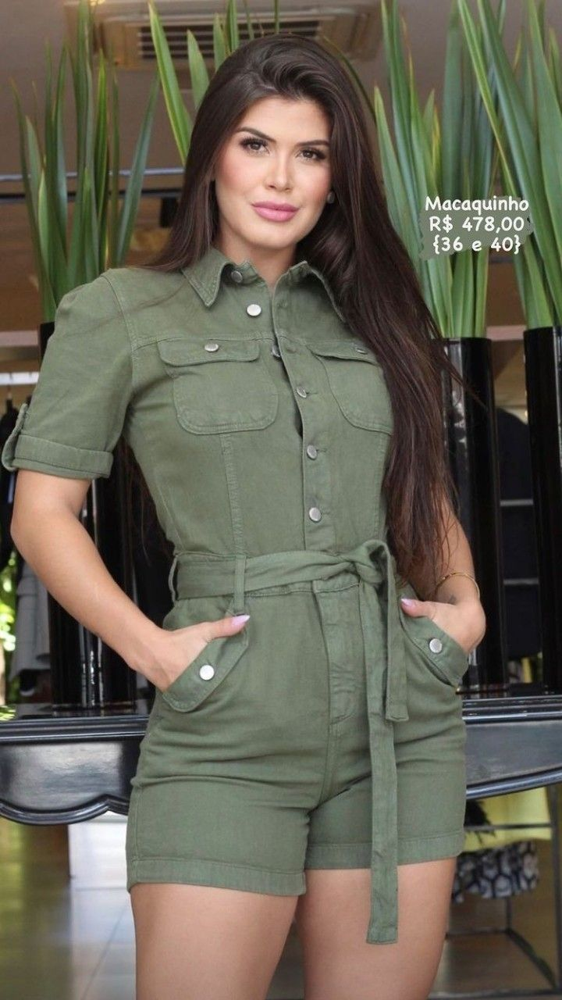

### Descrição visual (roupa)
- Macaquinho/jumpsuit curto **oliva**, manga curta, colarinho  
- Bolsos no peito e laterais; botões frontais  
- Faixa/cinto na cintura  
- Comprimento short nas pernas

### Quando usar
Trabalho prático, oficina ao ar livre, visual utilitário “de uma peça só”.

---

## 005 · Maxi floral + botas

**Arquivo:** `badlands_floral_maxi.jpg`  
**Nome rápido:** Maxi floral + botas · **#005**
**Combina com (sugestão):** Valk / Alex / pack  
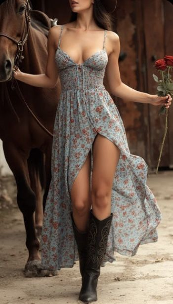

### Descrição visual (roupa)
- Vestido longo floral (fundo azul-acinzentado, flores rosadas)  
- Alças finas; bustier/smock no corpo  
- **Fenda alta** na perna  
- Botas cowboy pretas de cano médio/alto

### Quando usar
Pack em folga, Badlands “arrumada”, contraste feminino com o deserto — sem cargo.

---

# STREET / NIGHT CITY

## 006 · Cargo atlético

**Arquivo:** `street_cargo_athletic.jpg`  
**Nome rápido:** Cargo atlético · **#006**
**Combina com (sugestão):** qualquer  
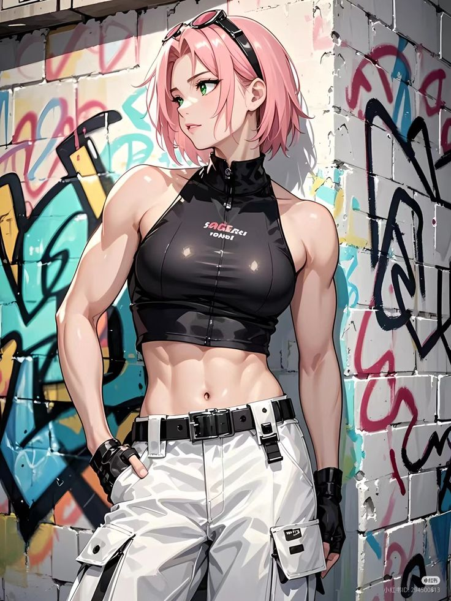

### Descrição visual (roupa)
- Crop top preto, gola alta, costas/ombros descobertos (halter)  
- Calça cargo **clara/branca** com bolsos laterais  
- Cinto preto largo com fivela  
- Luvas curtas sem dedos  
- Óculos de sol no cabelo (acessório)

### Quando usar
Rua, deslocamento urbano, visual street atlético.

---

## 007 · All-black set

**Arquivo:** `street_allblack_set.png`  
**Nome rápido:** All-black set · **#007**
**Combina com (sugestão):** Alex / Valk  
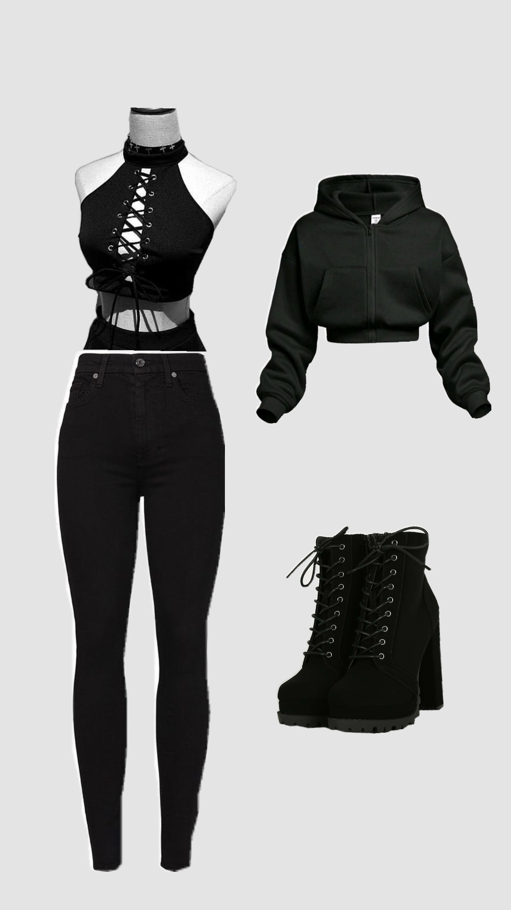

### Descrição visual (roupa)
- Top halter preto com **cadarço/lace-up** na frente  
- Calça jeans skinny preta  
- Moletom/hoodie cropped preto com zíper e capuz  
- Botas pretas de cano médio, salto bloco  
- Choker fino

### Quando usar
Saída urbana “tudo preto”, base de street fashion.

---

## 008 · Alt plaid

**Arquivo:** `street_alt_plaid.jpg`  
**Nome rápido:** Alt plaid · **#008**
**Combina com (sugestão):** qualquer  
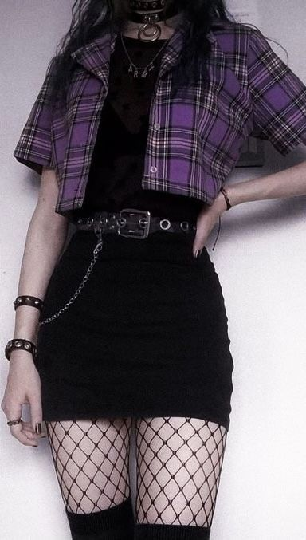

### Descrição visual (roupa)
- Camisa xadrez **roxa/lilás** cropped, aberta  
- Top preto por baixo  
- Mini saia preta justa  
- Cinto com corrente pendente  
- Meia-arrastão; pulseiras/choker

### Quando usar
Night out casual, bar, vibe alt.

---

## 009 · Leather trench

**Arquivo:** `street_leather_trench.jpg`  
**Nome rápido:** Leather trench · **#009**
**Combina com (sugestão):** Alex / Valk  

### Descrição visual (roupa)
- Trench/casaco de **couro preto**, botões duplos, ombreiras estruturadas  
- Gola alta / turtleneck por baixo  
- Luvas longas pretas  
- Cinto do próprio casaco; corrente decorativa na cintura  
- Calça/leggings pretas justas (camada inferior)

### Quando usar
Noite em Night City, visual edgerunner elegante, presença forte sem kit de combate completo.

---

## 010 · Hoodie + saia

**Arquivo:** `street_hoodie_pleat.jpg`  
**Nome rápido:** Hoodie + saia · **#010**
**Combina com (sugestão):** qualquer  
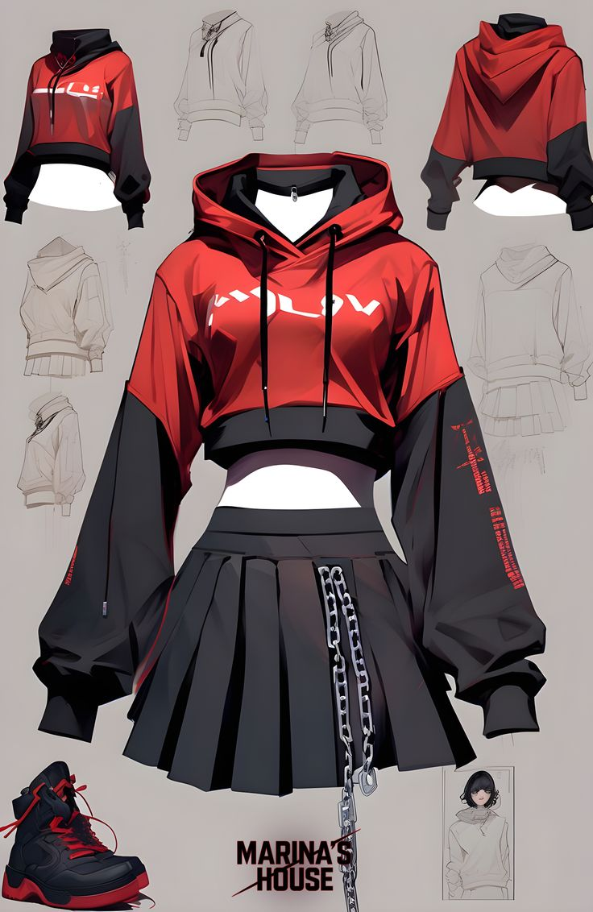

### Descrição visual (roupa)
- Moletom cropped **vermelho e preto**, capuz, cordões  
- Mini saia plissada preta  
- Corrente de cinto/prata pendente  
- Tênis high-top pretos com detalhe vermelho

### Quando usar
Street fashion jovem, folga urbana, visual casual ousado.

---

## 011 · Mocha romper

**Arquivo:** `street_mocha_romper.jpg`  
**Nome rápido:** Mocha romper · **#011**
**Combina com (sugestão):** qualquer  
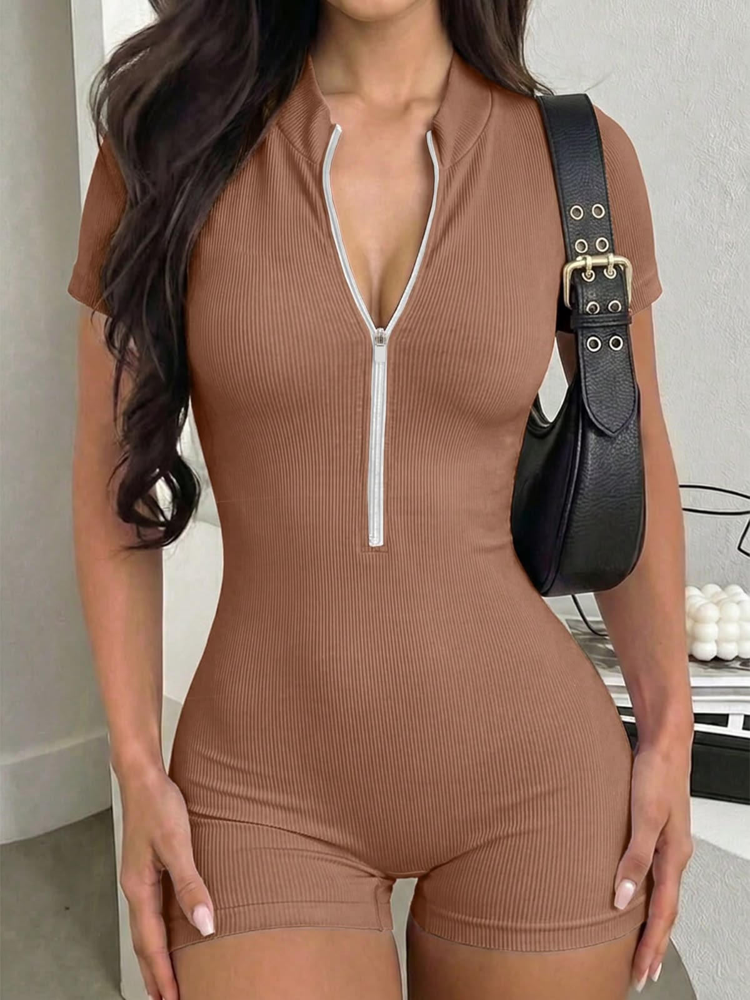

### Descrição visual (roupa)
- Macaquinho canelado **marrom/mocha**, manga curta  
- Zíper frontal longo (decote em V)  
- Comprimento short justo  
- Bolsa de ombro preta (acessório)

### Quando usar
Rua, deslocamento leve, visual bodycon casual sem calça.

---

## 012 · Tee oversized + cinto

**Arquivo:** `street_tee_belt_dress.jpg`  
**Nome rápido:** Tee oversized + cinto · **#012**
**Combina com (sugestão):** qualquer  
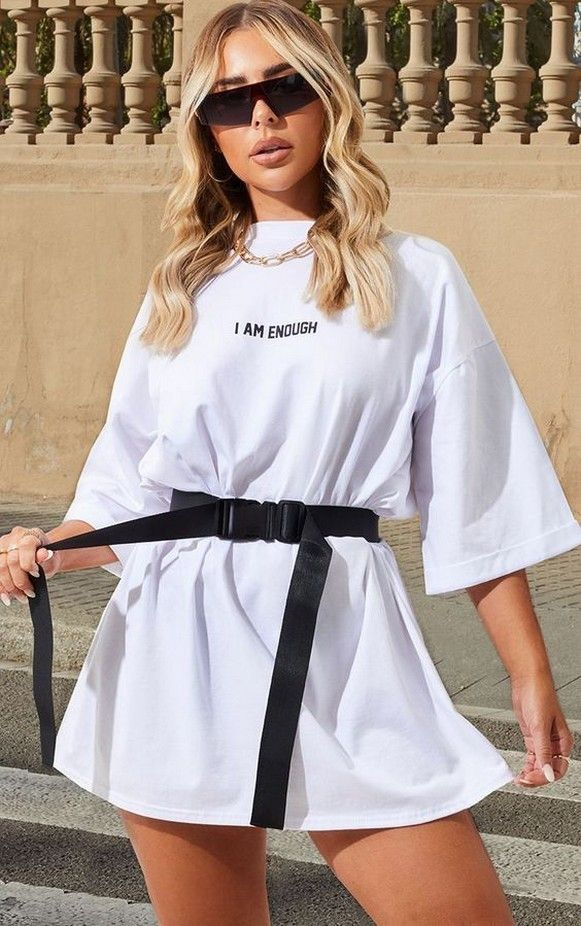

### Descrição visual (roupa)
- Camiseta oversized branca usada como mini-vestido  
- Cinto largo preto tipo tático (fivela/clip) na cintura  
- Correntes/colar grosso (acessório)  
- Óculos escuros opcionais

### Quando usar
Street minimal, saída rápida, vibe “camiseta virada look”.

---

## 013 · Kimono floral + short

**Arquivo:** `street_floral_kimono.jpg`  
**Nome rápido:** Kimono floral + short · **#013**
**Combina com (sugestão):** qualquer  
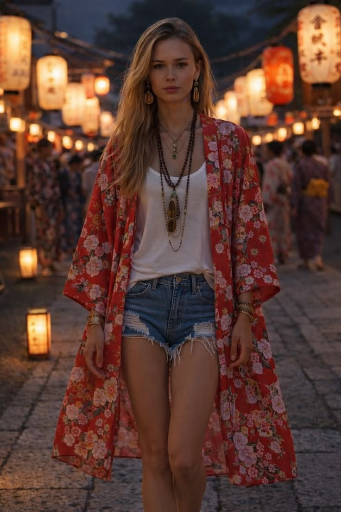

### Descrição visual (roupa)
- Kimono/robe longo **vermelho floral** aberto  
- Tank/top branco justo por baixo  
- Short jeans destroyed  
- Colares longos em camadas; óculos no peito (acessório)

### Quando usar
Noite de rua, festival, visual boho-urbano.

---

## 014 · Plaid + mini couro + OTK

**Arquivo:** `street_plaid_leather_mini.jpg`  
**Nome rápido:** Plaid + mini couro + OTK · **#014**
**Combina com (sugestão):** Alex / Valk  
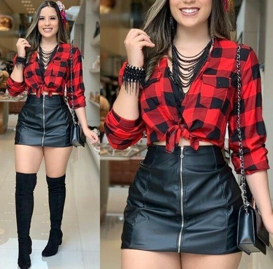

### Descrição visual (roupa)
- Camisa flannel **xadrez vermelho/preto**, nó na cintura ou aberta  
- Mini saia de **couro preto** com zíper frontal  
- Botas **over-the-knee** pretas  
- Colares em camadas; bolsa transversal pequena

### Quando usar
Bar, night out, street ousado com saia (não calça).

---

# CASUAL

## 028 · Plaid + short jeans

**Arquivo:** `casual_plaid_denim_shorts.jpg`  
**Nome rápido:** Plaid + short jeans · **#028**
**Combina com (sugestão):** qualquer  
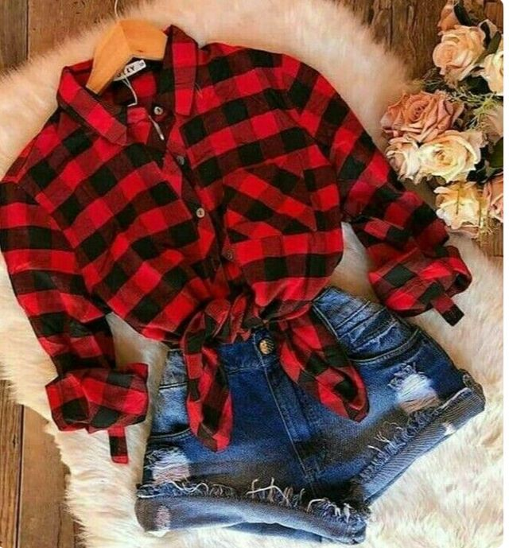

### Descrição visual (roupa)
- Camisa flannel **vermelha/preta**, nó na barra  
- Short jeans destroyed, barra dobrada  
- (Flatlay — extrair só o estilo das peças)

### Quando usar
Dia a dia pack/NC, visual “camisa de lenhador + short”.

---

## 029 · Jardineira jeans curta

**Arquivo:** `casual_denim_overalls.jpg`  
**Nome rápido:** Jardineira jeans curta · **#029**
**Combina com (sugestão):** qualquer  
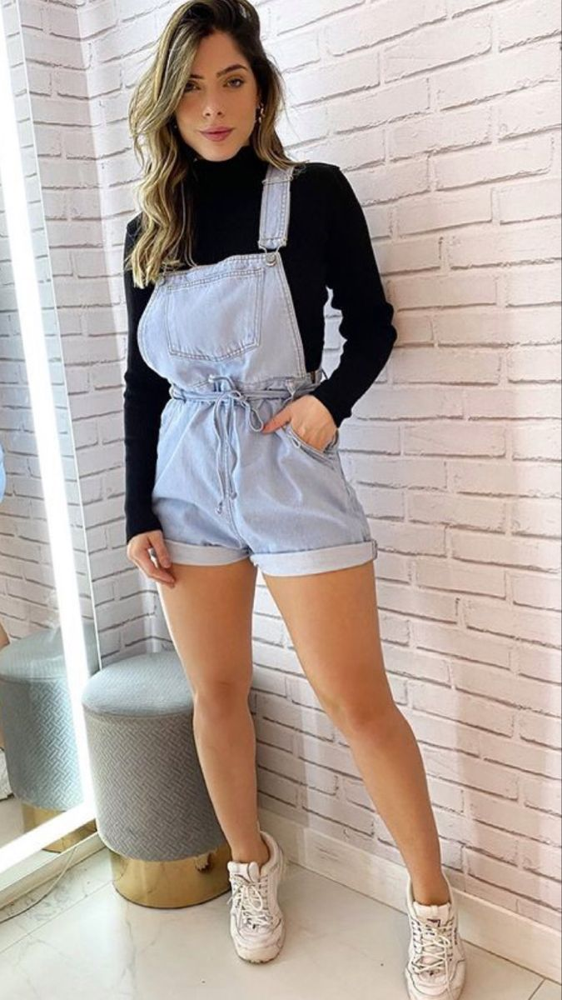

### Descrição visual (roupa)
- Jardineira/overall **jeans clara**, comprimento short  
- Gola alta / turtleneck **preta** por baixo  
- Cordão na cintura da jardineira  
- Tênis brancos

### Quando usar
Folga, oficina leve, visual casual prático.

---

## 030 · Tank + short jeans

**Arquivo:** `casual_tank_denim_shorts.jpg`  
**Nome rápido:** Tank + short jeans · **#030**
**Combina com (sugestão):** qualquer  
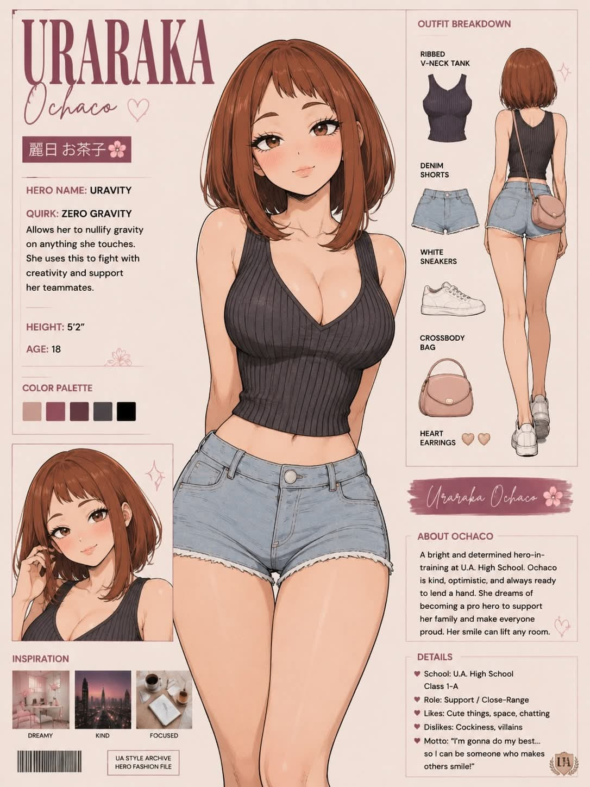

### Descrição visual (roupa)
- Tank/top canelado escuro, decote V  
- Short jeans claro, barra desfiada  
- Bolsa transversal pequena; tênis brancos  
- (Se a imagem for sheet com texto: **ignorar UI**, usar só as peças)

### Quando usar
Calor, rua casual, pack em folga.

---

## 031 · Tank + short jeans

**Arquivo:** `casual_tank_denim_shorts_alt.png`  
**Nome rápido:** Tank + short jeans · **#031**
**Combina com (sugestão):** qualquer  
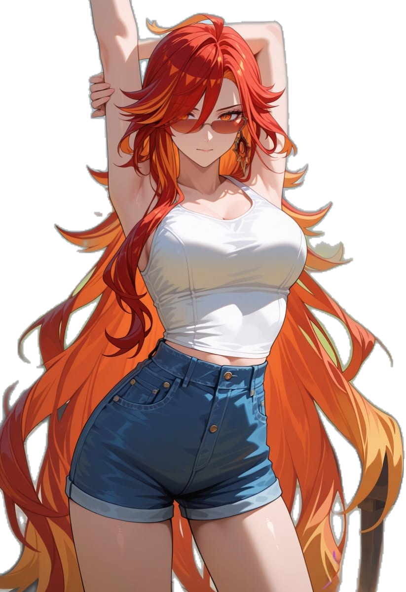

### Descrição visual (roupa)
- Tank branco justo  
- Short jeans azul, barra dobrada  
- Óculos de sol opcionais

### Quando usar
Variante limpa do tank + short; verão / Badlands dia.

---

## 032 · Crop off-shoulder + micro short

**Arquivo:** `casual_offshoulder_microshorts.jpg`  
**Nome rápido:** Crop off-shoulder + micro short · **#032**
**Combina com (sugestão):** qualquer  
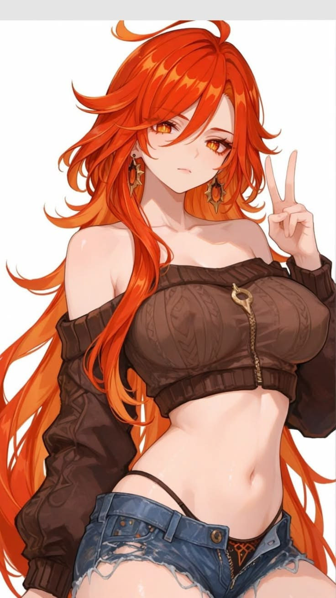

### Descrição visual (roupa)
- Crop off-shoulder marrom, manga longa, zíper e detalhe metálico  
- Short jeans destruído / micro  
- Brincos e acessórios leves

### Quando usar
Street ousado, clube casual, visual “crop + short” sem calça.

---

## 033 · Plaid + short

**Arquivo:** `casual_plaid_shorts_video.png`  
**Nome rápido:** Plaid + short · **#033**
**Combina com (sugestão):** qualquer  
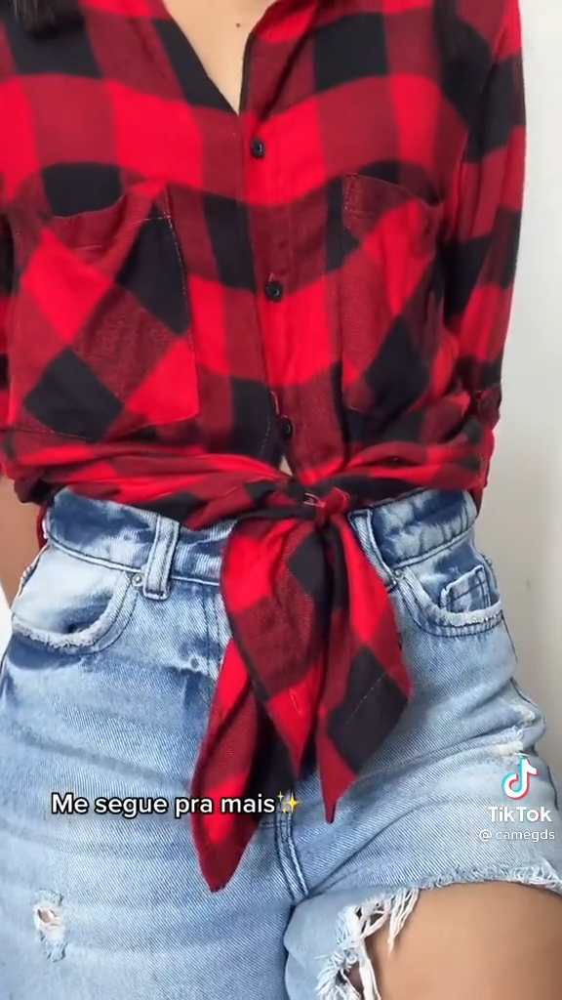

### Descrição visual (roupa)
- Mesma vibe de flannel xadrez vermelho com nó + short jeans  
- **Ignorar watermark/texto** na foto; extrair só o estilo

### Quando usar
Igual `casual_plaid_denim_shorts` — ref. alternativa do mesmo look.

---

# LOUNGE / CASA

## 058 · Conjunto moletom cinza

**Arquivo:** `lounge_grey_set.jpg`  
**Nome rápido:** Conjunto moletom cinza · **#058**
**Combina com (sugestão):** qualquer  
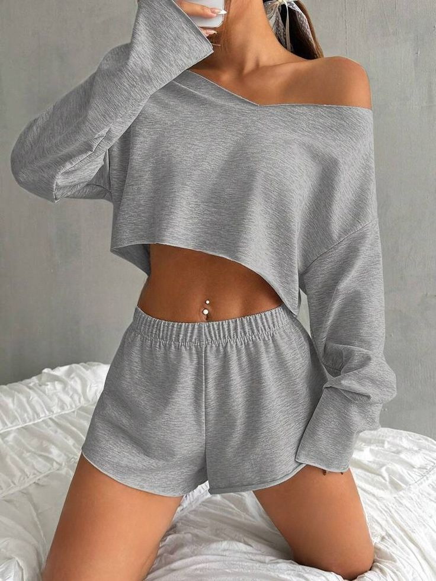

### Descrição visual (roupa)
- Crop moletom cinza, ombro a ombro / decote V  
- Short de moletom combinando, elástico  
- Visual lounge coeso

### Quando usar
Casa, safehouse, manhã preguiçosa, downtime.

---

## 059 · Hoodie cropped + short moletom

**Arquivo:** `lounge_hoodie_shorts.jpg`  
**Nome rápido:** Hoodie cropped + short moletom · **#059**
**Combina com (sugestão):** qualquer  
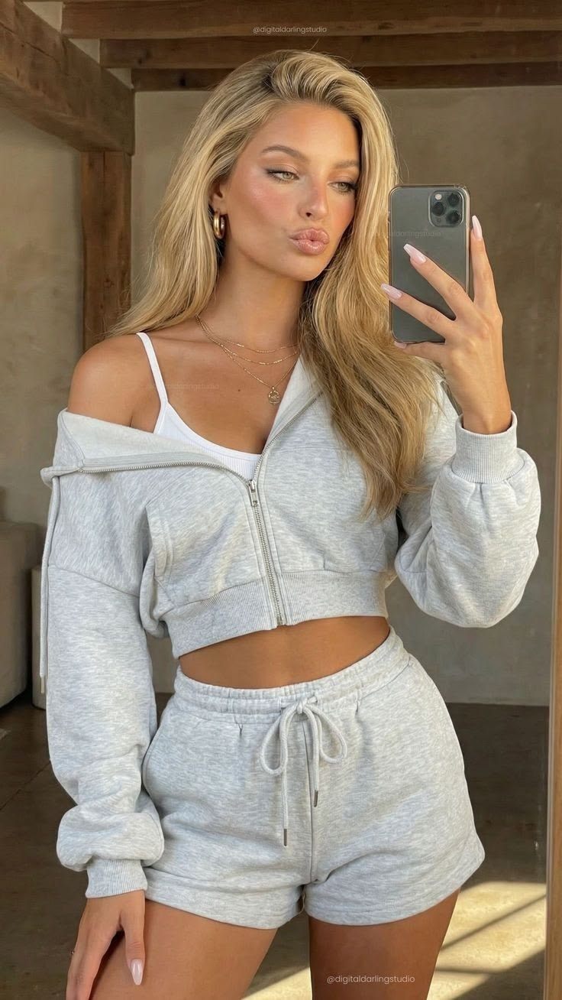

### Descrição visual (roupa)
- Hoodie cropped cinza com zíper, caído num ombro  
- Top/alça branca por baixo  
- Short de moletom cinza com cordão  
- Colares finos (acessório)

### Quando usar
Lounge fashion, casa NC, visual “acordei e saí assim”.

---

# TECH

## 044 · Netrunner

**Arquivo:** `tech_netrunner_pink.jpg`  
**Nome rápido:** Netrunner · **#044**
**Combina com (sugestão):** Echo / qualquer  
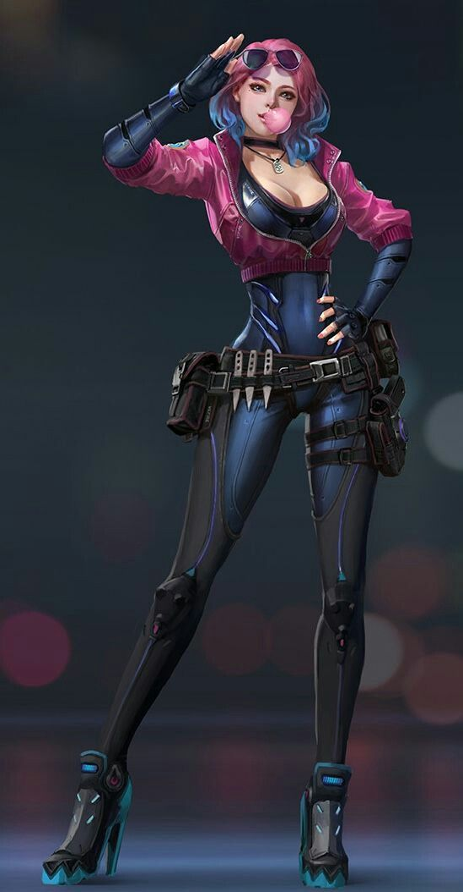

### Descrição visual (roupa)
- Jaqueta curta **rosa**  
- Body / catsuit azul-escuro com linhas claras (tecido tech)  
- Cinto com bolsas e alças (cintura utilitária de roupa)  
- Botas de salto com detalhes coloridos  
- Luvas sem dedos

### Quando usar
Visual tech/netrunner, clube tech, job de rua com estética cyber.

---

## 045 · Crop + jaqueta tech

**Arquivo:** `tech_crop_jacket.jpg`  
**Nome rápido:** Crop + jaqueta tech · **#045**
**Combina com (sugestão):** Echo / qualquer  
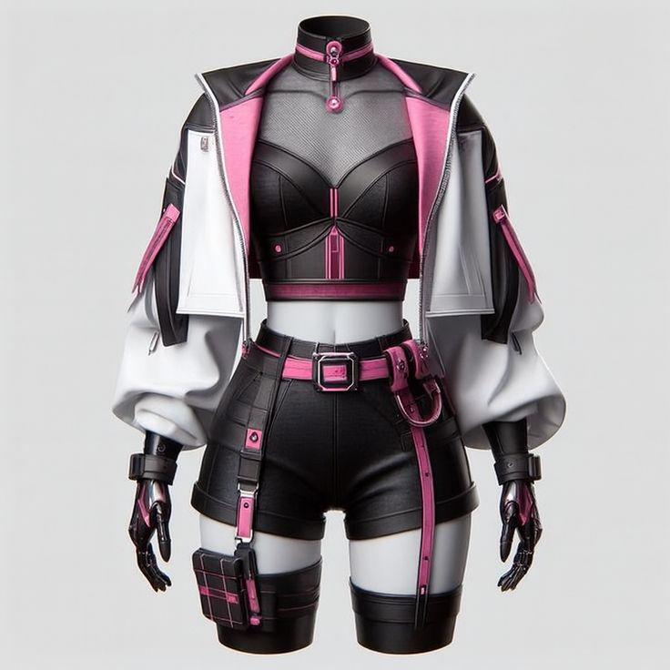

### Descrição visual (roupa)
- Crop top preto com zíperes e detalhes rosa, gola alta  
- Jaqueta oversized **branca** (forro/contraste rosa)  
- Shorts pretos de cintura alta  
- Cinto rosa com alças; pulseiras/luvas pretas

### Quando usar
Variante street-tech, saída fashion cyber.

---

# CLUBE / NOITE

## 111 · Corset + platform

**Arquivo:** `club_corset_platform.png`  
**Nome rápido:** Corset + platform · **#111**
**Combina com (sugestão):** Alex  
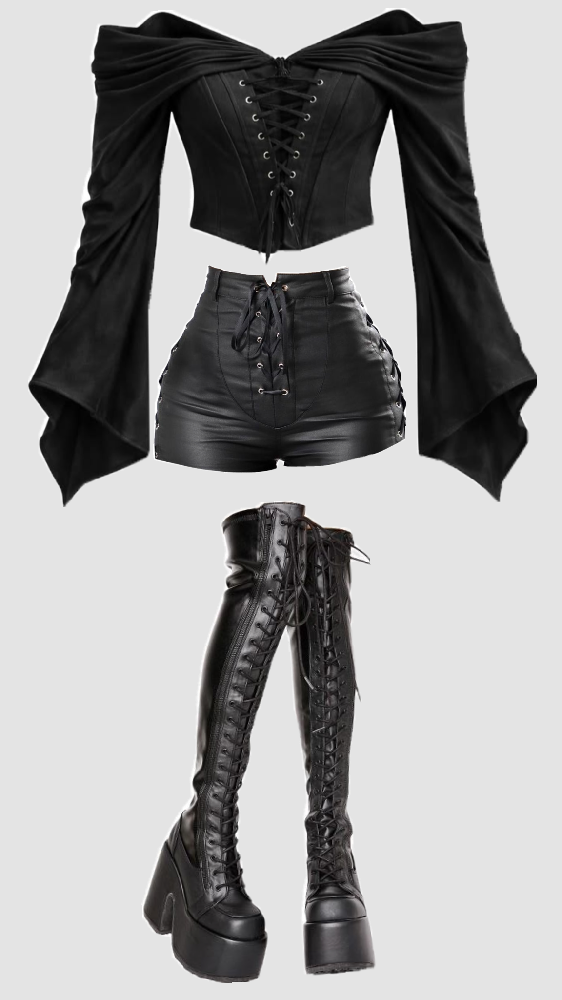

### Descrição visual (roupa)
- Corset/top preto off-shoulder, cadarço frontal, mangas longas tipo sino  
- Shorts de material tipo couro, laterais com lace-up  
- Botas pretas **acima do joelho**, platform, cadarço frontal

### Quando usar
Clube, corpo, noite ousada.

---

## 112 · Goth plaid

**Arquivo:** `club_goth_plaid.png`  
**Nome rápido:** Goth plaid · **#112**
**Combina com (sugestão):** Alex  

### Descrição visual (roupa)
- Top/vestido com corset e saia **xadrez** assimétrica (preto e cinza)  
- Gorro/beanie preto  
- Meias ou calça legging com recortes  
- Botas platform pretas com fivelas e correntes

### Quando usar
Night out alt/goth.

---

## 113 · Casaco gótico

**Arquivo:** `club_gothic_coat.jpg`  
**Nome rápido:** Casaco gótico · **#113**
**Combina com (sugestão):** Alex  

### Descrição visual (roupa)
- Sobretudo longo preto com detalhes/forro **vermelho**  
- Corset + shorts pretos  
- Meias-liga; botas de salto com cadarço colorido  
- Camadas de renda/tecido nas mangas ou saia interna

### Quando usar
Clube high-end, visual dark dramático.

---

## 114 · Mini preto ombro a ombro

**Arquivo:** `club_black_minidress.jpg`  
**Nome rápido:** Mini preto ombro a ombro · **#114**
**Combina com (sugestão):** Alex  
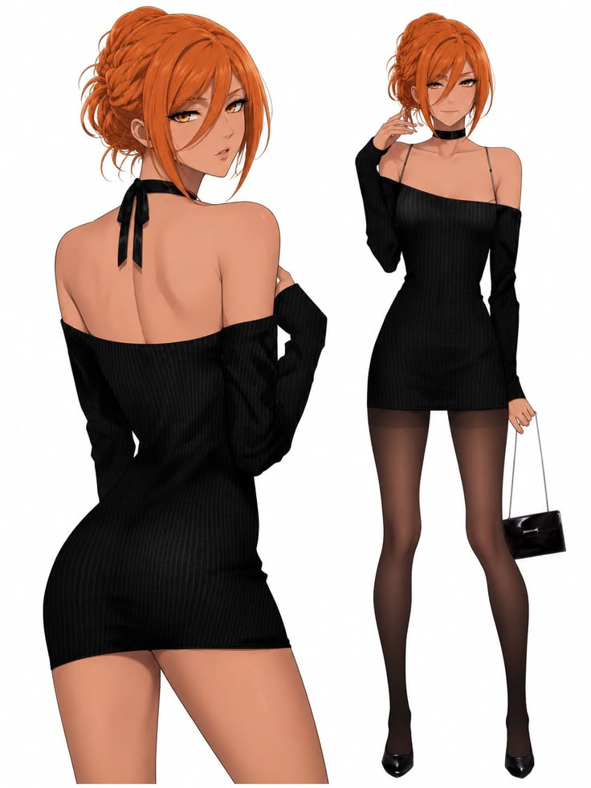

### Descrição visual (roupa)
- Vestido mini preto justo, ombro a ombro / um ombro  
- Mangas longas; laço no pescoço ou choker  
- Meia-calça preta; saltos; bolsa minúscula  
- (Sheet frente/costas se a imagem mostrar os dois)

### Quando usar
Clube, jantar ousado, night out minimalista.

---

## 115 · Catsuit canelado costas abertas

**Arquivo:** `club_ribbed_openback_catsuit.png`  
**Nome rápido:** Catsuit canelado costas abertas · **#115**
**Combina com (sugestão):** Alex  
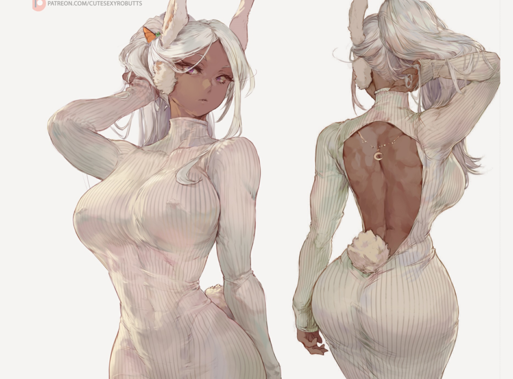

### Descrição visual (roupa)
- Body/catsuit **canelado** claro, gola alta  
- **Costas abertas** profundas; colar fino nas costas  
- Silhueta justa corpo inteiro  
- **Ignorar** orelhas/cauda/cosplay da foto — só o tecido e o corte

### Quando usar
Clube, corpo, visual bodycon ousado (sem calça solta).

---

# FORMAL

## 090 · Blazer + saia

**Arquivo:** `formal_blazer_skirt.jpg`  
**Nome rápido:** Blazer + saia · **#090**
**Combina com (sugestão):** qualquer  

### Descrição visual (roupa)
- Blazer preto aberto  
- Top/camisole **burgundy** ou vinho  
- Saia plissada preta curta  
- Cinto largo com fivela/anel  
- Meias-liga e meia-calça; choker

### Quando usar
Cliente semi-formal, jantar elegante, “arrumada sem ser gala”.

---

## 091 · Camisa office

**Arquivo:** `formal_shirt_office.jpg`  
**Nome rápido:** Camisa office · **#091**
**Combina com (sugestão):** qualquer  
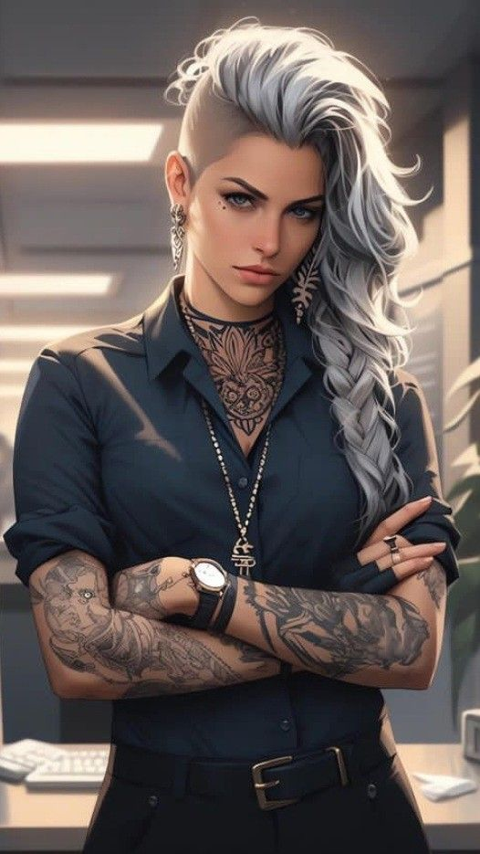

### Descrição visual (roupa)
- Camisa social de colarinho, cor escura (marinho/preto), mangas dobradas  
- Calça preta de cintura definida  
- Cinto fino; relógio de pulso  
- Colares finos (acessório)

### Quando usar
Reunião, clínica, visual profissional de rua.

---

## 092 · Roxo elegante

**Arquivo:** `formal_purple_elegant.jpg`  
**Nome rápido:** Roxo elegante · **#092**
**Combina com (sugestão):** qualquer  
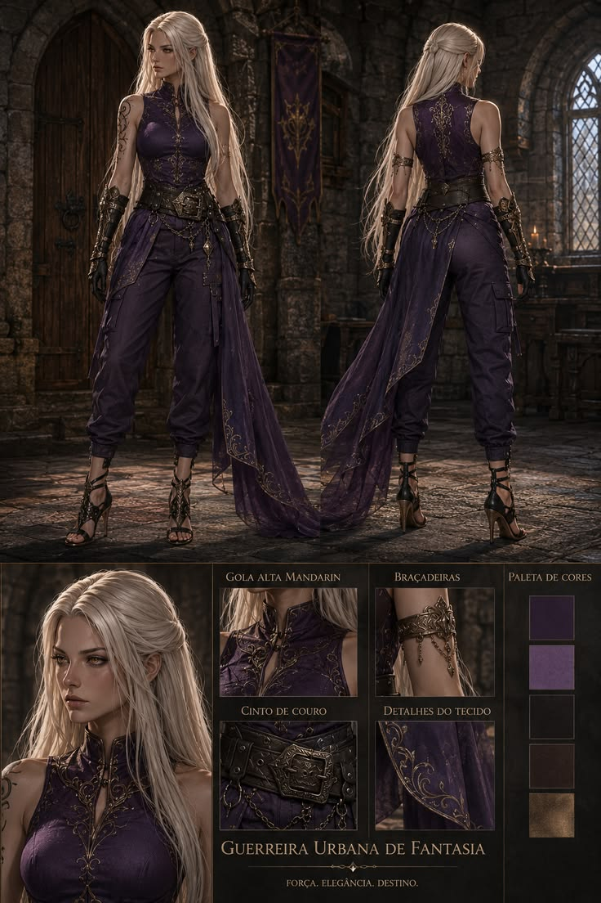

### Descrição visual (roupa)
- Conjunto roxo (top gola alta / mandarim + calça cargo elegante)  
- Bordados dourados; cinto de couro ornamentado  
- Cauda/tecido fluido opcional nas costas  
- Saltos de tiras; braçadeiras decorativas

### Quando usar
Evento de gala com estética “fantasia urbana”.

---

## 093 · Cream blazer + saia plissada

**Arquivo:** `formal_cream_pleat.jpg`  
**Nome rápido:** Cream blazer + saia plissada · **#093**
**Combina com (sugestão):** qualquer  
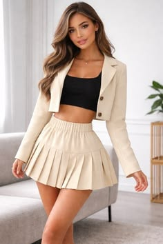

### Descrição visual (roupa)
- Blazer cropped **creme/bege**, botões  
- Crop/top preto justo por baixo  
- Mini saia plissada creme combinando  
- Visual monochrome claro

### Quando usar
Cliente semi-formal, café de negócios, “arrumada clara”.

---

## 094 · Camisa + colete + saia couro

**Arquivo:** `formal_vest_leather_skirt.jpg`  
**Nome rápido:** Camisa + colete + saia couro · **#094**
**Combina com (sugestão):** Alex  
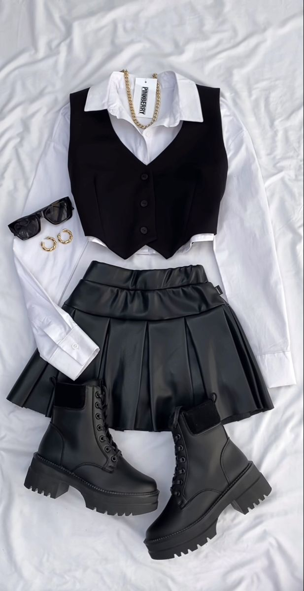

### Descrição visual (roupa)
- Camisa social branca de colarinho  
- Colete preto curto, botões  
- Mini saia plissada de **couro preto**  
- Botas chunky pretas; correntes/óculos (acessório)  
- (Flatlay — extrair só o estilo)

### Quando usar
Street-formal, entrevista ousada, visual “colete + saia”.

---

## 095 · Wide-leg bege + crop listrado

**Arquivo:** `formal_wideleg_beige.jpg`  
**Nome rápido:** Wide-leg bege + crop listrado · **#095**
**Combina com (sugestão):** qualquer  
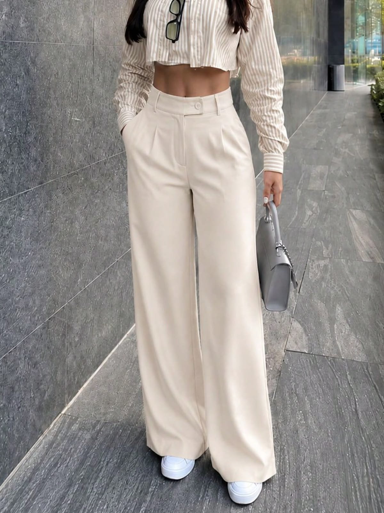

### Descrição visual (roupa)
- Calça **wide-leg** bege/creme de alfaiataria, prega  
- Crop/camisa listrada bege aberta na cintura  
- Tênis brancos; bolsa estruturada cinza  
- Óculos no cabelo (acessório)

### Quando usar
Dia elegante em NC, reunião casual, silhueta de calça **ampla** (não cargo).

---

# EVENING / GALA

## 122 · Gown preto

**Arquivo:** `evening_gown_black.jpg`  
**Nome rápido:** Gown preto · **#122**
**Combina com (sugestão):** Reina  
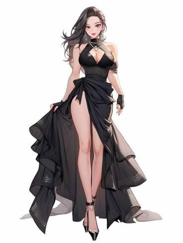

### Descrição visual (roupa)
- Vestido longo preto, decote profundo  
- Fenda alta; tecido fluido com cauda  
- Saltos; luva curta opcional

### Quando usar
Gala, corpo, evento formal de alto nível.

---

## 123 · Fenda preta

**Arquivo:** `evening_slit_dress.jpg`  
**Nome rápido:** Fenda preta · **#123**
**Combina com (sugestão):** Reina  

### Descrição visual (roupa)
- Vestido preto com alças cruzadas no peito  
- Aberturas no torso; fendas altas nas pernas  
- Sandálias de tira

### Quando usar
Variante de evening mais ousada e minimalista.

---

## 124 · Qipao / cheongsam

**Arquivo:** `evening_qipao_black.jpg`  
**Nome rápido:** Qipao / cheongsam · **#124**
**Combina com (sugestão):** Reina  
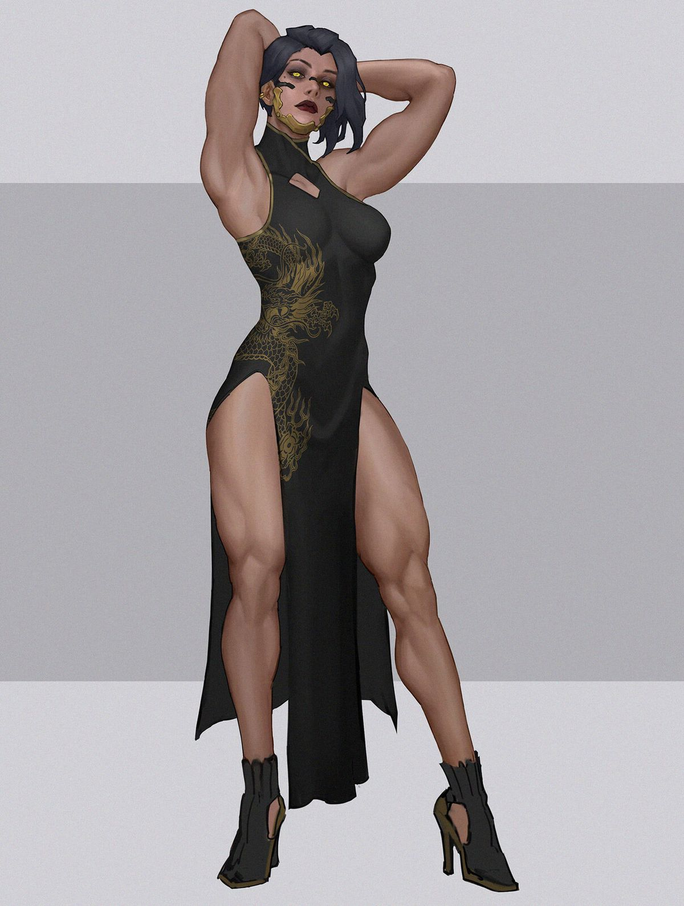

### Descrição visual (roupa)
- Vestido tipo qipao preto, gola alta  
- Motivo dourado (ex. dragão) no tecido  
- Fenda lateral alta; saltos finos

### Quando usar
Evento formal com estética leste-asiática / ousado estruturado.

---

## 125 · Gown vermelho

**Arquivo:** `evening_red_gown.jpg`  
**Nome rápido:** Gown vermelho · **#125**
**Combina com (sugestão):** Reina  
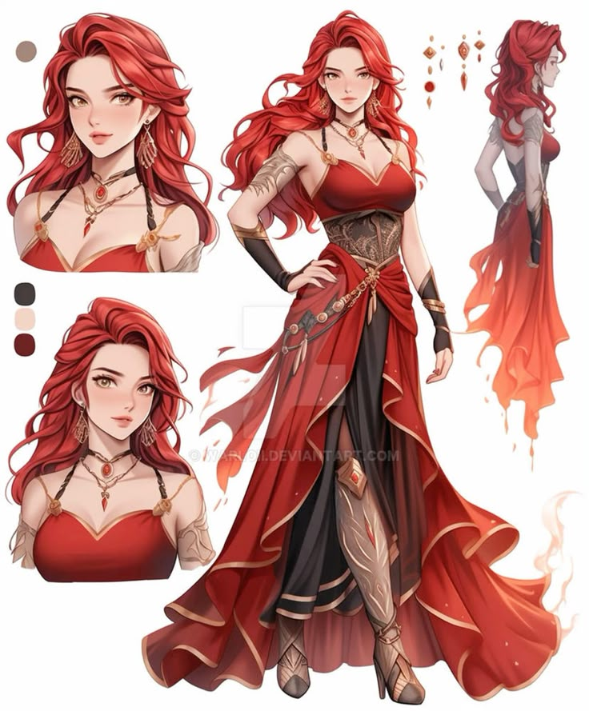

### Descrição visual (roupa)
- Vestido vermelho com detalhes dourados  
- Corset/cintura marcada; cauda longa  
- Saltos; joias de colar/brinco (acessório)

### Quando usar
Gala quente, destaque visual vermelho.

---

# COMBATE / TREINO (roupa tática ou esportiva)

## 038 · Bodysuit / tactical top verde

**Arquivo:** `combat_bodysuit_green.jpg`  
**Nome rápido:** Bodysuit / tactical top verde · **#038**
**Combina com (sugestão):** Valk / Alex / pack  
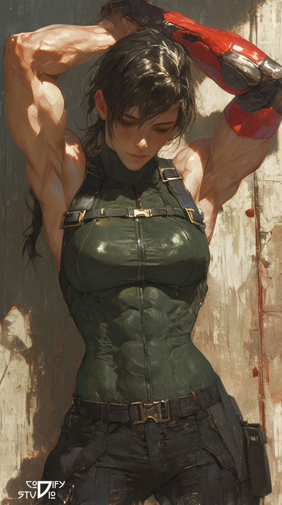

### Descrição visual (roupa)
- Top/body tático **verde-escuro** justo, zíperes e tiras  
- Calça cargo preta  
- Cintos e alças de vestuário no tronco  
- *(Ignorar braço/chrome da foto se não for da ficha.)*

### Quando usar
Combate, treino pesado, visual de campo fechado.

---

## 039 · Cargo oliva

**Arquivo:** `combat_cargo_olive.jpg`  
**Nome rápido:** Cargo oliva · **#039**
**Combina com (sugestão):** Valk / Alex / pack  
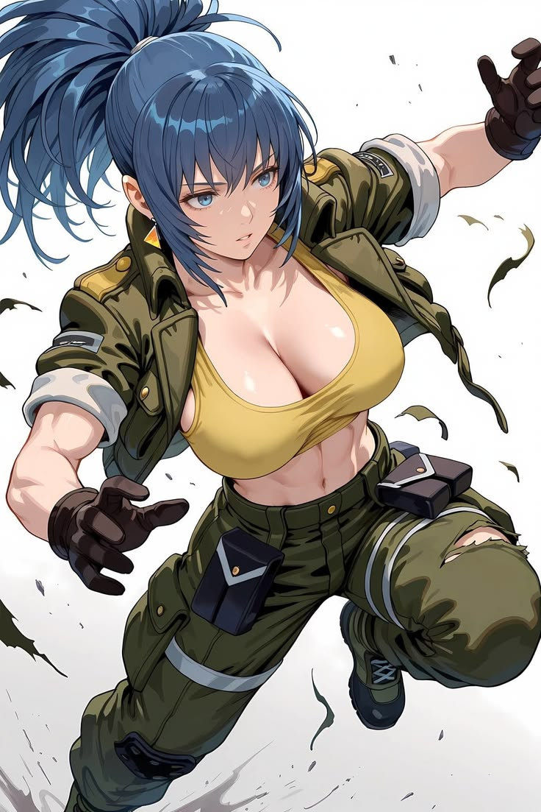

### Descrição visual (roupa)
- Jaqueta militar oliva aberta  
- Crop/top claro por baixo  
- Calça cargo oliva com bolsos  
- Luvas pretas curtas

### Quando usar
Ação, patrulha, visual militar-casual.

---

## 050 · Gym

**Arquivo:** `gym_sportswear.jpg`  
**Nome rápido:** Gym · **#050**
**Combina com (sugestão):** qualquer  
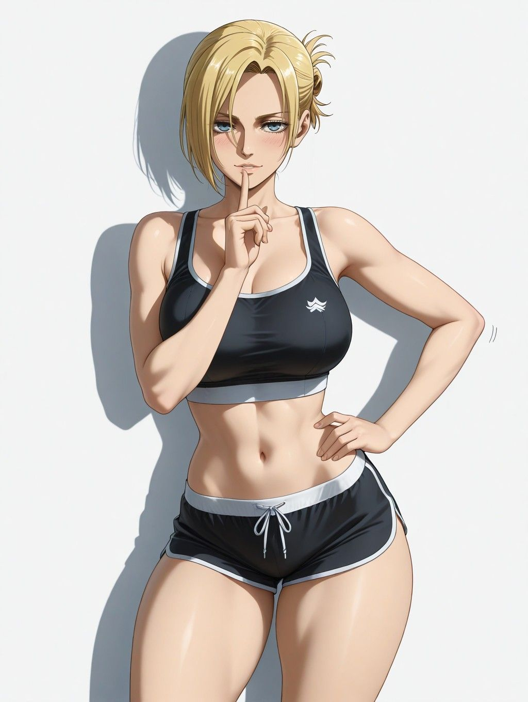

### Descrição visual (roupa)
- Top esportivo preto com borda clara  
- Short esportivo combinando  
- Visual de academia / corrida

### Quando usar
Treino físico, aquecimento.

---

## 051 · Gym — tennis skirt

**Arquivo:** `gym_tennis_skirt.jpg`  
**Nome rápido:** Gym — tennis skirt · **#051**
**Combina com (sugestão):** qualquer  
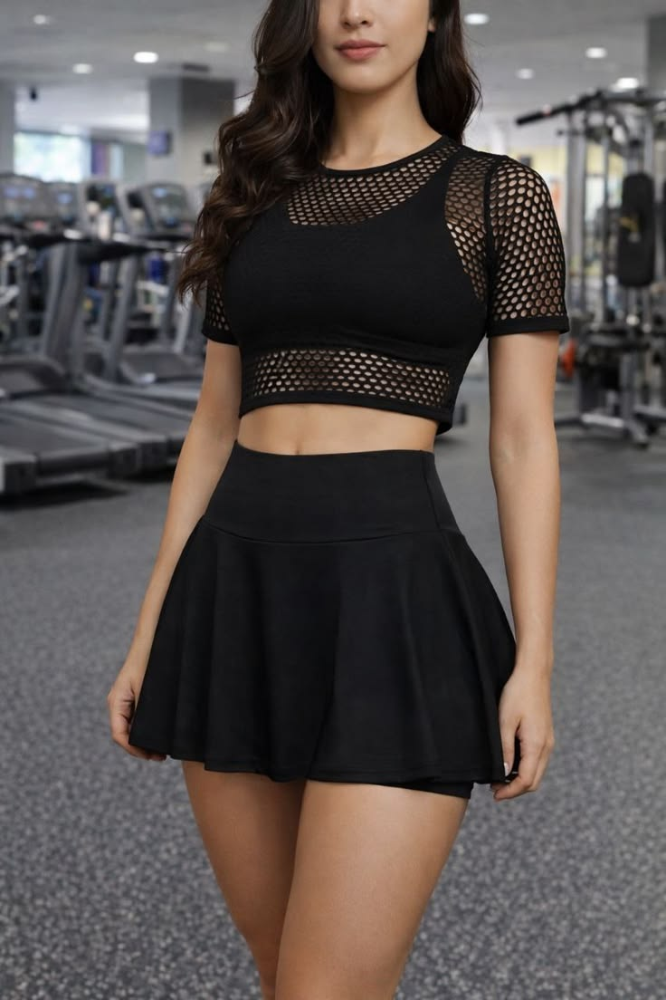

### Descrição visual (roupa)
- Crop preto com painéis **mesh**/rede nas mangas e peito  
- Saia tênis plissada preta (short interno)  
- Visual academia fashion

### Quando usar
Treino, academia, vibe esportiva **com saia** em vez de calça.

---

## 052 · Marcial

**Arquivo:** `training_martial.jpg`  
**Nome rápido:** Marcial · **#052**
**Combina com (sugestão):** qualquer  
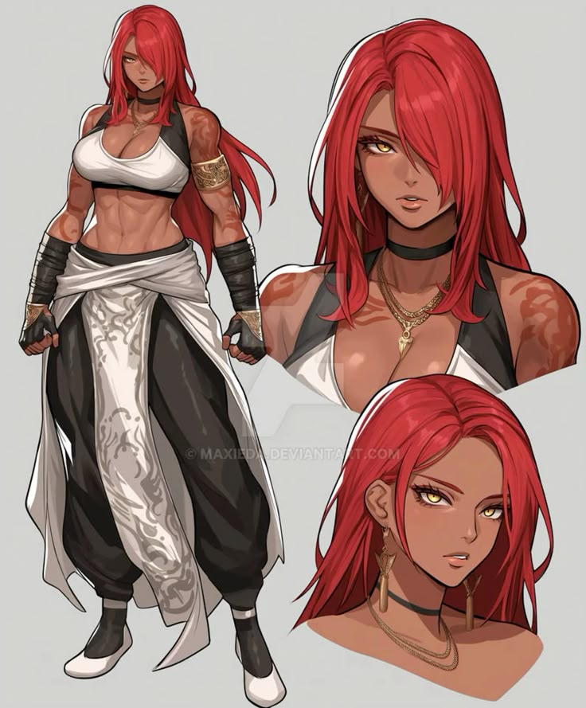

### Descrição visual (roupa)
- Top esportivo / halter  
- Calça larga preta com faixa ou painel branco  
- Luvas sem dedos; calçado leve de treino

### Quando usar
Sparring, dojo, treino marcial.

---

# SOFT / PACK / VERÃO

## 144 · Blusa + corset soft

**Arquivo:** `soft_blouse_corset.png`  
**Nome rápido:** Blusa + corset soft · **#144**
**Combina com (sugestão):** Reina / qualquer  
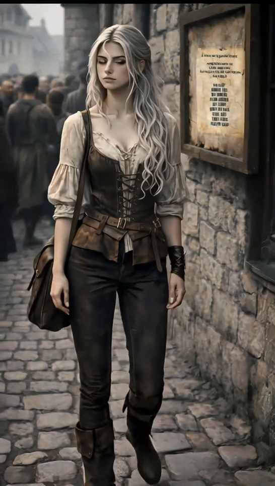

### Descrição visual (roupa)
- Blusa clara, mangas longas levemente bufantes  
- Corset/colete de couro marrom com lace-up  
- Calça escura justa; botas de cano médio  
- Bolsa transversal de couro  
- Braceletes de couro no pulso

### Quando usar
Jantar no pack, “arrumada sem ser clube”, saída apresentável.

---

## 145 · Sundress floral + botas

**Arquivo:** `soft_floral_sundress_boots.jpg`  
**Nome rápido:** Sundress floral + botas · **#145**
**Combina com (sugestão):** Reina / qualquer  
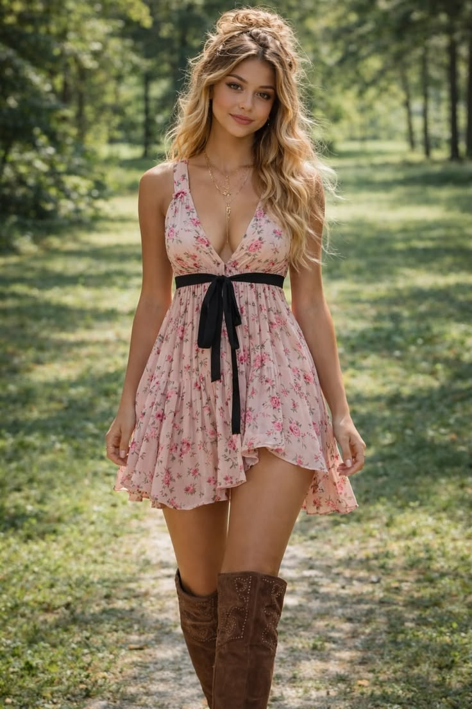

### Descrição visual (roupa)
- Vestido curto floral rosa/claro, decote V, alças  
- Faixa preta na cintura com laço  
- Botas cowboy marrom de cano alto  
- Colares finos dourados

### Quando usar
Pack em folga, dia de campo leve, visual soft com bota.

---

## 146 · Mini tricô cut-outs

**Arquivo:** `soft_knit_minidress.jpg`  
**Nome rápido:** Mini tricô cut-outs · **#146**
**Combina com (sugestão):** Reina / qualquer  
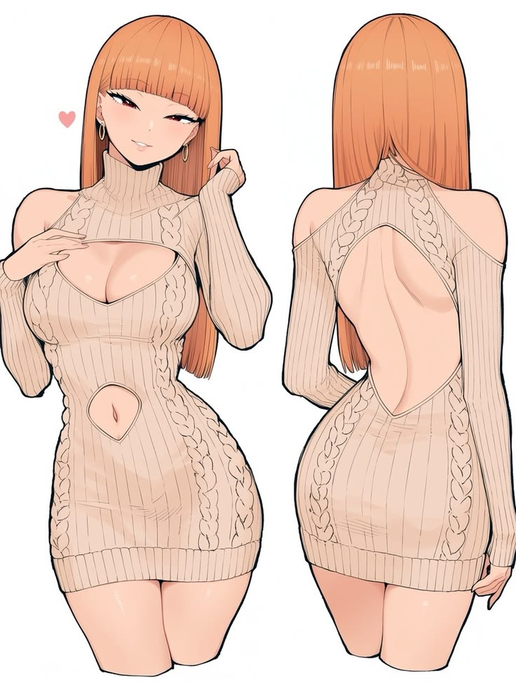

### Descrição visual (roupa)
- Vestido mini de tricô bege, gola alta  
- Cut-outs no peito/abdômen; costas abertas com tranças de tecido  
- Mangas longas; silhueta justa  
- (Sheet frente/costas se disponível)

### Quando usar
Noite soft, date, visual bodycon tricô.

---

## 147 · Mini floral tomara-que-caia

**Arquivo:** `soft_pink_floral_mini.jpg`  
**Nome rápido:** Mini floral tomara-que-caia · **#147**
**Combina com (sugestão):** Reina / qualquer  
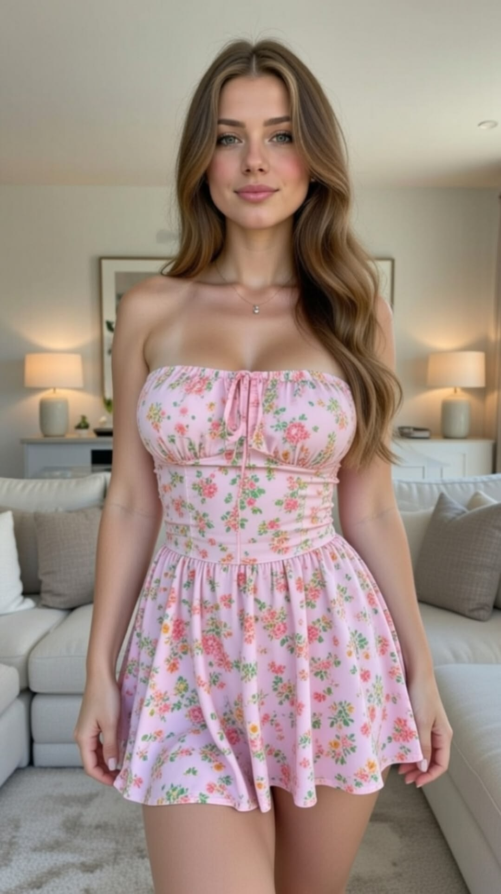

### Descrição visual (roupa)
- Vestido mini **rosa floral**, tomara-que-caia  
- Cadarço no busto; saia godê  
- Colar fino

### Quando usar
Casa, saída leve, visual “vestido de verão” indoor/outdoor.

---

## 148 · Mini branco lace-up

**Arquivo:** `soft_white_lace_mini.jpg`  
**Nome rápido:** Mini branco lace-up · **#148**
**Combina com (sugestão):** Reina / qualquer  
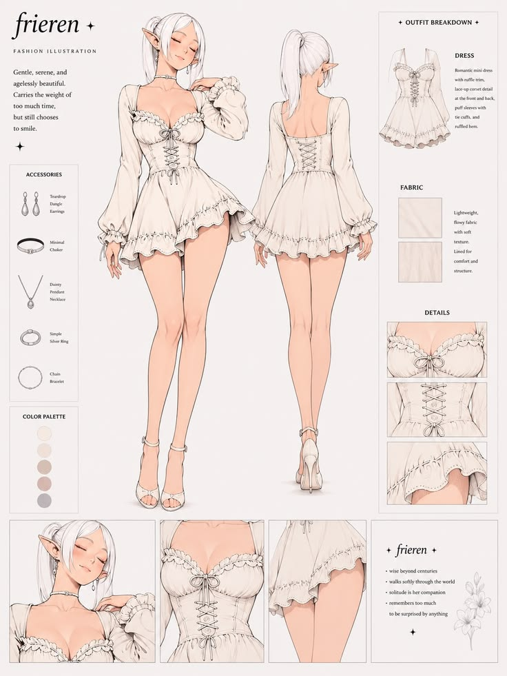

### Descrição visual (roupa)
- Mini vestido branco romântico, mangas bufantes  
- Cadarço/lace-up no peito e nas costas  
- Babados na barra e punhos; saltos claros  
- Choker e brincos finos  
- (Sheet com breakdown: usar só as peças de roupa)

### Quando usar
Evento leve, jantar pack, fantasia soft (não job).

---

## 149 · Halter oliva + saia plissada

**Arquivo:** `soft_olive_pleat_set.jpg`  
**Nome rápido:** Halter oliva + saia plissada · **#149**
**Combina com (sugestão):** Reina / qualquer  
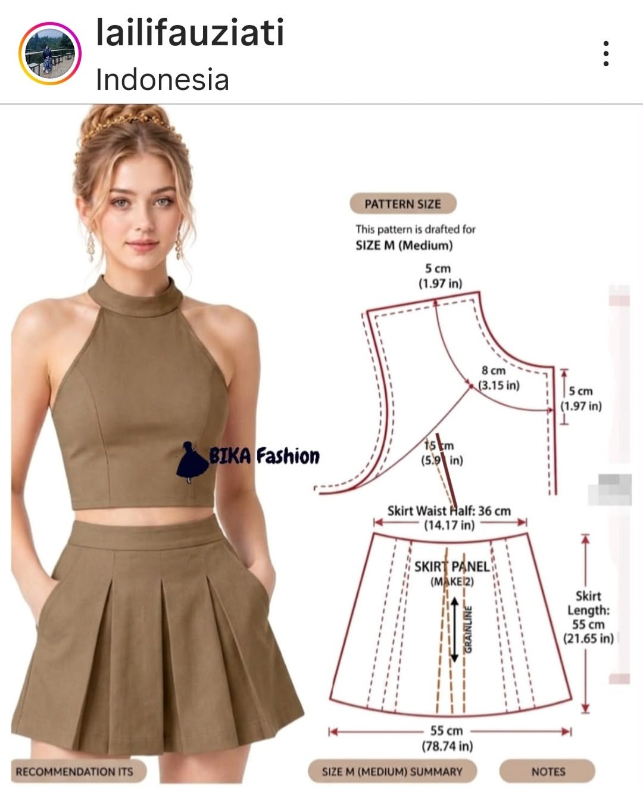

### Descrição visual (roupa)
- Top halter **oliva/cáqui**, gola alta, crop  
- Mini saia plissada da mesma cor  
- Conjunto coeso monocromático  
- (Ignorar diagramas de molde na foto)

### Quando usar
Street soft, verão, visual saia + crop sem calça.

---

## 150 · Co-ord floral crop + saia

**Arquivo:** `soft_floral_coord.jpg`  
**Nome rápido:** Co-ord floral crop + saia · **#150**
**Combina com (sugestão):** Reina / qualquer  
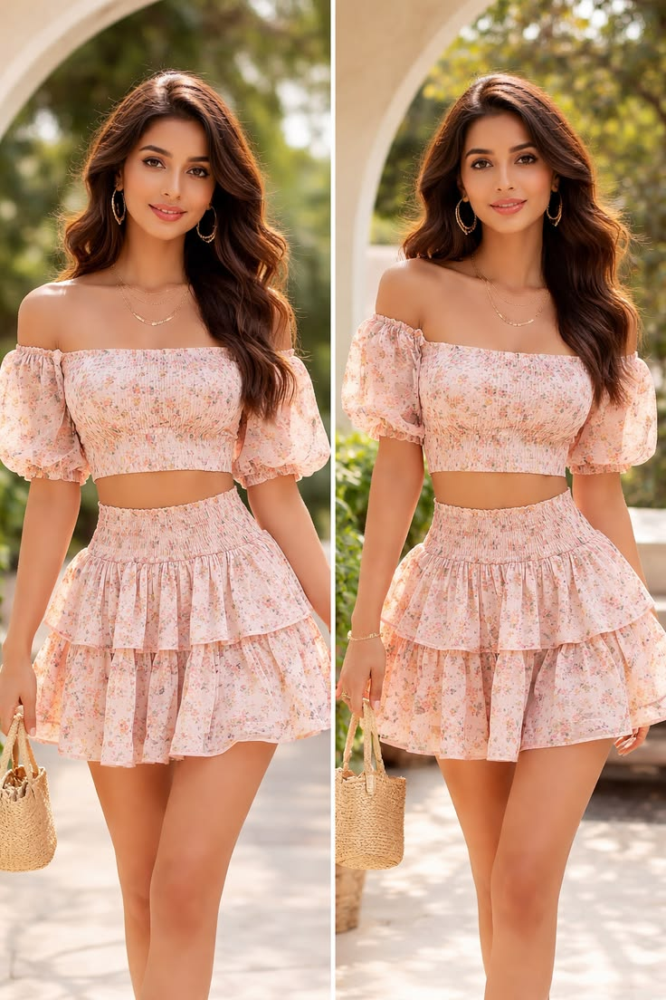

### Descrição visual (roupa)
- Crop floral rosa, ombro a ombro, manga bufante  
- Saia mini floral em camadas / babados  
- Bolsa de palha pequena; brincos argola

### Quando usar
Dia ensolarado, pack em folga, visual verão co-ord.

---

## 151 · Vestido laranja godê

**Arquivo:** `soft_orange_sundress.jpg`  
**Nome rápido:** Vestido laranja godê · **#151**
**Combina com (sugestão):** Reina / qualquer  
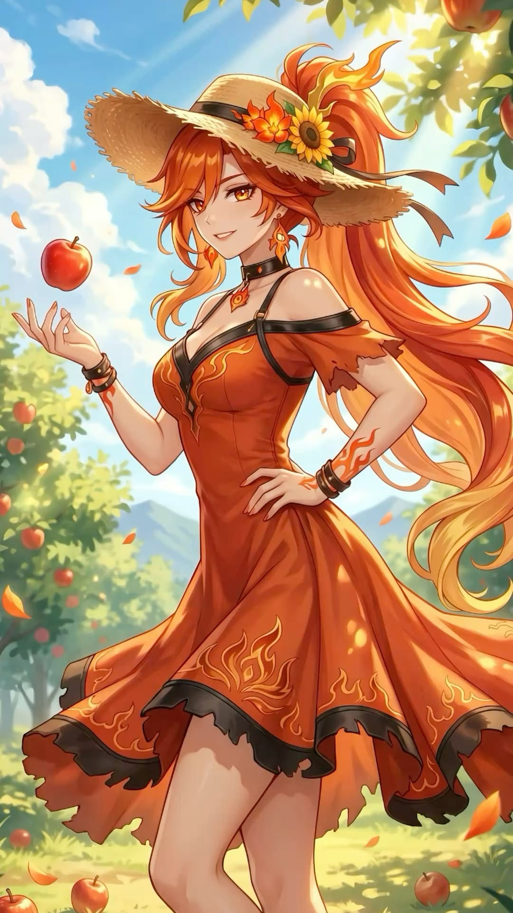

### Descrição visual (roupa)
- Vestido midi/curto **laranja**, ombro a ombro  
- Detalhes de alças pretas; barra com recortes  
- Chapéu de palha opcional (acessório de roupa)

### Quando usar
Folga, visual alegre; anime OK — extrair só corte e cor.

---

## 152 · Vestido renda high-low + botas

**Arquivo:** `soft_lace_highlow.jpg`  
**Nome rápido:** Vestido renda high-low + botas · **#152**
**Combina com (sugestão):** Reina / qualquer  
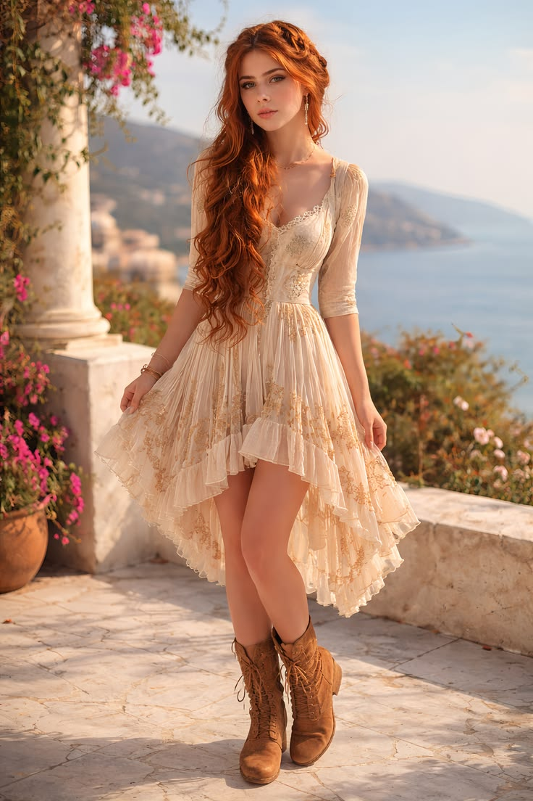

### Descrição visual (roupa)
- Vestido creme com renda/bordado dourado  
- Comprimento **high-low** (frente curta, trás mais longo)  
- Mangas 3/4; botas de cadarço marrom

### Quando usar
Evento ao ar livre, pack “arrumada”, visual romântico com bota.

---

## 153 · Vestido-camisa creme + botas

**Arquivo:** `soft_shirt_dress_boots.jpg`  
**Nome rápido:** Vestido-camisa creme + botas · **#153**
**Combina com (sugestão):** Reina / qualquer  
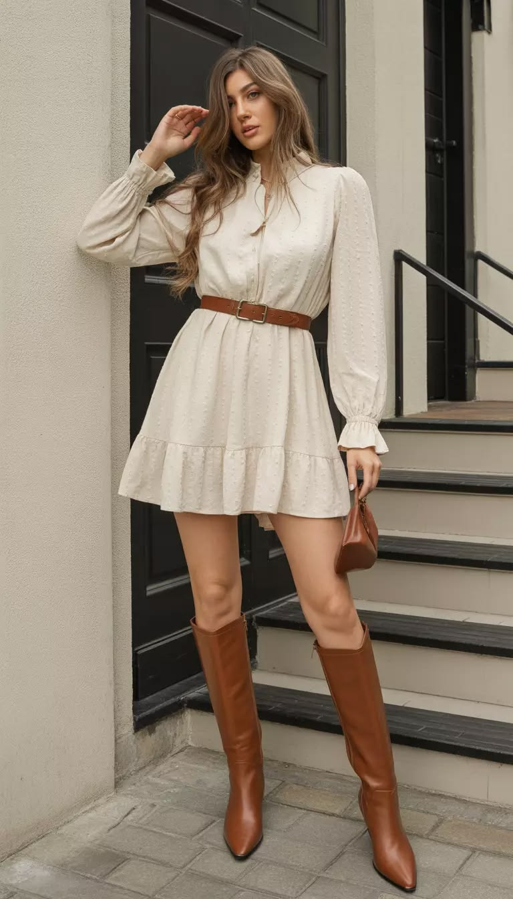

### Descrição visual (roupa)
- Vestido-camisa creme, mangas longas bufantes  
- Cinto marrom fino na cintura  
- Barra com babado; botas marrom de cano alto  
- Bolsa pequena marrom

### Quando usar
Cidade, jantar pack, visual apresentável soft.

---

## 154 · Peplum high-low + short + botas

**Arquivo:** `soft_peplum_boots.jpg`  
**Nome rápido:** Peplum high-low + short + botas · **#154**
**Combina com (sugestão):** Reina / qualquer  
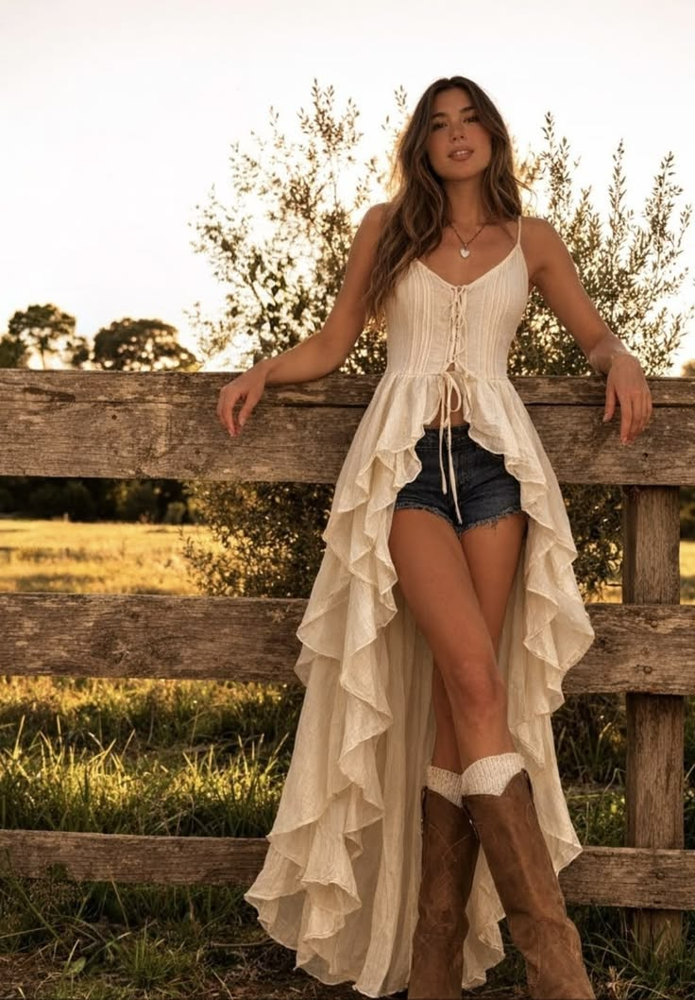

### Descrição visual (roupa)
- Top/peplum creme com cadarço e **cauda high-low** de babados  
- Short jeans destroyed por baixo  
- Botas cowboy marrom; meias de cano  
- Colar fino

### Quando usar
Pack, visual boho-country, contraste peplum + short.

---

## 155 · Kimono boho + crochê + short

**Arquivo:** `soft_boho_kimono.jpg`  
**Nome rápido:** Kimono boho + crochê + short · **#155**
**Combina com (sugestão):** Reina / qualquer  
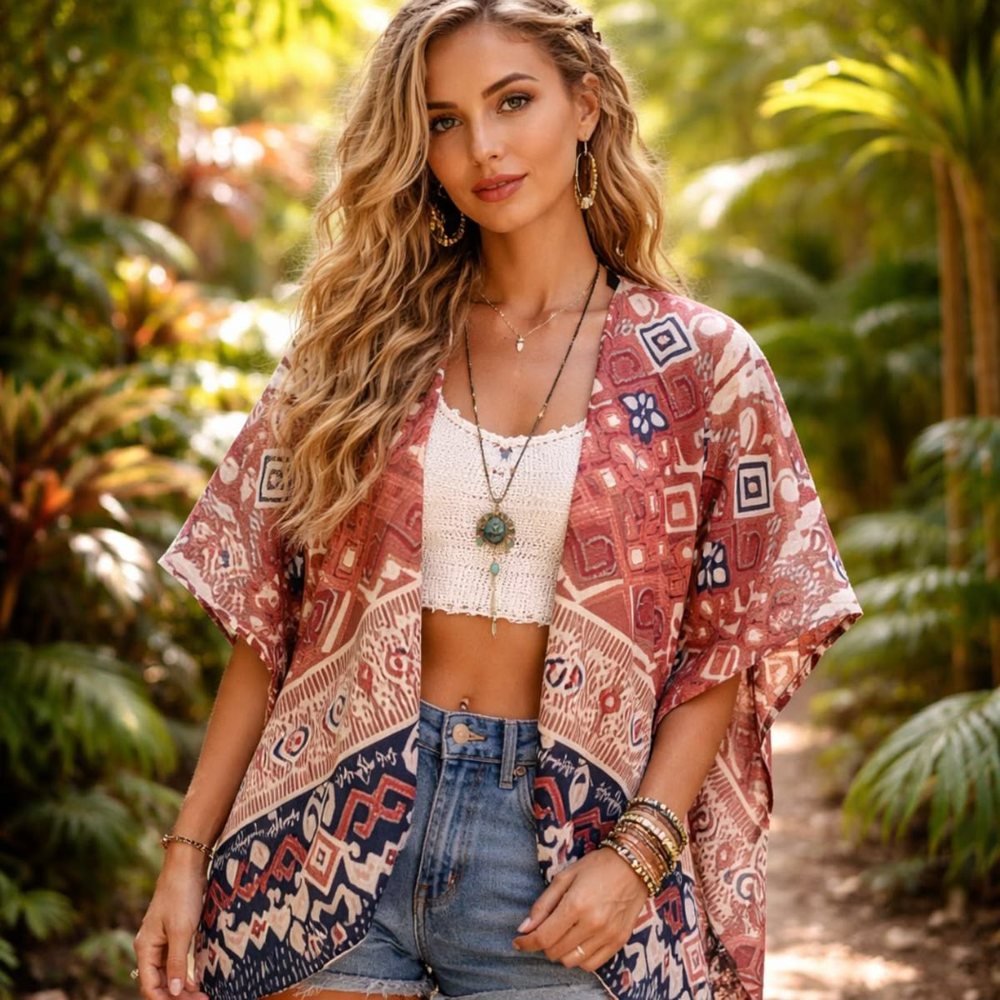

### Descrição visual (roupa)
- Kimono/cardigan aberto com estampa **étnica** (terracota, azul, creme)  
- Crop de crochê/branco por baixo  
- Short jeans destroyed  
- Colares longos, argolas, pulseiras em camadas

### Quando usar
Pack, verão, visual boho descontraído.

---

## 156 · Blusa branca + saia barroca

**Arquivo:** `soft_blouse_baroque_skirt.jpg`  
**Nome rápido:** Blusa branca + saia barroca · **#156**
**Combina com (sugestão):** Reina / qualquer  
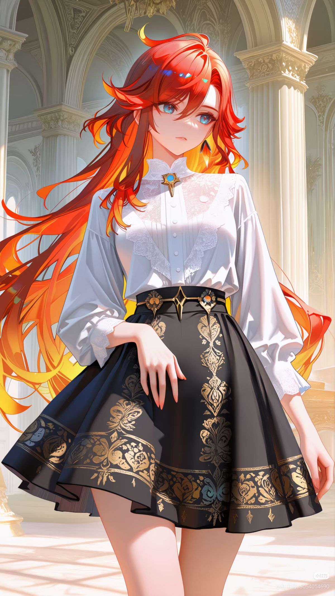

### Descrição visual (roupa)
- Blusa branca de colarinho, mangas longas, detalhes de renda  
- Mini saia preta godê com **bordado dourado** barroco  
- Cinto ornamentado na cintura

### Quando usar
Evento semi-formal, jantar, visual “blusa + saia” elegante.

---

## 157 · Crop floral + mini babado branca

**Arquivo:** `soft_white_floral_crop_skirt.jpg`  
**Nome rápido:** Crop floral + mini babado branca · **#157**
**Combina com (sugestão):** Reina / qualquer  
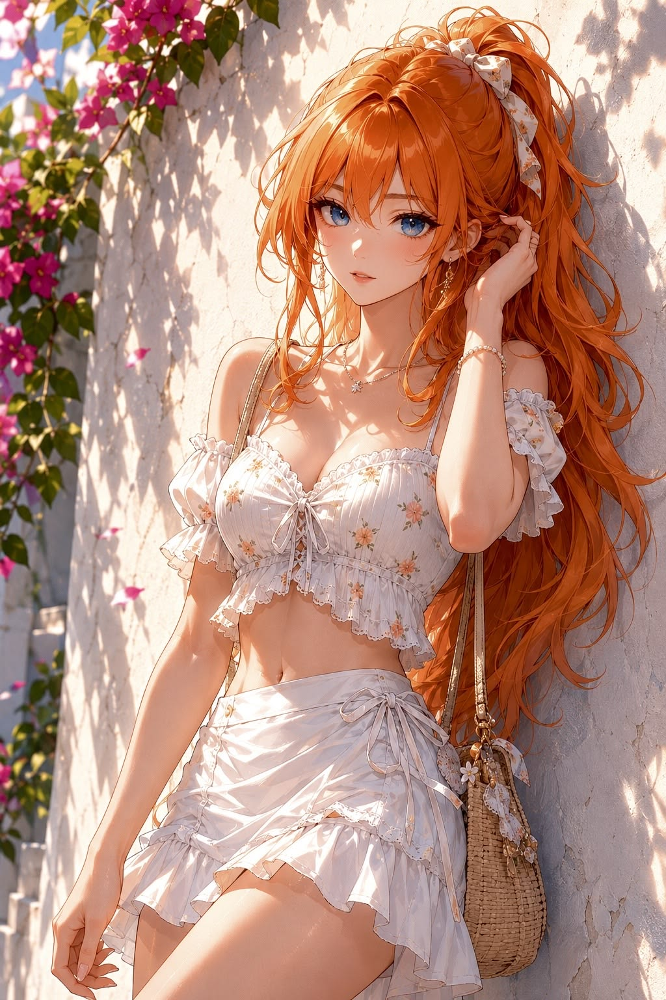

### Descrição visual (roupa)
- Crop branco com flores miúdas, alças, babados, cadarço no peito  
- Mini saia branca com babados e laços laterais  
- Bolsa de palha; colares finos

### Quando usar
Verão, pack, visual soft-branco co-ord.

---

## 158 · Steampunk corset

**Arquivo:** `steampunk_corset.jpg`  
**Nome rápido:** Steampunk corset · **#158**
**Combina com (sugestão):** qualquer  
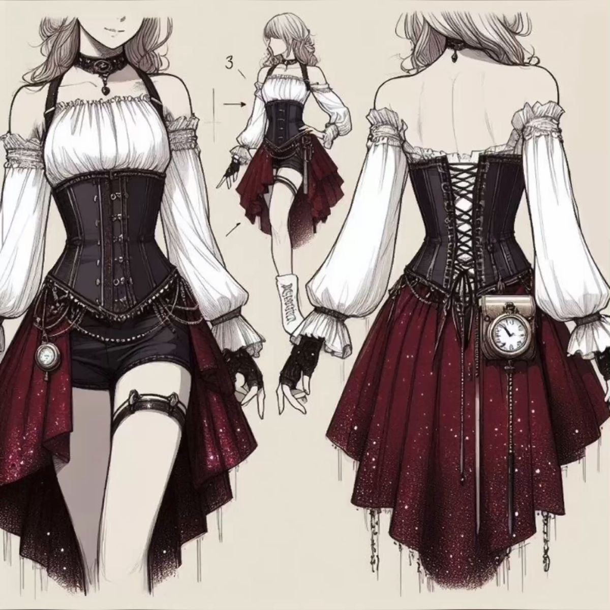

### Descrição visual (roupa)
- Blusa branca ombro a ombro, mangas longas  
- Corset preto com fivelas  
- Cauda/saia burgundy assimétrica  
- Meias-liga; luvas sem dedos; relógio de bolso como acessório  
- Sheet de referência (frente/costas)

### Quando usar
Fantasia, bar temático, evento raro — **não** look de job.

---

# PEÇAS / CAMADAS (completar na cena)

## 191 · Colete crop oliva

**Arquivo:** `piece_olive_crop_vest.jpg`  
**Nome rápido:** Colete crop oliva · **#191**
**Combina com (sugestão):** qualquer  
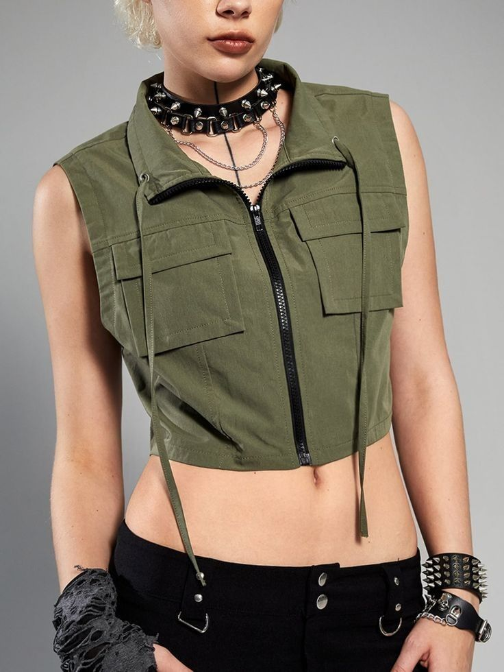

### Descrição visual (roupa)
- Colete crop **oliva**, sem mangas, gola, zíper central  
- Bolsos no peito com botões; cordões  
- Choker com spikes; pulseiras de couro (acessório)

### Completar com
- Short ou calça preta / jeans  
- Ou saia mini preta  
- Botas; top fino se o colete ficar aberto

### Quando usar
Camada street/badlands sobre base simples.

---

## 192 · Halter pinstripe

**Arquivo:** `piece_pinstripe_halter.jpg`  
**Nome rápido:** Halter pinstripe · **#192**
**Combina com (sugestão):** qualquer  
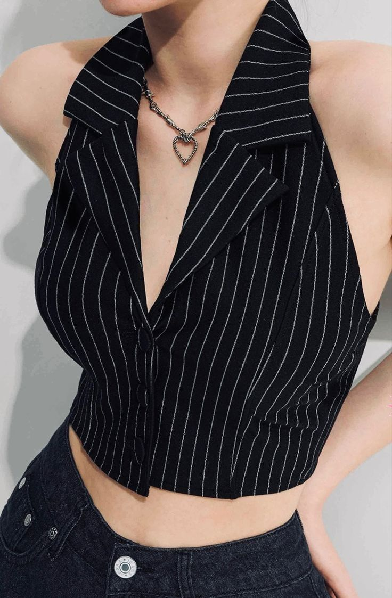

### Descrição visual (roupa)
- Top/colete **halter** preto com listras finas brancas  
- Gola de blazer, botões frontais, crop  
- Colar de corrente (acessório)

### Completar com
- Jeans, cargo ou saia  
- Cinto; botas ou saltos

### Quando usar
Street semi-formal, camada de destaque no tronco.

---

## 193 · Colete oliva + gola alta

**Arquivo:** `piece_olive_vest_turtleneck.jpg`  
**Nome rápido:** Colete oliva + gola alta · **#193**
**Combina com (sugestão):** qualquer  
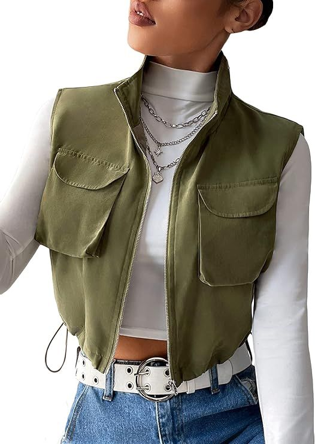

### Descrição visual (roupa)
- Colete oliva com bolsos e zíper  
- Gola alta / turtleneck branca por baixo  
- Cinto branco largo (visível na foto)  
- Jeans parcialmente visíveis

### Completar com
- Jeans ou saia (se a foto cortar as pernas)  
- Botas ou tênis

### Quando usar
Camada utilitária urbana / pack.

---

## 194 · Camisa halter listrada

**Arquivo:** `piece_striped_halter_shirt.jpg`  
**Nome rápido:** Camisa halter listrada · **#194**
**Combina com (sugestão):** qualquer  
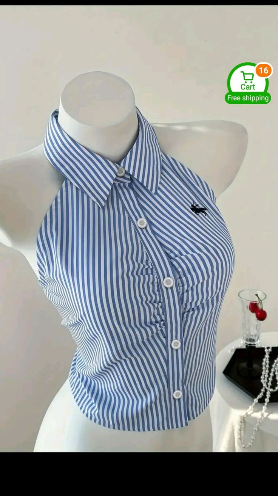

### Descrição visual (roupa)
- Camisa **halter** azul/branca listrada, colarinho, botões  
- Costas abertas; silhueta crop no tronco  
- (Mannequin/UI de loja: **ignorar**, usar só o corte da peça)

### Completar com
- Saia, short ou wide-leg  
- Cinto fino; sapatos da ocasião

### Quando usar
Base de look summer/formal-leve — combine com saia do catálogo.

---

# SHORTS NOVOS (varredura)

## 053 · Gym — short oliva set

**Arquivo:** `gym_olive_short_set.jpg`  
**Nome rápido:** Gym — short oliva set · **#053**
**Combina com (sugestão):** qualquer  
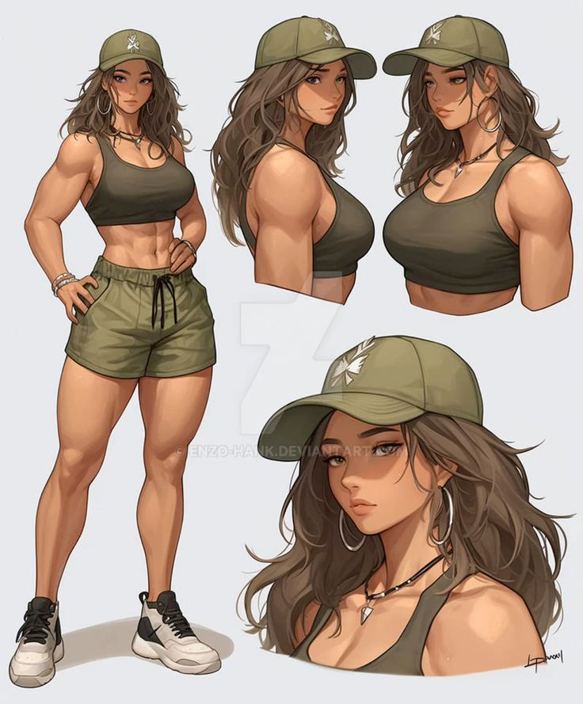

### Descrição visual (roupa)
- Sports bra / top oliva  
- Short oliva com cordão  
- Boné oliva; tênis esportivos  

### Quando usar
Treino, pack em calor, visual fitness nomad.

---

## 054 · Gym — running preto

**Arquivo:** `gym_black_running_set.jpg`  
**Nome rápido:** Gym — running preto · **#054**
**Combina com (sugestão):** qualquer  

### Descrição visual (roupa)
- Top esportivo preto com detalhe claro  
- Short de corrida preto com cordão e barra clara  

### Quando usar
Academia, corrida, treino limpo.

---

## 040 · Combate — cargo short + botas

**Arquivo:** `combat_cargo_shorts_boots.jpg`  
**Nome rápido:** Combate — cargo short + botas · **#040**
**Combina com (sugestão):** Valk / Alex / pack  
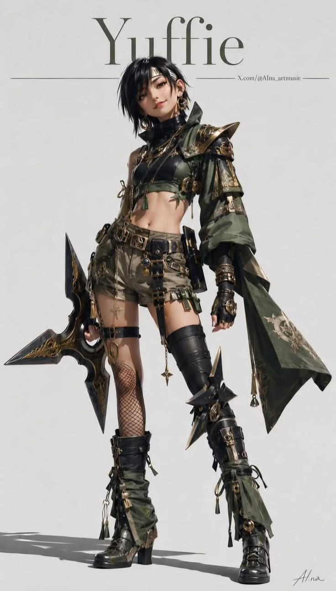

### Descrição visual (roupa)
- Crop/top com cintas  
- Short cargo cáqui com bolsos e cinto  
- Botas altas + meia-arrastão em uma perna  
- Capas/ombro decorativos (roupa)  
- **Ignorar** arma da foto  

### Quando usar
Ação, street combat, visual “short + botas”.

---

## 015 · Street — crop + micro short

**Arquivo:** `street_crop_micro_shorts.jpg`  
**Nome rápido:** Street — crop + micro short · **#015**
**Combina com (sugestão):** Alex / Valk  
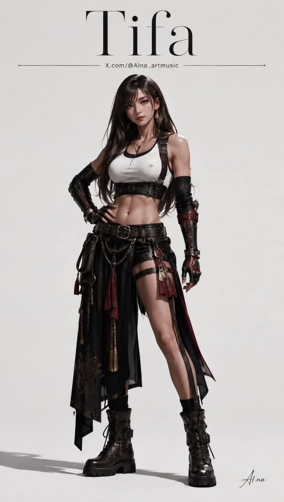

### Descrição visual (roupa)
- Tank/crop branco  
- Micro short preto com cintos e panos no quadril  
- Botas de combate; luvas/braçadeiras  

### Quando usar
Ação ousada, street edgerunner, calor extremo.

---

## 041 · Combate — halter + short verde

**Arquivo:** `combat_halter_green_shorts.jpg`  
**Nome rápido:** Combate — halter + short verde · **#041**
**Combina com (sugestão):** Valk / Alex / pack  
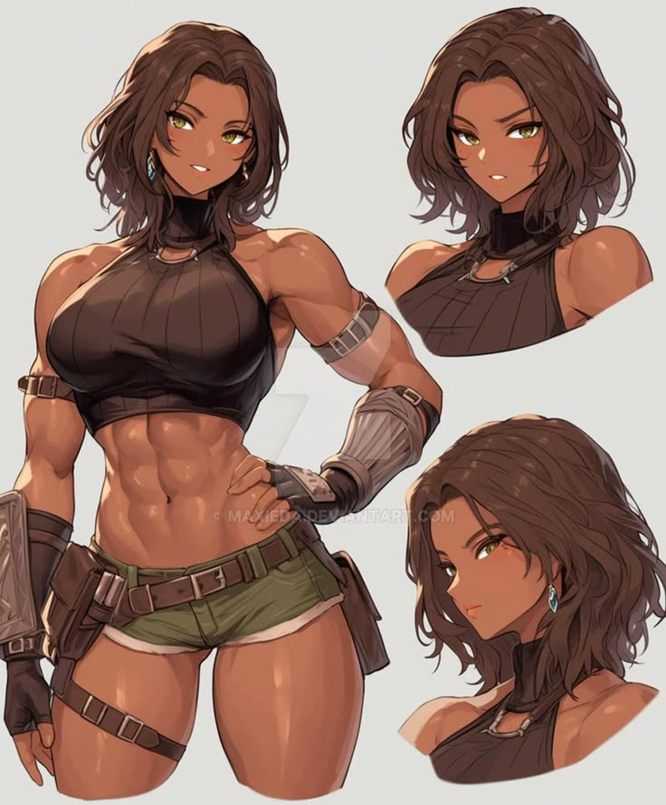

### Descrição visual (roupa)
- Top/halter preto crop  
- Short verde militar curto  
- Cinto largo com bolsos utilitários  

### Quando usar
Campo leve, combate hot weather, visual curto.

---

## 016 · Street — hoodie + short jeans

**Arquivo:** `street_hoodie_denim_shorts.jpg`  
**Nome rápido:** Street — hoodie + short jeans · **#016**
**Combina com (sugestão):** qualquer  
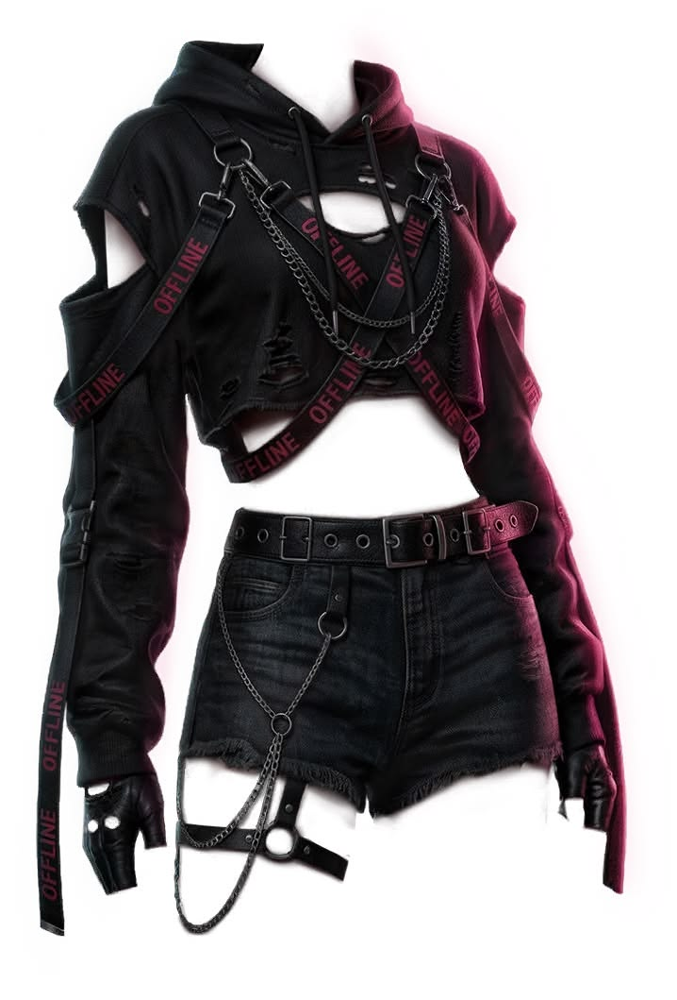

### Descrição visual (roupa)
- Hoodie crop preto rasgado / cutouts  
- Short jeans preto destroyed  
- Cinto + correntes (acessório de roupa)  
- (Flatlay — extrair só peças)  

### Quando usar
Street alt, night out casual.

---

## 046 · Tech — pink short set

**Arquivo:** `tech_pink_short_set.jpg`  
**Nome rápido:** Tech — pink short set · **#046**
**Combina com (sugestão):** Echo / qualquer  

### Descrição visual (roupa)
- Crop tech preto/rosa, gola alta  
- Short preto de cintura alta  
- Jaqueta oversized branca/rosa  
- Cinto rosa com bolsos  
- (Manequim — só roupa)  

### Quando usar
Street-tech, job fashion cyber (variante short do tech_crop_jacket).

---

## 116 · Club — corset + short couro + OTK

**Arquivo:** `club_corset_leather_shorts.png`  
**Nome rápido:** Club — corset + short couro + OTK · **#116**
**Combina com (sugestão):** Alex  

### Descrição visual (roupa)
- Corset/top preto off-shoulder, mangas sino, lace-up  
- Short de couro preto com lace-up lateral  
- Botas pretas platform over-knee  
- (Flatlay de peças)  

### Quando usar
Clube, noite ousada (parecido com club_corset_platform; short mais fechado).

---

## 117 · Club — goth short + casaco

**Arquivo:** `club_goth_leather_shorts.jpg`  
**Nome rápido:** Club — goth short + casaco · **#117**
**Combina com (sugestão):** Alex  
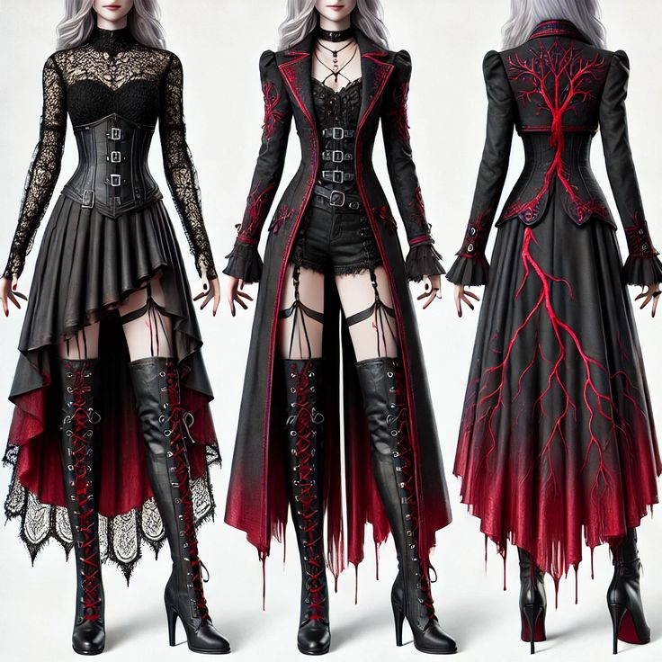

### Descrição visual (roupa)
- Short preto de couro  
- Casaco longo preto com detalhes vermelhos  
- Meias-liga; botas altas lace-up  
- (Sheet multi-view — usar short + camadas)  

### Quando usar
Clube goth, night out dramático **com short**.

---

## 159 · Soft — steampunk short + cauda

**Arquivo:** `soft_steampunk_shorts_coat.jpg`  
**Nome rápido:** Soft — steampunk short + cauda · **#159**
**Combina com (sugestão):** Reina / qualquer  

### Descrição visual (roupa)
- Blusa branca off-shoulder  
- Corset preto  
- Short preto sob cauda/saia burgundy high-low  
- Meias-liga; relógio de bolso  
- (Sheet — extrair peças)  

### Quando usar
Fantasia, bar temático — variante short do steampunk_corset.

---

# SAIAS NOVAS (varredura)

## 017 · Street — plaid roxo + mini

**Arquivo:** `street_purple_plaid_mini.jpg`  
**Nome rápido:** Street — plaid roxo + mini · **#017**
**Combina com (sugestão):** Alex / Valk  

### Descrição visual (roupa)
- Camisa xadrez roxa crop aberta  
- Top preto por baixo  
- Mini saia preta; cinto com corrente  
- Meia-arrastão  

### Quando usar
Bar, street alt (variante do street_alt_plaid).

---

## 018 · Street — hoodie + saia bege

**Arquivo:** `street_hoodie_beige_pleat.jpg`  
**Nome rápido:** Street — hoodie + saia bege · **#018**
**Combina com (sugestão):** qualquer  
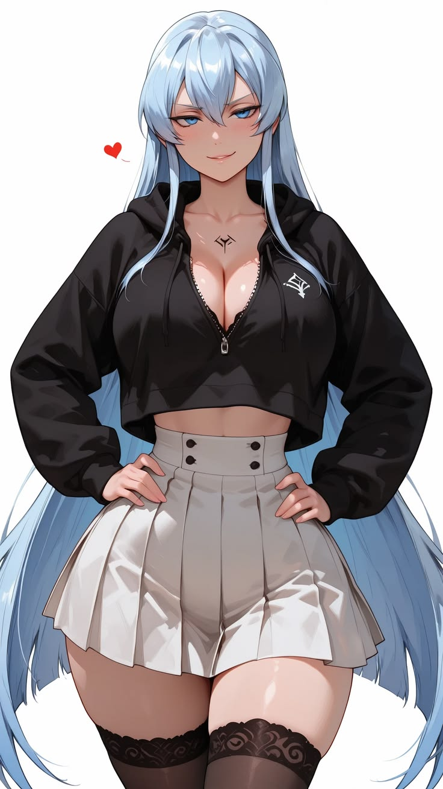

### Descrição visual (roupa)
- Hoodie crop preto com zíper  
- Mini saia plissada bege/clara  
- Meias 7/8 pretas  

### Quando usar
Street fashion, folga urbana.

---

## 019 · Street — mini couro plissada

**Arquivo:** `street_leather_pleat_mini.jpg`  
**Nome rápido:** Street — mini couro plissada · **#019**
**Combina com (sugestão):** Alex / Valk  
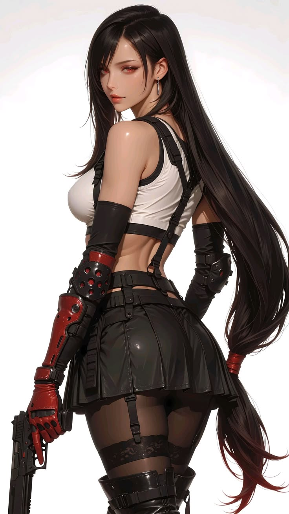

### Descrição visual (roupa)
- Crop/tank branco com harness de roupa  
- Mini plissada de couro preto  
- Meia-calça; botas altas  
- **Ignorar** arma e chrome da foto  

### Quando usar
Street/clube; visual “crop + saia couro”.

---

## 096 · Formal — cape + saia plissada

**Arquivo:** `formal_cape_pleat_mini.jpg`  
**Nome rápido:** Formal — cape + saia plissada · **#096**
**Combina com (sugestão):** qualquer  
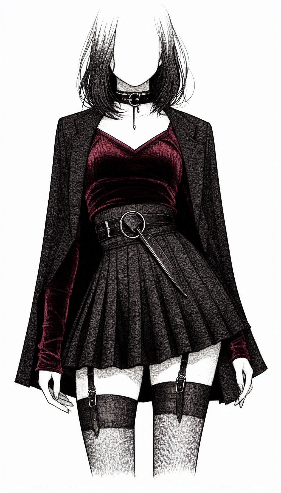

### Descrição visual (roupa)
- Blazer/capa preta  
- Top/camisole burgundy  
- Mini saia plissada preta  
- Cinto largo; meias-liga  
- (Figura sem rosto — só roupa)  

### Quando usar
Semi-formal ousado, jantar, clube elegante.

---

## 020 · Street — grey hoodie + mini preta

**Arquivo:** `street_grey_hoodie_black_mini.jpg`  
**Nome rápido:** Street — grey hoodie + mini preta · **#020**
**Combina com (sugestão):** Alex / Valk  
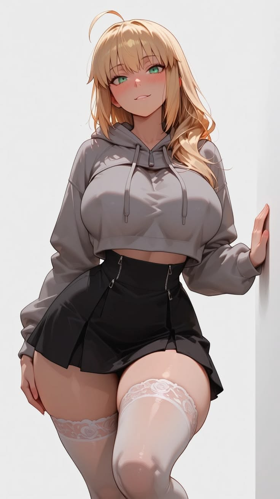

### Descrição visual (roupa)
- Hoodie cinza crop  
- Mini saia preta com zíperes  
- Meias brancas altas  

### Quando usar
Street casual ousado, casa/saída.

---

## 021 · Street — red hoodie + pleat

**Arquivo:** `street_red_hoodie_pleat.jpg`  
**Nome rápido:** Street — red hoodie + pleat · **#021**
**Combina com (sugestão):** qualquer  

### Descrição visual (roupa)
- Hoodie crop vermelho/preto  
- Mini saia plissada preta  
- Corrente de cinto; tênis/botas  
- (Concept sheet — extrair look principal)  

### Quando usar
Street fashion (irmão do street_hoodie_pleat).

---

## 118 · Club — bra + jaqueta + mini

**Arquivo:** `club_bra_jacket_pleat.jpg`  
**Nome rápido:** Club — bra + jaqueta + mini · **#118**
**Combina com (sugestão):** Alex  
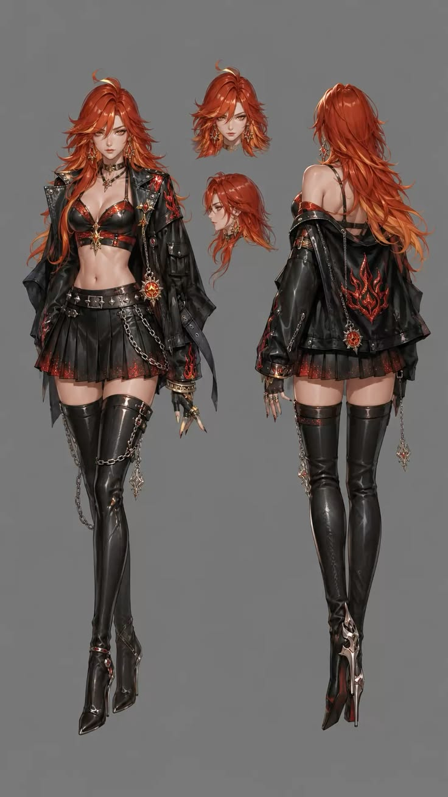

### Descrição visual (roupa)
- Top tipo sutiã/crop com correntes  
- Jaqueta preta aberta  
- Mini plissada preta  
- Botas OTK pretas  

### Quando usar
Clube ousado — **só se a cena pedir** exposição alta.

---

## 034 · Casual — skort preto

**Arquivo:** `casual_black_skort.jpg`  
**Nome rápido:** Casual — skort preto · **#034**
**Combina com (sugestão):** qualquer  
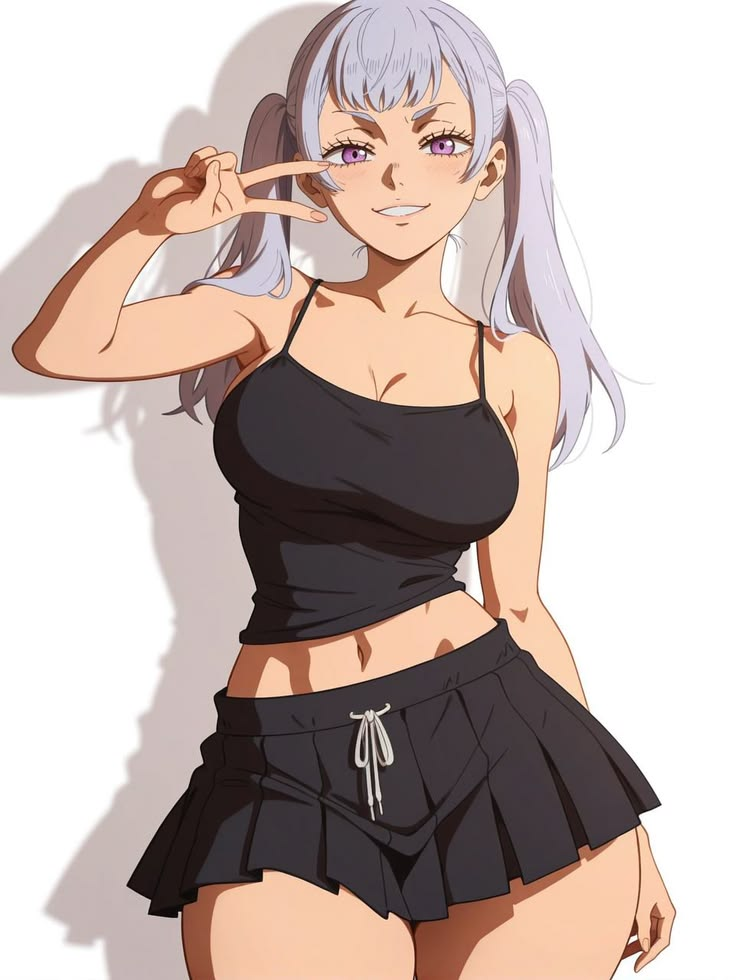

### Descrição visual (roupa)
- Tank/top alça preto  
- Saia-short plissada preta com cordão  

### Quando usar
Casual, gym fashion, folga.

---

## 097 · Formal — renda + midi bege

**Arquivo:** `formal_lace_beige_midi.jpg`  
**Nome rápido:** Formal — renda + midi bege · **#097**
**Combina com (sugestão):** qualquer  
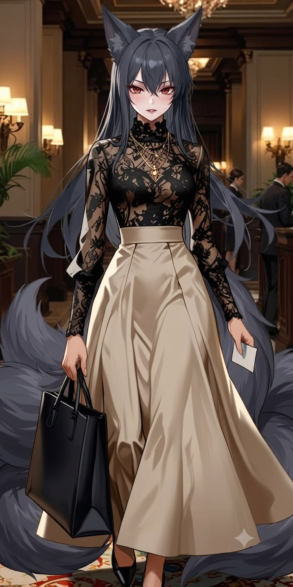

### Descrição visual (roupa)
- Blusa de renda preta gola alta, mangas longas  
- Saia midi/longuete bege plissada  
- Bolsa estruturada; saltos  
- (Ignorar orelhas/cauda cosplay)  

### Quando usar
Jantar, cliente semi-formal, visual elegante com **saia** (não calça).

---

# EVENING / FANTASIA NOVOS

## 126 · Purple satin slit

**Arquivo:** `evening_purple_satin_slit.jpg`  
**Nome rápido:** Purple satin slit · **#126**
**Combina com (sugestão):** Reina  
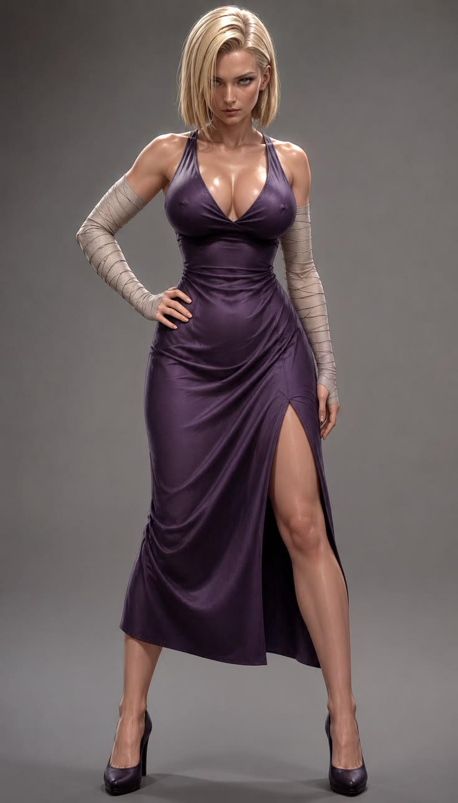

### Descrição visual (roupa)
- Vestido cetim roxo, halter, decote V  
- Fenda alta; saltos  
- Mangas-luva tipo bandage (opcional)  

### Quando usar
Gala, jantar alto, destaque roxo.

---

## 119 · Club strapless mini

**Arquivo:** `club_black_strapless_mini.jpg`  
**Nome rápido:** Club strapless mini · **#119**
**Combina com (sugestão):** Alex  
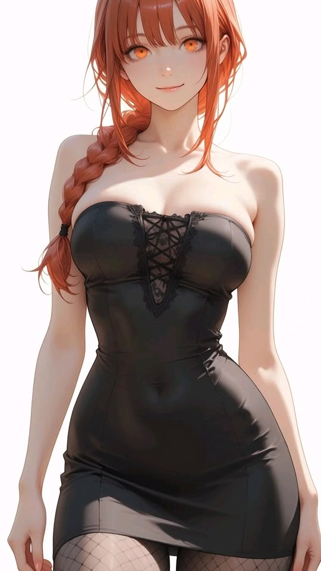

### Descrição visual (roupa)
- Mini tomara-que-caia preto, lace-up no busto  
- Meia-arrastão  

### Quando usar
Clube, noite minimalista ousada.

---

## 127 · Black cross slit

**Arquivo:** `evening_black_cross_slit.jpg`  
**Nome rápido:** Black cross slit · **#127**
**Combina com (sugestão):** Reina  
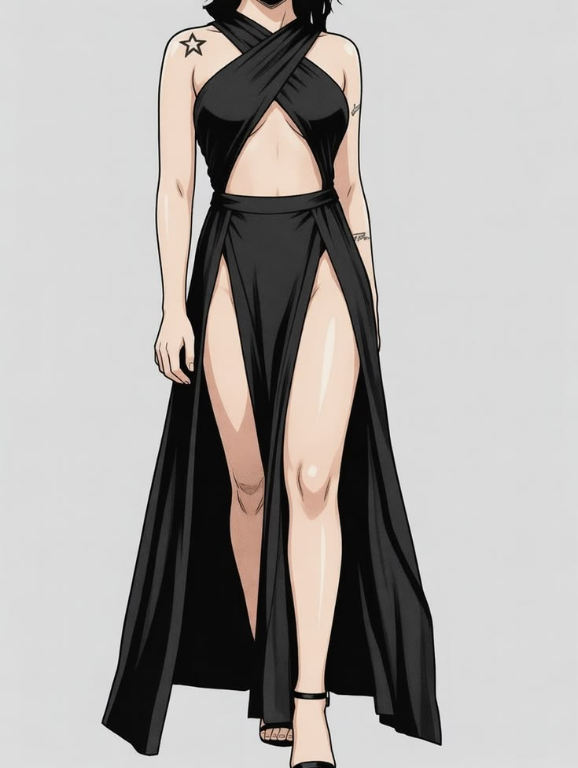

### Descrição visual (roupa)
- Vestido preto, alças cruzadas no peito, cut-out  
- Saia com fenda alta / abertura frontal  
- Sandálias de tira  

### Quando usar
Evening ousado, corpo, gala.

---

## 128 · Cream satin mini

**Arquivo:** `evening_cream_satin_mini.jpg`  
**Nome rápido:** Cream satin mini · **#128**
**Combina com (sugestão):** Reina  
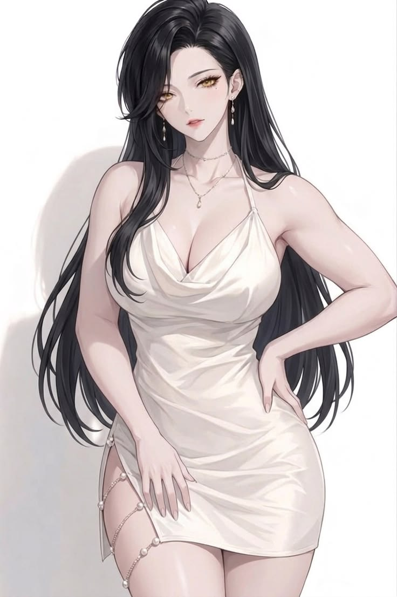

### Descrição visual (roupa)
- Mini vestido cetim creme, alça fina, decote fluido  
- Correntes na coxa (acessório)  

### Quando usar
Date, jantar, evening soft.

---

## 160 · Soft black mini + botas

**Arquivo:** `soft_black_mini_boots.jpg`  
**Nome rápido:** Soft black mini + botas · **#160**
**Combina com (sugestão):** Reina / qualquer  
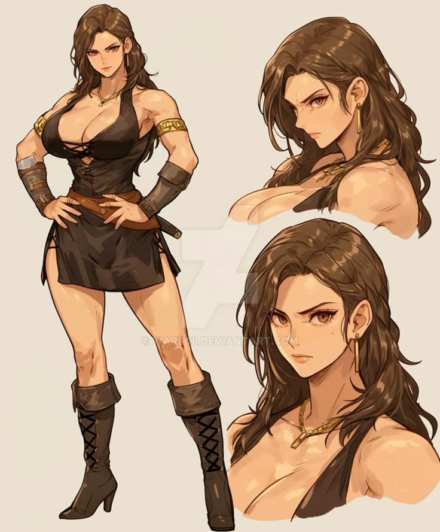

### Descrição visual (roupa)
- Mini vestido preto, alças, lace-up frontal  
- Botas marrom de cano médio  

### Quando usar
Pack, street soft, visual “vestido + bota”.

---

## 129 · White hooded gown

**Arquivo:** `evening_white_hooded_gown.png`  
**Nome rápido:** White hooded gown · **#129**
**Combina com (sugestão):** Reina  
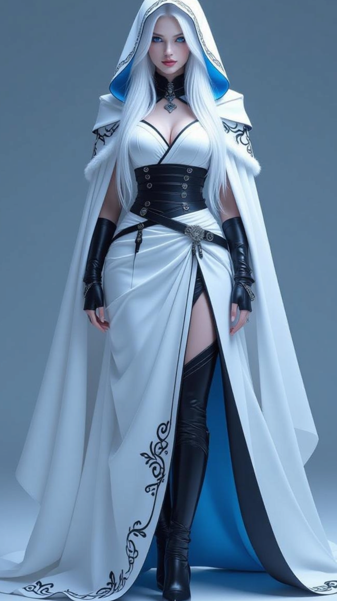

### Descrição visual (roupa)
- Vestido branco fluido com capa/capuz  
- Corset/cinto preto na cintura  
- Luvas pretas; botas OTK pretas  
- Fenda na perna  

### Quando usar
Gala fantasia, evento cerimonial.

---

## 130 · Black hooded gown

**Arquivo:** `evening_black_hooded_gown.png`  
**Nome rápido:** Black hooded gown · **#130**
**Combina com (sugestão):** Reina  
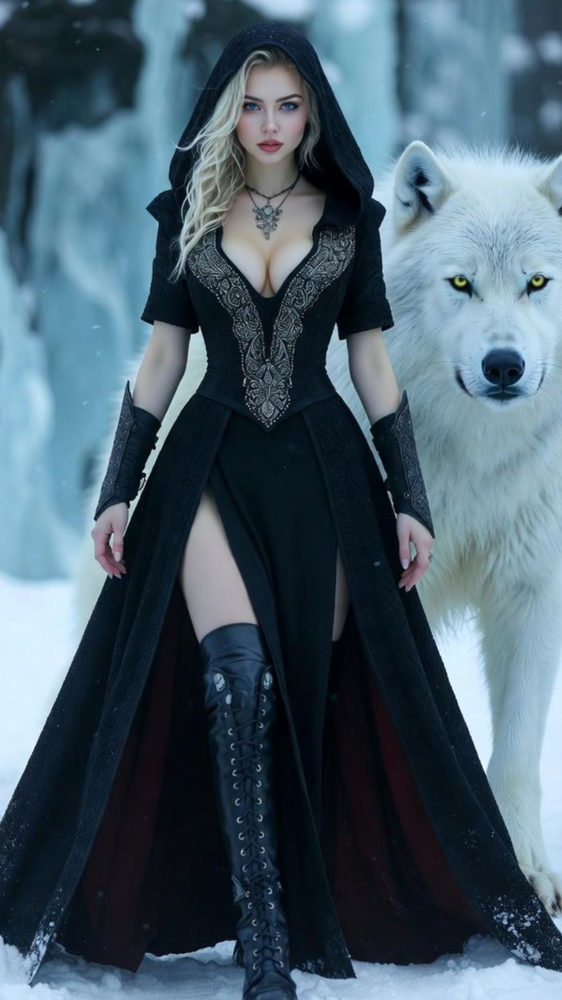

### Descrição visual (roupa)
- Vestido/casaco longo preto com capuz  
- Bordado no decote; fenda alta  
- Botas pretas lace-up  

### Quando usar
Evening dark, fantasia, inverno dramático.

---

## 161 · Fantasy orange-white gown

**Arquivo:** `fantasy_orange_white_gown.jpg`  
**Nome rápido:** Fantasy orange-white gown · **#161**
**Combina com (sugestão):** Reina  
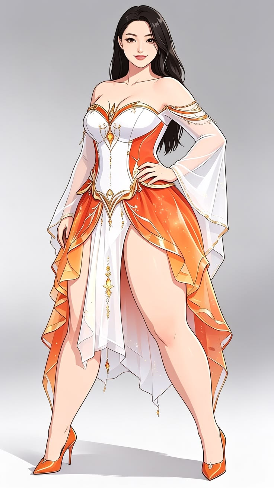

### Descrição visual (roupa)
- Vestido branco e laranja, off-shoulder, fenda  
- Detalhes dourados; saltos laranja  

### Quando usar
Fantasia, gala colorida — **não** job.

---

## 162 · Fantasy green long dress

**Arquivo:** `fantasy_green_long_dress.jpg`  
**Nome rápido:** Fantasy green long dress · **#162**
**Combina com (sugestão):** Reina  
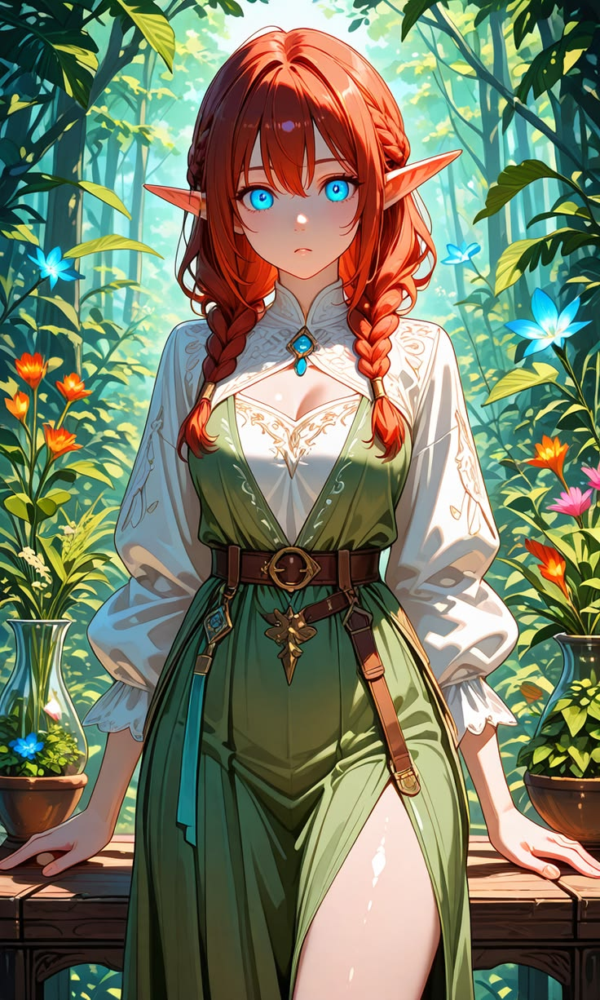

### Descrição visual (roupa)
- Vestido longo verde com fenda  
- Blusa branca por baixo; cinto de couro  

### Quando usar
Fantasia soft, evento temático.

---

## 131 · White qipao

**Arquivo:** `evening_white_qipao.jpg`  
**Nome rápido:** White qipao · **#131**
**Combina com (sugestão):** Reina  
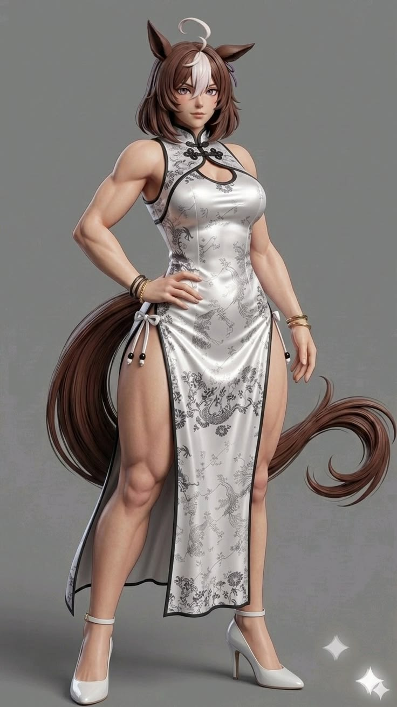

### Descrição visual (roupa)
- Qipao branca com motivo impresso  
- Fendas laterais altas; saltos claros  
- (Ignorar orelhas/cauda)  

### Quando usar
Evening ousado estruturado (variante clara do qipao preto).

---

## 163 · Soft pink layered

**Arquivo:** `soft_pink_layered_skirt.jpg`  
**Nome rápido:** Soft pink layered · **#163**
**Combina com (sugestão):** Reina / qualquer  
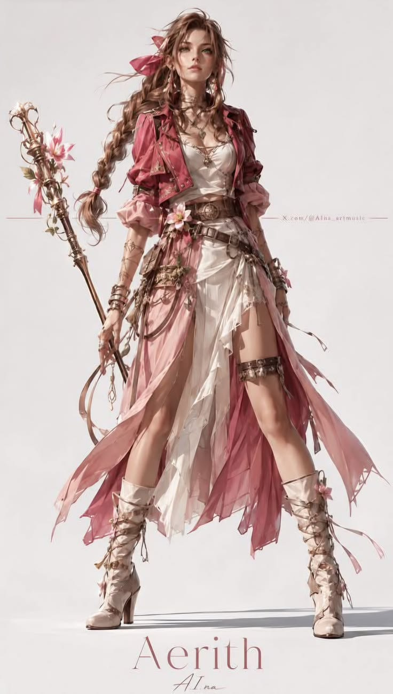

### Descrição visual (roupa)
- Jaqueta/cropped rosa  
- Top branco; saias em camadas rosa/creme  
- Botas de cadarço claras  
- **Ignorar** bastão/arma da foto  

### Quando usar
Pack soft, fantasia leve, visual boho-rosa.

---

## 164 · Fantasy teal coat + skirt

**Arquivo:** `fantasy_teal_coat_skirt.jpg`  
**Nome rápido:** Fantasy teal coat + skirt · **#164**
**Combina com (sugestão):** Reina  
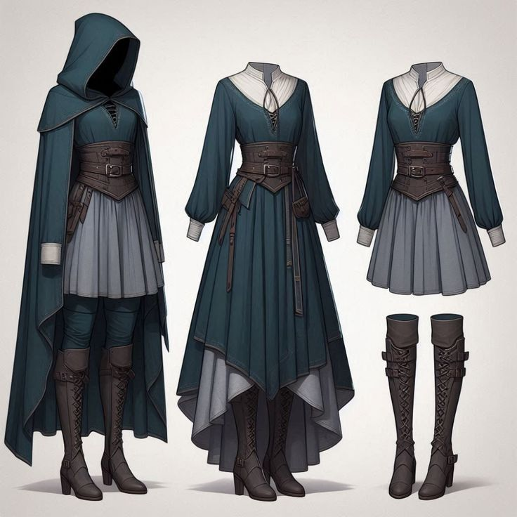

### Descrição visual (roupa)
- Casaco/capa teal com capuz  
- Vestido ou saia cinza-azul com cinto de couro  
- Botas de cano  
- (Sheet de peças — combinar look)  

### Quando usar
Fantasia, cold weather temático.

---

# ESPECIAL / OUSADO / LINGERIE DE OCASIÃO

> Só se a **cena** pedir (clube, corpo, fantasia). **Não** default de job/campo.

## 181 · Latex mini + gravata

**Arquivo:** `special_latex_mini_tie.jpg`  
**Nome rápido:** Latex mini + gravata · **#181**
**Combina com (sugestão):** Alex  
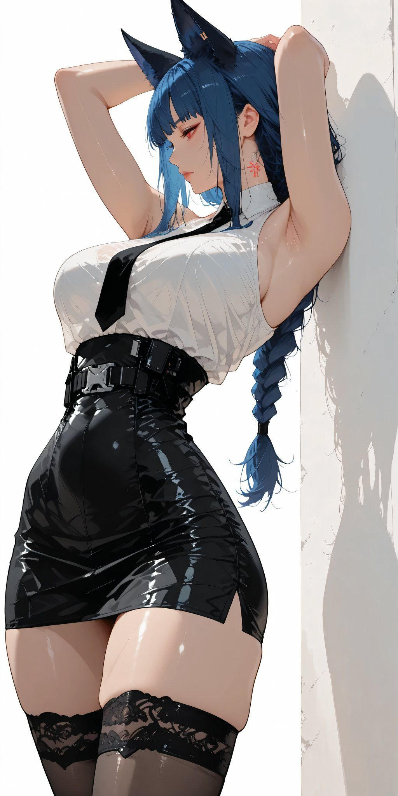

### Descrição visual (roupa)
- Camisa branca sem mangas + gravata  
- Mini saia latex/brilhante preta  
- Meias 7/8 rendadas  
- (Ignorar orelhas cosplay)  

### Quando usar
Clube ousado, roleplay fashion.

---

## 182 · Navy extreme slit

**Arquivo:** `special_navy_extreme_slit.jpg`  
**Nome rápido:** Navy extreme slit · **#182**
**Combina com (sugestão):** cena especial  
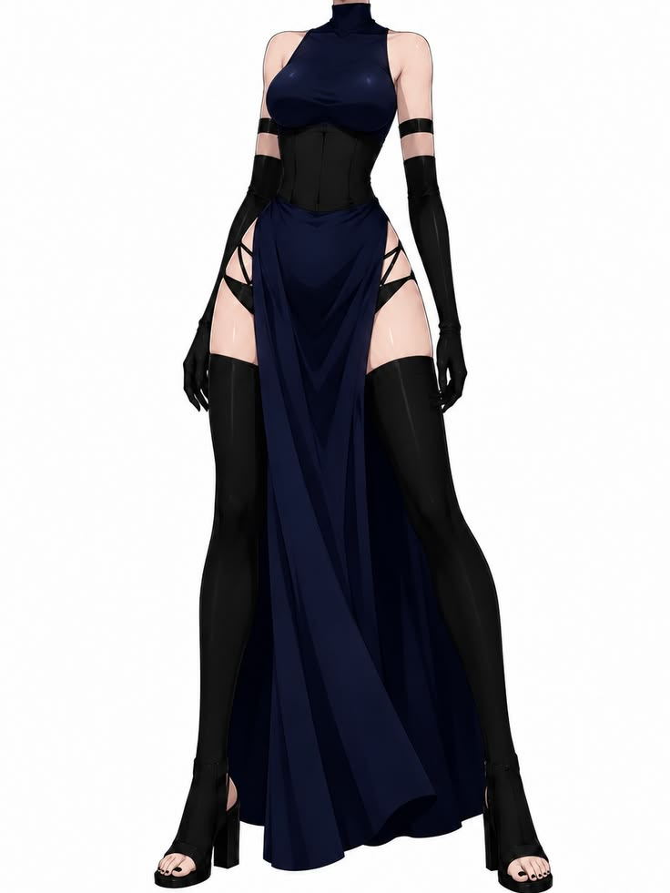

### Descrição visual (roupa)
- Vestido marinho gola alta, corset preto  
- Fenda extrema; tiras nas coxas  
- Meia-calça OTK preta; luvas longas  

### Quando usar
Gala ousada, corpo high-end.

---

## 183 · Latex body + jaqueta vermelha

**Arquivo:** `special_latex_bodysuit_red.jpg`  
**Nome rápido:** Latex body + jaqueta vermelha · **#183**
**Combina com (sugestão):** Alex  
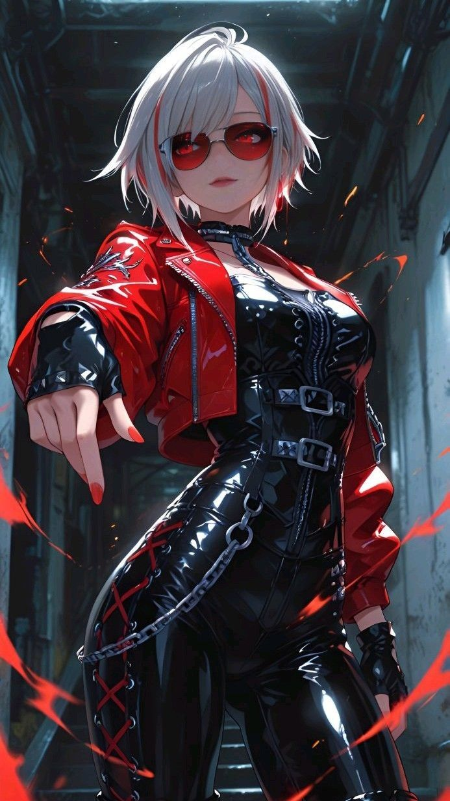

### Descrição visual (roupa)
- Body/catsuit latex preto com cinto e correntes  
- Jaqueta vermelha curta  
- Óculos vermelhos (acessório)  

### Quando usar
Night out extremo, clube.

---

## 184 · Plaid asymmetric dress

**Arquivo:** `special_plaid_asymmetric_dress.png`  
**Nome rápido:** Plaid asymmetric dress · **#184**
**Combina com (sugestão):** cena especial  
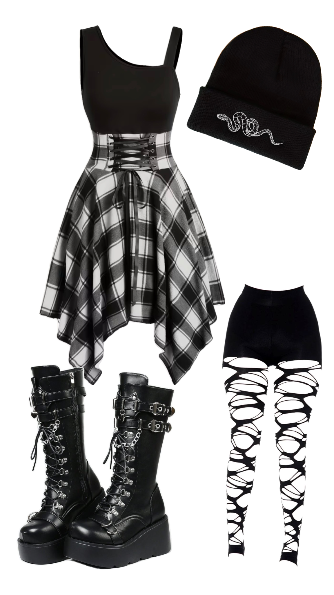

### Descrição visual (roupa)
- Vestido xadrez P&B assimétrico + corset lace-up  
- Beanie preto; botas platform  
- Meia/legging rasgada (peça)  
- (Flatlay)  

### Quando usar
Alt/goth club, fantasia street.

---

## 185 · Sheer cheongsam dourado

**Arquivo:** `special_sheer_cheongsam.jpg`  
**Nome rápido:** Sheer cheongsam dourado · **#185**
**Combina com (sugestão):** cena especial  
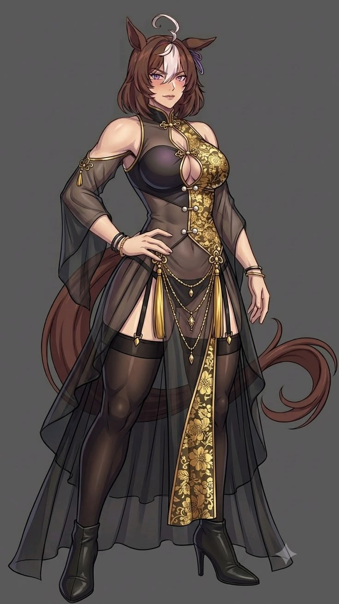

### Descrição visual (roupa)
- Vestido tipo cheongsam sheer preto/dourado  
- Fenda alta; meias; saltos  
- (Ignorar orelhas/cauda)  

### Quando usar
Evento ousado, corpo temático.

---

## 186 · Purple suit mini

**Arquivo:** `special_purple_suit_mini.jpg`  
**Nome rápido:** Purple suit mini · **#186**
**Combina com (sugestão):** cena especial  
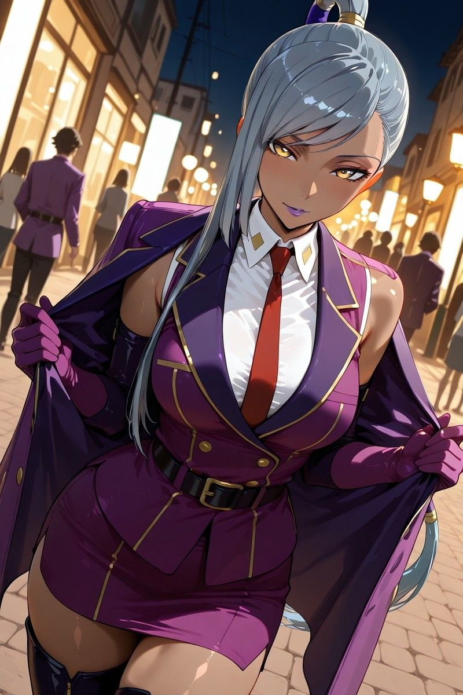

### Descrição visual (roupa)
- Blazer roxo + colete + camisa branca + gravata vermelha  
- Mini saia do terno; luvas roxas; botas  
- Sobretudo roxo aberto  

### Quando usar
Clube / formal ousado, presença “power suit” curta.

---

## 187 · Especial — school shirt + saia

**Arquivo:** `special_school_shirt_pleat.jpg`  
**Nome rápido:** Especial — school shirt + saia · **#187**
**Combina com (sugestão):** cena especial  
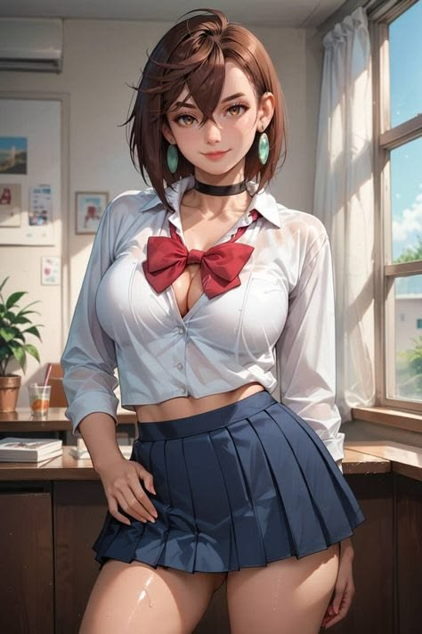

### Descrição visual (roupa)
- Camisa branca crop + laço vermelho  
- Mini saia plissada marinho  
- Choker  

### Quando usar
**Só** fantasia/roleplay — não default de personagem.

---

## 188 · Especial — school vest + saia vermelha

**Arquivo:** `special_school_vest_red_skirt.jpg`  
**Nome rápido:** Especial — school vest + saia vermelha · **#188**
**Combina com (sugestão):** cena especial  
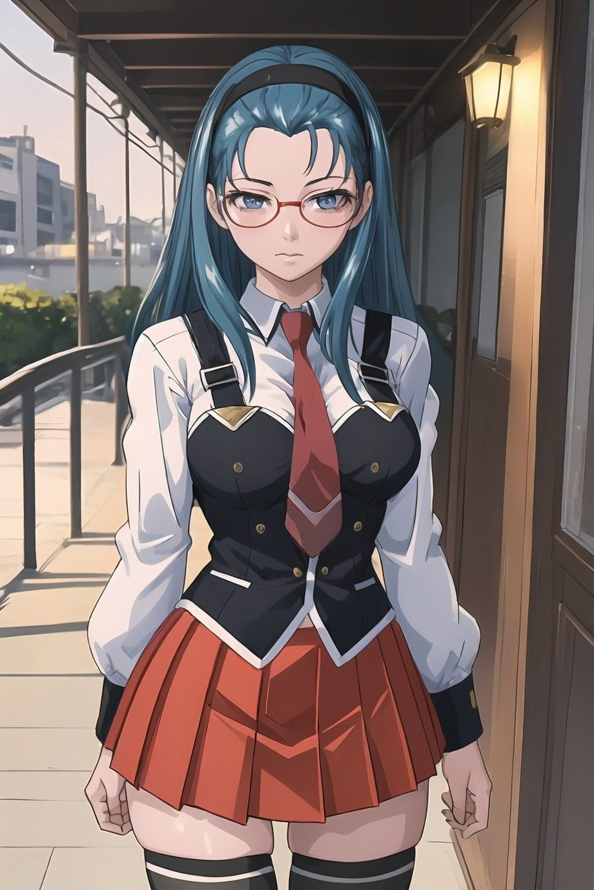

### Descrição visual (roupa)
- Camisa branca + colete preto + gravata  
- Mini saia plissada vermelha  
- Meias 7/8  

### Quando usar
Fantasia/uniforme estilizado — **não** job.

---

# GAPS DE CENA (stealth, clima, media, lounge, formal)

## 042 · Stealth — jumpsuit preto

**Arquivo:** `stealth_black_jumpsuit.jpg`  
**Nome rápido:** Stealth — jumpsuit preto · **#042**
**Combina com (sugestão):** Valk / Alex / pack  
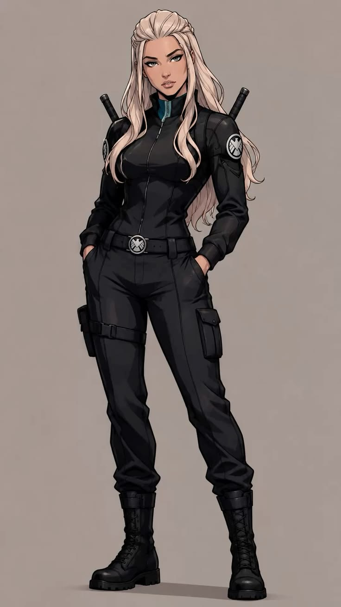

### Descrição visual (roupa)
- Macacão/jumpsuit **preto** de uma peça, zíper central  
- Gola alta; bolsos cargo nas coxas  
- Botas pretas de combate  
- (Ignorar patches/emblemas e armas nas costas)  

### Quando usar
Job stealth, infiltração, “tudo preto funcional” (não clube).

---

## 043 · Stealth — combat all black

**Arquivo:** `stealth_black_combat_set.jpg`  
**Nome rápido:** Stealth — combat all black · **#043**
**Combina com (sugestão):** Valk / Alex / pack  
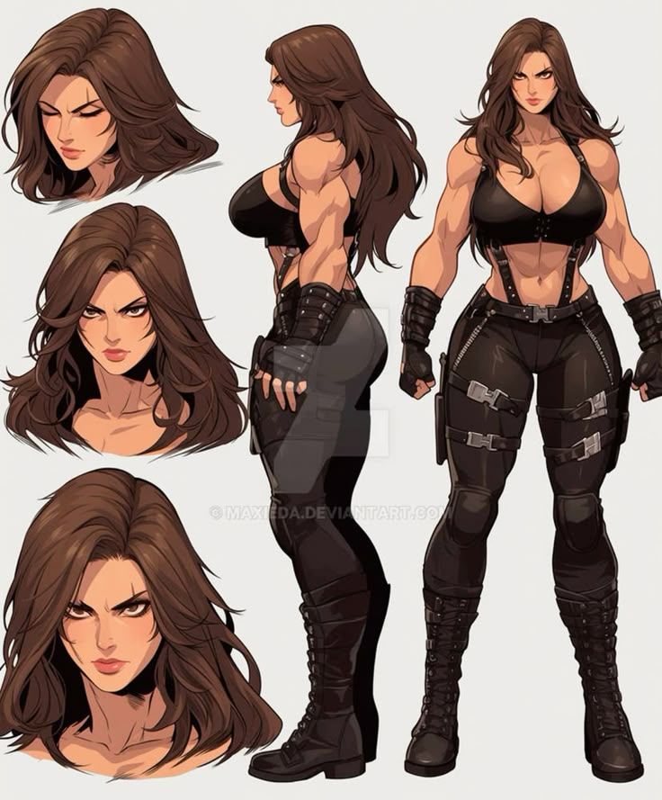

### Descrição visual (roupa)
- Top/halter preto com tiras  
- Calça tática preta justa com cintas e joelheiras de roupa  
- Botas altas pretas; luvas sem dedos  
- (Sheet — extrair o look de corpo)  

### Quando usar
Operação noturna, close combat discreto.

---

## 022 · Chuva / noite — trench couro pesado

**Arquivo:** `rain_black_leather_trench.jpg`  
**Nome rápido:** Chuva / noite — trench couro pesado · **#022**
**Combina com (sugestão):** qualquer  
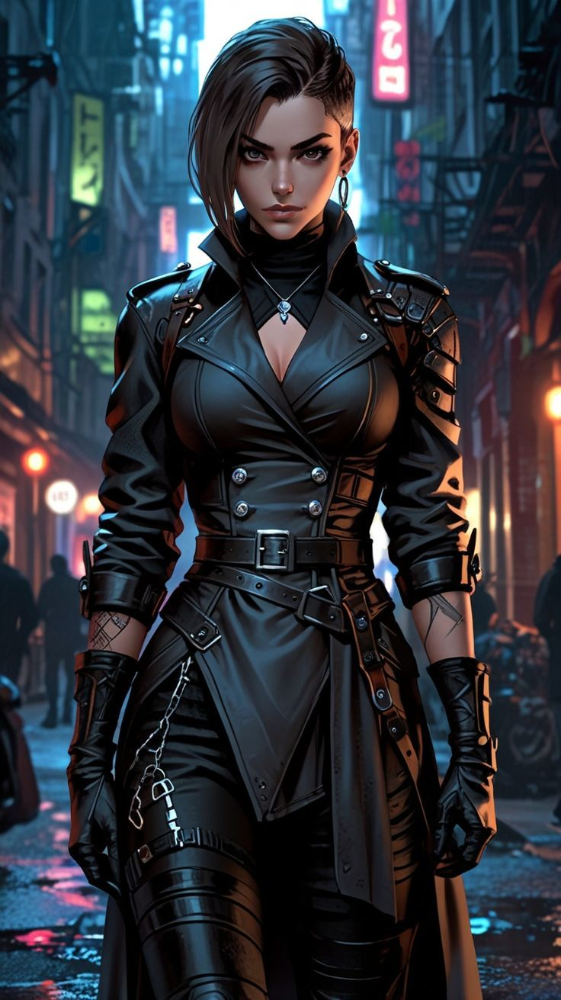

### Descrição visual (roupa)
- Trench/casaco de **couro preto** longo, botões duplos, ombreiras  
- Camadas pretas por baixo (gola alta / body)  
- Cinto; luvas pretas; botas  
- Visual “chuva de Night City”  

### Quando usar
Chuva, frio urbano, deslocamento noturno (variante mais pesada do street_leather_trench).

---

## 023 · Clima / scav — trench oliva

**Arquivo:** `weather_olive_trench.jpg`  
**Nome rápido:** Clima / scav — trench oliva · **#023**
**Combina com (sugestão):** qualquer  
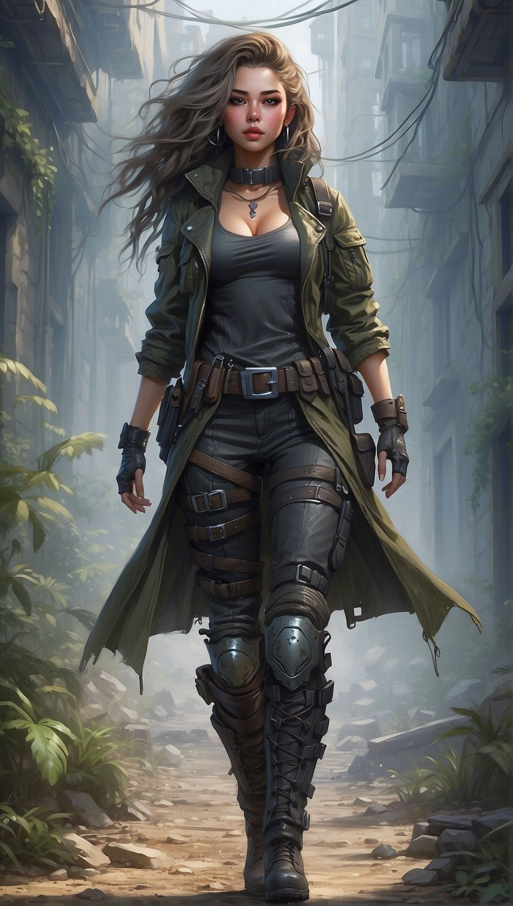

### Descrição visual (roupa)
- Trench/casaco **oliva** longo, aberto  
- Tank/top cinza justo  
- Calça tática escura; cintos e joelheiras de roupa  
- Botas altas; luvas  

### Quando usar
Badlands úmido, scav, clima ruim, “pronta pro tempo”.

---

## 060 · Lounge — hoodie + calça moletom

**Arquivo:** `lounge_hoodie_sweatpants.jpg`  
**Nome rápido:** Lounge — hoodie + calça moletom · **#060**
**Combina com (sugestão):** qualquer  
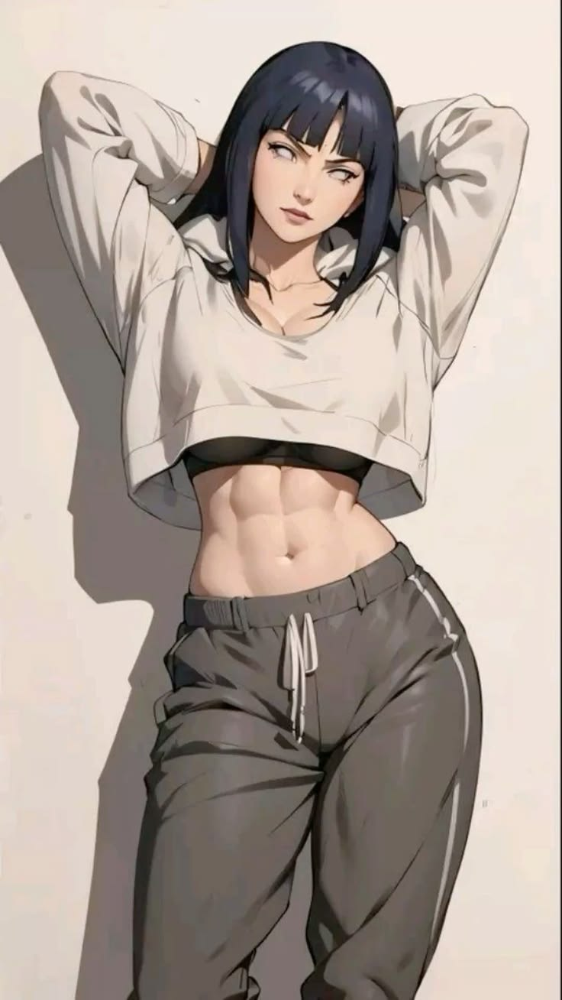

### Descrição visual (roupa)
- Hoodie crop bege/off-white  
- Top esportivo preto por baixo  
- Calça de moletom cinza com cordão  
- Visual casa / pós-treino / “acordei assim”  

### Quando usar
Safehouse, manhã, downtime (mais “calça lounge” que só short).

---

## 047 · Tech — bodysuit + crop branco

**Arquivo:** `tech_bodysuit_white_crop.jpg`  
**Nome rápido:** Tech — bodysuit + crop branco · **#047**
**Combina com (sugestão):** Echo / qualquer  
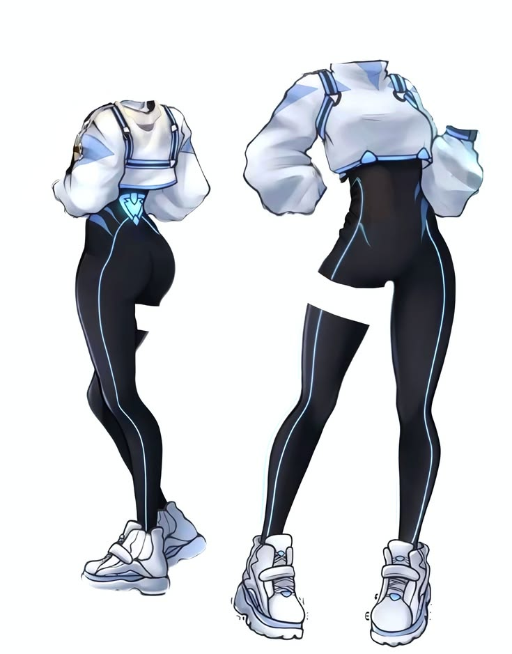

### Descrição visual (roupa)
- Bodysuit/legging preto com linhas claras  
- Crop/moletom branco com alças  
- Tênis chunky brancos  
- (Sheet manequim — só roupa)  

### Quando usar
Netrunner, tech fashion, job leve de rua.

---

## 035 · Casual — tank + jeans boyfriend

**Arquivo:** `casual_tank_boyfriend_jeans.jpg`  
**Nome rápido:** Casual — tank + jeans boyfriend · **#035**
**Combina com (sugestão):** qualquer  

### Descrição visual (roupa)
- Top/sports bra azul-turquesa  
- Jeans azul **solto** (boyfriend/mom), rasgado no joelho  
- Botas marrom; cinto/pochete de couro  

### Quando usar
Pack, folga, casual sem cargo.

---

## 036 · Casual — tee + calça simples

**Arquivo:** `casual_tee_simple_pants.jpg`  
**Nome rápido:** Casual — tee + calça simples · **#036**
**Combina com (sugestão):** qualquer  
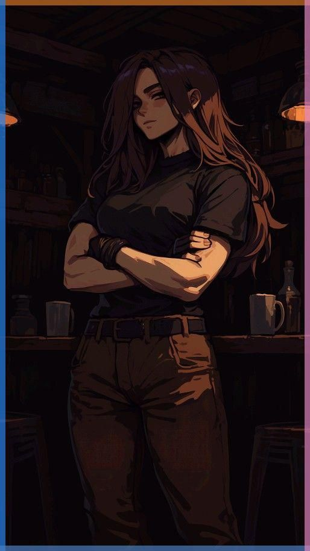

### Descrição visual (roupa)
- Camiseta preta lisa, manga curta  
- Calça marrom/caqui reta, cinto  
- Visual mínimo de bar/pack  

### Quando usar
Downtime, conversa, “só roupa de gente normal”.

---

## 048 · Media — jaqueta branca + cargo

**Arquivo:** `media_white_jacket_cargo.jpg`  
**Nome rápido:** Media — jaqueta branca + cargo · **#048**
**Combina com (sugestão):** Echo / qualquer  
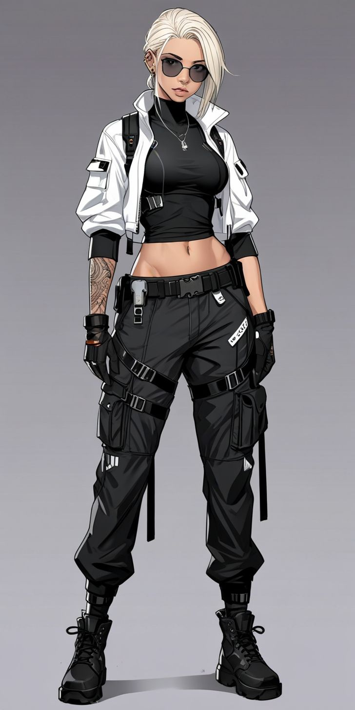

### Descrição visual (roupa)
- Crop/top preto gola alta  
- Jaqueta cropped **branca** com bolsos  
- Calça cargo preta com tiras  
- Óculos escuros; botas pretas  

### Quando usar
Rua com câmera, job de media, visual “pronta pra gravação”.

---

## 049 · Media / corp — jaqueta uniforme

**Arquivo:** `media_corp_uniform_jacket.jpg`  
**Nome rápido:** Media / corp — jaqueta uniforme · **#049**
**Combina com (sugestão):** Echo / qualquer  
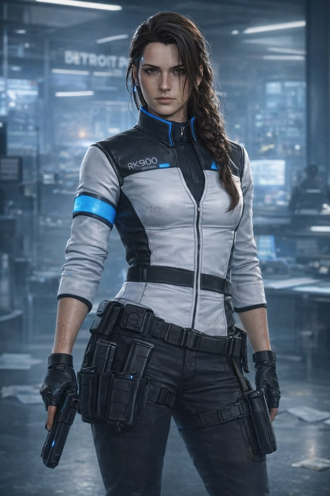

### Descrição visual (roupa)
- Jaqueta zip cinza/preta, detalhe azul no ombro  
- Calça preta justa  
- Cinto utilitário de roupa; luvas  
- **Ignorar** pistolas, coldres e texto da foto  

### Quando usar
Ambiente corp/segurança, entrevista, “uniforme limpo”.

---

## 098 · Formal — pantsuit preto

**Arquivo:** `formal_black_pantsuit.jpg`  
**Nome rápido:** Formal — pantsuit preto · **#098**
**Combina com (sugestão):** Alex  
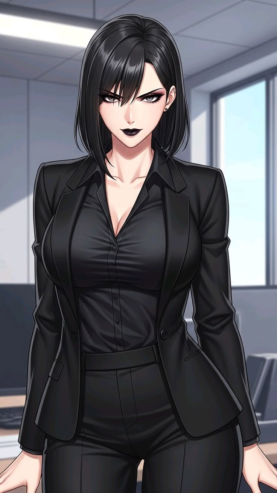

### Descrição visual (roupa)
- Blazer preto  
- Camisa preta social  
- Calça de alfaiataria preta  

### Quando usar
Reunião, corp, visual profissional completo (além da camisa office).

---

## 099 · Formal — terno 3 peças

**Arquivo:** `formal_black_threepiece_suit.jpg`  
**Nome rápido:** Formal — terno 3 peças · **#099**
**Combina com (sugestão):** Alex  
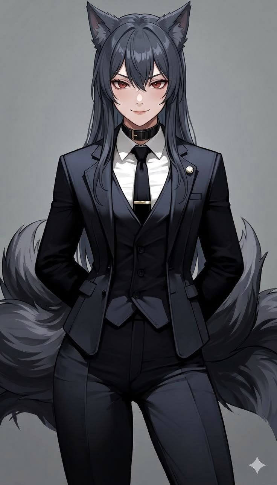

### Descrição visual (roupa)
- Blazer + colete + camisa branca + gravata preta  
- Calça de terno preta  
- (Ignorar orelhas/cauda cosplay)  

### Quando usar
Evento formal, corpo andrógino/power suit, cliente high-end.

---

## 132 · Evening — halter longo fenda

**Arquivo:** `evening_black_halter_long_slit.jpg`  
**Nome rápido:** Evening — halter longo fenda · **#132**
**Combina com (sugestão):** Reina  
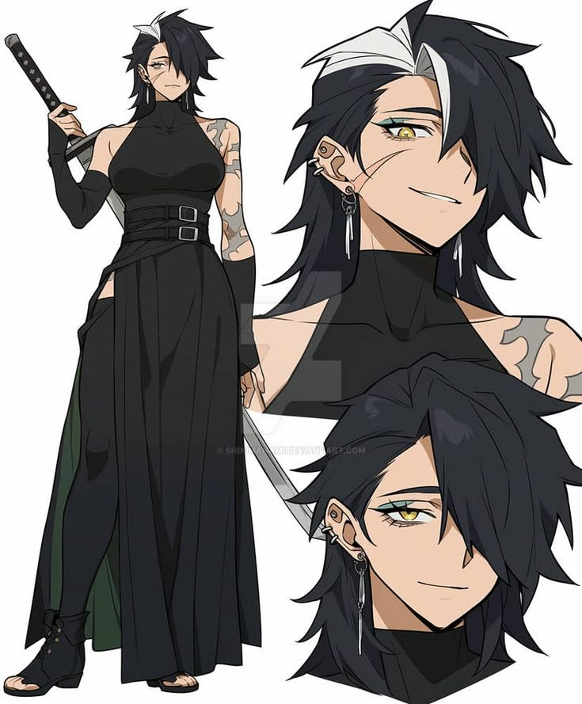

### Descrição visual (roupa)
- Vestido/macacão longo preto, gola alta  
- Fenda alta na perna; cinto com fivelas  
- Botas pretas  
- (Ignorar espada)  

### Quando usar
Noite elegante, evening com mobilidade, visual “longo mas prático”.

---

## 024 · Street — robe tinta P&B

**Arquivo:** `street_ink_robe_gown.jpg`  
**Nome rápido:** Street — robe tinta P&B · **#024**
**Combina com (sugestão):** qualquer  
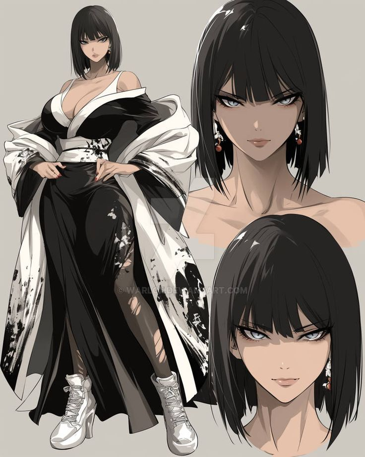

### Descrição visual (roupa)
- Robe/vestido longo preto com manchas brancas  
- Faixa/obi branca na cintura  
- Tênis/saltos brancos altos  

### Quando usar
Street fashion, night out artístico, media event.

---

# MEDICAL / CLÍNICO

## 169 · Jaleco clássico

**Arquivo:** `medical_lab_coat_classic.jpg`  
**Nome rápido:** Jaleco clássico · **#169**
**Combina com (sugestão):** Stitch / qualquer  
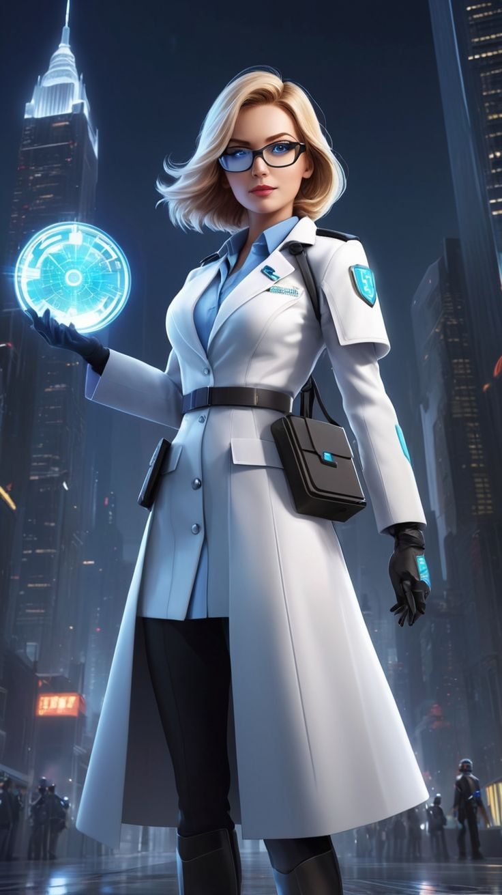

### Descrição visual (roupa)
- Jaleco/lab coat **branco** longo, botões, cinto  
- Camisa azul clara por baixo  
- Calça preta justa; botas pretas  
- Luvas pretas; bolsa/cinto utilitário  

### Quando usar
Clínica, Stitch em ambiente limpo, ripperdoc “profissional”.

---

## 170 · Jaleco street / medtech de rua

**Arquivo:** `medical_street_lab_coat.jpg`  
**Nome rápido:** Jaleco street / medtech de rua · **#170**
**Combina com (sugestão):** Stitch / qualquer  
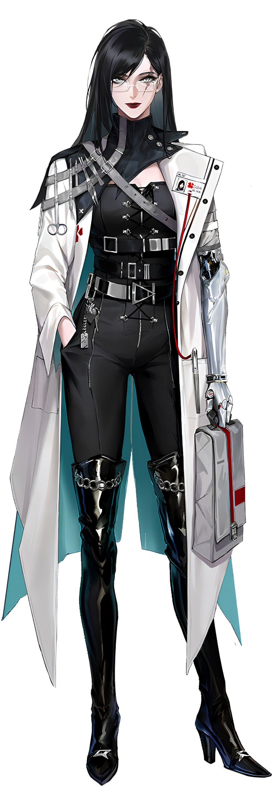

### Descrição visual (roupa)
- Jaleco branco aberto, forro/teal  
- Top/corset preto com tiras e cinto  
- Calça preta justa; botas pretas OTK  
- (Kit médico = acessório de cena se a ficha/job pedir; **ignorar chrome** se não for da ficha)  

### Quando usar
Medtech em campo, Stitch street, clínica de rua.

---

## 171 · Casaco tech com capuz

**Arquivo:** `medical_tech_hooded_coat.jpg`  
**Nome rápido:** Casaco tech com capuz · **#171**
**Combina com (sugestão):** Stitch / qualquer  
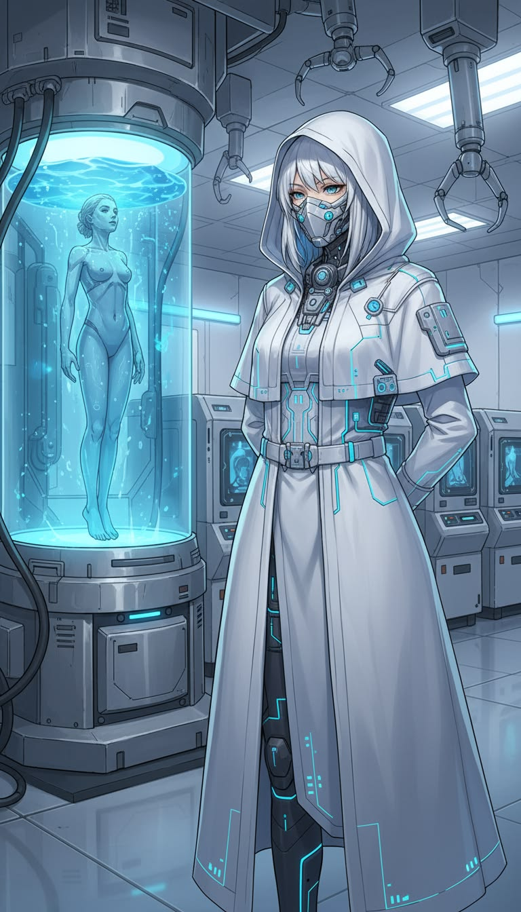

### Descrição visual (roupa)
- Casaco branco longo com **capuz** e linhas tech  
- Body/undersuit escuro  
- Cinto; visual lab futurista  
- (Ignorar máscara/implantes se não forem da ficha)  

### Quando usar
Lab high-tech, ripperdoc corporativo, medtech “cyber”.

---

## 172 · Uniforme branco

**Arquivo:** `medical_white_uniform_set.jpg`  
**Nome rápido:** Uniforme branco · **#172**
**Combina com (sugestão):** Stitch / qualquer  
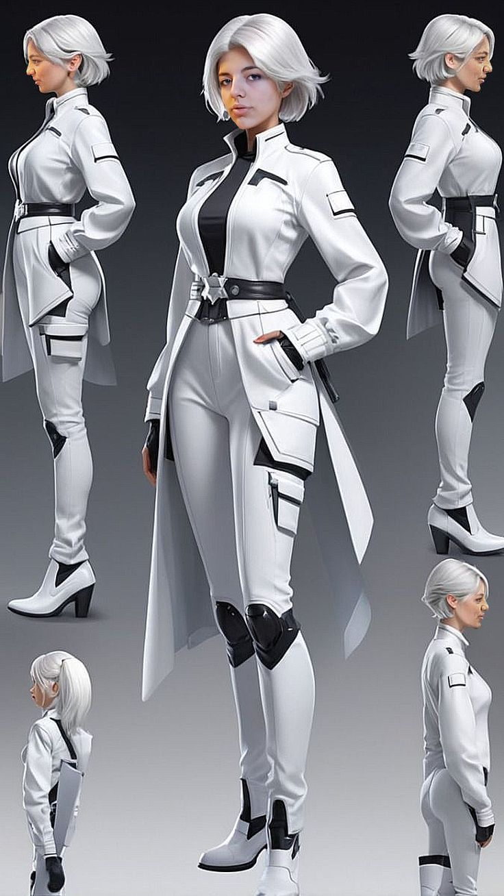

### Descrição visual (roupa)
- Uniforme/jumpsuit branco justo  
- Casaco/sobretudo branco longo com cinto  
- Botas brancas de salto/bloco  
- (Sheet multi-ângulo — extrair o set)  

### Quando usar
Corp medical, clínica premium, visual limpo all-white.

---

## 173 · Nurse dress branca

**Arquivo:** `medical_nurse_dress_white.jpg`  
**Nome rápido:** Nurse dress branca · **#173**
**Combina com (sugestão):** Stitch / qualquer  
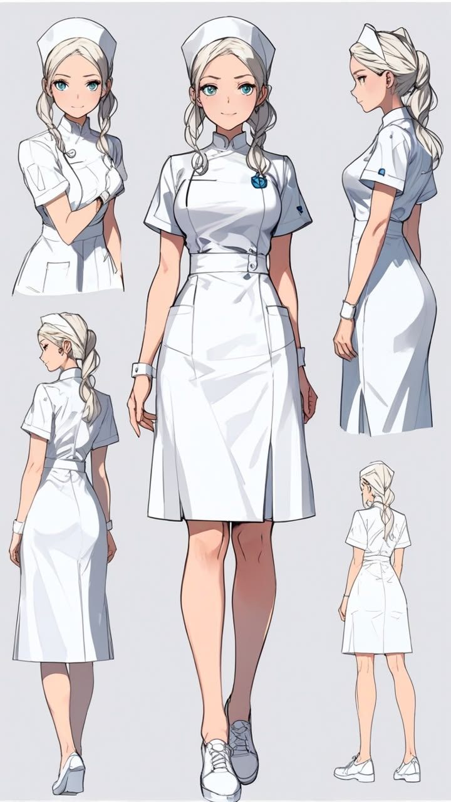

### Descrição visual (roupa)
- Vestido enfermeira **branco** comprimento joelho/midi  
- Gola alta; cinto; bolsos  
- Tênis/sapatos brancos  
- (Sheet; gorro opcional)  

### Quando usar
Clínica, hospital, visual “enfermeira clássica”.

---

## 174 · Nurse dress assimétrico

**Arquivo:** `medical_nurse_dress_asym.jpg`  
**Nome rápido:** Nurse dress assimétrico · **#174**
**Combina com (sugestão):** Stitch / qualquer  
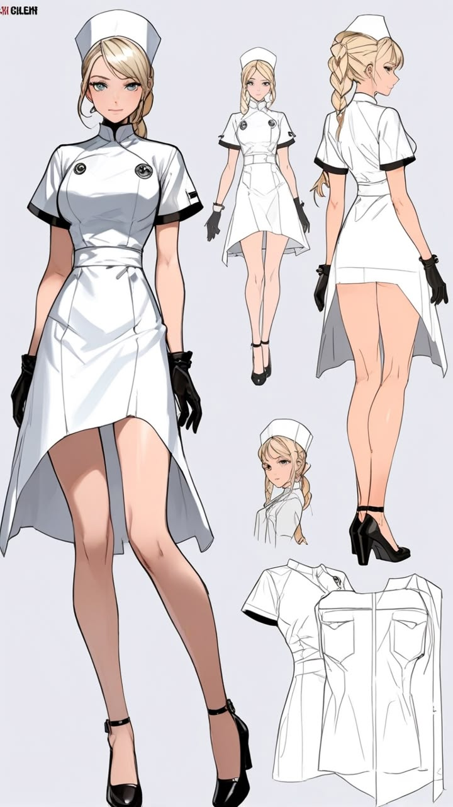

### Descrição visual (roupa)
- Vestido enfermeira branco com barra **assimétrica**  
- Detalhe preto nas mangas/gola  
- Luvas pretas; saltos pretos  

### Quando usar
Clínica estilizada, Stitch “arrumada” medical.

---

## 175 · Nurse dress rosa

**Arquivo:** `medical_nurse_dress_pink.jpg`  
**Nome rápido:** Nurse dress rosa · **#175**
**Combina com (sugestão):** Stitch / qualquer  
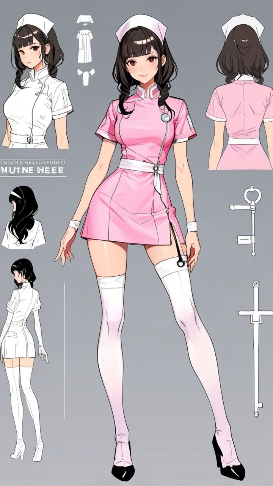

### Descrição visual (roupa)
- Vestido enfermeira **rosa** mini  
- Cinto branco; meias 7/8 brancas  
- Saltos pretos  
- (Mais costume/fantasia medical)  

### Quando usar
Cena estilizada / costume — **não** default realista de hospital.

---

# SLEEP / CASA

## 061 · Tee oversized

**Arquivo:** `sleep_oversized_tee.jpg`  
**Nome rápido:** Tee oversized · **#061**
**Combina com (sugestão):** qualquer  
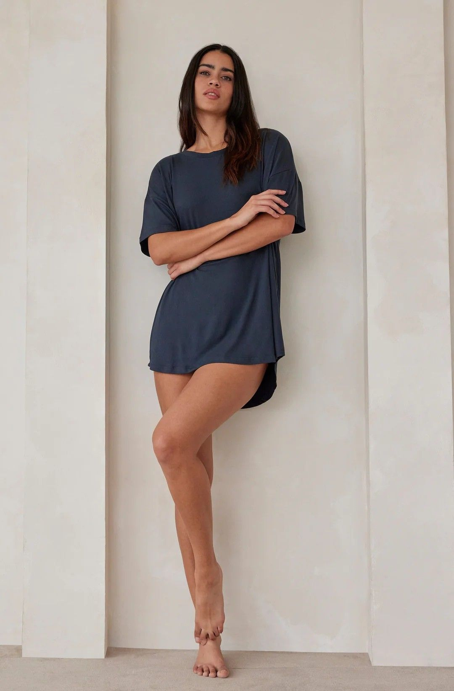

### Descrição visual (roupa)
- Camiseta oversized cinza-azul, manga curta  
- Comprimento quase short; visual “só a camisa”  

### Quando usar
Casa, safehouse, manhã preguiçosa, intimidade casual.

---

## 062 · Roupão branco

**Arquivo:** `sleep_white_robe.jpg`  
**Nome rápido:** Roupão branco · **#062**
**Combina com (sugestão):** qualquer  
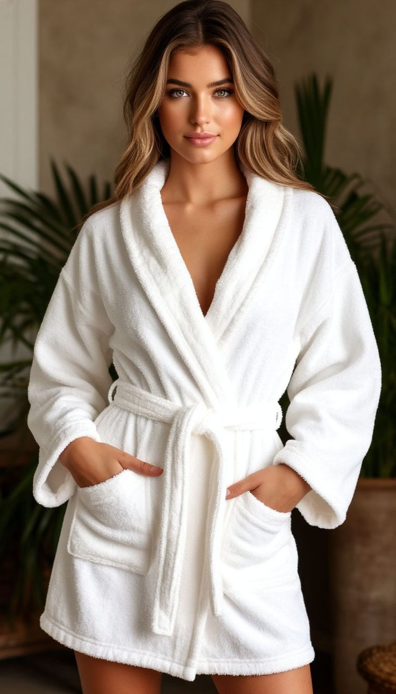

### Descrição visual (roupa)
- Roupão/bathrobe **branco** felpudo  
- Faixa na cintura; bolsos  

### Quando usar
Pós-banho, manhã, hotel, downtime doméstico.

---

## 063 · Cami cetim + short

**Arquivo:** `sleep_satin_cami_shorts.jpg`  
**Nome rápido:** Cami cetim + short · **#063**
**Combina com (sugestão):** Valk / intimidade  
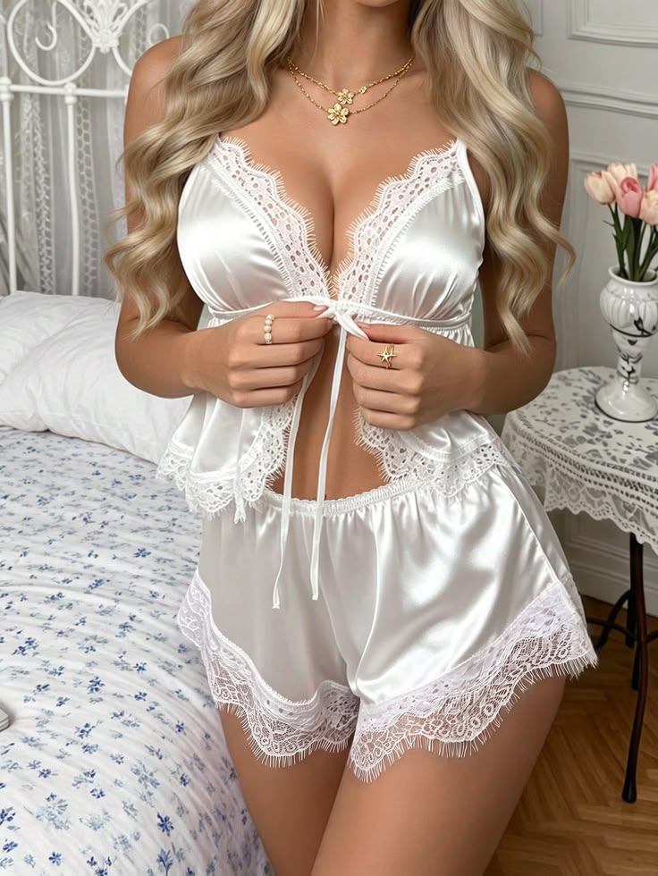

### Descrição visual (roupa)
- Top/cami cetim branco com renda  
- Short cetim combinando  
- Visual pijama/lingerie soft  

### Quando usar
Sleep ousado-leve, cena íntima em casa.

---

## 064 · Lace azul + robe

**Arquivo:** `sleep_blue_lace_set.jpg`  
**Nome rápido:** Lace azul + robe · **#064**
**Combina com (sugestão):** qualquer  
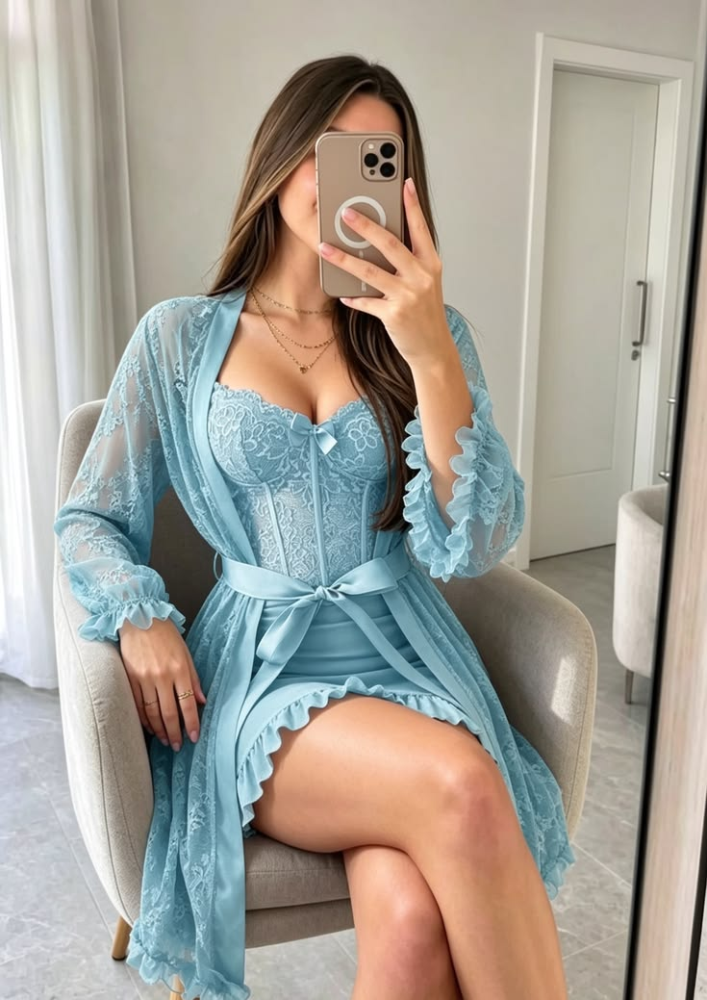

### Descrição visual (roupa)
- Vestido/corset renda azul claro  
- Robe sheer azul com faixa e babados  

### Quando usar
Sleep fashion, intimidade, “pijama de saída”.

---

## 065 · Lingerie + robe

**Arquivo:** `sleep_lingerie_robe_set.jpg`  
**Nome rápido:** Lingerie + robe · **#065**
**Combina com (sugestão):** Valk / intimidade  
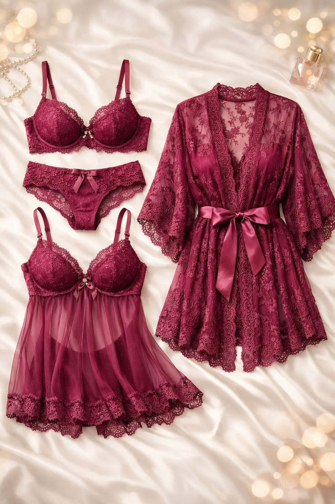

### Descrição visual (roupa)
- Conjunto lingerie magenta (sutiã + calcinha + babydoll)  
- Robe de renda magenta com faixa  
- (Flatlay — extrair peças)  

### Quando usar
Especial/sleep ousado — só se a cena pedir.

---

## 066 · Onesie plush hearts

**Arquivo:** `sleep_plush_onesie_hearts.jpg`  
**Nome rápido:** Onesie plush hearts · **#066**
**Combina com (sugestão):** qualquer  
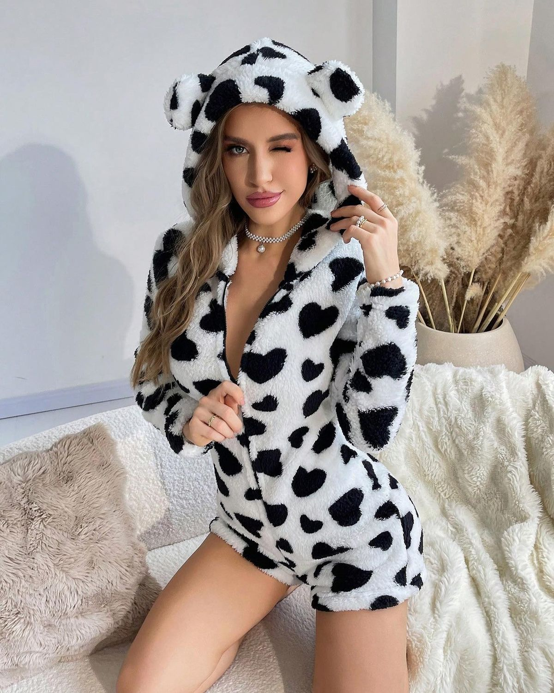

### Descrição visual (roupa)
- Onesie/macacão plush curto P&B com estampa  
- Capuz com orelhas  

### Quando usar
Casa fofa, humor, downtime pack (Reina vibe opcional).

---

## 067 · Onesie plush bear

**Arquivo:** `sleep_plush_onesie_bear.jpg`  
**Nome rápido:** Onesie plush bear · **#067**
**Combina com (sugestão):** qualquer  
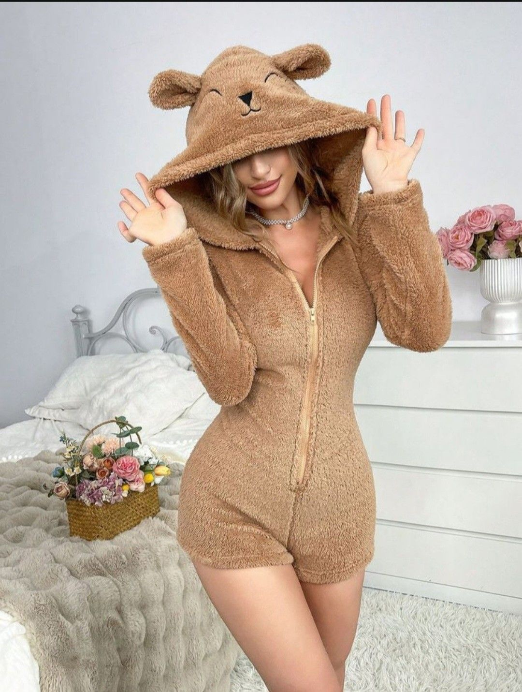

### Descrição visual (roupa)
- Onesie plush marrom curto  
- Capuz com cara de ursinho  

### Quando usar
Sleep fofo, humor, intimidade casual.

---

# FORMAL / EVENING / SWIM / FANTASIA (lote novo)

## 100 · Vest + saia plissada bege

**Arquivo:** `formal_vest_tan_pleat.jpg`  
**Nome rápido:** Vest + saia plissada bege · **#100**
**Combina com (sugestão):** qualquer  
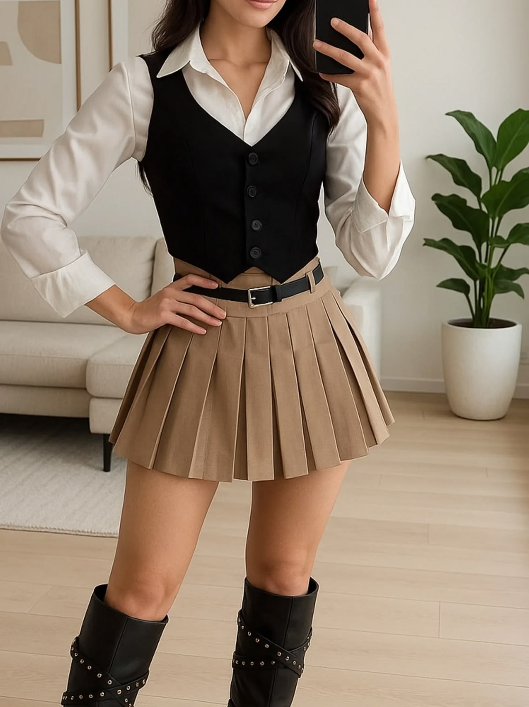

### Descrição visual (roupa)
- Camisa branca social  
- Colete preto  
- Mini saia plissada bege; cinto fino  
- Botas pretas com tiras  

### Quando usar
Semi-formal, escritório casual, saída apresentável.

---

## 101 · Navy gold mini

**Arquivo:** `formal_navy_gold_mini.jpg`  
**Nome rápido:** Navy gold mini · **#101**
**Combina com (sugestão):** qualquer  
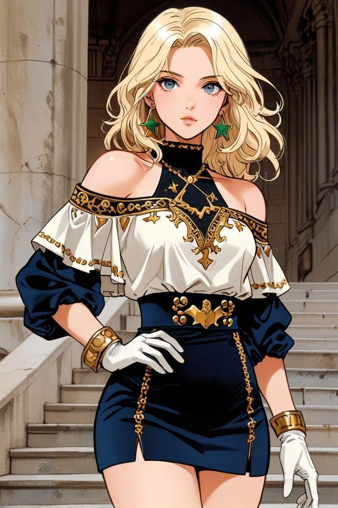

### Descrição visual (roupa)
- Blusa off-shoulder creme/azul com bordado dourado  
- Mini saia navy; cinto dourado  
- Luvas brancas  

### Quando usar
Evento semi-formal, jantar, fantasia elegante.

---

## 133 · Velvet black lace

**Arquivo:** `evening_black_velvet_lace.jpg`  
**Nome rápido:** Velvet black lace · **#133**
**Combina com (sugestão):** Reina  
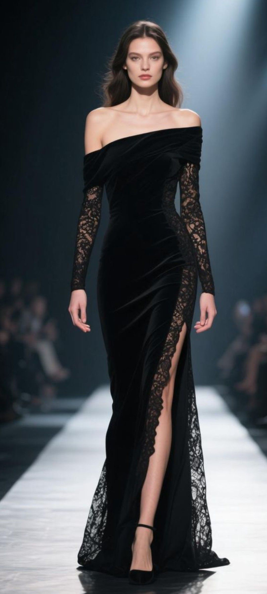

### Descrição visual (roupa)
- Vestido longo veludo preto, ombro a ombro  
- Mangas e painel de renda; fenda alta  
- Saltos pretos  

### Quando usar
Gala, evening clássico.

---

## 134 · Sparkle black gown

**Arquivo:** `evening_black_sparkle_gown.jpg`  
**Nome rápido:** Sparkle black gown · **#134**
**Combina com (sugestão):** Reina  
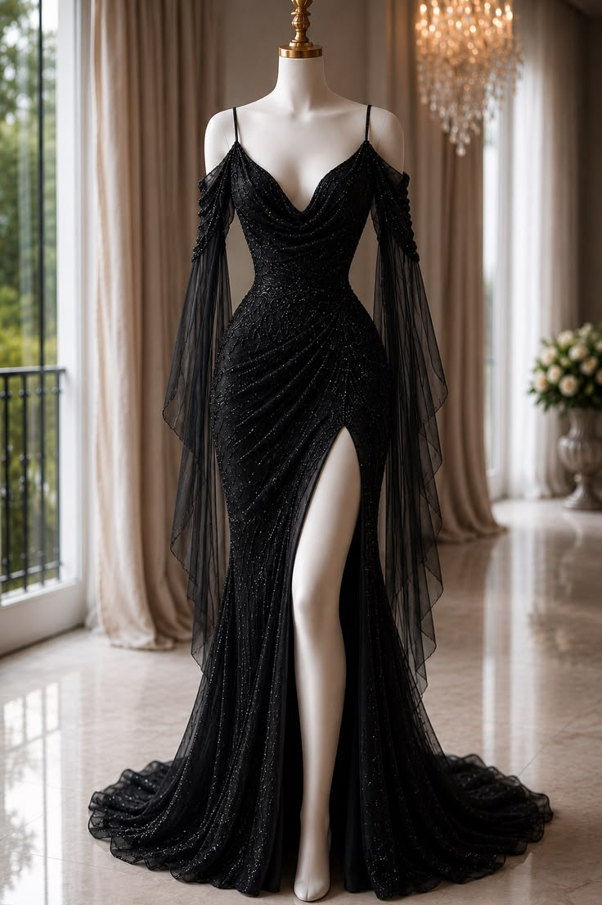

### Descrição visual (roupa)
- Gown preto com brilho/bordado  
- Decote fluido; mangas sheer; fenda e cauda  

### Quando usar
Gala high-end.

---

## 135 · Blue one-shoulder gown

**Arquivo:** `evening_blue_oneshoulder_gown.jpg`  
**Nome rápido:** Blue one-shoulder gown · **#135**
**Combina com (sugestão):** Reina  
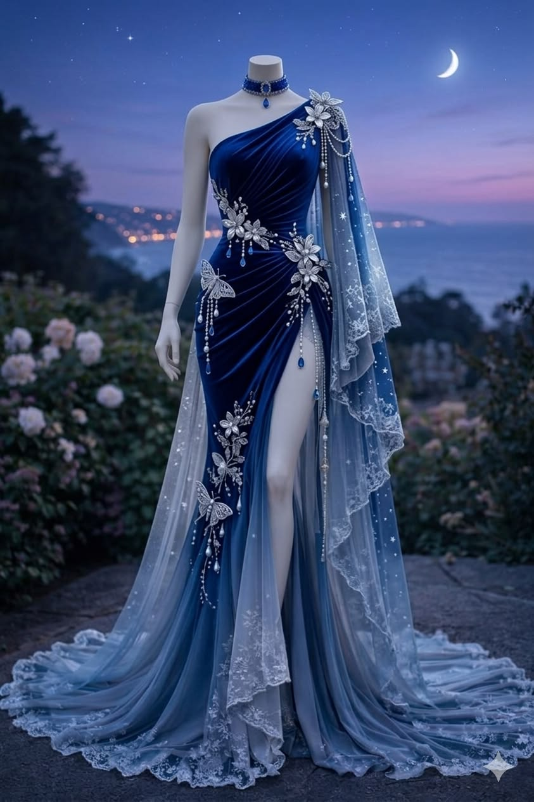

### Descrição visual (roupa)
- Gown azul one-shoulder com fenda  
- Capa/sheer com detalhes prateados  

### Quando usar
Gala, evening colorido.

---

## 179 · Swim — sheer coverup

**Arquivo:** `swim_black_sheer_coverup.jpg`  
**Nome rápido:** Swim — sheer coverup · **#179**
**Combina com (sugestão):** qualquer  
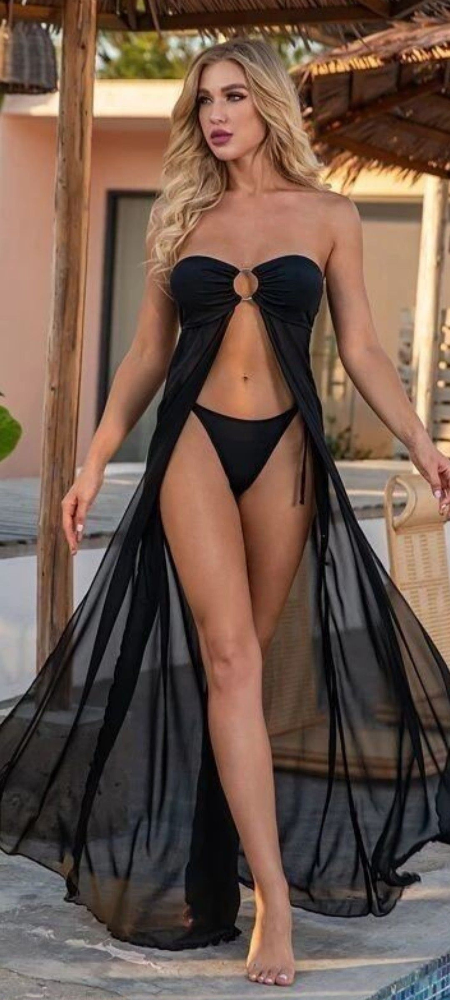

### Descrição visual (roupa)
- Top/bandeau preto  
- Parte de baixo preta  
- Capa/robe sheer preta longa aberta  

### Quando usar
Praia, piscina, resort — **não** job.

---

## 165 · Fantasy ice gown

**Arquivo:** `fantasy_ice_gown_sheet.jpg`  
**Nome rápido:** Fantasy ice gown · **#165**
**Combina com (sugestão):** Reina  
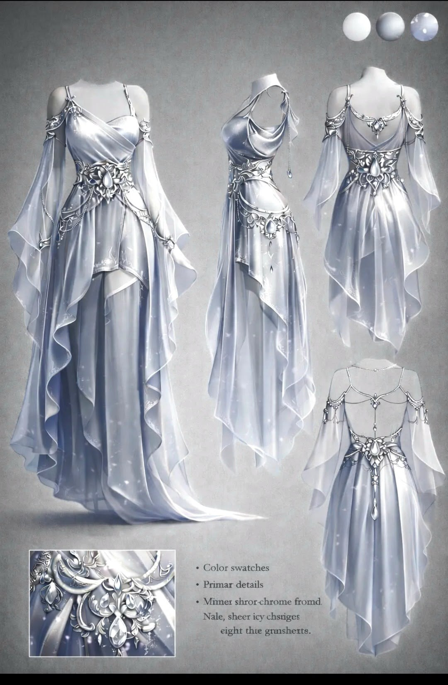

### Descrição visual (roupa)
- Gown prata/gelo fluido (sheet frente/costas)  
- Mangas e recortes  

### Quando usar
Fantasia, evento raro — **não** job.

---

## 166 · Fantasy snow coord

**Arquivo:** `fantasy_snow_coord.jpg`  
**Nome rápido:** Fantasy snow coord · **#166**
**Combina com (sugestão):** Reina  
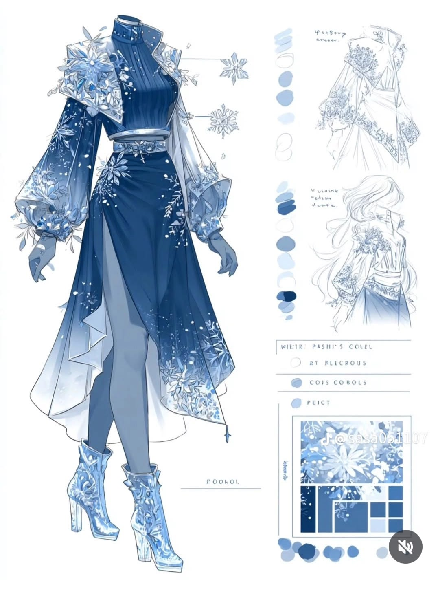

### Descrição visual (roupa)
- Crop azul com mangas bufantes  
- Saia midi com fenda e estampa neve  
- Botas de salto claras  

### Quando usar
Fantasia inverno, costume.

---

# MEDICAL — SCRUBS (hospital real)

## 176 · Scrubs azuis clássicos

**Arquivo:** `medical_scrubs_blue.jpg`  
**Nome rápido:** Scrubs azuis clássicos · **#176**
**Combina com (sugestão):** Stitch / qualquer  
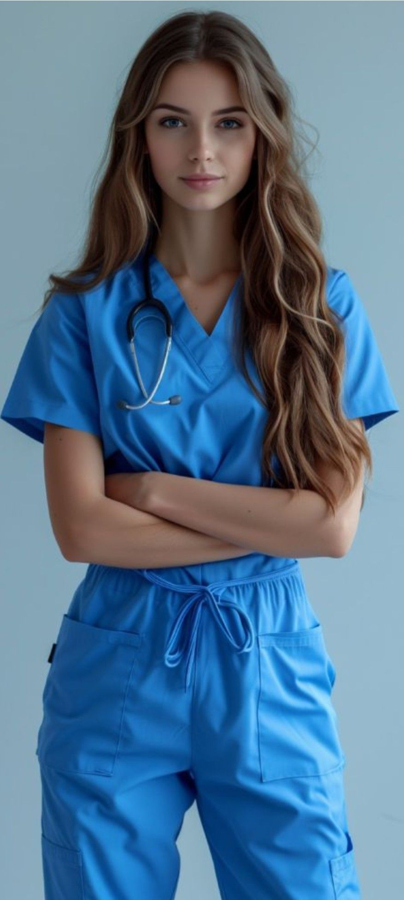

### Descrição visual (roupa)
- Top scrub **azul** V-neck, manga curta  
- Calça scrub azul com bolsos e cordão  
- (Estetoscópio = prop de cena se fizer sentido)  

### Quando usar
Hospital, clínica, Stitch em plantão realista.

---

## 177 · Scrubs slate / cinza-azul

**Arquivo:** `medical_scrubs_slate.jpg`  
**Nome rápido:** Scrubs slate / cinza-azul · **#177**
**Combina com (sugestão):** Stitch / qualquer  
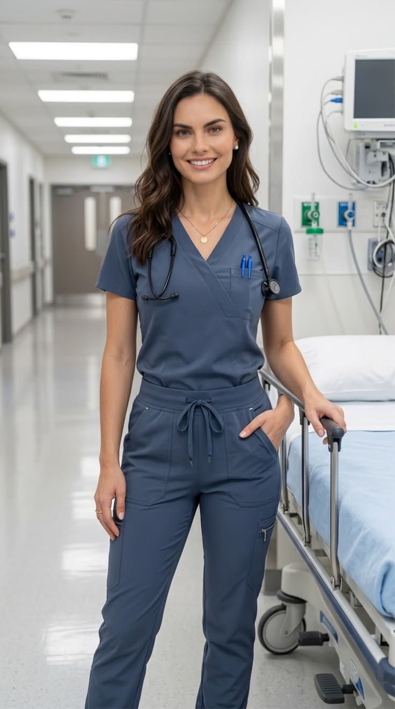

### Descrição visual (roupa)
- Scrubs azul-acinzentado, top envelope com bolso  
- Calça scrub com cordão e bolsos laterais  

### Quando usar
Hospital moderno, plantão, visual clean medical.

---

## 178 · Scrubs light blue

**Arquivo:** `medical_scrubs_light_blue.jpg`  
**Nome rápido:** Scrubs light blue · **#178**
**Combina com (sugestão):** Stitch / qualquer  
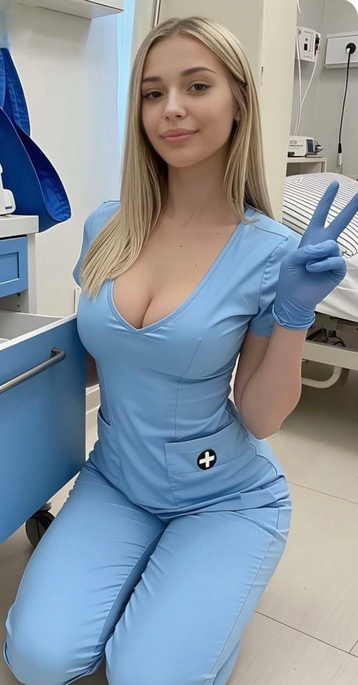

### Descrição visual (roupa)
- Scrubs azul claro, corte mais justo  
- Top V profundo; calça combinando  
- Luvas azuis opcionais  

### Quando usar
Clínica estilizada / medical fashion — ainda é scrub, não nurse dress.

---

# GYM / BIKER / ROMPER

## 055 · Biker black set

**Arquivo:** `gym_biker_black_set.jpg`  
**Nome rápido:** Biker black set · **#055**
**Combina com (sugestão):** qualquer  
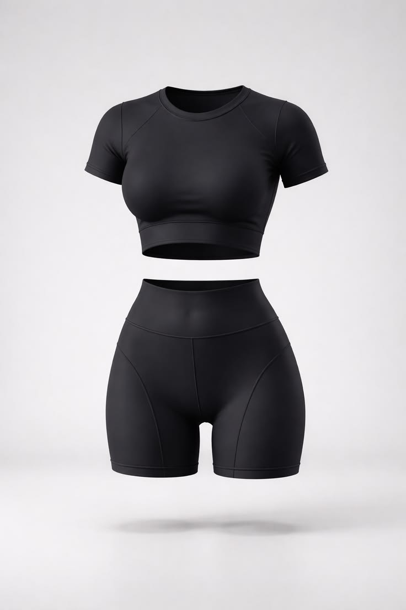

### Descrição visual (roupa)
- Crop top preto de malha esportiva, manga curta  
- **Biker shorts** pretos de cintura alta  
- (Produto flutuante — extrair set)  

### Quando usar
Treino, gym, visual “biker short + crop”.

---

## 056 · Biker + top halter

**Arquivo:** `gym_biker_halter_set.png`  
**Nome rápido:** Biker + top halter · **#056**
**Combina com (sugestão):** qualquer  
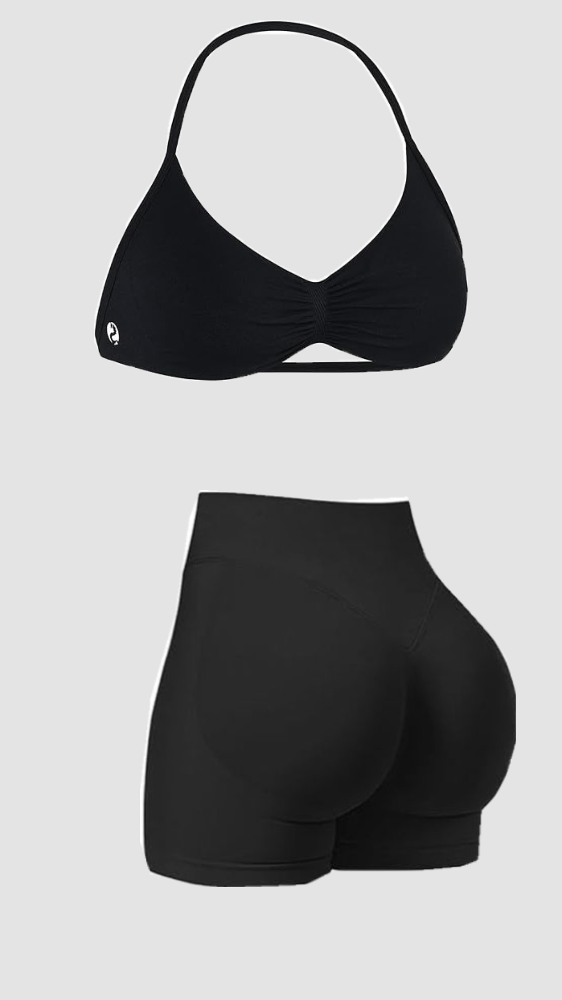

### Descrição visual (roupa)
- Top/halter preto com cut-out  
- Biker shorts pretos de cintura alta  
- (Flatlay de peças)  

### Quando usar
Gym fashion, street atlético, short justo.

---

## 057 · Tech romper preto

**Arquivo:** `gym_tech_romper_black.jpg`  
**Nome rápido:** Tech romper preto · **#057**
**Combina com (sugestão):** qualquer  
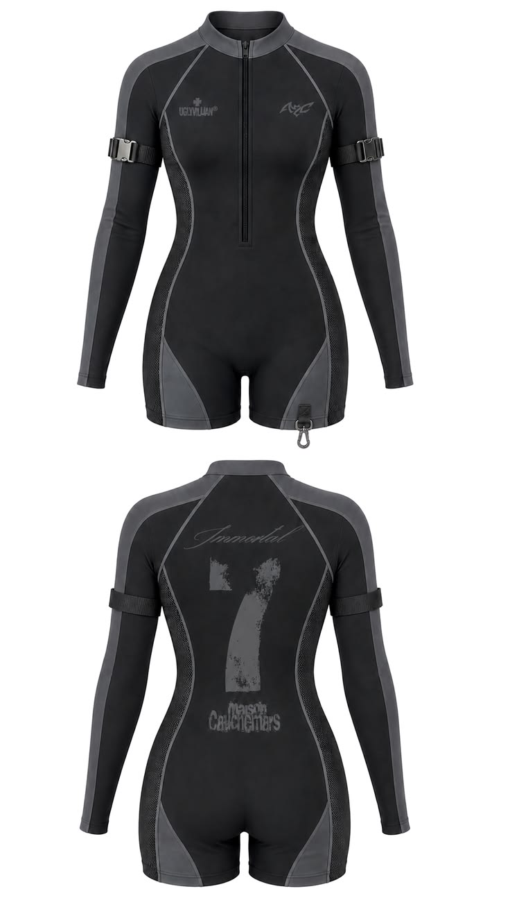

### Descrição visual (roupa)
- Romper/body manga longa preto e cinza  
- Zíper frontal; painéis mesh; fivelas nos braços  
- Comprimento short  
- (Frente e costas)  

### Quando usar
Gym tech, street cyber leve, treino.

---

## 068 · Lounge black ruched set

**Arquivo:** `lounge_black_ruched_set.jpg`  
**Nome rápido:** Lounge black ruched set · **#068**
**Combina com (sugestão):** qualquer  
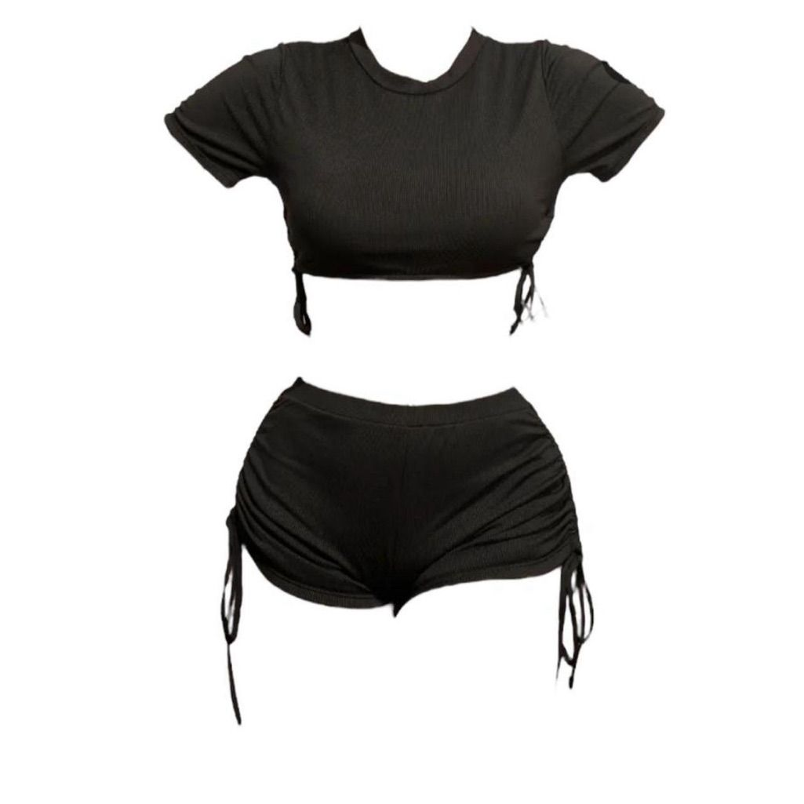

### Descrição visual (roupa)
- Crop preto canelado com tiras laterais  
- Short preto franzido (ruched) com cadarços  
- (Produto)  

### Quando usar
Casa, lounge, short set casual.

---

# SLEEP / SWIM (lote)

## 069 · Onesie Hello Kitty

**Arquivo:** `sleep_onesie_hello_kitty.jpg`  
**Nome rápido:** Onesie Hello Kitty · **#069**
**Combina com (sugestão):** qualquer  
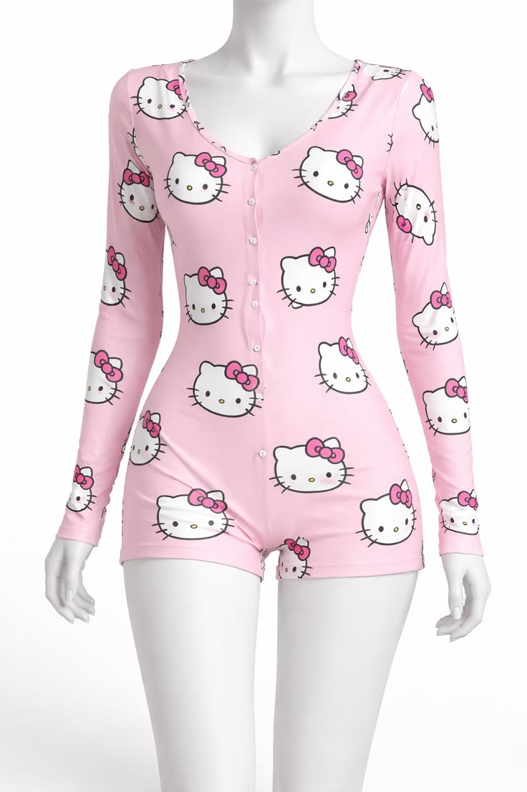

### Descrição visual (roupa)
- Onesie/romper rosa manga longa com estampa  
- Botões na frente; comprimento short  
- (Manequim)  

### Quando usar
Sleep fofo, humor, downtime pack.

---

## 070 · Bunny hoodie body

**Arquivo:** `sleep_bunny_hoodie_body.jpg`  
**Nome rápido:** Bunny hoodie body · **#070**
**Combina com (sugestão):** qualquer  
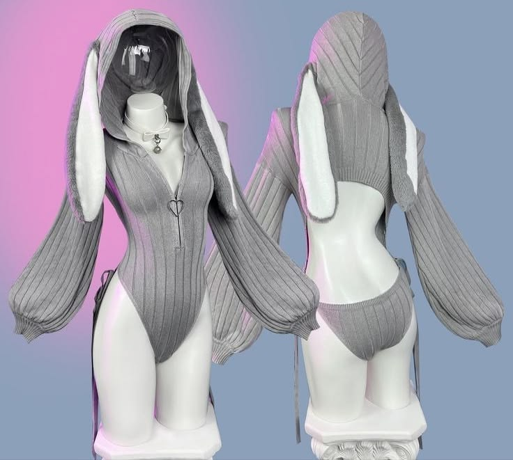

### Descrição visual (roupa)
- Body canelado cinza com capuz e orelhas longas  
- Mangas longas; abertura atrás  
- (Manequim frente/costas)  

### Quando usar
Sleep/costume fofo — especial casa.

---

## 180 · Swim one-piece black/white

**Arquivo:** `swim_black_white_onepiece.jpg`  
**Nome rápido:** Swim one-piece black/white · **#180**
**Combina com (sugestão):** qualquer  
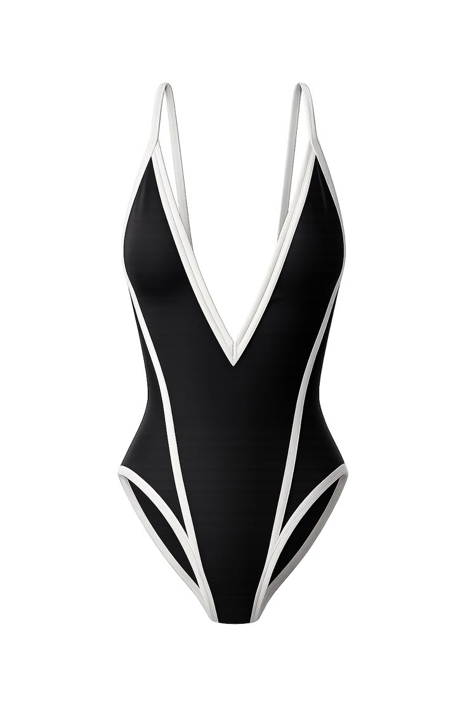

### Descrição visual (roupa)
- Maiô/one-piece preto com borda branca  
- Decote V profundo; alças finas  

### Quando usar
Praia, piscina (junto com `swim_black_sheer_coverup` se quiser capa).

---

# FORMAL — BERMUDA ALFAIATARIA

## 102 · Bermuda terno cinza + blazer

**Arquivo:** `formal_grey_bermuda_suit.jpg`  
**Nome rápido:** Bermuda terno cinza + blazer · **#102**
**Combina com (sugestão):** Alex  
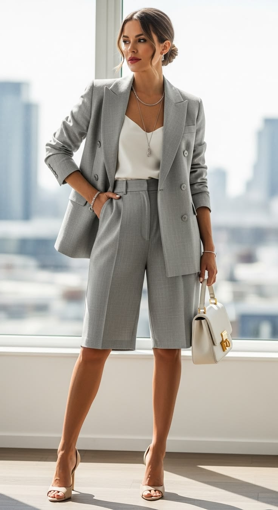

### Descrição visual (roupa)
- Blazer cinza alfaiataria, botões duplos  
- Top/camisole branco  
- **Bermuda** cinza do mesmo tecido, cintura alta, comprimento joelho  
- Saltos nude  

### Quando usar
Formal verão, reunião corp, “power suit” sem calça longa.

---

## 103 · Bermuda bege + blazer

**Arquivo:** `formal_beige_bermuda_blazer.jpg`  
**Nome rápido:** Bermuda bege + blazer · **#103**
**Combina com (sugestão):** qualquer  
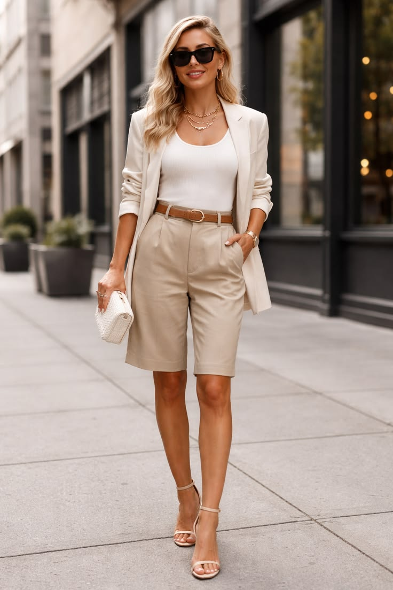

### Descrição visual (roupa)
- Blazer bege aberto  
- Tank branco canelado  
- Bermuda bege plissada, cinto marrom, joelho  
- Saltos finos  

### Quando usar
Dia elegante, cliente semi-formal, street money.

---

## 037 · Bermuda cáqui + camisa

**Arquivo:** `casual_khaki_bermuda_shirt.jpg`  
**Nome rápido:** Bermuda cáqui + camisa · **#037**
**Combina com (sugestão):** qualquer  
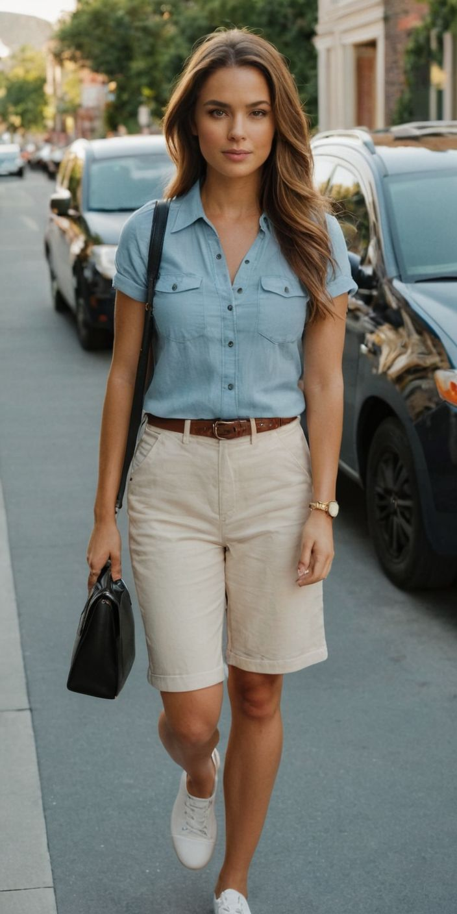

### Descrição visual (roupa)
- Camisa azul clara manga curta (chambray)  
- Bermuda cáqui/bege reta no joelho, cinto marrom  
- Tênis brancos  

### Quando usar
Smart casual, deslocamento urbano leve, “arrumada mas de short”.

---

## 104 · Culotte bege + camisa crop

**Arquivo:** `formal_beige_culotte_crop.jpg`  
**Nome rápido:** Culotte bege + camisa crop · **#104**
**Combina com (sugestão):** qualquer  
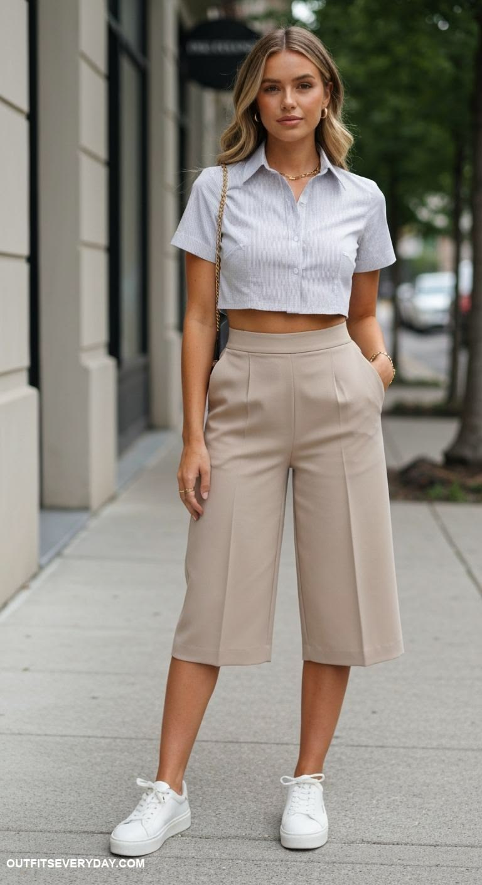

### Descrição visual (roupa)
- Camisa crop listrada cinza/branca  
- Calça **culotte**/pantacourt bege com pregas (comprimento longo-quase joelho)  
- Tênis brancos  

### Quando usar
Formal verão largo (irmão da bermuda; silhueta mais longa/larga).

---

## 105 · Wide-leg branca crop

**Arquivo:** `formal_white_wideleg_crop.jpg`  
**Nome rápido:** Wide-leg branca crop · **#105**
**Combina com (sugestão):** qualquer  
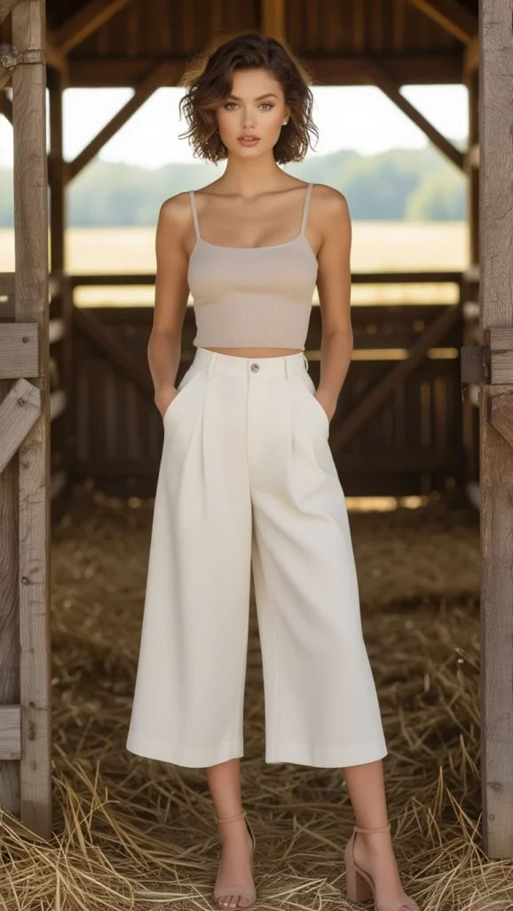

### Descrição visual (roupa)
- Top/cami bege  
- Calça wide-leg branca de alfaiataria, barra cropada  
- Saltos  

### Quando usar
Soft formal, pack “arrumada”, **não** é bermuda (calça).

---

# INTIMIDADE / NIGHTWEAR / OUSADO / GALA (lote pool)

> Subcategoria **íntimo** (`intimate_*`): sutiã/calcinha/sets mínimos — válidos para cenas de intimidade (ex.: Ryan/Valk).  
> **Combina com** é só sugestão de vibe, **não** default de personagem.

## 071 · Camisetão-vestido azul

**Arquivo:** `sleep_oversized_tee_dress_blue.jpg`  
**Nome rápido:** Camisetão-vestido azul · **#071**
**Categoria:** sleep  
**Combina com (sugestão):** qualquer  

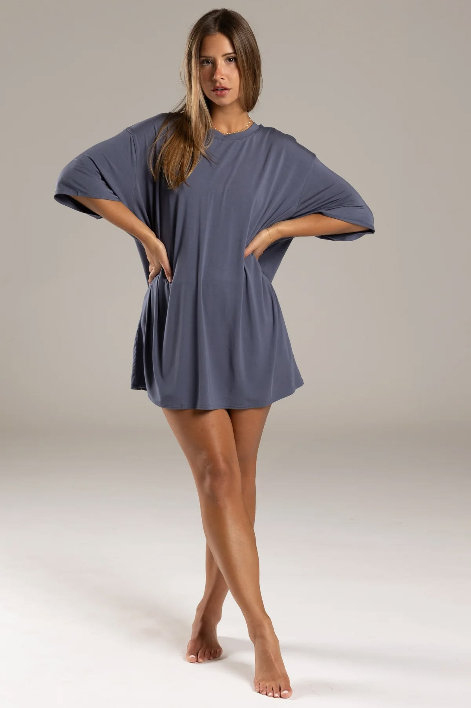

### Descrição visual (roupa)
- Camiseta oversized azul-acinzentada usada como mini-vestido; bolsos laterais

### Quando usar
Casa, safehouse, manhã, intimidade casual.

---

## 072 · Onesie plush vaca

**Arquivo:** `sleep_plush_onesie_cow.jpg`  
**Nome rápido:** Onesie plush vaca · **#072**
**Categoria:** sleep  
**Combina com (sugestão):** qualquer  

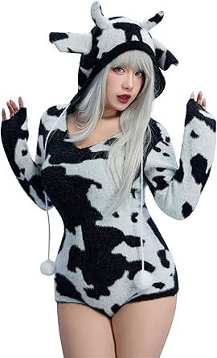

### Descrição visual (roupa)
- Onesie/macacão plush P&B com capuz e orelhas

### Quando usar
Sleep fofo, humor, downtime pack.

---

## 073 · Cami + short pretos

**Arquivo:** `sleep_black_cami_shorts.jpg`  
**Nome rápido:** Cami + short pretos · **#073**
**Categoria:** sleep  
**Combina com (sugestão):** Valk / intimidade  

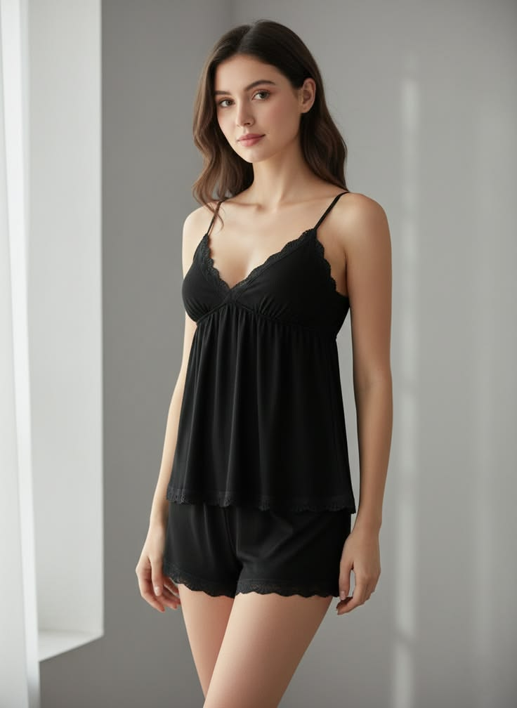

### Descrição visual (roupa)
- Top cami preto com renda + short combinando

### Quando usar
Pijama elegante, intimidade.

---

## 074 · Slip branco renda

**Arquivo:** `sleep_white_lace_slip.jpg`  
**Nome rápido:** Slip branco renda · **#074**
**Categoria:** sleep  
**Combina com (sugestão):** Valk / intimidade  

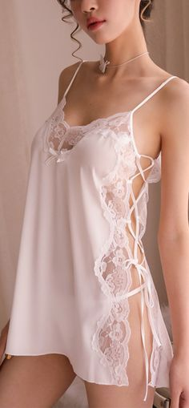

### Descrição visual (roupa)
- Camisola/slip branca com renda e amarração lateral

### Quando usar
Sleep ousado-leve, intimidade.

---

## 075 · Babydoll rosa + robe

**Arquivo:** `sleep_pink_babydoll_robe.jpg`  
**Nome rápido:** Babydoll rosa + robe · **#075**
**Categoria:** sleep  
**Combina com (sugestão):** Valk / intimidade  

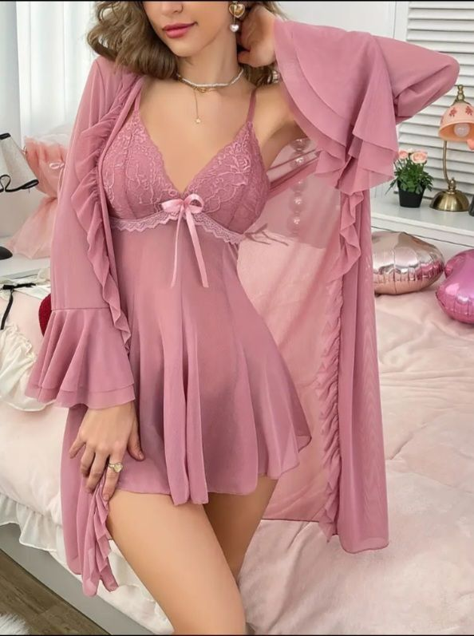

### Descrição visual (roupa)
- Babydoll rosa renda + robe sheer rosa babados

### Quando usar
Sleep fashion, intimidade.

---

## 076 · Babydoll sheer preto

**Arquivo:** `sleep_black_sheer_babydoll.png`  
**Nome rápido:** Babydoll sheer preto · **#076**
**Categoria:** sleep  
**Combina com (sugestão):** Valk / intimidade  

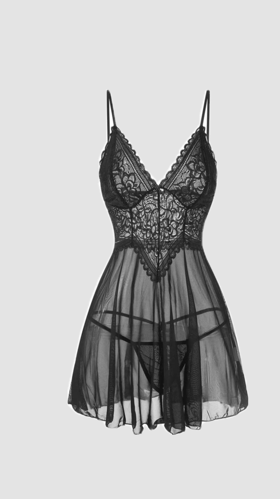

### Descrição visual (roupa)
- Babydoll preto renda + tule transparente

### Quando usar
Intimidade, nightwear ousado.

---

## 077 · Moletom estrela + short

**Arquivo:** `sleep_star_sweater_set.png`  
**Nome rápido:** Moletom estrela + short · **#077**
**Categoria:** sleep  
**Combina com (sugestão):** qualquer  

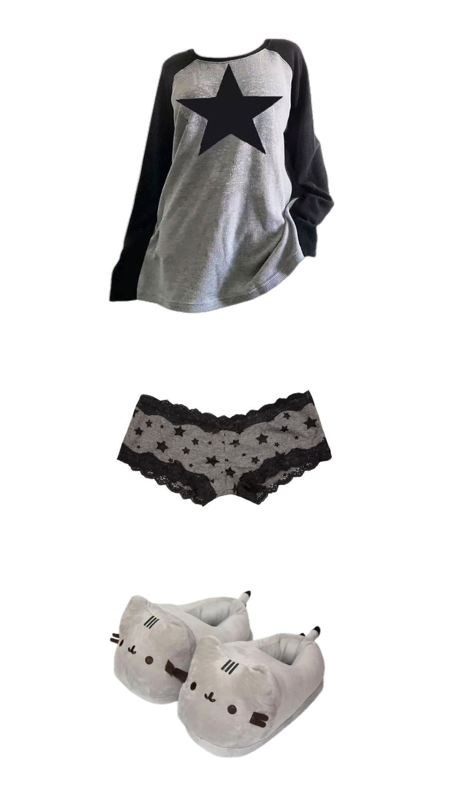

### Descrição visual (roupa)
- Moletom cinza/preto com estrela + short renda + pantufas (opcional)

### Quando usar
Casa, pijama fofo, qualquer personagem.

---

## 078 · Tee ombro + boyshort

**Arquivo:** `sleep_black_offshoulder_boyshort.png`  
**Nome rápido:** Tee ombro + boyshort · **#078**
**Categoria:** sleep  
**Combina com (sugestão):** qualquer  

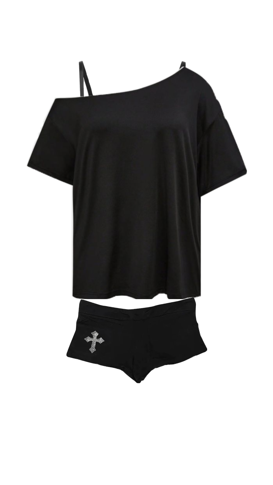

### Descrição visual (roupa)
- Camiseta preta ombro a ombro + boyshort preto com cruz

### Quando usar
Casa, intimidade casual ousada.

---

## 079 · Sutiã lounge + cardigan

**Arquivo:** `lounge_bra_cardigan_shorts.jpg`  
**Nome rápido:** Sutiã lounge + cardigan · **#079**
**Categoria:** sleep  
**Combina com (sugestão):** qualquer  

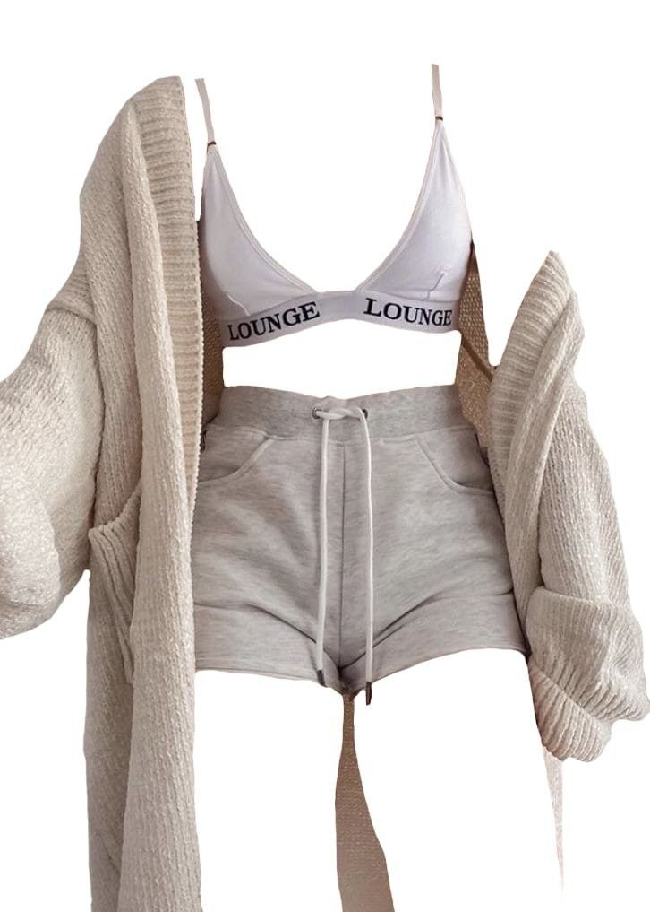

### Descrição visual (roupa)
- Sutiã branco 'LOUNGE' + short moletom cinza + cardigan bege

### Quando usar
Casa, manhã, lounge íntimo.

---

## 084 · Robe sheer + sutiã

**Arquivo:** `intimate_black_sheer_robe.jpg`  
**Nome rápido:** Robe sheer + sutiã · **#084**
**Categoria:** intimate  
**Combina com (sugestão):** Valk / intimidade  

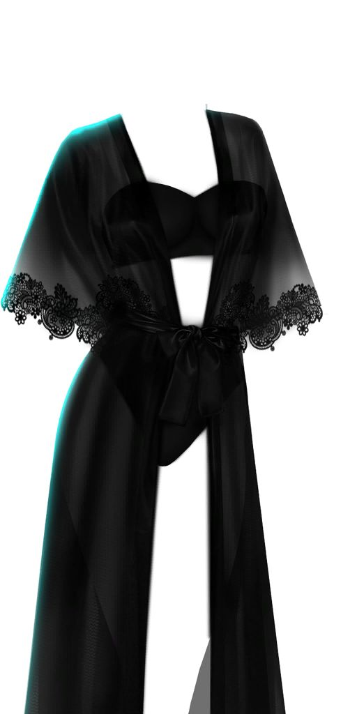

### Descrição visual (roupa)
- Robe preto transparente renda + sutiã preto

### Quando usar
Intimidade, pós-banho ousado.

---

## 085 · Set vinho renda

**Arquivo:** `intimate_burgundy_lace_set.jpg`  
**Nome rápido:** Set vinho renda · **#085**
**Categoria:** intimate  
**Combina com (sugestão):** Valk / intimidade  

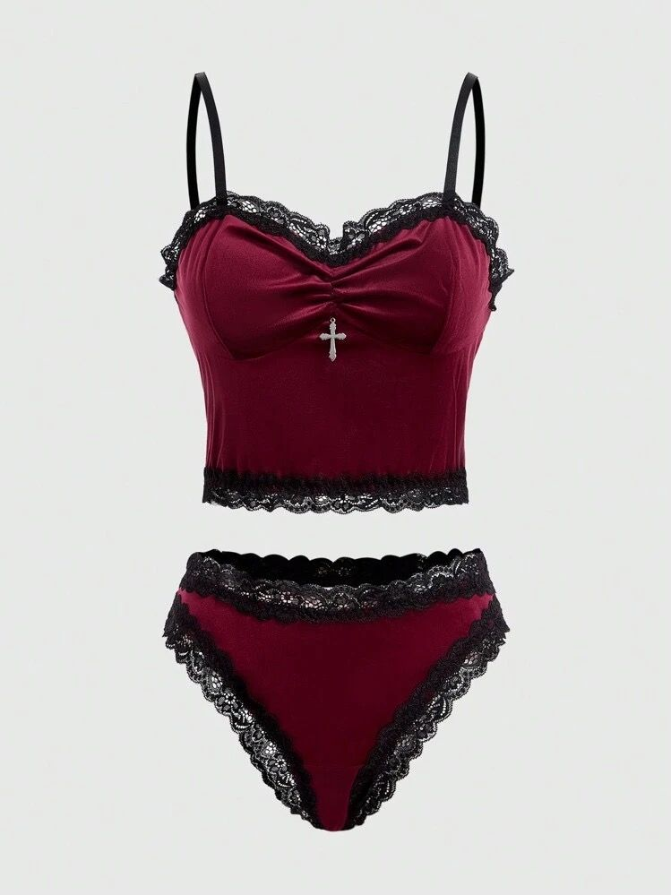

### Descrição visual (roupa)
- Top crop vinho renda + calcinha combinando (cruz no peito)

### Quando usar
Intimidade Ryan/Valk ou cena íntima; completar com robe se quiser.

---

## 086 · Tricô crop + fio

**Arquivo:** `intimate_knit_crop_thong.png`  
**Nome rápido:** Tricô crop + fio · **#086**
**Categoria:** intimate  
**Combina com (sugestão):** Valk / intimidade  

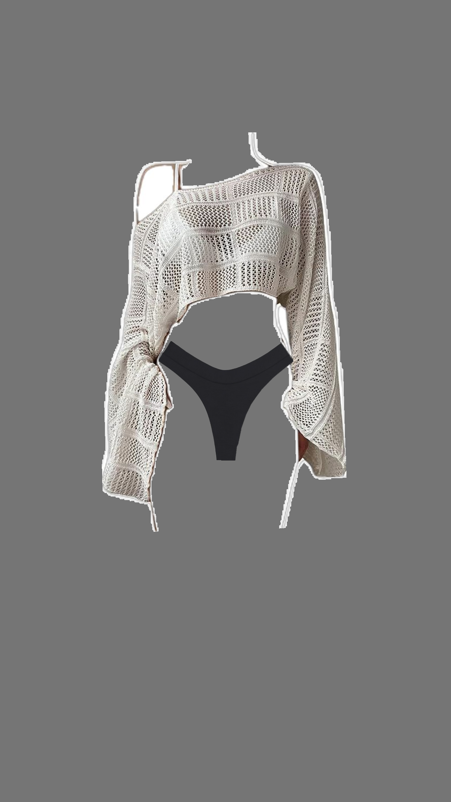

### Descrição visual (roupa)
- Suéter/tricô crochê ombro de fora + calcinha fio preta

### Quando usar
Intimidade / look ousado incompleto (ref).

---

## 087 · Camisa sheer + fio

**Arquivo:** `intimate_sheer_shirt_thong.png`  
**Nome rápido:** Camisa sheer + fio · **#087**
**Categoria:** intimate  
**Combina com (sugestão):** Valk / intimidade  

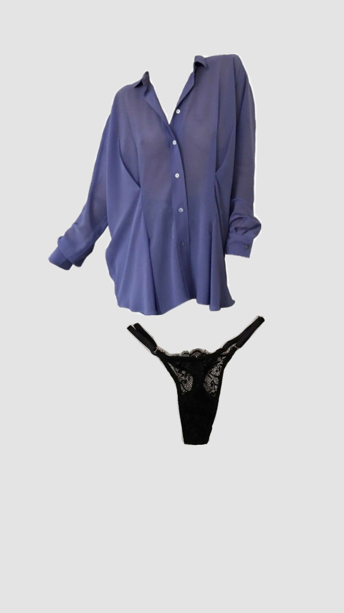

### Descrição visual (roupa)
- Camisa roxa/azul semi-transparente + calcinha fio renda preta

### Quando usar
Intimidade, manhã ousada.

---

## 120 · Halter couro + mini

**Arquivo:** `club_black_leather_harness_mini.png`  
**Nome rápido:** Halter couro + mini · **#120**
**Categoria:** club  
**Combina com (sugestão):** Alex  

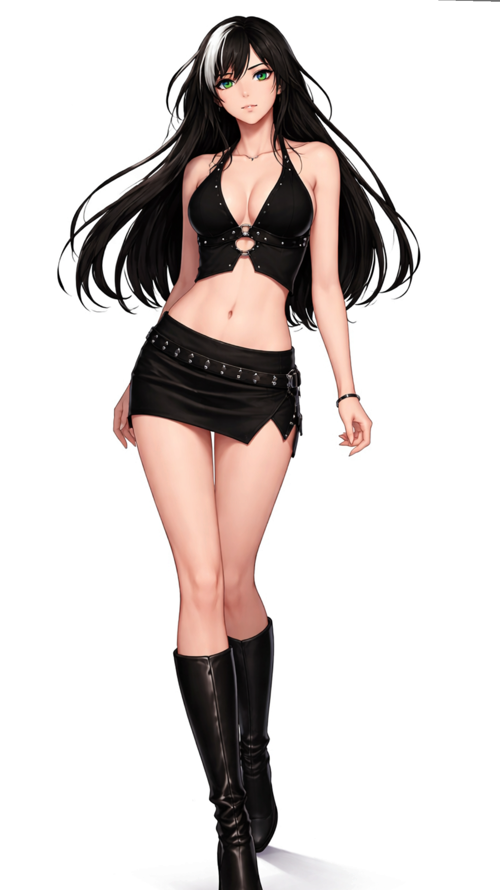

### Descrição visual (roupa)
- Top halter couro preto com argola + mini saia rebites + botas altas

### Quando usar
Clube, night out ousado.

---

## 025 · Top off + micro denim

**Arquivo:** `street_bikini_micro_denim.png`  
**Nome rápido:** Top off + micro denim · **#025**
**Categoria:** club  
**Combina com (sugestão):** Alex / Valk  

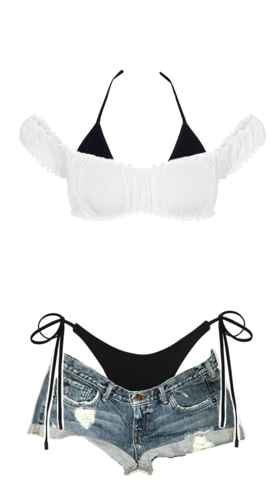

### Descrição visual (roupa)
- Top branco off-shoulder + micro short jeans + fio preto por baixo

### Quando usar
Street ousado, verão extremo, intimidade casual.

---

## 121 · Vestido preto correntes

**Arquivo:** `club_black_chain_mermaid.jpg`  
**Nome rápido:** Vestido preto correntes · **#121**
**Categoria:** club  
**Combina com (sugestão):** Alex  

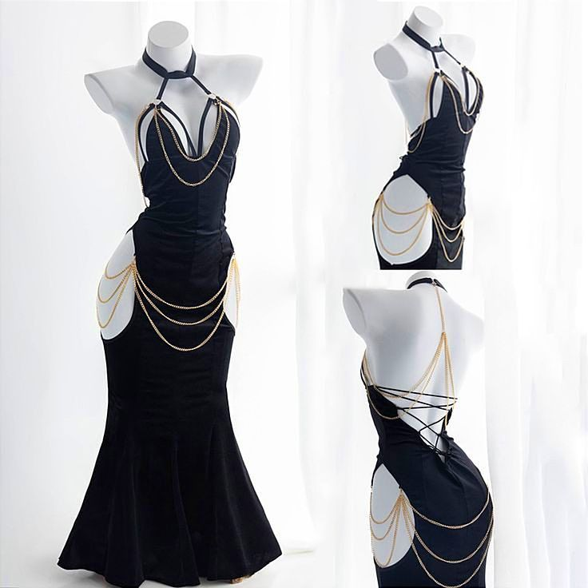

### Descrição visual (roupa)
- Vestido preto sereia cut-outs + correntes douradas

### Quando usar
Clube high-end, corpo.

---

## 106 · Camisa + calça couro

**Arquivo:** `formal_shirt_leather_harness.jpg`  
**Nome rápido:** Camisa + calça couro · **#106**
**Categoria:** formal  
**Combina com (sugestão):** Alex  

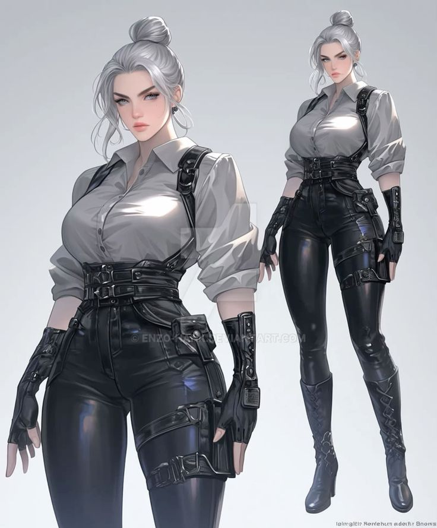

### Descrição visual (roupa)
- Camisa cinza social + calça couro preta + cinto multi + botas

### Quando usar
Formal ousado, job de rua high-end, corpo.

---

## 107 · Terno preto gravata vermelha

**Arquivo:** `formal_black_red_tie_suit.jpg`  
**Nome rápido:** Terno preto gravata vermelha · **#107**
**Categoria:** formal  
**Combina com (sugestão):** Alex  

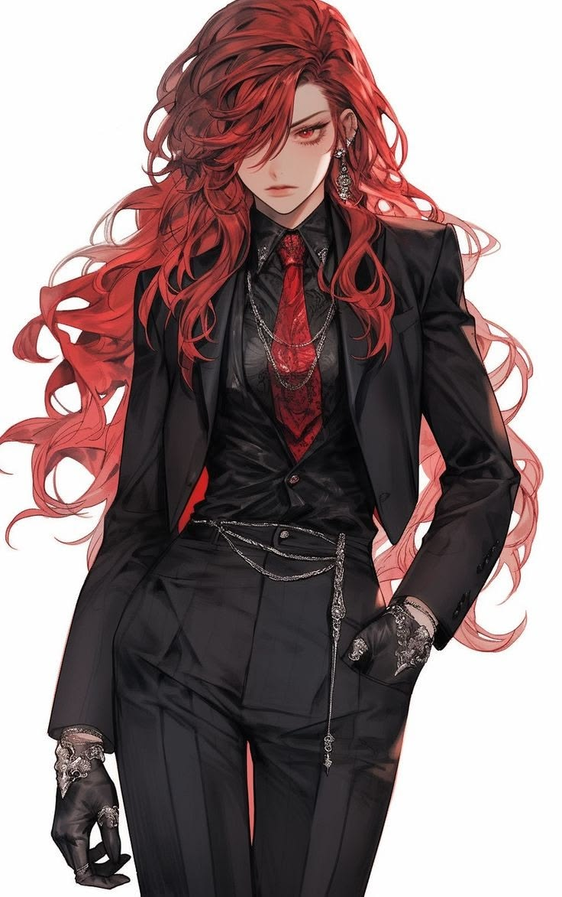

### Descrição visual (roupa)
- Blazer + camisa + gravata vermelha + calça pretos + luvas

### Quando usar
Formal andrógino, evento, poder.

---

## 108 · Camisa + gravata + harness

**Arquivo:** `formal_shirt_tie_harness.jpg`  
**Nome rápido:** Camisa + gravata + harness · **#108**
**Categoria:** formal  
**Combina com (sugestão):** Alex  

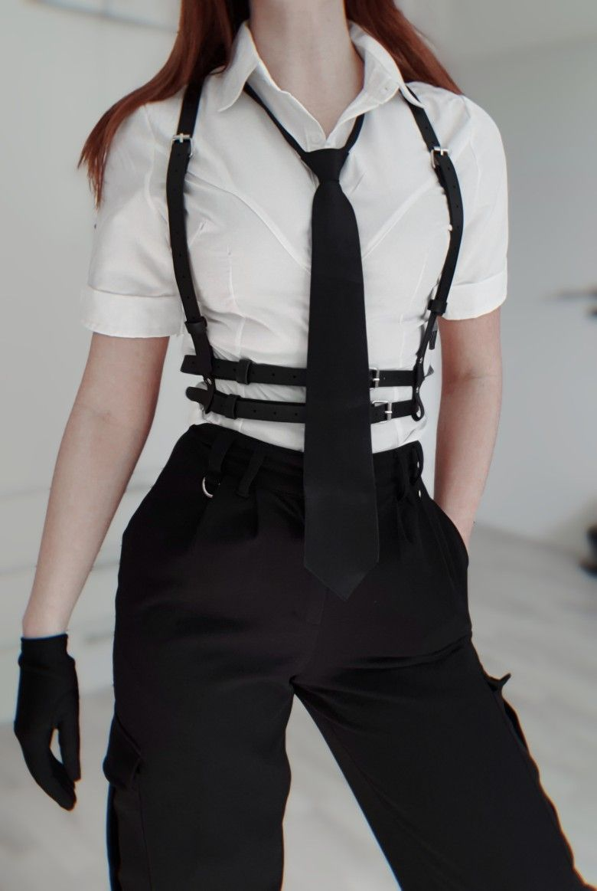

### Descrição visual (roupa)
- Camisa branca manga curta + gravata preta + harness/cinto peito + calça

### Quando usar
Formal fetish-light, clube corp.

---

## 109 · Casaco steampunk marrom

**Arquivo:** `formal_steampunk_brown_coat.jpg`  
**Nome rápido:** Casaco steampunk marrom · **#109**
**Categoria:** formal  
**Combina com (sugestão):** qualquer  

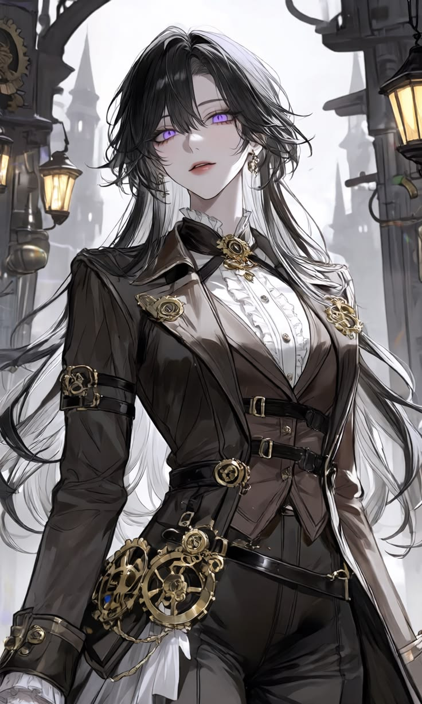

### Descrição visual (roupa)
- Casaco/colete marrom com detalhes metal + camisa branca babados

### Quando usar
Fantasia steampunk, formal dark.

---

## 136 · Vestido rosa + capa

**Arquivo:** `evening_pink_nightgown_cape.jpg`  
**Nome rápido:** Vestido rosa + capa · **#136**
**Categoria:** evening  
**Combina com (sugestão):** Reina  

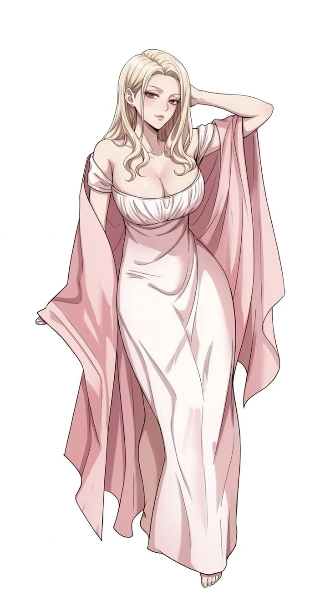

### Descrição visual (roupa)
- Vestido longo rosa claro ombro a ombro + capa rosa

### Quando usar
Gala soft, nightwear elegante.

---

## 137 · Gown preto estrelas

**Arquivo:** `evening_black_star_gown.jpg`  
**Nome rápido:** Gown preto estrelas · **#137**
**Categoria:** evening  
**Combina com (sugestão):** Reina  

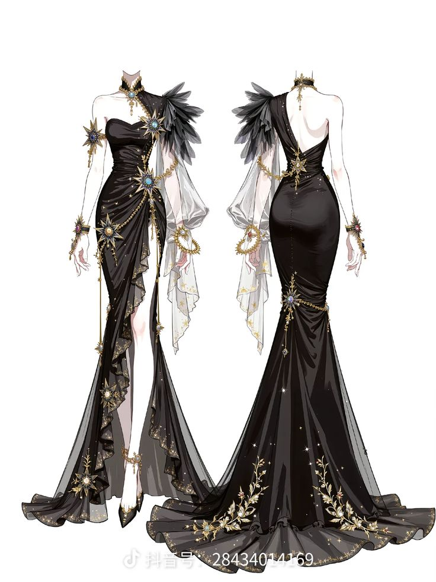

### Descrição visual (roupa)
- Vestido longo preto one-shoulder + estrelas/ouro + fenda (sheet)

### Quando usar
Gala, fantasia celestial.

---

## 167 · Gown inverno azul

**Arquivo:** `fantasy_winter_blue_cape.jpg`  
**Nome rápido:** Gown inverno azul · **#167**
**Categoria:** fantasy  
**Combina com (sugestão):** Reina / fantasia  

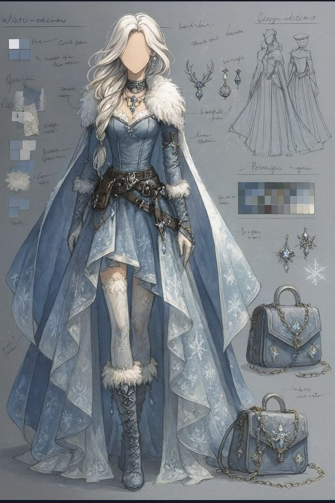

### Descrição visual (roupa)
- Vestido azul gelo + capa pele + botas + cintos (sheet design)

### Quando usar
Fantasia inverno, evento raro.

---

## 138 · Gown branco penas

**Arquivo:** `evening_white_feather_gown.jpg`  
**Nome rápido:** Gown branco penas · **#138**
**Categoria:** evening  
**Combina com (sugestão):** Reina  

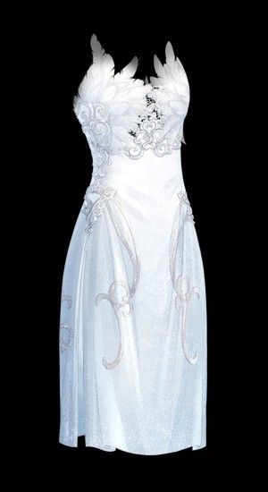

### Descrição visual (roupa)
- Vestido branco prata com ombros em pena/asa e bordado

### Quando usar
Gala, fantasia angelical.

---

## 168 · Vestido branco e vermelho

**Arquivo:** `fantasy_white_red_rose_gown.jpg`  
**Nome rápido:** Vestido branco e vermelho · **#168**
**Categoria:** fantasy  
**Combina com (sugestão):** Reina  

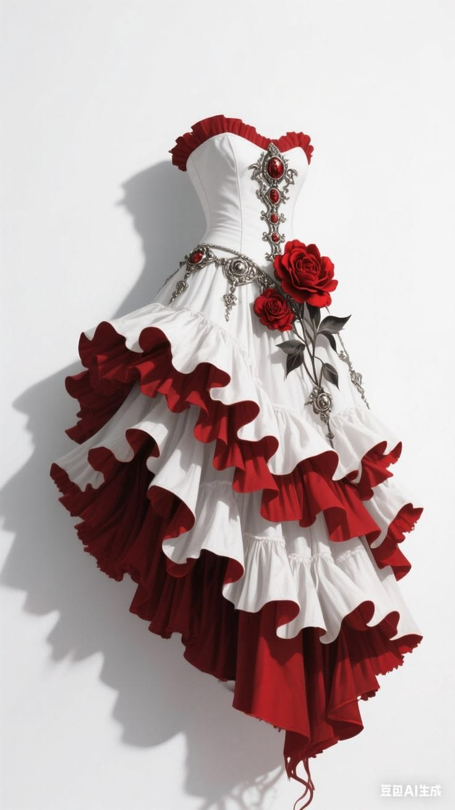

### Descrição visual (roupa)
- Corset branco + saia camadas branca/vermelha + rosas

### Quando usar
Fantasia, evento, gala dramática.

---

## 189 · Mini angelical branca

**Arquivo:** `special_white_gold_angel_mini.jpg`  
**Nome rápido:** Mini angelical branca · **#189**
**Categoria:** special  
**Combina com (sugestão):** cena especial  

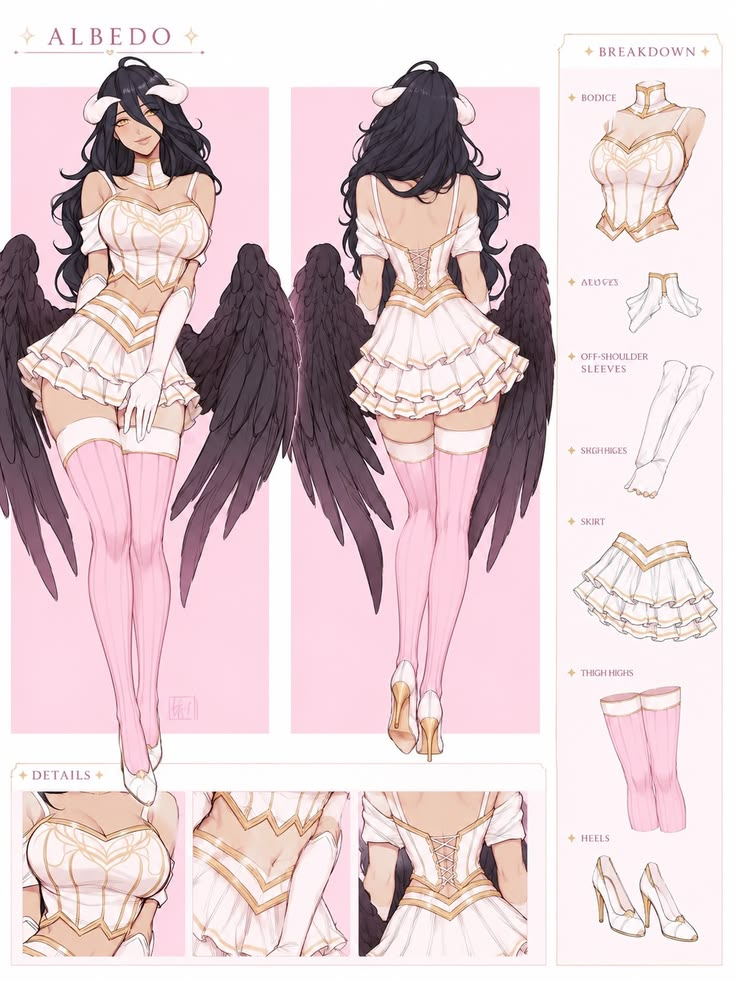

### Descrição visual (roupa)
- Corset branco/ouro + mini babados + meias 7/8 (sheet)

### Quando usar
Costume, especial, clube temático.

---

## 139 · Gown lilás estrelas

**Arquivo:** `evening_lilac_star_gown.jpg`  
**Nome rápido:** Gown lilás estrelas · **#139**
**Categoria:** evening  
**Combina com (sugestão):** Reina  

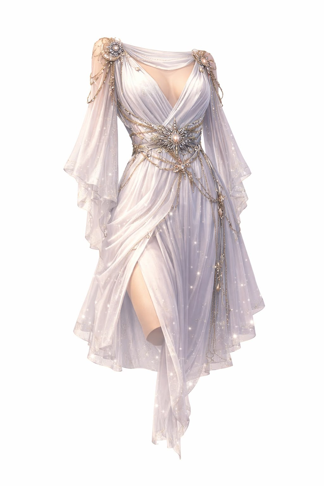

### Descrição visual (roupa)
- Vestido lilás/prata fluido com correntes e fenda

### Quando usar
Gala, fantasia.

---

## 140 · Gown branco corset

**Arquivo:** `evening_white_corset_gown.jpg`  
**Nome rápido:** Gown branco corset · **#140**
**Categoria:** evening  
**Combina com (sugestão):** Reina  

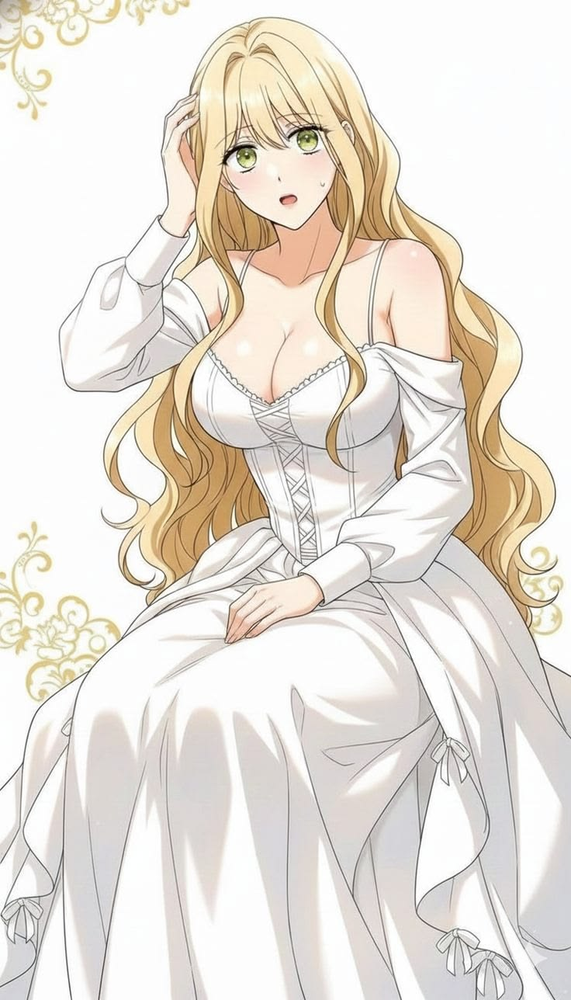

### Descrição visual (roupa)
- Vestido branco longo com corset e ombro de fora

### Quando usar
Gala romântica, fantasia.

---

## 026 · Crop roxo + calça

**Arquivo:** `street_purple_crop_combat.jpg`  
**Nome rápido:** Crop roxo + calça · **#026**
**Categoria:** street  
**Combina com (sugestão):** qualquer  

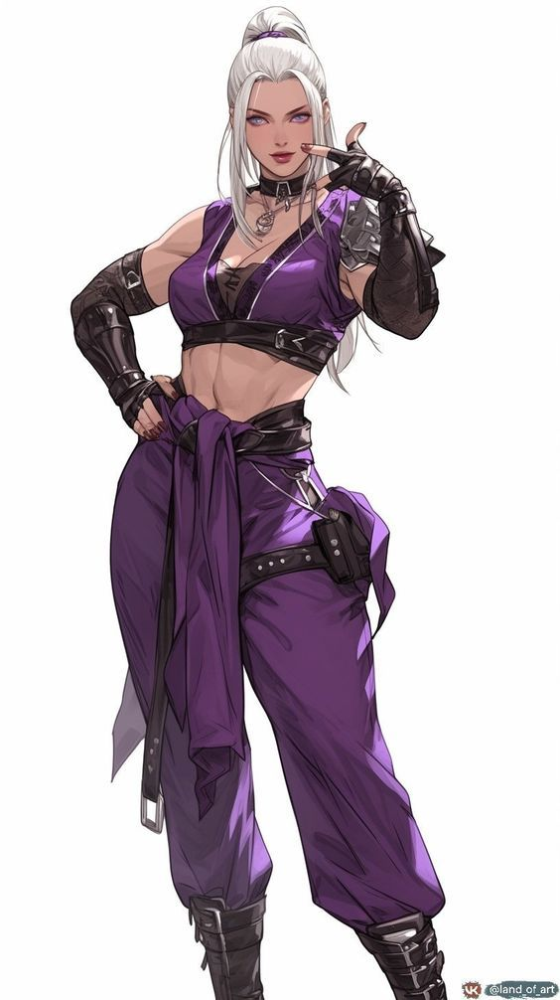

### Descrição visual (roupa)
- Crop/colete roxo + calça roxa larga + arm wraps pretos

### Quando usar
Street combate fashion, pack ousado.

---

## 027 · Flannel + crop + cargo

**Arquivo:** `street_plaid_crop_cargo.jpg`  
**Nome rápido:** Flannel + crop + cargo · **#027**
**Categoria:** street  
**Combina com (sugestão):** qualquer  

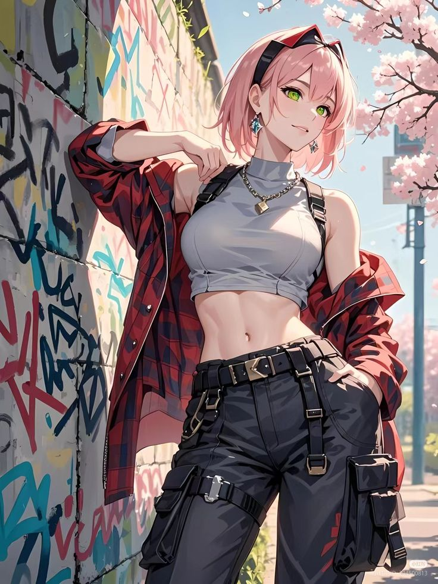

### Descrição visual (roupa)
- Jaqueta flannel vermelha + crop cinza + cargo preta com tiras

### Quando usar
Street, pack, dia a dia ousado.

---

## 110 · Camisa branca + calça preta

**Arquivo:** `formal_white_shirt_black_pants.jpg`  
**Nome rápido:** Camisa branca + calça preta · **#110**
**Combina com (sugestão):** Valk / qualquer  

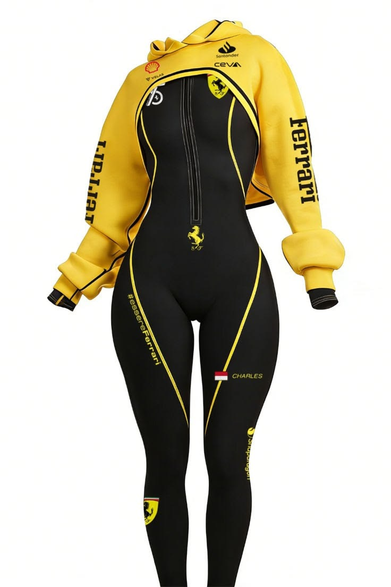

### Descrição visual (roupa)
- Camisa branca social  
- Calça preta justa / alfaiataria  

### Quando usar
Office, formal simples, visual limpo.

---

## 088 · Tee branca + calcinha

**Arquivo:** `intimate_white_tee_panties.jpg`  
**Nome rápido:** Tee branca + calcinha · **#088**
**Combina com (sugestão):** Valk / intimidade  

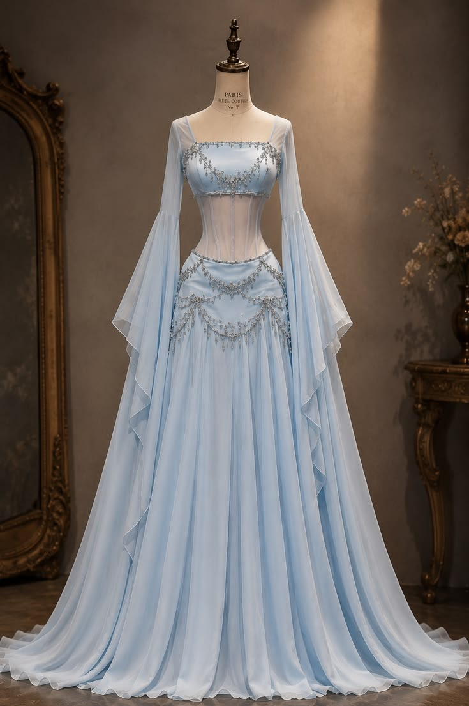

### Descrição visual (roupa)
- Camiseta branca oversized  
- Calcinha branca (set mínimo íntimo)  

### Quando usar
Intimidade; manhã ousada; completar com robe se quiser.

---

## 190 · Cosplay borboleta

**Arquivo:** `special_butterfly_wing_set.jpg`  
**Nome rápido:** Cosplay borboleta · **#190**
**Combina com (sugestão):** cena especial  

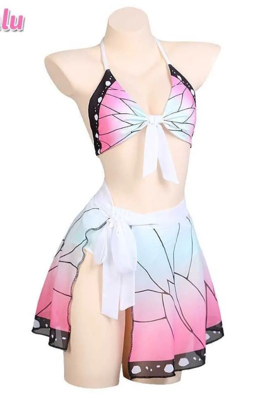

### Descrição visual (roupa)
- Top triângulo tipo bikini com estampa de **asas de borboleta** (rosa → azul) e laço branco  
- Saia curta assimétrica com a mesma estampa de asas e laço lateral  
- Ref. de manequim / loja cosplay — **não** é blazer nem formal  

### Quando usar
Costume, cosplay, fantasia de evento — **não** default de personagem nem semi-formal.

---

## 089 · Babydoll sheer preto

**Arquivo:** `intimate_black_sheer_babydoll_ref.jpg`  
**Nome rápido:** Babydoll sheer preto · **#089**
**Combina com (sugestão):** Valk / intimidade  

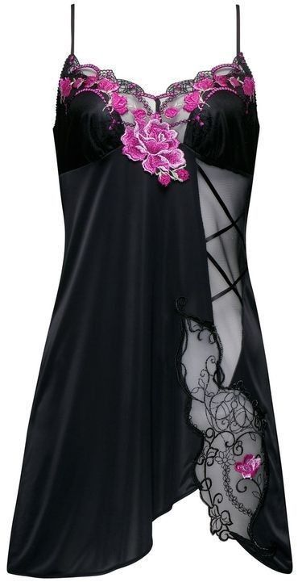

### Descrição visual (roupa)
- Babydoll / chemise preta sheer com renda  

### Quando usar
Intimidade, nightwear ousado.

---

## 141 · Mermaid glitter preta

**Arquivo:** `evening_black_mermaid_glitter.jpg`  
**Nome rápido:** Mermaid glitter preta · **#141**
**Combina com (sugestão):** Reina  

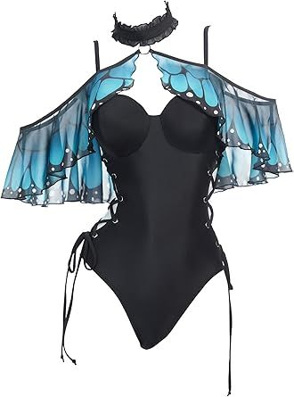

### Descrição visual (roupa)
- Vestido sereia preto com brilho / glitter  

### Quando usar
Gala, evening high-end.

---

## 080 · Onesie plush panda

**Arquivo:** `sleep_plush_onesie_panda.jpg`  
**Nome rápido:** Onesie plush panda · **#080**
**Combina com (sugestão):** qualquer  

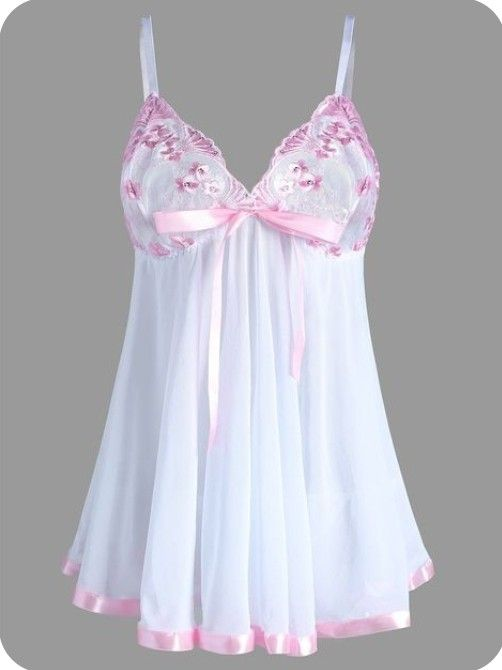

### Descrição visual (roupa)
- Onesie plush com tema panda / capuz  

### Quando usar
Sleep fofo, humor, downtime pack.

---

## 142 · Cape + corset preto

**Arquivo:** `evening_black_cape_corset.jpg`  
**Nome rápido:** Cape + corset preto · **#142**
**Combina com (sugestão):** Reina / Alex  

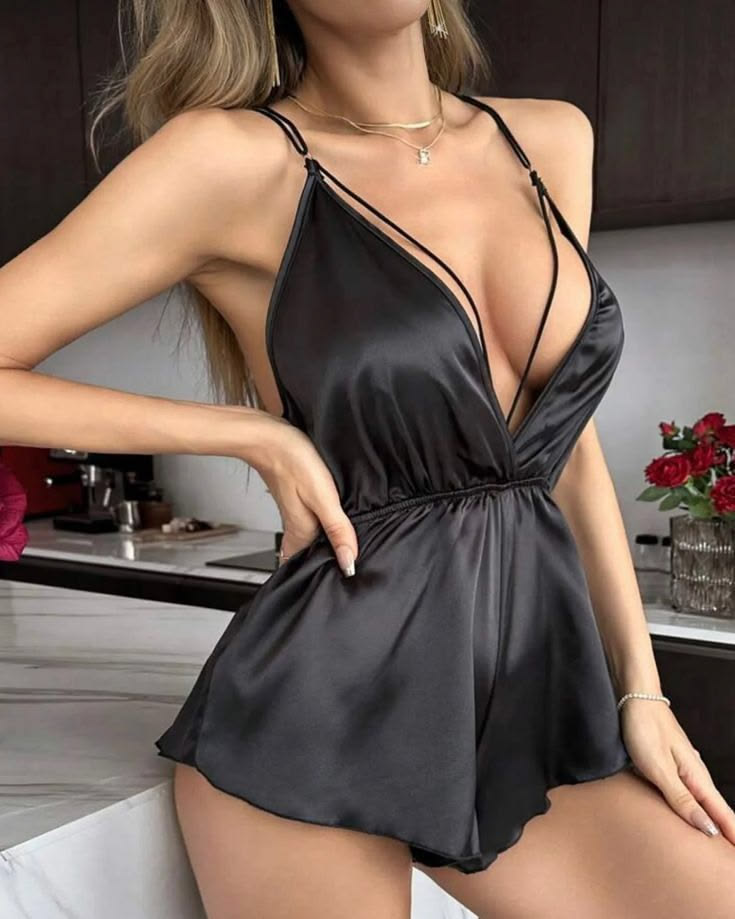

### Descrição visual (roupa)
- Corset / body preto + capa  

### Quando usar
Evening dramático, clube high-end, fantasia.

---

## 081 · Robe rosa renda

**Arquivo:** `sleep_pink_lace_robe_set.jpg`  
**Nome rápido:** Robe rosa renda · **#081**
**Combina com (sugestão):** Reina / Valk  

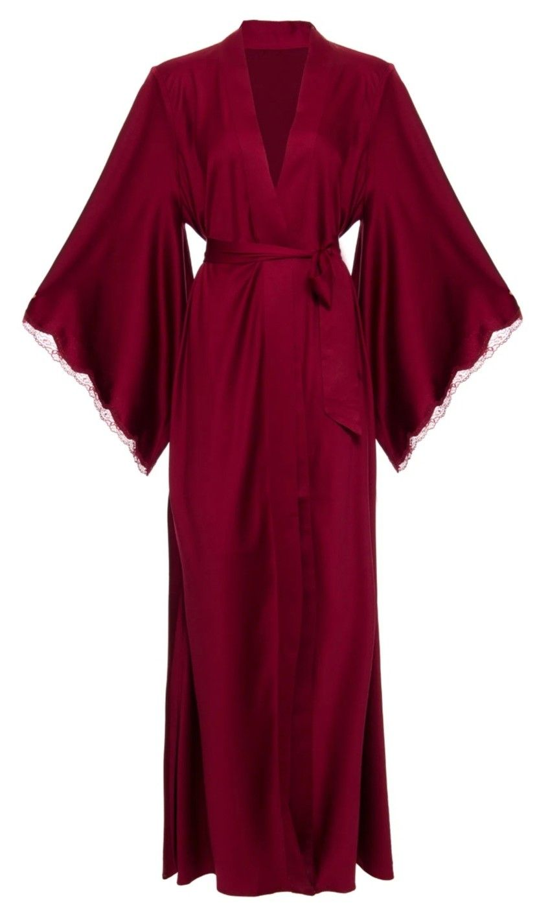

### Descrição visual (roupa)
- Robe / set rosa com renda  

### Quando usar
Sleep fashion, intimidade soft.

---

## 143 · Mini vinho corset dourado

**Arquivo:** `evening_wine_corset_mini.jpg`  
**Nome rápido:** Mini vinho corset dourado · **#143**
**Combina com (sugestão):** qualquer  

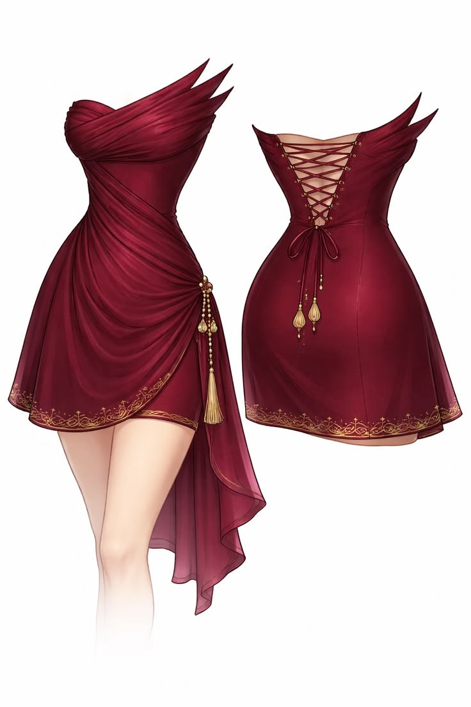

### Descrição visual (roupa)
- Vestido mini **vinho** drapeado, ombro a ombro  
- Costas com **corset** (ilhoses + cordão) e tassels dourados  
- Barra assimétrica / high-low; detalhes dourados na bainha  
- **Não** é terno (o terno + gravata vermelha correto é o **#107**)  

### Quando usar
Evening fantasy, evento temático, gala ousada curta.

---

## 082 · Pijama cetim preto

**Arquivo:** `sleep_black_satin_pj_set.jpg`  
**Nome rápido:** Pijama cetim preto · **#082**
**Combina com (sugestão):** qualquer  

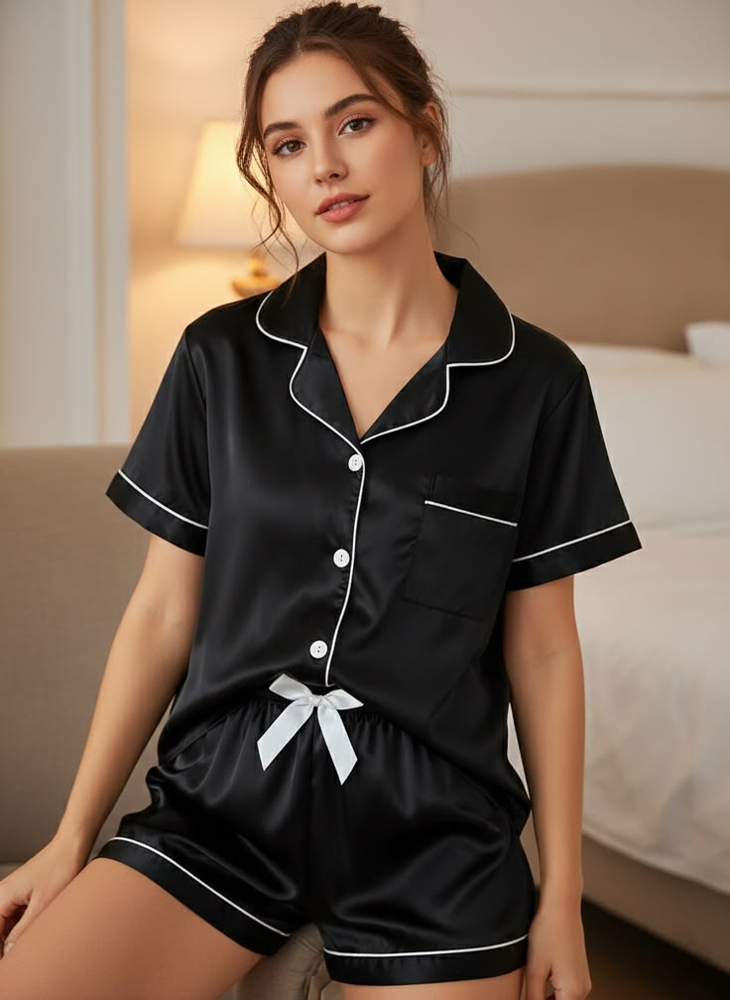

### Descrição visual (roupa)
- Camisa de **cetim preto** manga curta, gola, botões brancos, vivo branco, bolso  
- Short de cetim combinando com elástico e laço branco na cintura  
- Lounge / sleep — **não** é bodysuit nem harness  

### Quando usar
Casa, safehouse, sleep, pós-banho — não clube.

---

## 083 · Cami floral branca + set

**Arquivo:** `sleep_white_floral_cami_set.jpg`  
**Nome rápido:** Cami floral branca + set · **#083**
**Combina com (sugestão):** Valk / qualquer  

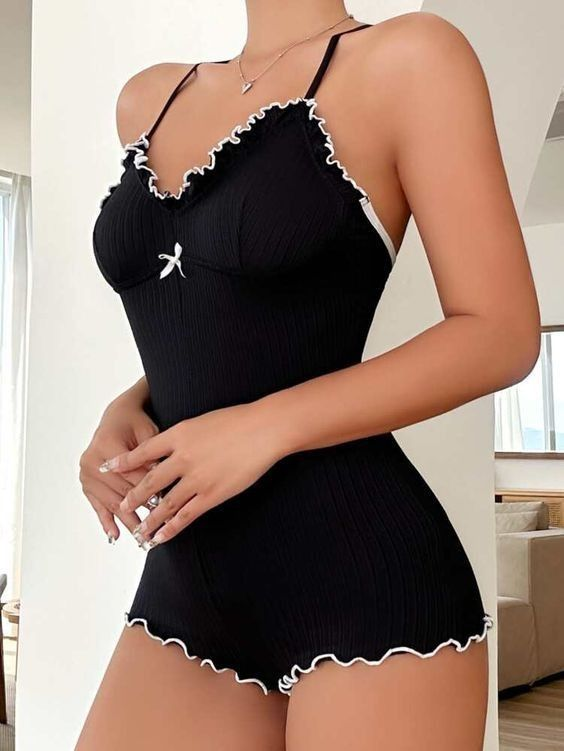

### Descrição visual (roupa)
- Cami / short set branco com detalhe floral  

### Quando usar
Sleep, intimidade leve, casa.

---

## Notas de narração

1. Descreva **só a roupa** a partir do slot escolhido.  
2. Não copie rosto, cabelo ou corpo do modelo da imagem.  
3. Não assuma armas ou chrome só porque aparecem na foto.  
4. **Quem** veste o look é decisão da cena / ficha — não deste arquivo.  
5. Em dúvida de “o que ela está vestindo?”, abra o slot da ocasião e liste 3–5 peças.  
6. Flatlay, character sheet, watermark ou UI de loja: **extrair só o estilo da roupa**.  
7. Slots `piece_*`: sempre completar mentalmente com outra peça (saia/calça/short/botas) se a foto for só tronco.  
8. Seção **Especial / ousado**: só quando a cena pedir; não default de job.  
9. Preferir o **Índice — Shorts & rompers** quando quiser silhueta curta em vez de calça.  
10. Medical/sleep: usar slots `medical_*` e `sleep_*`; kit médico e chrome só se a ficha tiver.  
11. Scrubs: `medical_scrubs_*`. Biker: `gym_biker_*`. Bermuda alfaiataria: `formal_*_bermuda_*` / `casual_khaki_bermuda_shirt`.

---

## Referências

- [Valk](nomad%20-%20lena_valk_kane.md) · [Alex](netrunner%20-%20alex_specter_kane.md) · [Reina](solo%20-%20reina_bearclaw_morales.md) · [Stitch](medtech%20-%20stephania_stitch_voss.md)  
- [Ryan — guarda-roupa](ryan_guarda_roupas.md) · [Mapa](../relacionamentos/mapa_relacional_geral.md) · [Registro](../sistema/registro_arquivos.md)
12. **Combina com (sugestão)** em cada look é só vibe de personalidade/cena — **nunca** trava personagem. `intimate_*` serve intimidade (Ryan/Valk etc.) sem excluir outras.
