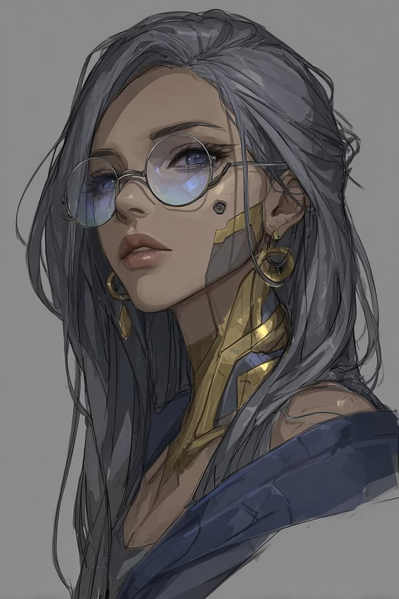

# Dra. Elisa “Doc” Moreau — NPC Secundário

**Tipo:** Terapeuta / Ripperdoc (contato de longo prazo)  
**Facção / contexto:** Independente — Night City (clínica de rua / consultório discreto)  
**Status:** Ativo · **fora de cena** (Ryan nas Badlands) · **E011** pendente

> **F04:** “**a Doc**” / **Doc Moreau** = **esta pessoa**.  
> **Nunca** confundir com **Stephania “Stitch” Voss** (MedTech da crew — [ficha](../medtech%20-%20stephania_stitch_voss.md)).

---

## Personalidade

- Calma, firme, pouco dada a teatro de rua; trata trauma e chrome com o mesmo pragmatismo.
- Frustrada de forma carinhosa com pacientes que “sabem demais e lembram de menos”.
- Não cosplay de mãe — cuida cobrando responsabilidade (sessões, limites de chrome, honestidade parcial).
- Guarda segredos de cliente como regra profissional; revela só o que a cena e o jogador desbloqueiam.

## Aparência / voz (rápido)

- Mulher adulta (faixa 40–50), presença clínica; mãos estáveis de ripper.
- Cabelo longo prateado/cinza; óculos redondos; chrome facial/pescoço dourado-prateado (ripperdoc).
- Voz baixa, cadência de consultório; raramente grita.
- Ambiente típico: clínica discreta em NC (não é o pack, não é a mesa de Stitch).

**Imagem de referência:**

- Retrato: [imagens/elisa_doc_moreau.jpg](../../imagens/elisa_doc_moreau.jpg)  
- Rosto/cabelo/chrome canônicos; roupa da foto é só referência visual, não default de cena.

## O que ela sabe (narrador)

| Camada | Conteúdo | Revelar? |
| ------ | -------- | -------- |
| Público / Ryan | Removeu ou atenuou chips/bloqueios Arasaka; “ajudou com a cabeça”; trata ferimentos e chrome | Ryan **não** entende o alcance |
| Oculto | Sabe **muito mais** do passado de Ryan do que ele lembra; estabilizou Humanidade pós-chrome/Arasaka (HL histórico alto → Humanidade atual 63/70) | Gradual — [gatilhos](../notas_narrador/ryan_gatilhos_memorias.md) · [background](../notas_narrador/ryan_background_completo.md) · ficha Ryan § Humanidade |
| Reina | Mediadora do favor: cobrou Ryan para construir os **cyberarms** da Reina (Estado da Arte). **Reina sabe**; **Ryan não lembra** | Não despejar em monólogo |

## Eventos narrativos

| Data (aprox.) | Evento |
| ------------- | ------ |
| Pós-Arasaka (passado) | Ryan chega via crew; Doc inicia remoção/atenuação de chips e tratamento. Processo doloroso; memória continua fragmentada. |
| Passado (surto) | Durante tratamento, Ryan tem surto; **Reina** ajuda a contê-lo. Ryan não lembra. |
| Passado (braços) | Reina perde os braços; Doc cobra favor de Ryan → ele constrói os cyberarms. Reina sabe; Ryan amnésico do ato. |
| Em curso (campanha) | Visitas regulares no passado; **E011** — Ryan prometeu ir (Valk quer ir junto). Ainda não ocorreu in-game (21/07/2026). |

## Relação com a crew

- **Ryan:** Confiança confusa + dependência terapêutica/técnica. Uma das poucas pessoas que “sabe da cabeça dele”. Gatilho de revelação controlada.
- **Valk:** Ainda não se encontraram de forma documentada; Valk quer acompanhar a visita (promessa com Ryan).
- **Reina:** Ligação histórica forte (surto + braços). Reina respeita o silêncio sobre a dívida.
- **Stitch:** **Não** é a mesma pessoa; sem parentesco; papéis distintos (passado vs MedTech da crew atual).

## Notas para o narrador

- Visita E011 = item do **checklist E015** (Night City). Clínica em NC, não no Pack.
- Em cena: priorizar **cuidado + frustração profissional**, não monólogo de lore. Ryan em modo vulnerável = gatilhos possíveis; em modo operador = quase imune.
- Anti-meta: NPCs do pack **não** conhecem a Doc salvo se o SoT disser o contrário.
- Se a IA precisar de nome de local e não houver: clínica discreta em bairro de NC a definir no Finalizar — **não inventar** mega-clínica Arasaka.

## Status de campanha (NOW)

| Campo | Valor |
| ----- | ----- |
| Local | Night City (clínica) |
| Próximo gancho | **E011** / checklist E015 item 1 — Ryan + Valk |
| Ficha mecânica RED | Não (NPC mínimo) |

---

## Referências

- [Ficha Ryan — Contatos](../techie%20-%20ryan_wireghost_voss.md#contatos-e-amigos) · [Gatilhos](../notas_narrador/ryan_gatilhos_memorias.md) · [Background (restrito)](../notas_narrador/ryan_background_completo.md)
- [Reina](../solo%20-%20reina_bearclaw_morales.md) · [rels Reina](../../relacionamentos/reina_bearclaw_morales_relacionamentos.md) · [Stitch](../medtech%20-%20stephania_stitch_voss.md)
- [Event queue E011/E015](../../event_queue.md) · [Fatos duros F04](../../sistema/fatos_duros.md) · [Mapa](../../relacionamentos/mapa_relacional_geral.md)
