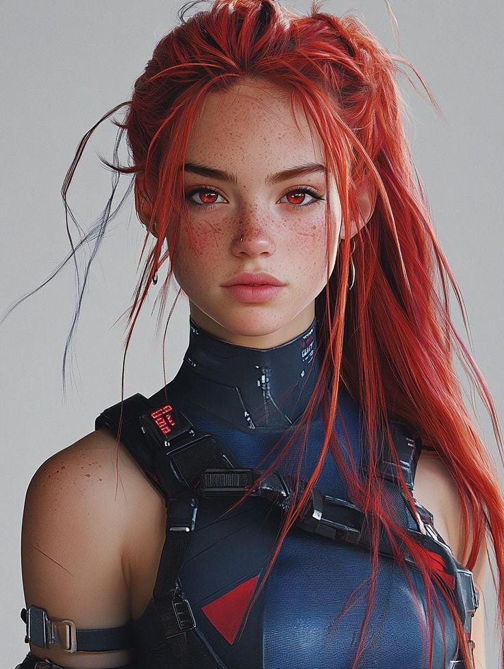

# Lira — NPC Secundário

**Tipo:** Membro do Pack Nômade (jovem)  
**Facção / contexto:** Pack Badlands  
**Status:** Ativo

---

## Personalidade

- Direta, cheia de energia; fala sem rodeios quando quer algo.
- Tentativa ativa de se aproximar de Valk — mais confiante que Sasha nesse jogo social.
- Assustada com o lado operador de Ryan (ouviu falar / viu de longe); mantém distância respeitosa sem ser submissa.
- Após tensão no pack, ajuda Valk a acalmar o grupo — papel de apoio emocional entre os jovens.

## Aparência / voz (rápido)

- Mulher jovem (~início dos 20s), magra e ágil, pele clara densamente sardenta (rosto, ombros, colo).
- Cabelo vermelho vivo, longo e volumoso, preso em coque alto bagunçado com mechas soltas; alguns fios escuros misturados nas laterais.
- Olhos vermelhos intensos (provável chrome óptico ou lentes); sobrancelhas finas, olhar fixo e confiante; brincos de argola prateados.
- Traje tático futurista azul-escuro e preto, colarinho alto com marcações técnicas; harness com fivelas; patch triangular vermelho no peito; display no ombro com o nome **LIRA**.
- Um ombro exposto com alça de couro no braço; expressão séria, quase desafiadora — postura de atiradora ou batedora de incursão.
- Voz provavelmente firme e um tom acima do necessário quando está animada ou nervosa.

**Imagem de referência:**  

## Eventos narrativos

| Data (aprox.) | Evento |
| ------------- | ------ |
| Jun/2026 | Tenta se aproximar de Valk enquanto Ryan se integra ao pack; tensão social leve com Sasha (ambas orbitam Valk). |
| 23/06/2026 | **Incidente 002:** Não esteve na limpeza silenciosa; repercussão por histórias. Depois ajudou Valk a acalmar o grupo (Sasha ficou mais abalada). |
| Pós-Raffen | Mantém cautela em relação ao “mecânico bonzinho” vs operador; admiração misturada com medo, como boa parte do pack. |

## Relação com a crew

- **Ryan:** Respeito pelo que faz pelo pack + medo do lado soldado; evita provocar, mas não some.
- **Valk:** Interesse romântico/social em construção; aliada em momentos de tensão no acampamento.
- **Sasha:** Colega jovem do pack; competição leve pela atenção de Valk.

## Notas para o narrador

- Contraste útil com Sasha: Lira reage com ação (falar, ajudar, aproximar); Sasha reage com recuo e vergonha.
- Bom NPC para cenas de integração social de Valk ou para mostrar como o pack processa o arco operador de Ryan.

---

## Referências

- [Incidente 002](../../logs/incidente_002_incursao_noturna_raffen.md) · [Pack Badlands](../../facoes/pack_badlands.md)
- [ryan_relacionamentos.md](../../relacionamentos/ryan_relacionamentos.md) · [sessao_resumo_002.md](../../logs/sessao_resumo_002.md)
- [Sasha](sasha.md) · [Mapa Relacional](../../relacionamentos/mapa_relacional_geral.md)