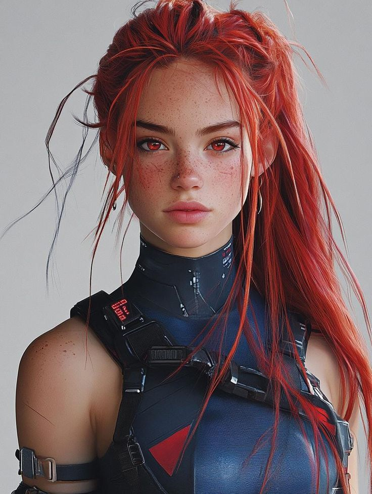

# Lira — NPC Secundário (Pack Badlands)

**Nome / como chamar:** **Lira** (sem sobrenome canônico no SoT)  
**Tipo:** Membro do Pack Nômade (jovem) · assistente / incursões  
**Facção / contexto:** Pack Badlands  
**Status:** Ativo · Pack (retorno 27/07 pós-viagem E015)

> **Pessoa (NPC do Pack).** Não é crew NC. Não confundir com Solos da crew.

---

## Personalidade

- Direta, cheia de energia; fala sem rodeios quando quer algo.
- Tentativa ativa de se aproximar de Valk — mais confiante que Sasha nesse jogo social.
- Assustada com o lado operador de Ryan (ouviu falar / viu de longe); mantém distância respeitosa sem ser submissa.
- Após tensão no pack, ajuda Valk a acalmar o grupo — papel de apoio emocional entre os jovens.

## Aparência / voz (rápido)

- Mulher jovem (~início dos 20s), magra e ágil, pele clara densamente sardenta (rosto, ombros, colo).
- Cabelo vermelho vivo, longo e volumoso, preso em coque alto bagunçado com mechas soltas; alguns fios escuros misturados nas laterais.
- Olhos vermelhos intensos (provável chrome óptico ou lentes); sobrancelhas finas, olhar fixo e confiante; brincos de argola prateados.
- Traje tático futurista azul-escuro e preto, colarinho alto com marcações técnicas; harness com fivelas; patch triangular vermelho no peito; display no ombro com o nome **LIRA**.
- Um ombro exposto com alça de couro no braço; expressão séria, quase desafiadora — postura de atiradora ou batedora de incursão.
- Voz provavelmente firme e um tom acima do necessário quando está animada ou nervosa.

**Imagem de referência:**  

## Eventos narrativos

| Data (aprox.) | Evento |
| ------------- | ------ |
| Jun/2026 | Tenta se aproximar de Valk enquanto Ryan se integra ao pack; tensão social leve com Sasha (ambas orbitam Valk). |
| 23/06/2026 | **Incidente 002:** Não esteve na limpeza silenciosa; repercussão por histórias. Depois ajudou Valk a acalmar o grupo (Sasha ficou mais abalada). |
| Pós-Raffen | Mantém cautela em relação ao “mecânico bonzinho” vs operador; admiração misturada com medo, como boa parte do pack. |
| 24–27/07/2026 (018–019) | Viagem com Ryan/Valk/Sasha (industrial + retorno). Em 019: overwatch com Phantom (cooperativa), despedida positiva (“A gente foi. E foi bom. Quando tiver de novo, chama.”), residual aberto a novas saídas. |
| 28–29/07/2026 (020) | Pack. Cumprimento no refeitório; **sem** delta novo. Residual 019 mantido. |

## Relação com a crew

- **Ryan:** Respeito + medo residual do operador; **pós-viagem 019:** residual positivo claro — overwatch cooperativa, “foi bom / chama de novo”. 020 sem delta.
- **Valk:** Aproximação ativa / tutoria; aliada em tensão no acampamento. Respeito ao namoro.
- **Sasha:** Colega jovem do pack; competição leve pela atenção de Valk, agora mais amizade compartilhada.
- **Camada:** Pack. **Não** é crew NC nem peça de polycule.

## Notas para o narrador

- Contraste útil com Sasha: Lira reage com ação (falar, ajudar, aproximar); Sasha reage com recuo e vergonha.
- Bom NPC para cenas de integração social de Valk ou para mostrar como o pack processa o arco operador de Ryan.

---

## Referências

- [Incidente 002](../../logs/incidente_002_incursao_noturna_raffen.md) · [Pack Badlands](../../facoes/pack_badlands.md)
- [ryan_relacionamentos.md](../../relacionamentos/ryan_relacionamentos.md) · [sessao_resumo_002.md](../../logs/sessao_resumo_002.md)
- [Sasha](sasha.md) · [Mapa Relacional](../../relacionamentos/mapa_relacional_geral.md)
