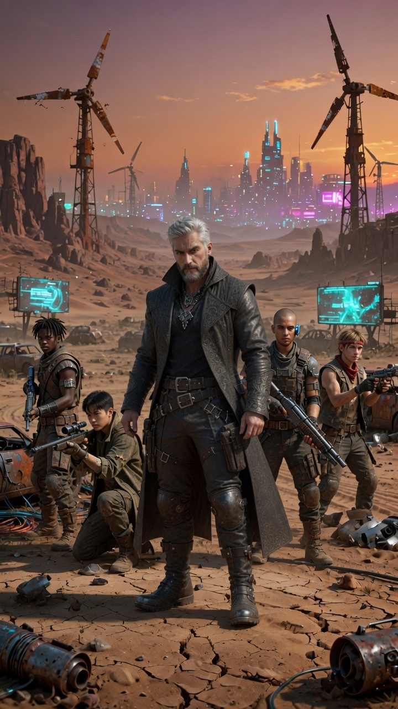

# Reyes — NPC Secundário

**Tipo:** Líder do Pack Nômade de Badlands  
**Facção / contexto:** Pack Badlands  
**Status:** Ativo

---

## Personalidade

- Voz rouca, típica de quem passou anos no deserto; cauteloso mas justo.
- Cobra pagamento **e** confiança: “a gente não vai morrer por causa de corporativo”.
- Abre espaço gradual para Ryan em decisões estratégicas (reunião 02/07 sobre recrutas).

## Aparência / voz (rápido)

- Homem mais velho, barba grisalha, cicatrizes antigas, colete blindado com patches de vários packs.
- Sentinelas jovens ao redor; postura de líder que mede risco antes de acolher.

**Imagens de referência:**

- Retrato (cena): [imagens/Reyes.jpg](../../imagens/Reyes.jpg)
- Token (mapa / combate / UI): [imagens/Reyes_token.jpg](../../imagens/Reyes_token.jpg)

## Eventos narrativos

| Data (aprox.) | Evento |
| ------------- | ------ |
| 16/06/2026 | Aceita Ryan e Valk via Kaz (800 eb + favor); tenda e comida oferecidas. |
| Jun/2026 | Ryan conserta bomba, gerador, forja; respeito técnico cresce. |
| 23/06/2026 | Performance musical no pack; após [Incidente 002](../logs/incidente_002_incursao_noturna_raffen.md), nota tensão no acampamento (cautela + respeito). Ryan planeja falar sobre risco das incursões. |
| 01–02/07/2026 | Recebe recrutas Mara, Elias, Tomas; reunião estratégica com Ryan e Tio Gringo. |
| 03/07/2026 | **Aprovou oficialmente** o projeto **Badlands Node v0.1** após apresentação de Ryan. |
| 04/07/2026 | Recebeu debrief de Ryan após operação na Torre Raffen (6 reféns, ameaça neutralizada). |

## Relação com a crew

- **Ryan:** Respeito técnico + cautela pelo lado operador; consulta em expansão do pack.
- **Valk:** Reconhece como nômade confiável desde a chegada.

## Notas para o narrador

- Linha vermelha: se Biotechnica aparecer no acampamento, o pack não morre por corporativo.
- Tende a concordar com consolidação interna antes de crescimento rápido.

---

## Referências

- [Pack Badlands](../../facoes/pack_badlands.md) · [Board](../../board/board_campanha.md)
- [Sessão 007](../../logs/sessao_resumo_007.md) · [Sessão 008](../../logs/sessao_resumo_008.md)
- [Mapa Relacional](../../relacionamentos/mapa_relacional_geral.md)
- Imagens: [Reyes.jpg](../../imagens/Reyes.jpg) · [Reyes_token.jpg](../../imagens/Reyes_token.jpg)
- Pulso: [reyes.md](../../pulso_do_mundo/pack_badlands/reyes.md)
