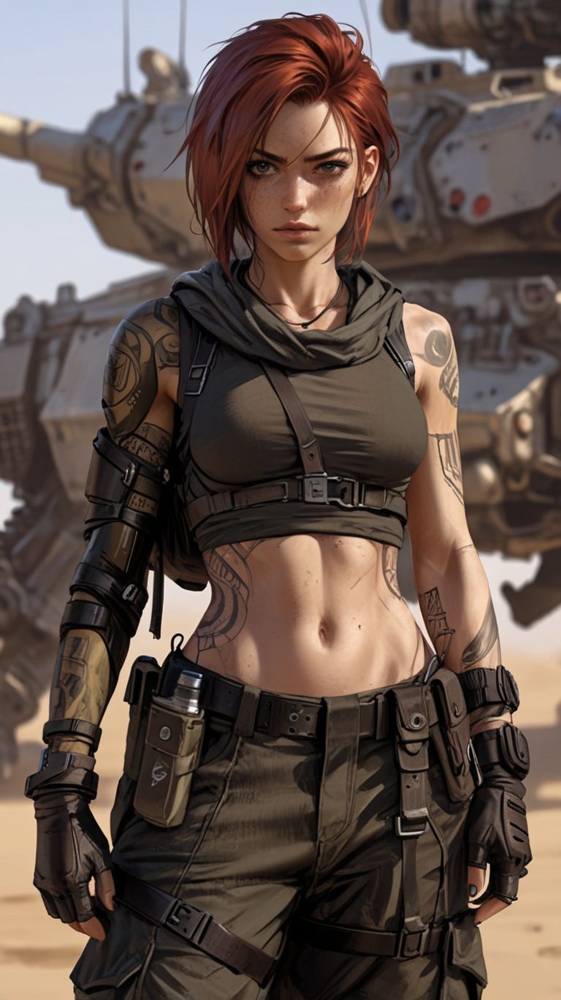

# Sasha — NPC Secundário

**Tipo:** Membro do Pack Nômade (jovem)  
**Facção / contexto:** Pack Badlands  
**Status:** Ativo

---

## Personalidade

- Reativa sob stress; ofereceu-se para incursões mas obedece mal sob fogo quando acha que está “ajudando”.
- Fica visivelmente desconfortável quando Ryan entra em modo operador — abaixa o olhar, evita confronto.
- Curiosa em relação a Valk (tentativas de aproximação); incidentes constrangedores com Ryan na oficina (ver notas).

## Aparência / voz (rápido)

- Mulher jovem (~meados dos 20s), corpo atlético e tonificado — abdômen definido, postura de quem trabalha com as mãos e não foge de campo.
- Cabelo vermelho curto e bagunçado, franja irregular; pele clara com sardas no nariz e nas maçãs do rosto; olhos verde-avelã, olhar direto e sério.
- Tatuagens grandes e visíveis: padrões mecânicos/cibernéticos no braço, símbolos menores nos antebraços, rosto estilizado (quase demoníaco) no abdômen.
- Roupa tática de Badlands: top cropped verde-oliva com capuz/caçador, harness preto com fivelas, calças cargo, luvas sem dedos, bracelete de armadura no antebraço, coldre e bolsas utilitárias no cinto.
- Choker preto fino; voz não fixada — tende a falar baixo quando está desconfortável.
- Pistola nas incursões; não é soldado de formação, mas se equipa como quem já foi ao fogo.

**Imagem de referência:**  

## Eventos narrativos

| Data (aprox.) | Evento |
| ------------- | ------ |
| 22–23/06/2026 | **Incidente 001:** Devolveu fogo contra ordem de cobertura; presenciou execução e confronto de Ryan. |
| 23/06/2026 | **Incidente 002:** Na incursão noturna ficou na colina de suporte; viu o resultado da limpeza silenciosa (~16 hostis). Permaneceu abalada — Valk conversou com ela depois. |
| Jun/2026 | Aula/oficina: Ryan consertou algo com a cabeça entre as pernas dela sem perceber; ouviu Ryan e Valk perto da tenda. |

## Relação com a crew

- **Ryan:** Respeito + medo após o incidente Raffen; vergonha em situações sociais anteriores.
- **Valk:** Tenta se aproximar; às vezes com ciúme possessivo de Ryan.

## Notas para o narrador

- Não é soldado — Ryan já internalizou isso após o confronto.
- Bom NPC para reações do pack ao “mecânico bonzinho” vs operador.

---

## Referências

- [Incidente 001](../../logs/incidente_001_incursao_recursos_raffen.md) · [Pack Badlands](../../facoes/pack_badlands.md)
- [ryan_relacionamentos.md](../../relacionamentos/ryan_relacionamentos.md) · [sessao_resumo_002.md](../../logs/sessao_resumo_002.md)
