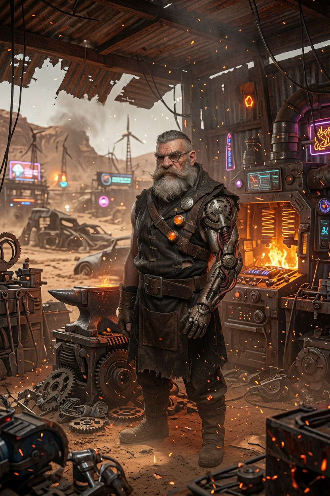

# Tio Gringo — NPC Secundário

**Tipo:** Ferreiro / mentor técnico do Pack  
**Facção / contexto:** Pack Badlands  
**Status:** Ativo

---

## Personalidade

- Coruja avô: resmungão, poucas palavras, prefere **fazer** a ensinar.
- Honesto e respeitoso com quem aprende; bufa mas dá tapinha carinhoso no ombro.
- Orgulhoso da oficina cheia; desconfia que “moleques vão queimar as tendas” (mas fica satisfeito).

## Aparência / voz (rápido)

- Barba branca grande, braço forte marcado pelo ofício; prótese no lugar do braço perdido.
- Arquétipo visual de ferreiro de estrada; trabalhou sozinho na forja muito tempo.

**Imagem de referência:**  

- Retrato: [imagens/Tio_Gringo.jpg](../../imagens/Tio_Gringo.jpg)
- Detalhe do braço/prótese (opcional): [imagens/Tio_Gringo_arm.jpg](../../imagens/Tio_Gringo_arm.jpg)

## Eventos narrativos

| Data (aprox.) | Evento |
| ------------- | ------ |
| Jun/2026 | Ryan foi o primeiro a trabalhar/ser ensinado por ele — amizade base. |
| Jun/2026 | Ryan reforça didática dele na forja sem tirar mérito (perguntas, mínima intervenção). |
| 28/06/2026 | Supervisiona tendas e playground; noite em claro com Ryan no Mule. |
| 02/07/2026 | Reunião com Reyes e Ryan sobre desempenho dos novos recrutas. |
| 03/07/2026 | Alinhamento com Ryan e Rusty; pré-validação do blueprint **Badlands Node v0.1**. |
| 11/07/2026 | Ryan revela projeto **casas modulares** ao time de produção (Warden projeta modelo). |
| 11–13/07/2026 | Mentoria na montagem do protótipo externo com alunos. |
| 14/07/2026 | **Co-liderou apresentação a Reyes** com Valk; alunos explicaram partes. |

## Relação com a crew

- **Ryan:** Alta estima mútua; orgulho do time de produção no protótipo.
- **Valk:** Parceira na apresentação Reyes; cordial no dia a dia.

## Notas para o narrador

- Quase não fala — se Ryan some dois dias, risco de frustração ou expulsar novatos.
- Parceiro natural em projetos de forja, cerca e veículos.

---

## Referências

- [Pack Badlands](../../facoes/pack_badlands.md) · [Downtime Ryan](../../logs/downtime_ryan.md)
- [Sessão 005](../../logs/sessao_resumo_005.md) · [Sessão 007](../../logs/sessao_resumo_007.md) · [Sessão 011](../../logs/sessao_resumo_011.md)
- [Mapa Relacional](../../relacionamentos/mapa_relacional_geral.md)
- Imagens: [Tio_Gringo.jpg](../../imagens/Tio_Gringo.jpg) · [Tio_Gringo_arm.jpg](../../imagens/Tio_Gringo_arm.jpg)
- Pulso: [tio_gringo.md](../../pulso_do_mundo/pack_badlands/tio_gringo.md)
