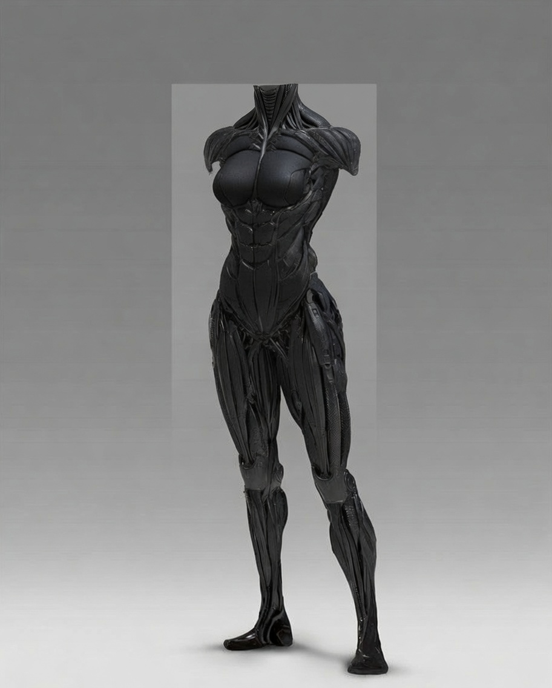
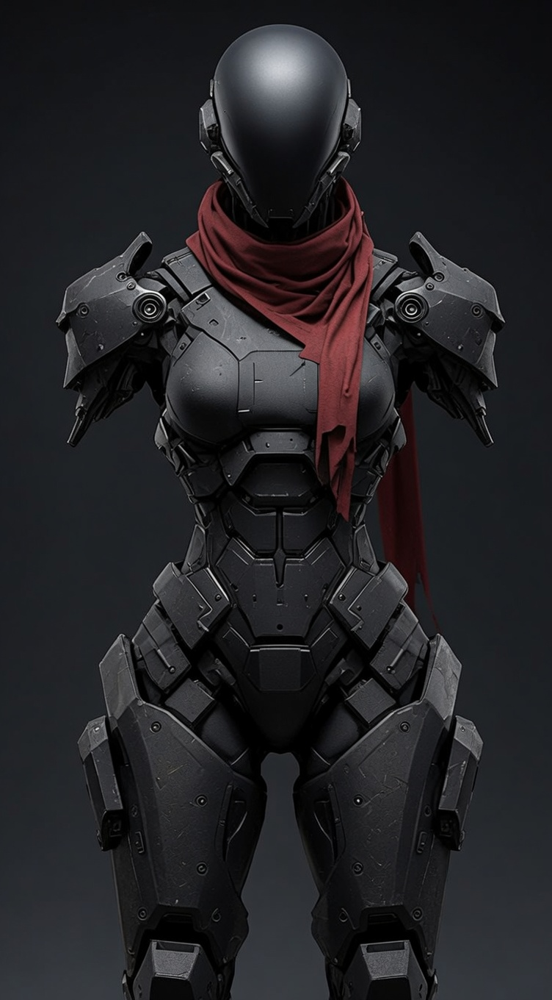
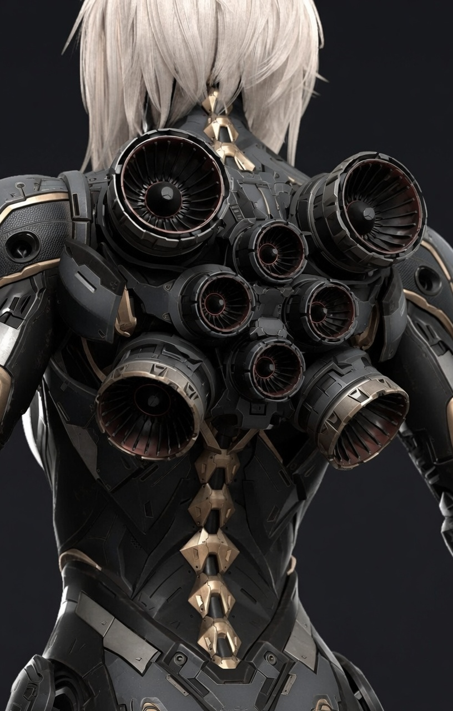

# Projeto de Armadura Custom — Reina “Bearclaw” Morales

> **STATUS: IDEIA FUTURA — NÃO CANÔNICO AINDA**  
> **Não usar em cena** como gear existente.  
> **Não** alterar SP/equipamento da ficha de Reina até o projeto ser **entregue e testado in-fiction**.  
> **Ativar quando:** Ryan em Night City + alguns jobs com a crew + **Reina se machuca de forma grave** (Ryan vê ou não consegue ignorar).  
> Até lá: spec de design + referências visuais para o Narrador.  
> Visuais oficiais: só `reina_armour_1.jpg`, `reina_armour_2.jpg`, `reina_bursts.jpg` — **não** usar `*_base.jpg`.

**Nome protocolar (Ryan):** SYS-BEAR-EXO/T2-041  
_(Apelido ainda não existe. Será dado pela crew ou pela própria Reina depois do primeiro uso em campo.)_

**Filosofia do projeto**  
Projeto pessoal do Ryan. Ele assume total responsabilidade. Não cobra. Compra material do próprio bolso se necessário. Trabalha o tempo que for preciso até ficar pronto antes do próximo job. O job espera.

---

## Quando ativar (pré-condições)

Todas devem ser verdadeiras:

1. Ryan (e preferencialmente Valk) em **Night City**.  
2. Crew com **Reina** em jobs — não no primeiro reencontro.  
3. **Alguns jobs** já feitos juntos (confiança operacional).  
4. **Reina toma dano grave** em job (SP estourado, ferimento sério, quase-KIA, ou “só os braços a salvaram de novo”) — Ryan **vê** ou não ignora.

**Reação esperada de Ryan:** instinto de Techie + proteção → “isso não acontece de novo”. Abre downtime de construção. Stitch cuida do trauma médico; **Ryan** faz o gear (Doc Moreau **não** entra neste projeto).

**Subtexto:** Reina **sabe** que ele fez os cyberarms; a armadura é o segundo presente que ela não pediu — reforça dívida/proteção sem monólogo obrigatório.

**Não fazer cedo:** entregar no reencontro; listar SP deste arquivo na ficha; inventar o ferimento só por meta.

---

## Arco sugerido (fases)

| Fase | Nome | O que acontece | Status deste arquivo |
| ---- | ---- | -------------- | -------------------- |
| 0 | Dormindo | Só spec; sem narrar Reina com a armadura | **IDEIA FUTURA** (agora) |
| 1 | Ferimento | Job; dano grave; Stitch; Ryan decide construir | “Em construção” |
| 2 | Oficina | Downtime: Estágio 1 e/ou 2 | “Em construção” |
| 3 | Entrega | Fitting / primeiro uso ou treino | → **ATIVO / CANÔNICO** |
| 4 | Em campo | Apelido da crew; manutenções | ATIVO + ficha Reina atualizada |

### Critério “pronto” (vira canônico)

Só quando **todas** forem verdade:

- Ryan entrega / Reina veste em cena, **e**  
- Status deste arquivo muda para **ATIVO / CANÔNICO**, **e**  
- Equipamento da ficha Reina é atualizado (Armorjack → Estágio 1 ± 2).

Até lá a ficha permanece com **Light/Medium Armorjack**.

---

## Referências visuais

_(Meta / design até o projeto estar ATIVO. Em cena só após entrega.)_

| Estágio / sistema | Imagem |
| ----------------- | ------ |
| Estágio 1 (catsuit) |  |
| Estágio 2 (exo) |  |
| Bursts principais |  |

---

## Arquitetura em Dois Estágios

### Estágio 1 — Catsuit Reforçado (uso diário)

- Baseado no catsuit que ela já usa, elevado para padrão próximo de Nanosuit.
- Material balístico + placas flexíveis/compósitos integrados.
- Visual: preto fosco, contorno muscular marcado, acabamento tático discreto.
- Cobre: tronco, pernas, pescoço e ombros. **Braços completamente livres**.
- **SP:** Cabeça 11 / Tronco 13 / Pernas 13
- Penalidade situacional apenas:
  - Combate próximo / Brawling → 0
  - Corrida prolongada ou parkour → leve perda de agilidade
- Energia: quase passivo → apenas baterias de alta densidade.
- Contém:
  - Neural Link completo
  - Sensores de dano
  - Biomonitor
  - Pontos de acoplamento reforçados para o Estágio 2
  - **Sistema de Suporte Vital** (desfibrilador + adrenalina e outras drogas de emergência já posicionadas para injeção). Acionamento automático assim que o Biomonitor identifica perigo crítico à vida.
- Pode ser usado por baixo de roupa civil (marca volume e dureza).

### Estágio 2 — Exoesqueleto Acoplável (modo combate)

- Transportado como **maleta grande** (~1 m × 60 cm, 28–32 kg) com alça reforçada.
- Reina carrega a maleta a maior parte do tempo.
- Quando necessário, a maleta se desloca até ela.
- Acoplamento rápido e bruto (pode rasgar roupa externa).
- Cobre: tronco, pernas, ombros e cabeça. **Sem braços**.
- **SP (substitui o Estágio 1 enquanto acoplado):** Cabeça 15 / Tronco 17 / Pernas 16
- Capacete completo e reforçado, modular, com abertura parcial do visor.
- Sistemas do capacete: Realidade Aumentada (HUD limpo), proteção ambiental, perks limitados para não sobrecarregar.

---

## Sistema de Energia (Estágio 2)

- Híbrido e distribuído.
- Cartuchos modulares estilo magazine (material descartável).
- Mecanismo de ejeção idêntico ao de pistola.

**Distribuição:**

- **Costas:** 2 carregadores × 3 cartuchos grandes = 6 principais
- **Coxas:** 1 slot por coxa × 2 cartuchos médios = 4
- **Frente (abaixo dos seios):** 2 slots × 1 cartucho pequeno = 2 auxiliares

**Autonomia estimada:**

- Combate moderado: 45–55 min
- Combate intenso: 25–35 min
- Uso extremo: 12–18 min
- Só Estágio 1: vários dias

**Cartuchos ejetados:**

- Podem ser usados como granada térmica, isca ou termo-punch.
- Alimentam os mini-bursts das pernas.

---

## Sistema de Bursts

**Principais (costas):**

- 2 grandes para baixo
- 2 médios laterais
- 2 menores para trás
- Possibilidade de redirecionamento parcial para frente

**Mini-bursts das pernas:**

- Ativação: Neural Link + leitura sináptica + estado biométrico + aprendizado do estilo Bearclaw.
- Efeito: chute-foguete (**+2d6** ou mais).
- Consumo: 1/3 do cartucho da coxa correspondente.

---

## Comportamento da Maleta

- Deve permanecer no mesmo ambiente que a Reina.
- Quando solta, abre rodas laterais e se desloca até ficar no campo de visão ou próxima dela.
- Com comando: pode se encostar em parede e ficar inerte.
- Hierarquia de retorno:
  1. Reina
  2. The Mule
  3. Ponto seguro pré-definido (safe-house/casa)
- Para Mule ou ponto seguro a longa distância: ativa bursts em modo voo baixo.
- Tentativa de roubo (progressiva):
  1. Aviso sonoro
  2. Descarga elétrica + fumaça
  3. Termo-Punch + efeito moral
- Em todos os casos tenta retornar pela hierarquia.
- Se nenhuma opção de retorno for possível → **autodestruição**.

---

## Inteligência e Integração

- Base de programação derivada do Warden.
- Gateway de comunicação: Neural Link.
- Os cyberarms descobrem o serviço da armadura e iniciam comunicação automaticamente.
- A armadura é **submissa aos braços**.
- Aprende o estilo de combate junto com os braços e compensa para favorecê-lo.
- Trata os cyberarms como se fossem a própria Reina (protege ativamente, mas permanece submissa).
- Eco narrativo: braços feitos por Ryan (ela sabe; ele não lembra) + armadura como segundo ato de cuidado.

---

## Protocolos de Dano e Emergência (Estágio 2)

1. Monitoramento contínuo de integridade.
2. Se estiver mais atrapalhando do que ajudando → aviso + desacoplamento forçado.
3. Fora do corpo tenta se fechar novamente.
4. Se impossível se fechar → comprime e inicia autodestruição controlada.

---

## Manutenção

**Estágio 2**

- Resistente. Manutenção pesada só em caso de dano.
- Rotina: 15 dias no início → depois 1× por mês (ou quando Reina pedir).
- Troca de cartucho em combate: 1 turno por cartucho (pode fazer 2 ao mesmo tempo). Sistema gerencia o resto automaticamente com reserva interna.

**Estágio 1**

- Tratado como Heavy Armorjack bem feito.
- Limpeza: a própria Reina.
- Manutenção técnica: Ryan resolve rápido.
- Troca de baterias: on the fly (puxa e coloca outra).

Qualquer coisa mais complexa → Ryan resolve.

---

## Referências

- [Ficha Reina](solo%20-%20reina_bearclaw_morales.md) — equipamento atual **sem** este projeto
- [Relacionamentos Reina](../relacionamentos/reina_bearclaw_morales_relacionamentos.md) · [Ryan](../relacionamentos/ryan_relacionamentos.md)
- Imagens: `imagens/reina/reina_armour_1.jpg` · `reina_armour_2.jpg` · `reina_bursts.jpg`

---

**Fim da consolidação.** · Status vigente: **IDEIA FUTURA**
