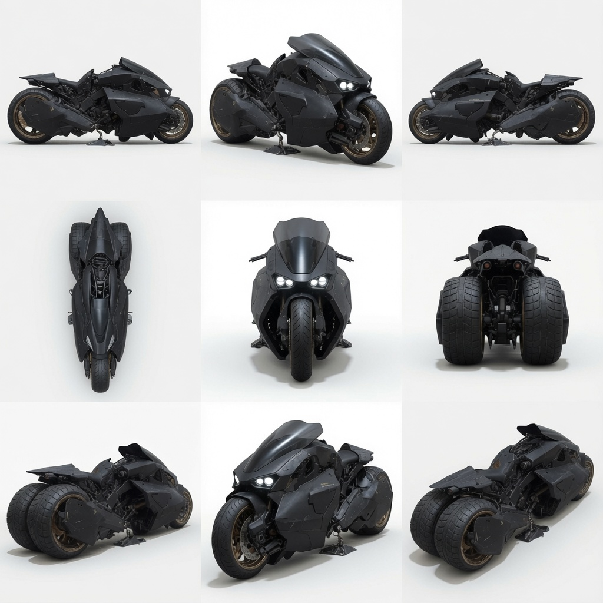

# Projeto de Moto Custom — Reina “Bearclaw” Morales

> **STATUS: IDEIA FUTURA — NÃO CANÔNICO AINDA**  
> **Não usar em cena** como veículo existente.  
> **Não** listar esta moto na ficha de Reina até o projeto ser **entregue e testado in-fiction**.  
> **Ativar quando:** Reina aparece na oficina pedindo upgrades + Ryan modifica + entrega in-fiction.  
> Até lá: spec de design + referência visual para o Narrador.  
> Visual oficial: `imagens/reina/bike9.jpg` (sheet multi-ângulo). Outras `bike*.jpg` em `imagens/reina/` são rascunhos — **não** preferir sobre `bike9`.

**Contexto:** Ryan modifica a moto dela após ela aparecer na oficina pedindo upgrades. O diálogo de entrada já foi esboçado.  
**Filosofia:** A moto é para chegar e sair. O Mule continua sendo a plataforma pesada de missão.

---

## Referência visual

_(Meta / design até o projeto estar ATIVO. Em cena só após entrega.)_

---

## Visual e Estrutura Geral

- Moto pesada, horizontal, visual **brutalista e industrial** (ver sheet acima).
- Acabamento preto fosco com poucos detalhes em cinza escuro / metal escovado.
- **Duas rodas traseiras largas** em eixos independentes + uma roda dianteira larga.
- Postura alongada o suficiente para acomodar uma piloto de 1,92 m sem parecer pequena sob ela.
- Não é esportiva leve. É uma máquina que transmite peso, estabilidade e capacidade de aguentar porrada.
- **Para-brisa / escudo frontal grande** no estilo Kaneda (Akira): angular, reforçado e alto o suficiente para ela se abaixar e usá-lo como proteção de tronco.

---

## Sistema de Rodas Traseiras + Banco

- Cada roda traseira permanece no **seu próprio eixo**.
- Sistema mecânico simples controlado por sensor de velocidade + parafuso/eixo de comando:

| Situação                  | Rodas traseiras | Altura do banco | Postura da piloto      |
| ------------------------- | --------------- | --------------- | ---------------------- |
| Parada / baixa velocidade | Se aproximam    | Sobe            | Mais ereta / sentada   |
| Alta velocidade           | Se afastam      | Desce           | Força maior inclinação |

- Transição progressiva e suave.
- Objetivo: estabilidade em baixa velocidade + melhor comportamento em curva em alta velocidade.

---

## Motorização (Híbrida em dois estágios)

- **Motor elétrico de alto torque**: saída, manobras lentas e controle fino.
- **Motor principal de alta capacidade**: entra conforme a demanda aumenta.
- Transição gerenciada pela moto com base em leitura de intenção + velocidade.

---

## Controle

**Camada principal:** Neural Link

- Aceleração, freio, altura do banco, abertura das rodas, placas de proteção e transição dos motores respondem à intenção em tempo real.

**Camada de segurança:** Controles mecânicos físicos sempre presentes como backup.

A moto também pode se mover de forma semi-autônoma ou receber comandos remotos se necessário (aproximar, reposicionar, etc.), sempre com a possibilidade de a Reina retomar o controle imediatamente.

---

## Freios

- Sistema híbrido nos três pontos (duas traseiras + dianteira).
- Acionamento progressivo:
  1. Primeiro as rodas traseiras
  2. Depois a dianteira (com mais pressão)
- Assistido por Neural Link + backup mecânico/hidráulico.
- Possibilidade de comando simplificado para manter as mãos mais livres.

---

## Proteção

- Placas móveis que se fecham ao redor do corpo (especialmente flancos e pernas), formando proteção parcial.
- **Requisito absoluto:** fácil de abrir/sair por dentro. Em caso de queda ou necessidade de ejeção, a Reina consegue sair sem ficar presa.
- O para-brisa grande funciona como escudo frontal quando ela se abaixa.

---

## Proteção Ativa e Armamento

**Filosofia:** A moto é para chegar e sair. O Mule continua sendo a plataforma pesada de missão. Armamento é secundário — melhor ter e não precisar do que precisar e não ter.

### Sistemas de dissuasão / fuga

- Cortina de fumaça (traseira e laterais)
- Óleo / fluido escorregadio (traseira)
- Spike strips / caltrops (ejetáveis para trás)
- Possível descarga elétrica de contato nas placas e chassi
- Sensoriamento e alerta de aproximação (via Neural Link)

### Armamento

- Dois hardpoints laterais sob a carenagem (um de cada lado).
- Cada hardpoint recebe uma **pistola pesada** (ou arma de porte equivalente).
- As armas ficam recolhidas/protegidas e podem ser extraídas para coldres na cintura (traseira ou próximo das costelas).
- Enquanto montadas na moto: mira ajustada por intenção via Neural Link (pequenas correções de ângulo), permitindo alguns disparos para frente e para trás.
- Quando ela desmonta: as armas vão com ela.

---

## Acoplamento da Armadura (Estágio 2)

- Suporte tipo **cauda baixa**, posicionando a maleta quase entre as duas rodas traseiras.
- Aproveita o formato plano da maleta.
- Mantém a silhueta limpa, o centro de gravidade baixo e o visual intencional.
- Respeita o movimento de abertura/fechamento das rodas e permite desacoplamento rápido.

---

## Filosofia Geral (Ryan)

- Soluções mecânicas robustas sempre que possível.
- Inteligência (Neural Link + aprendizado) por cima, nunca no lugar do backup físico.
- Proteção real sem criar armadilha.
- A moto deve se adaptar ao estilo da Reina com o tempo (calibração + aprendizado).
- Tudo pensado para ela chegar, resolver e sair — não para travar combate prolongado em cima da máquina.

---

## Referências

- [Ficha Reina](solo%20-%20reina_bearclaw_morales.md) — equipamento/veículo atual **sem** este projeto
- [Projeto de armadura](reina_armour_project.md) — acoplamento da maleta (Estágio 2) na cauda da moto
- [Relacionamentos Reina](../relacionamentos/reina_bearclaw_morales_relacionamentos.md) · [Ryan](../relacionamentos/ryan_relacionamentos.md)
- Visual oficial: `imagens/reina/bike9.jpg`

---

**Fim da consolidação da moto.** · Status vigente: **IDEIA FUTURA**
