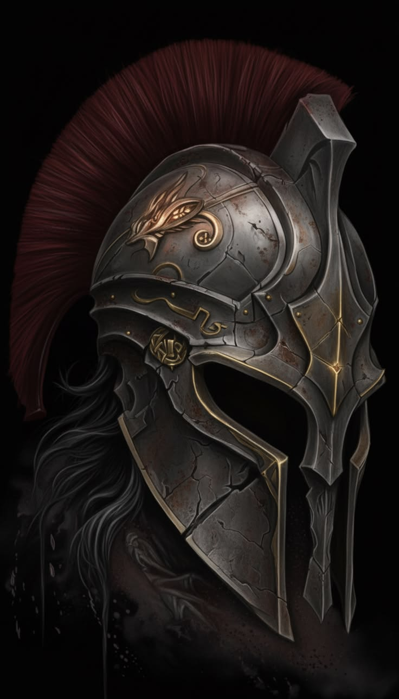

# Leopold von und zu Habsbrück

> **F23:** Rockerboy da **crew** em Night City. Handle público = **Prometheus**. **Não** está no Pack. Casa **Habsbrück** ≠ chama da parede. ≠ Echo.

**Role:** Rockerboy (Charismatic Impact **6**)  
**Idade:** 21  
**Civil:** Leopold von und zu Habsbrück  
**Amigos / família:** Leo  
**Handle / persona:** **Prometheus**  
**Na rua:** o público conhece Prometheus, não Leopold.  
**Conceito:** Herdeiro que virou voz de rua. Não é estrela de arena — é presença urbana. Grafite, vídeos curtos de máscara, denúncia. A Role é influência, não guitarra.

**Descrição visual:** Magro, 21 anos, pele clara. Cabelo vermelho bagunçado (Techhair) com franja no olho. Delineador preto, sorriso de canto. Moletom preto com spikes por baixo de jaqueta de couro vermelha/preta, camisa preta aberta, luvas sem dedos, dois cintos, spray nas duas mãos. A crew vê **este rosto**. No feed: **espartana** (Prometheus) ou **caveira** (kit Void List — ele perdeu a discussão). Chrome visível = só fashionware.

### Presença física (narrador)

| Campo | Valor |
| ----- | ----- |
| **Altura** | **~1,72 m** |
| **Build** | Magro / street — ombro estreito, sem academia. BODY 5. Não compete com ninguém em porte. |
| **Nota** | Homem mais baixo da crew. Acima de Stitch (~1,70) e Alex (~1,68); abaixo de Valk (~1,75) e **Kaz (~1,78)**; Ryan (1,85) cobre ele na fila. Echo (~1,60) ainda é menor. A presença dele não é altura — é a chama e a voz. |

**Presença (prosa, antes da tabela):** Leopold não enche a porta. Entra como quem vai pichar e já está olhando a parede. No grupo dos altos (Reina, Jax, Ryan) some um pouco; quando a máscara sobe ou o spray chia, a sala vira para ele. Kaz olha de cima. Ryan olha de mais cima. Echo é a única que ainda precisa levantar o queixo.

## Aparência

Leopold não quer que as pessoas procurem o filho de um chairman. Quer que procurem a **chama**.

A máscara **Prometheus** é o elmo espartano (fechado, pano escuro por baixo — some cabelo vermelho, pele, Techhair). Fora da câmera, o retrato acima é o que a crew vê. Cabelo e roupa saíram do molde corporativo na adolescência e ficaram na rua. Come comida de rua. Fora da câmera pode parecer um cara bastante normal; na parede / no feed da causa, a persona é Prometheus.

### Marca — Prometheus

**Símbolo:** chama estilizada de **três linhas grossas** (base larga, centro em espiral/ponta, laterais curvadas para dentro). Sem letra, sem “P” escondido. Qualquer um reproduz com spray em segundos. De longe é fogo; de perto é *aquela* chama.

**Slogan (muro, ao lado da chama — não dentro):** **O FOGO NÃO É DELES.**

**Vídeo (agora, 21 anos):**
- **Abre:** “O fogo não é deles.”
- **Pode fechar:** “Eu não estou pedindo uma revolução. Estou perguntando por que a de vocês precisa de autorização.”

**Não** é o brasão Habsbrück (ponte / coroa / chaves). **Não** gravar a chama no elmo — a chama é parede.

### Máscaras (gear — transmissão)

| Máscara | Quando | No feed |
| ------- | ------ | ------- |
| **Espartana** (fechada + pano escuro) | Job **relevante para ele transmitir que está fazendo** — a mensagem é dele, e ainda é job da crew | Ele **é** Prometheus. Nome não muda. |
| **Caveira** (kit da crew; **ele repinta a cada job**) | Default de transmissão; **jobs mais perigosos**; quando perde a discussão com a Echo | Echo chama de apelido pejorativo / qualquer coisa. Nunca Prometheus. |

A pentelhação dele fez o kit da crew virar caveira. A pintura muda todo job — silhueta igual, tinta nova, não vira logo fixa. Echo odeia o visual e troca o **dela** com frequência. O resto da crew não se importa com o design, só com o rosto oculto.

**Discussão em cena:** caveira ou espartana. SOP: [echo_exposicao.md](../sistema/echo_exposicao.md) §7.1.

---

## Background (mini)

**Nota completa (narrador):** [leopold_habsbruck_background.md](notas_narrador/leopold_habsbruck_background.md) — backstory ≠ mesa; **não** despejar teia Habsbrück / avó / job do Kaz / semanas Zoners no Pack.

Infância de chairman: educação de executivo, porta que abre pelo sobrenome. Ruptura na adolescência.

**Antes de Prometheus:** viu seguranças de corp extorquindo um negócio em South Night City. Entrou com o **nome da família**, sem arma, sem plano. Os seguranças pausaram para descobrir se Habsbrück mandava ali (não mandava). Chegaram os **Zoners** da célula local. Briga. Leo se escondeu, apanhou. Um Zoner reconheceu o Habsbrück. O líder — carismático, educado, líder de comunidade — levou o garoto consigo. Semanas: trabalho braçal (comunidade e operações), arma na mão no fundo da cena, sempre ao lado daquele homem. Volta **sem resgate hollywoodiano**: uma ligação, um carro de terno, caixas no porta-malas, quarto, silêncio.

**Prometheus nasce no quarto.** Máscara, chama, vídeos. Anos seguintes: relativamente famoso na rua. A chama circula. Ele acha que fala com conhecimento de causa.

**O que ele acredita:** fugiu, vive por conta, aprendeu o que é lutar, construiu a própria voz.

**Estado de cena:** off-screen em NC. Sem beat no Pack. Segundo encontro com Zoners / resgate da crew = **parked**.

---

## Personalidade

Fora da câmera, não é rebelde 24/7. A birra adolescente virou convicção. Gosta de acompanhar operações. Gosta de estar onde as coisas acontecem. Se há parede e história, dificilmente ignora.

**Falha:** confunde a importância da própria mensagem com a importância para o público. Aprendizado (ainda incompleto): *preciso encontrar o público certo.*

Ninguém manda nele. Influência ≠ disponibilidade. Se desaparecer tempo demais, a crew vai buscá-lo.

Quando entra em modo de trabalho, pinta e fala. Não é Solo. Pode segurar uma arma; a Role é fazer gente ouvir e agir.

**Frase-âncora (muro / abre o vídeo):** “O fogo não é deles.”  
**Fecha o vídeo (quando a cena pede):** “Eu não estou pedindo uma revolução. Estou perguntando por que a de vocês precisa de autorização.”  
**Civil (se encurralado):** “Leo.”  
**Se alguém da rua reconhece a chama:** “Espera… você é o Prometheus?”

**Baseline vs agora (narrador):** o parágrafo público é o default. Ele **não está na mesa**. **Não** bootar teia Habsbrück, avó, job do Kaz, líder Zoner, nem grafite no Pack.

---

## Atributos (62 pontos)

Infância de chairman (INT / Education / Business) + anos Prometheus (COOL / EMP). BODY de quem apanhou e carregou caixa, não de Solo.

| Atributo | Valor |
| -------- | ----- |
| INT      | 8     |
| REF      | 6     |
| DEX      | 6     |
| TECH     | 5     |
| COOL     | 8     |
| WILL     | 6     |
| LUCK     | 4     |
| MOVE     | 6     |
| BODY     | 5     |
| EMP      | 8     |

**HP Total:** 35  
**Seriously Wounded:** 18  
**Death Save:** BODY 5  
**EMP atual:** 8  
**Humanidade base:** 80 · **HL:** 0 (só fashionware) · **Humanidade atual:** 80

`HP = 10 + 5 × floor((BODY + WILL) / 2)` → floor(11/2)=5 → 35.

---

## Role Ability: Rockerboy (Charismatic Impact 6)

Presença urbana em Night City. As pessoas procuram a chama; copiam o símbolo; alguns aparecem se ele pedir. **Não** é plateia de arena. ≠ Credibility da Echo (ela verifica e corta; ele mobiliza).

**Em mesa:** [07_roles.md](../sistema/regras_red/07_roles.md). Off-screen até NC.

---

## Skills (100 pts; CI à parte)

Padrão da crew = 86. **+14** da infância de chairman + semanas Zoners + anos Prometheus. Linguagens livres.

| Skill | Nível | Skill | Nível |
| ----- | ----- | ----- | ----- |
| Persuasion | 8 | Education | 7 |
| Composition | 7 | Streetwise | 7 |
| Human Perception | 7 | Conversation | 6 |
| Acting | 6 | Athletics | 6 |
| Stealth | 6 | Wardrobe & Style | 6 |
| Perception | 6 | Business | 5 |
| Local Expert (Night City) | 5 | Evasion | 5 |
| Library Search | 4 | Endurance | 3 |
| Concentration | 3 | Handgun | 3 |

**Linguagens (livres):** Streetslang 4 · Inglês 4 · Alemão (casa) 4.

Composition cobre discurso, vídeo **e** a chama na parede. Handgun 3 = segurou arma no fundo da operação; não é atirador.

---

## Cyberware (estético)

Sem chrome de combate, sem Kiroshi, sem neural de ofício. O que se vê é fashionware. A máscara é **gear**, não implante.

| Cyberware | HL | Origem / efeito |
| --------- | -- | --------------- |
| Light Tattoo | 0 | Estética de rua. **Não** é a chama pública (essa é tinta). |
| Techhair | 0 | O visual que ele escolheu depois do molde corporativo. |
| Chemskin | 0 | Leo no cotidiano / Prometheus na câmera. |
| Shift tacts | 0 | Olhos da persona vs. o garoto. |
| Biomonitor | 0 | Relíquia de família; ele mal registra que está lá. |

**Total Humanity Loss:** 0 | **EMP atual:** 8 | **Humanidade:** 80

---

## Gear

- Elmo **espartano** Prometheus (fechado + pano escuro) — persona
- Kit **caveira** de transmissão (Ryan fabricou; Leo **repinta a cada job**)
- Spray (várias latas) + stencil da chama de três linhas
- Câmera + Agent
- Streetwear
- Medium Pistol (sabe onde está o gatilho; não é o plano)

**Filosofia de combate:** pintar, falar, sair. Se houver tiro, ele não é a linha de frente.

---

## Relação com a crew

A presença dele começou menos ideológica do que ele gostaria de admitir. Kaz conhece a origem e as semanas. O acordo visível para Leopold: está na crew, acompanha jobs, é útil.

**Emilia "Echo" Rivera:** ela procura a história; ele procura o impacto. Ela registra; ele provoca. Megafone + arquivo — Roles diferentes.  
**Ryan:** trata o “grande revolucionário” como mais um cara que precisa parar de atrapalhar enquanto ele trabalha — e mesmo assim respeita quem sobe à parede.  
**Alex:** núcleo avoado com Echo (motivos diferentes). Eixo Ryan / Valkirya / Reina é o pragmático.

Detalhe: [nota](notas_narrador/leopold_habsbruck_background.md) · [relacionamentos](../relacionamentos/leopold_habsbruck_relacionamentos.md) · [crew](../relacionamentos/crew_relacionamentos.md).

---

## Parked (não fecha a ficha)

- Segundo encontro com os Zoners / resgate da crew.
- **Sem** nome do líder Zoner. **Sem** nome da crew por enquanto.
- **Mais tarde na vida (não agora):** “EU SÓ ANUNCIO, chooms. Estou só iluminando o caminho. A revolução é de vocês.” — ver nota. Não usar aos 21.

Notas pontuais: [ideas_concepts/rockerboy_added_story.md](../ideas_concepts/rockerboy_added_story.md) (esvaziar depois de integrar).

---

## Referências

- **Background (narrador):** [leopold_habsbruck_background.md](notas_narrador/leopold_habsbruck_background.md)
- **Relacionamentos:** [leopold_habsbruck_relacionamentos.md](../relacionamentos/leopold_habsbruck_relacionamentos.md)
- [Mapa](../relacionamentos/mapa_relacional_geral.md) · [Crew](../relacionamentos/crew_relacionamentos.md) · [Ryan](../relacionamentos/ryan_relacionamentos.md)
- **Pulso (NC / futuro):** [leopold.md](../pulso_do_mundo/crew/leopold.md)
- **Retrato:** [rockerboy - leopold_prometheus_habsbruck.png](../imagens/rockerboy%20-%20leopold_prometheus_habsbruck.png)
- **Símbolo:** [prometheus_flame.jpg](../imagens/leopold/prometheus_flame.jpg)
- **Espartana:** [prometheus_espartana.jpg](../imagens/leopold/prometheus_espartana.jpg) · **Caveira:** [transmissao_caveira.jpg](../imagens/crew/transmissao_caveira.jpg)
- **SOP transmissão:** [echo_exposicao.md](../sistema/echo_exposicao.md) §7.1
- **Estado:** [Board](../board/board_campanha.md) · **F06** · **F23**
