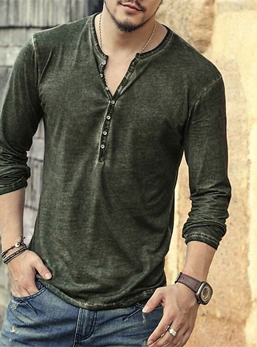
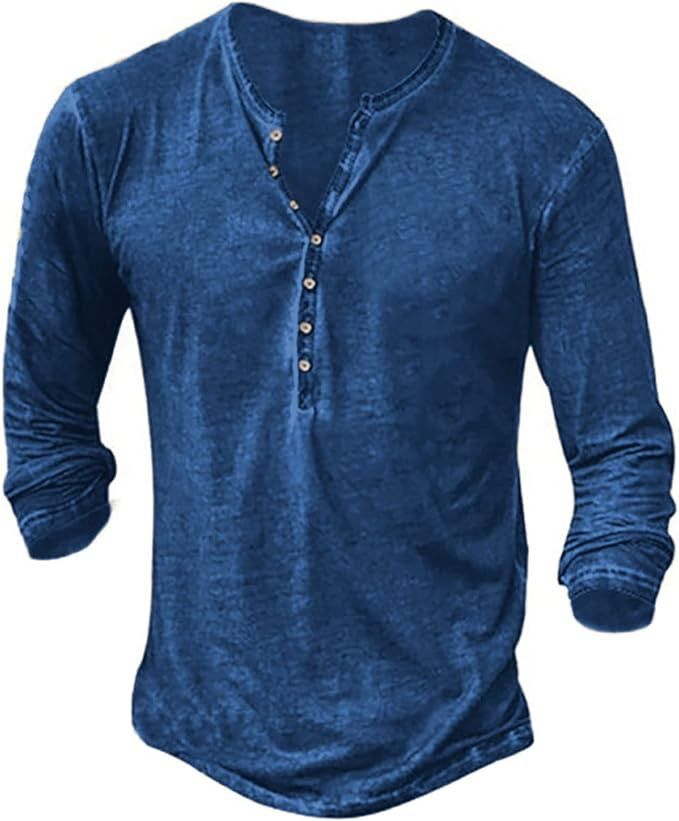
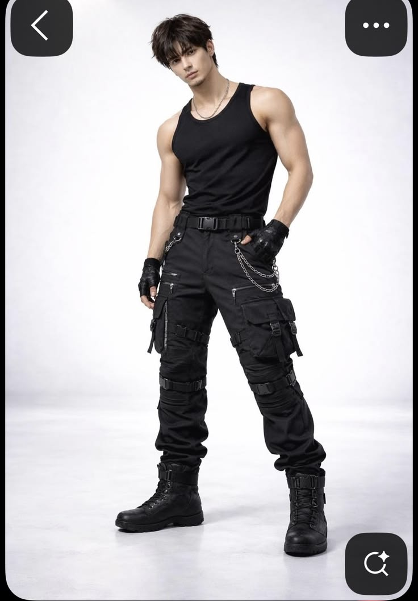
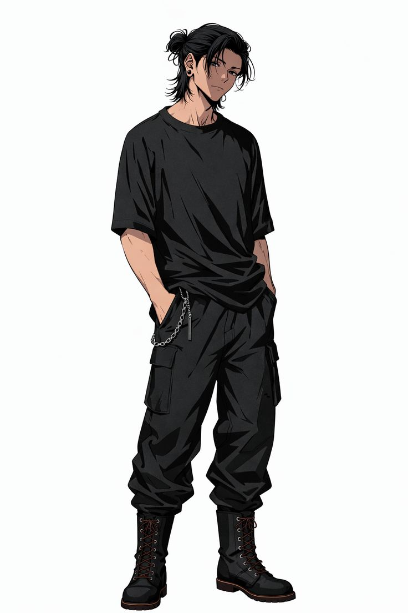
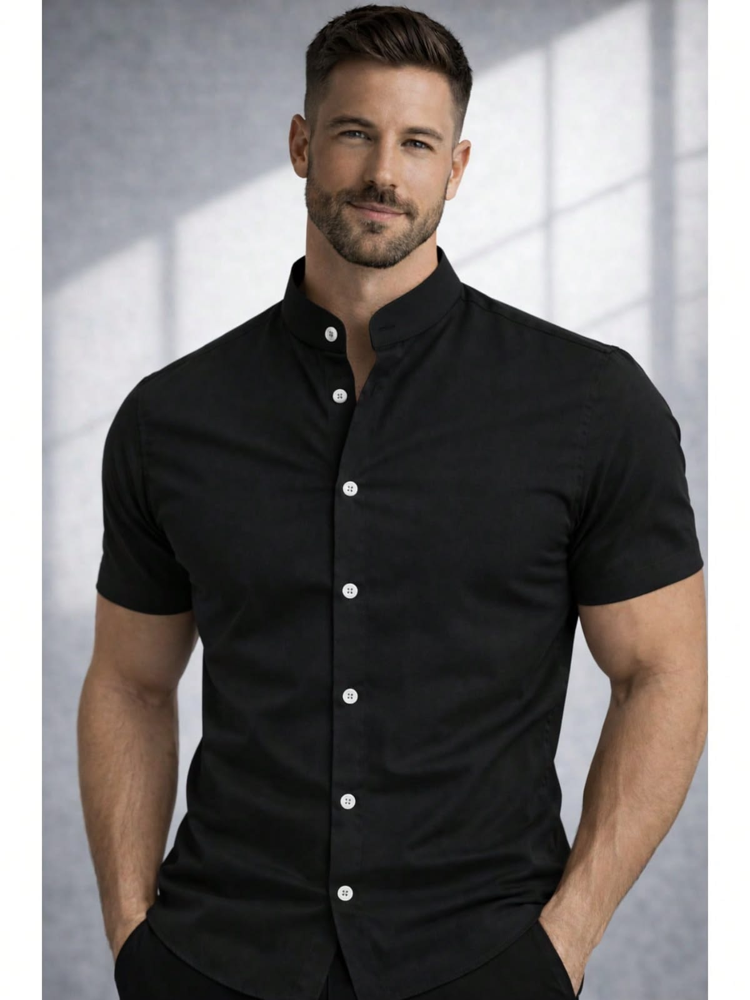
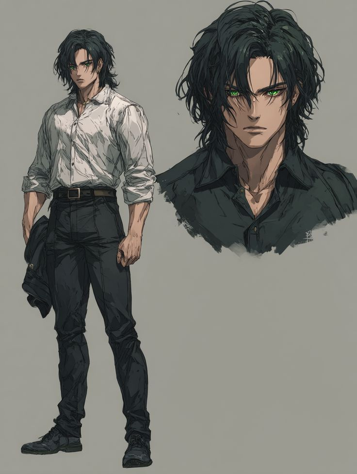
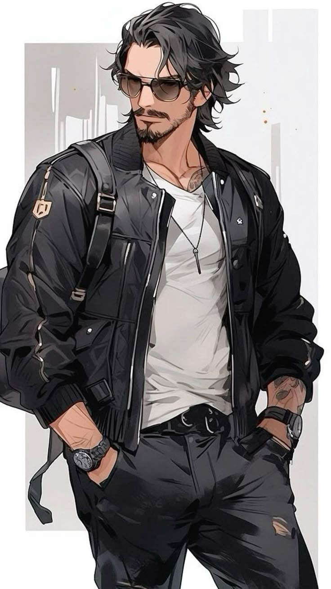
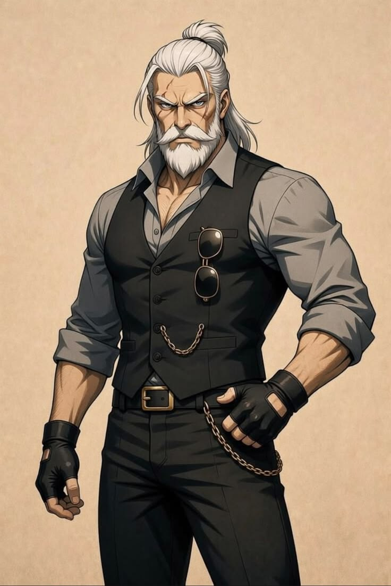
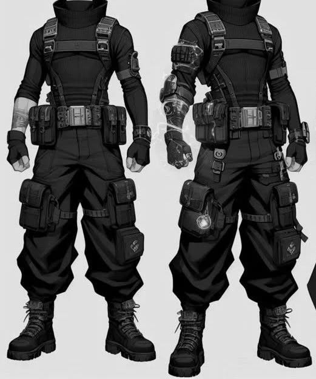
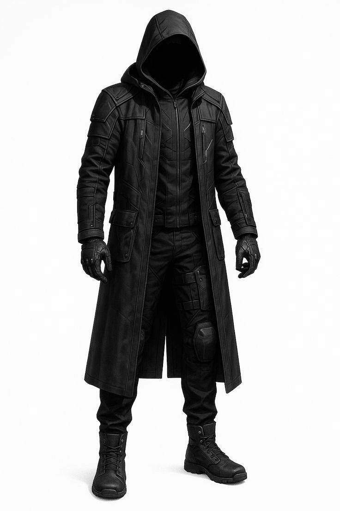

# Guarda-Roupa de Ryan Wireghost Voss

**Ficha mecânica:** [techie - ryan_wireghost_voss.md](techie%20-%20ryan_wireghost_voss.md)  
**Pasta de imagens:** [imagens/ryan/guarda_roupas/](../imagens/ryan/guarda_roupas/)

> **Filosofia**
>
> Ryan não liga para moda. Ele compra roupas como compra ferramentas:
> **"Funciona? É confortável? Aguenta trabalho? Então serve."**
>
> É comum comprar roupas em promoção, especialmente pacotes.
>
> Exemplo:
> - 7 Henleys por um preço promocional.
> - Várias cores diferentes.
> - Algumas (vinho, branca...) praticamente nunca são usadas, mas vieram no pacote.
>
> Já Valk enxerga roupas de outra forma. Aos poucos ela vai substituindo peças, escolhendo roupas para ocasiões especiais e montando um segundo guarda-roupa para Night City.
>
> Ryan nunca discute.
>
> > "Se você gosta... eu gosto."
>
> ou
>
> > "Você fica feliz quando eu uso."

**Nota sobre as imagens:** as refs de `guarda_roupas/` são **catálogo de roupa** (corte, cor, vibe). Cabelo/rosto do modelo da foto **não** substituem o Ryan canônico (cabelo prata/branco, ficha tática e daily_clothes).

---

## Índice rápido

| Contexto | Ocasião | Arquivo | Retrato canônico (ficha) |
| -------- | ------- | ------- | ------------------------ |
| Badlands | Oficina (padrão) | `henley2.jpg` | [daily_clothes](../imagens/techie%20-%20ryan_wireghost_voss_daily_clothes.png) |
| Badlands | Oficina (calor extremo) | `henley1.jpg` | — |
| Badlands | Trabalho pesado | `worker.jpg` | — |
| Badlands | Pós-expediente | `casual+botas.jpg` | — |
| Badlands | Jantar do Pack | `camisa_gola_padre.jpg` | — |
| Night City | Casa | `casual+botas.jpg` | — |
| Night City | Treino (Reina) | `worker.jpg` | — |
| Night City | Casual limpo / semi-saída | `casual.jpg` | — |
| Night City | Street / deslocamento | `street_style.jpg` | — |
| Night City | Cliente comum | `camisa_gola_padre.jpg` | — |
| Night City | Cliente corporativo | `great_style.jpg` | — |
| Night City | Evento formal | `great_style.jpg` | — |
| Wireghost | Operação rápida | `quick_operator.jpg` | [tático](../imagens/techie%20-%20ryan_wireghost_voss.jpg) |
| Wireghost | Operação completa | `stealth_operator.jpg` | [tático](../imagens/techie%20-%20ryan_wireghost_voss.jpg) |

### Retratos canônicos da ficha (não substituem o catálogo)

| Uso | Arquivo |
| --- | ------- |
| Tático / operador (Warden + Vespas) | [techie - ryan_wireghost_voss.jpg](../imagens/techie%20-%20ryan_wireghost_voss.jpg) |
| Dia a dia / oficina (full-body) | [techie - ryan_wireghost_voss_daily_clothes.png](../imagens/techie%20-%20ryan_wireghost_voss_daily_clothes.png) |

**Narração:** em job/scav/combate → tático ou Wireghost abaixo. Em pack/oficina → henleys / daily_clothes.

---

# BADLANDS

## Oficina (Padrão)

**Referência:** `henley2.jpg`

A roupa que Ryan usa praticamente todos os dias.

### Descrição visual

- **Henley** manga longa, tecido macio desbotado (verde-oliva / musgo / grafite lavado).
- Decote em V com **fileira de botões** (cerca de 5–7); 2–3 abertos no peito.
- Mangas **enroladas até o antebraço**.
- **Jeans** ou cargo desgastado; cinto simples.
- Relógio de pulseira de couro; corrente fina no pescoço (opcional).
- Aparência de peça “já usada mil vezes”, não de loja.

### No personagem

- Cinto utilitário e ferramentas por perto.
- Óculos de proteção na gola quando está na forja.
- Graxa e manchas inevitáveis.

Essa roupa nunca foi escolhida para ficar bonita.

Aconteceu.

---

## Oficina (Calor extremo)

**Referência:** `henley1.jpg`

Mesma lógica da henley padrão — só que no limite do conforto térmico.

### Descrição visual

- **Henley** manga ¾ ou longa, tom **azul índigo / denim lavado** (ou grafite suado).
- Tecido enrugado, aspecto “lavado e esmagado”.
- Botões mais abertos; decote mais profundo.
- Mangas mais altas no braço.
- Suor, cabelo bagunçado (no Ryan: prata bagunçado, não penteado).

É justamente essa versão que costuma chamar atenção das garotas do Pack.

Ryan nunca percebe.

---

## Trabalho Pesado

**Referência:** `worker.jpg`

Quando sabe que vai passar o dia carregando peso, soldando ou no treino bruto.

### Descrição visual

- **Regata / tank** preta justa (ombro e braço à mostra).
- **Cargo tática preta** com muitos bolsos, zíperes e reforços nas coxas/joelhos.
- Cinto largo com fivela plástica; **corrente** de metal no quadril (opcional).
- **Luvas fingerless** pretas; botas de combate altas com cadarço.
- Corrente fina no pescoço.
- Silhueta magra/funcional — zero tecido solto que prenda em máquina.

Visual extremamente funcional. Para treino com Reina: mesma base, sem corrente se atrapalhar o movimento; trocar botas por tênis de treino se for ginástica.

---

## Pós-expediente

**Referência:** `casual+botas.jpg`

Depois do banho. Primeira roupa limpa encontrada.

### Descrição visual

- **Camiseta oversized preta** (manga curta, caimento largo).
- **Cargo preta** volumosa, bolsos laterais, pernas largas (quase joggers).
- **Botas militares pretas** altas, cadarço cruzado, sola robusta.
- Corrente de carteira prateada no bolso (opcional).
- Postura descontraída: mãos nos bolsos, zero formalidade.

Usada para:

- refeitório;
- fogueira;
- conversar com o Pack;
- descansar.

---

## Jantar do Pack

**Referência:** `camisa_gola_padre.jpg`

Quando Valk quer que ele pareça um pouco mais apresentável.

### Descrição visual

- **Camisa gola padre (mandarim)** preta ou grafite, manga curta ou manga longa dobrada.
- Tecido liso, botões claros contrastando com o tecido escuro.
- Corte justo no tronco sem parecer social de escritório.
- Calça escura limpa; botas limpas (não as da solda).
- Sem gravata, sem blazer — só “menos graxa que o normal”.

Ryan acha confortável.

Valk acha lindo.

---

# NIGHT CITY

## Casa

**Referência:** `casual+botas.jpg`

A roupa mais "Ryan" possível em apartamento / oficina caseira.

### Descrição visual

- Mesma base do **pós-expediente**: oversized preta + cargo larga.
- Em casa: pode trocar botas por **meias + chinelo ou tênis**.
- Ideal para programar, montar drones, café, mexer em chrome no chão.

---

## Casual limpo (semi-saída)

**Referência:** `casual.jpg`

Quando precisa sair sem parecer “acabou de sair da forja”, mas ainda sem o kit Valk de cliente.

### Descrição visual

- **Camisa branca de botão**, levemente amarrotada (não engomada), mangas dobradas no cotovelo.
- Decote aberto nos primeiros botões; tecido fino o bastante para marcar o peito sem ser formal.
- **Calça preta** justa/reta, cinto marrom ou preto simples.
- **Sapatos/tênis pretos** baixos e limpos.
- Jaqueta preta leve **na mão** ou no ombro (não vestida o tempo todo).
- Variação: mesma silhueta com **camisa preta** fechada até o peito.

### Uso

- Café com contato; loja de peças; caminhada em Watson sem chamar heat.
- Vibe: “engenheiro de folga”, não “corpo de elite”.

---

## Street / deslocamento

**Referência:** `street_style.jpg`

Deslocamento em Night City com cara de edgerunner discreto — sem armar o kit Wireghost completo.

### Descrição visual

- **Bomber / jaqueta preta** com bolsos frontais, zíperes e ombros estruturados; aberta.
- **Camiseta branca** básica por baixo.
- **Calça preta** (rasgo leve no joelho opcional), cinto com fivela metálica.
- **Mochila ou bag de ombro** preta (ferramentas leves, datapad, kit de campo).
- **Óculos escuros**; corrente fina no pescoço; relógio no pulso.
- Mãos nos bolsos; postura confiante, street, não “corpo tático”.

### Uso

- Rua, metrô, ponto de encontro com Kaz, reconhecimento visual sem máscara.
- Meio-termo entre casual limpo e operação rápida.

---

## Treino (Reina)

**Referência:** `worker.jpg`

Tudo pensado para movimento.

### Descrição visual

- Regata preta dry-fit + cargo elástica preta (mesma família do trabalho pesado).
- Tênis de treino no lugar das botas de combate, se for dojo/quadra.
- Sem mochila, sem corrente se atrapalhar; luvas opcionais.

Nada pode atrapalhar.

---

## Cliente comum

**Referência:** `camisa_gola_padre.jpg`

Primeiro nível do guarda-roupa montado pela Valk.

### Descrição visual

- Camisa gola padre preta/grafite (ver Jantar do Pack).
- Calça escura reta; botas de couro limpas (não de solda).
- Relógio simples; barba aparada se Valk insistir.

Visual:

> "Engenheiro extremamente competente."

---

## Cliente Corporativo

**Referência:** `great_style.jpg`

A roupa que Valk faz questão que ele use.

### Descrição visual

- **Camisa cinza** manga longa, mangas dobradas no antebraço.
- **Colete / waistcoat preto** entalhado, botões, óculos escuros no bolso do peito.
- **Calça preta** social/reta; cinto com fivela dourada/escura.
- **Corrente de bolso** dourada ou prateada; **luvas fingerless** pretas (toque “ainda é street”).
- Barba feita; cabelo prata penteado ou preso baixo; pele cuidada (hidratante — Valk).

Ryan acha exagero.

Valk insiste.

---

## Evento Formal

**Referência:** `great_style.jpg`

Quando realmente precisa impressionar.

### Descrição visual

- Base do cliente corporativo + **blazer técnico** escuro por cima do colete (se a ocasião exigir).
- Camisa branca ou grafite; calça social; botas sociais escuras.
- **Nunca gravata.**

Ryan simplesmente não gosta.

---

# WIREGHOST

## Operação Rápida

**Referência:** `quick_operator.jpg`

### Descrição visual

- Base preta total: **balaclava / face cover**, gola alta.
- **Harness / peitoral** com bolsas de munição e utilitários no peito e cintura.
- Mangas com **braçadeiras / proteções** (versão mais “armada” tem mais bulk e glow tech).
- Cargo tática com bolsos nas coxas e panturrilha; botas de combate.
- Luvas táticas; pouca silhueta solta — mobilidade para recon, escolta, incursão curta.

Usado para:

- reconhecimento;
- escolta;
- incursões rápidas.

Retrato full com Warden/Vespas: [techie - ryan_wireghost_voss.jpg](../imagens/techie%20-%20ryan_wireghost_voss.jpg).

---

## Operação Completa

**Referência:** `stealth_operator.jpg`

A identidade visual do Wireghost.

### Descrição visual

- **Casaco longo preto** com capuz (rosto em sombra / máscara).
- Peitoral tático com linhas geométricas / painéis sob o casaco.
- Calça tática com joelheiras; luvas e botas pretas.
- Silhueta de “fantasma urbano” — volume, sombra, zero rosto.
- Equipamento completo + drones (Warden nas costas no retrato canônico).

Nesse momento praticamente ninguém enxerga o Ryan.

Retrato full com Warden/Vespas: [techie - ryan_wireghost_voss.jpg](../imagens/techie%20-%20ryan_wireghost_voss.jpg).

---

# Paleta de cores

Ryan praticamente só compra:

- Grafite
- Preto
- Verde-oliva
- Cinza
- Azul-marinho / índigo
- Areia

Exceções (porque vieram em promoção):

- Branco (camisas de “casual limpo” e corporativo)
- Vinho
- Azul claro

Normalmente continuam guardadas — exceto o branco, que Valk puxa para NC.

---

# Hábitos

Ryan compra roupas em pacotes.

Exemplo:

> Promoção:
> 7 Henleys por preço de 6.

Resposta dele:

> "Ótimo. Já sei que essa camisa funciona."

Fim da análise.

---

# Relação com Valk

Ryan quase nunca escolhe roupa quando sai com Valk.

Ela simplesmente separa a roupa na cama.

Ele veste.

Sem reclamar.

Sem discutir.

Não porque não tenha opinião.

Mas porque a lógica dele é extremamente simples.

> "Se você gosta... eu gosto."

Ou, quando Valk pergunta por quê:

> "Porque você fica feliz quando eu uso."

Para Ryan, isso encerra completamente a discussão.

Ele não entende de moda.

Ela entende.

Da mesma forma que ela confia nele para construir um drone ou projetar um veículo, ele confia nela para decidir como ele deve se vestir.

Para ele, é apenas outra demonstração silenciosa de parceria.

---

## Referências

- [Ficha Ryan](techie%20-%20ryan_wireghost_voss.md) · [Relacionamentos](../relacionamentos/ryan_relacionamentos.md) · [Mapa](../relacionamentos/mapa_relacional_geral.md)
- [Valk](nomad%20-%20lena_valk_kane.md) · [Registro](../sistema/registro_arquivos.md)
