# Guarda-Roupa de Ryan Wireghost Voss

**Ficha mecânica:** [techie - ryan_wireghost_voss.md](techie%20-%20ryan_wireghost_voss.md)  
**Pasta de imagens:** [imagens/ryan/guarda_roupas/](../imagens/ryan/guarda_roupas/)  
**Exibição:** looks em `` (HTML) — arquivos originais intactos.

> **Filosofia**
>
> Ryan não liga para moda. Ele compra roupas como compra ferramentas:
> **"Funciona? É confortável? Aguenta trabalho? Então serve."**
>
> É comum comprar roupas em promoção, especialmente pacotes.
>
> Exemplo:
> - 7 Henleys por um preço promocional.
> - Várias cores diferentes.
> - Algumas (vinho, branca...) praticamente nunca são usadas, mas vieram no pacote.
>
> Já Valk enxerga roupas de outra forma. Ela escolhe, separa e monta um segundo armário — **[Ryan by Valk](#ryan-by-valk)**.
>
> Ryan **não monta look**. Não adapta a roupa conforme quem está em casa.  
> Critério dele: **confortável + foi ela quem deu.**  
> Se ela abre, fecha ou ajusta, ele deixa.
>
> > "Se você gosta... eu gosto."
>
> ou
>
> > "Você fica feliz quando eu uso."

**Nota sobre as imagens:** as refs de `guarda_roupas/` são **catálogo de roupa** (corte, cor, vibe). Cabelo/rosto do modelo da foto **não** substituem o Ryan canônico (cabelo prata/branco, ficha tática e daily_clothes).  
**Armas Ghostwire** não ficam aqui — ver [ficha mecânica](techie%20-%20ryan_wireghost_voss.md) e [imagens/ryan/armas/](../imagens/ryan/armas/).

---

## Índice rápido

| Contexto | Ocasião | Arquivo | Retrato canônico (ficha) |
| -------- | ------- | ------- | ------------------------ |
| Badlands | Oficina (padrão) | `henley2.jpg` | [daily_clothes](../imagens/techie%20-%20ryan_wireghost_voss_daily_clothes.png) |
| Badlands | Oficina (calor extremo) | `henley1.jpg` | — |
| Badlands | Trabalho pesado | `worker.jpg` | — |
| Badlands | Pós-expediente | `casual+botas.jpg` | — |
| Badlands | Jantar do Pack | `camisa_gola_padre.jpg` | — |
| Night City | Casa | `casual+botas.jpg` | — |
| Night City | Treino (Reina) | `worker.jpg` | — |
| Night City | Casual limpo / semi-saída | `casual.jpg` | — |
| Night City | Street / deslocamento | `street_style.jpg` | — |
| Night City | Cliente comum | `camisa_gola_padre.jpg` | — |
| Night City | Cliente corporativo | `great_style.jpg` | — |
| Night City | Evento formal | `great_style.jpg` / `valk_terno_preto.jpg` | — |
| **Valk** | Camisa verde militar | `valk_camisa_verde_militar.jpg` | — |
| **Valk** | Long sleeve / tee justa | `valk_longsleeve_cinza.jpg`, `valk_tee_*.jpg` | — |
| **Valk** | Tank preto + calça | `valk_tank_preto_calca.jpg` | — |
| **Valk** | Shorts / peças curtas | `valk_shorts_*.jpg`, `casual_tee_shorts_preto.jpg`, `lounge_joggers_preto.jpg` | — |
| **Valk** | Polo / apresentável | `valk_polo_cinza.jpg`, `valk_gola_alta_preta.jpg`, `valk_blazer_cinza.jpg` | — |
| **Valk** | Formal (terno) | `valk_terno_preto.jpg` | — |
| **Valk** | Casaco aberto (casa) | `valk_casaco_cinza_aberto.jpg` | — |
| Wireghost | Operação rápida | `quick_operator.jpg` | [tático](../imagens/techie%20-%20ryan_wireghost_voss.jpg) |
| Wireghost | Operação completa | `stealth_operator.jpg` | [tático](../imagens/techie%20-%20ryan_wireghost_voss.jpg) |

### Retratos canônicos da ficha (não substituem o catálogo)

| Uso | Arquivo |
| --- | ------- |
| Tático / operador (Warden + Vespas) | [techie - ryan_wireghost_voss.jpg](../imagens/techie%20-%20ryan_wireghost_voss.jpg) |
| Dia a dia / oficina (full-body) | [techie - ryan_wireghost_voss_daily_clothes.png](../imagens/techie%20-%20ryan_wireghost_voss_daily_clothes.png) |

**Narração:** em job/scav/combate → tático ou Wireghost abaixo. Em pack/oficina → henleys / daily_clothes.

---

# BADLANDS

## Oficina (Padrão)

**Referência:** `henley2.jpg`

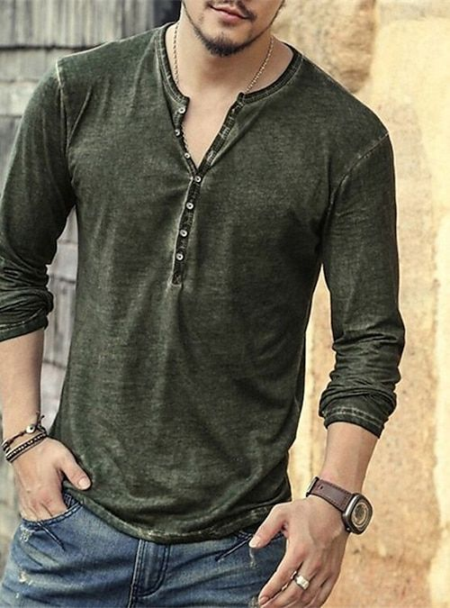

A roupa que Ryan usa praticamente todos os dias.

### Descrição visual

- **Henley** manga longa, tecido macio desbotado (verde-oliva / musgo / grafite lavado).
- Decote em V com **fileira de botões** (cerca de 5–7); 2–3 abertos no peito.
- Mangas **enroladas até o antebraço**.
- **Jeans** ou cargo desgastado; cinto simples.
- Relógio de pulseira de couro; corrente fina no pescoço (opcional).
- Aparência de peça “já usada mil vezes”, não de loja.

### No personagem

- Cinto utilitário e ferramentas por perto.
- Óculos de proteção na gola quando está na forja.
- Graxa e manchas inevitáveis.

Essa roupa nunca foi escolhida para ficar bonita.

Aconteceu.

---

## Oficina (Calor extremo)

**Referência:** `henley1.jpg`

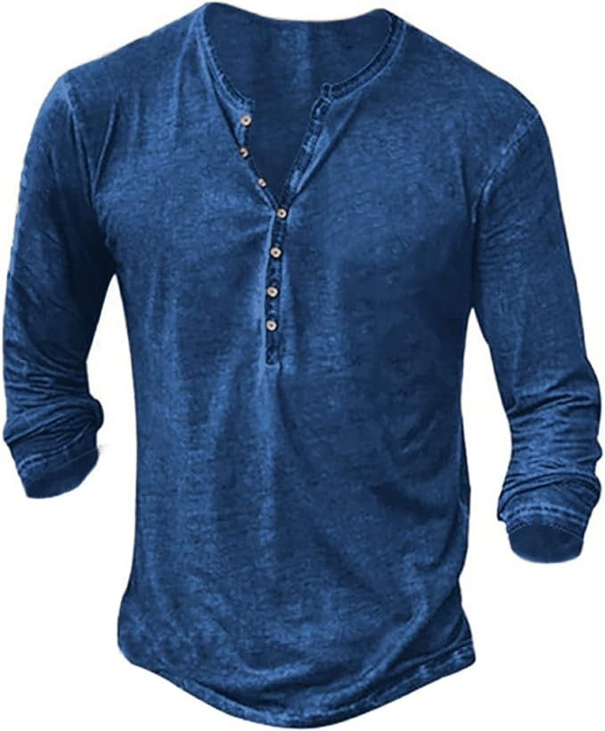

Mesma lógica da henley padrão — só que no limite do conforto térmico.

### Descrição visual

- **Henley** manga ¾ ou longa, tom **azul índigo / denim lavado** (ou grafite suado).
- Tecido enrugado, aspecto “lavado e esmagado”.
- Botões mais abertos; decote mais profundo.
- Mangas mais altas no braço.
- Suor, cabelo bagunçado (no Ryan: prata bagunçado, não penteado).

É justamente essa versão que costuma chamar atenção das garotas do Pack.

Ryan nunca percebe.

---

## Trabalho Pesado

**Referência:** `worker.jpg`

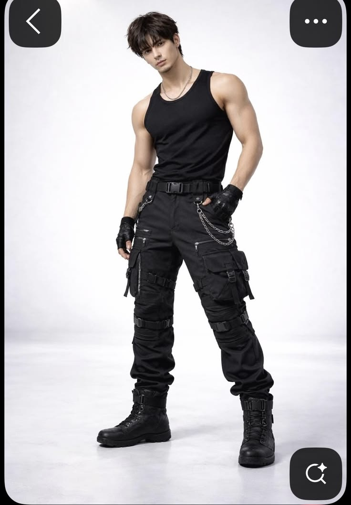

Quando sabe que vai passar o dia carregando peso, soldando ou no treino bruto.

### Descrição visual

- **Regata / tank** preta justa (ombro e braço à mostra).
- **Cargo tática preta** com muitos bolsos, zíperes e reforços nas coxas/joelhos.
- Cinto largo com fivela plástica; **corrente** de metal no quadril (opcional).
- **Luvas fingerless** pretas; botas de combate altas com cadarço.
- Corrente fina no pescoço.
- Silhueta magra/funcional — zero tecido solto que prenda em máquina.

Visual extremamente funcional. Para treino com Reina: mesma base, sem corrente se atrapalhar o movimento; trocar botas por tênis de treino se for ginástica.

---

## Pós-expediente

**Referência:** `casual+botas.jpg`

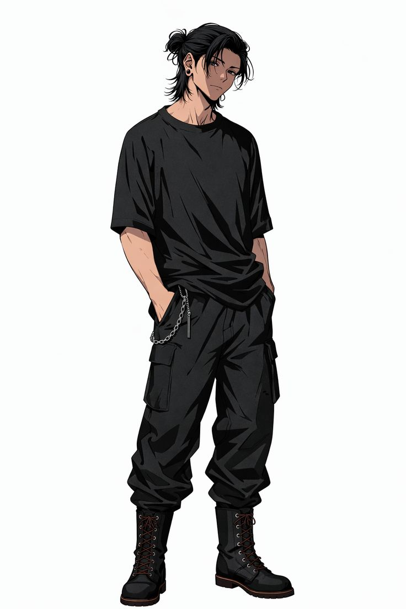

Depois do banho. Primeira roupa limpa encontrada.

### Descrição visual

- **Camiseta oversized preta** (manga curta, caimento largo).
- **Cargo preta** volumosa, bolsos laterais, pernas largas (quase joggers).
- **Botas militares pretas** altas, cadarço cruzado, sola robusta.
- Corrente de carteira prateada no bolso (opcional).
- Postura descontraída: mãos nos bolsos, zero formalidade.

Usada para:

- refeitório;
- fogueira;
- conversar com o Pack;
- descansar.

---

## Jantar do Pack

**Referência:** `camisa_gola_padre.jpg`

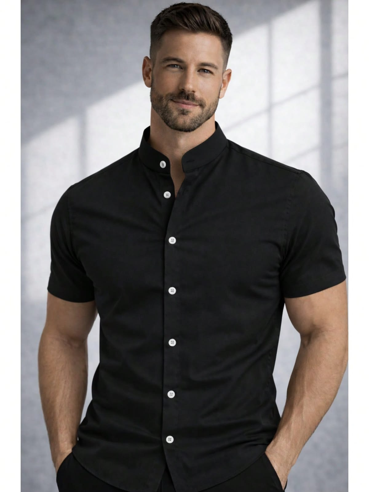

Quando Valk quer que ele pareça um pouco mais apresentável.

### Descrição visual

- **Camisa gola padre (mandarim)** preta ou grafite, manga curta ou manga longa dobrada.
- Tecido liso, botões claros contrastando com o tecido escuro.
- Corte justo no tronco sem parecer social de escritório.
- Calça escura limpa; botas limpas (não as da solda).
- Sem gravata, sem blazer — só “menos graxa que o normal”.

Ryan acha confortável.

Valk acha lindo.

---

# NIGHT CITY

## Casa

**Referência:** `casual+botas.jpg`

A roupa mais "Ryan" possível em apartamento / oficina caseira.

### Descrição visual

- Mesma base do **pós-expediente**: oversized preta + cargo larga.
- Em casa: pode trocar botas por **meias + chinelo ou tênis**.
- Ideal para programar, montar drones, café, mexer em chrome no chão.

---

## Casual limpo (semi-saída)

**Referência:** `casual.jpg`

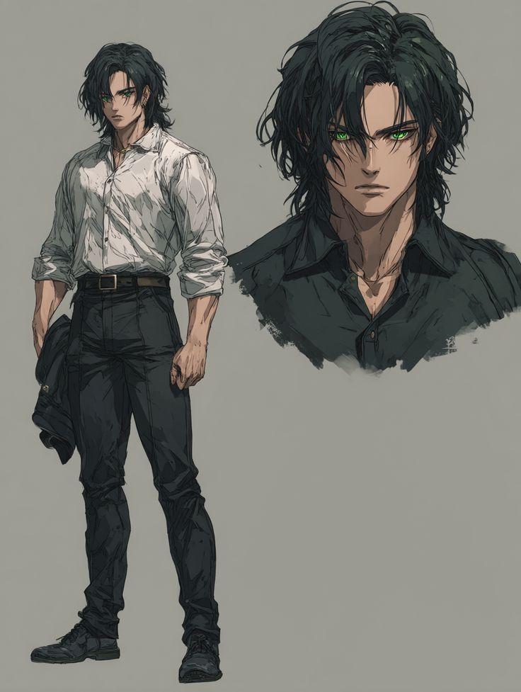

Quando precisa sair sem parecer “acabou de sair da forja”, mas ainda sem o kit Valk de cliente.

### Descrição visual

- **Camisa branca de botão**, levemente amarrotada (não engomada), mangas dobradas no cotovelo.
- Decote aberto nos primeiros botões; tecido fino o bastante para marcar o peito sem ser formal.
- **Calça preta** justa/reta, cinto marrom ou preto simples.
- **Sapatos/tênis pretos** baixos e limpos.
- Jaqueta preta leve **na mão** ou no ombro (não vestida o tempo todo).
- Variação: mesma silhueta com **camisa preta** fechada até o peito.

### Uso

- Café com contato; loja de peças; caminhada em Watson sem chamar heat.
- Vibe: “engenheiro de folga”, não “corpo de elite”.

---

## Street / deslocamento

**Referência:** `street_style.jpg`

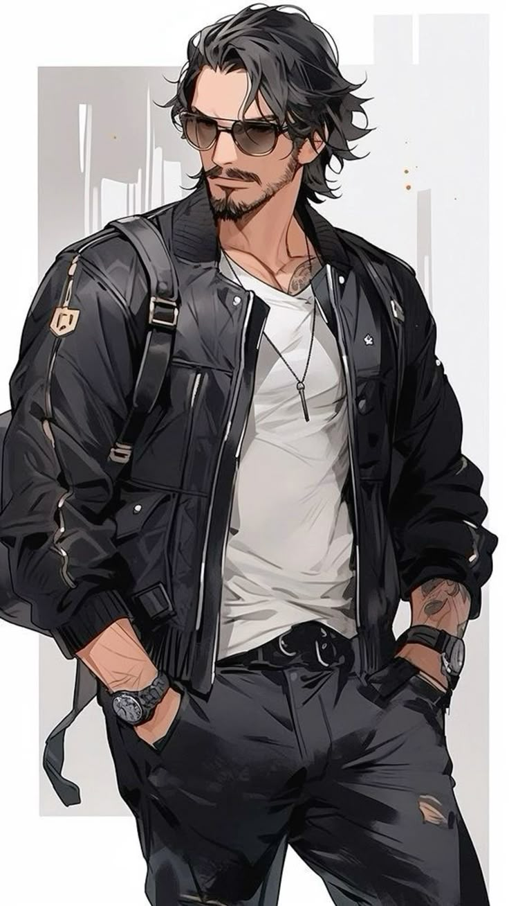

Deslocamento em Night City com cara de edgerunner discreto — sem armar o kit Wireghost completo.

### Descrição visual

- **Bomber / jaqueta preta** com bolsos frontais, zíperes e ombros estruturados; aberta.
- **Camiseta branca** básica por baixo.
- **Calça preta** (rasgo leve no joelho opcional), cinto com fivela metálica.
- **Mochila ou bag de ombro** preta (ferramentas leves, datapad, kit de campo).
- **Óculos escuros**; corrente fina no pescoço; relógio no pulso.
- Mãos nos bolsos; postura confiante, street, não “corpo tático”.

### Uso

- Rua, metrô, ponto de encontro com Kaz, reconhecimento visual sem máscara.
- Meio-termo entre casual limpo e operação rápida.

---

## Treino (Reina)

**Referência:** `worker.jpg`

Tudo pensado para movimento.

### Descrição visual

- Regata preta dry-fit + cargo elástica preta (mesma família do trabalho pesado).
- Tênis de treino no lugar das botas de combate, se for dojo/quadra.
- Sem mochila, sem corrente se atrapalhar; luvas opcionais.

Nada pode atrapalhar.

---

## Cliente comum

**Referência:** `camisa_gola_padre.jpg`

Primeiro nível do guarda-roupa montado pela Valk.

### Descrição visual

- Camisa gola padre preta/grafite (ver Jantar do Pack).
- Calça escura reta; botas de couro limpas (não de solda).
- Relógio simples; barba aparada se Valk insistir.

Visual:

> "Engenheiro extremamente competente."

---

## Cliente Corporativo

**Referência:** `great_style.jpg`

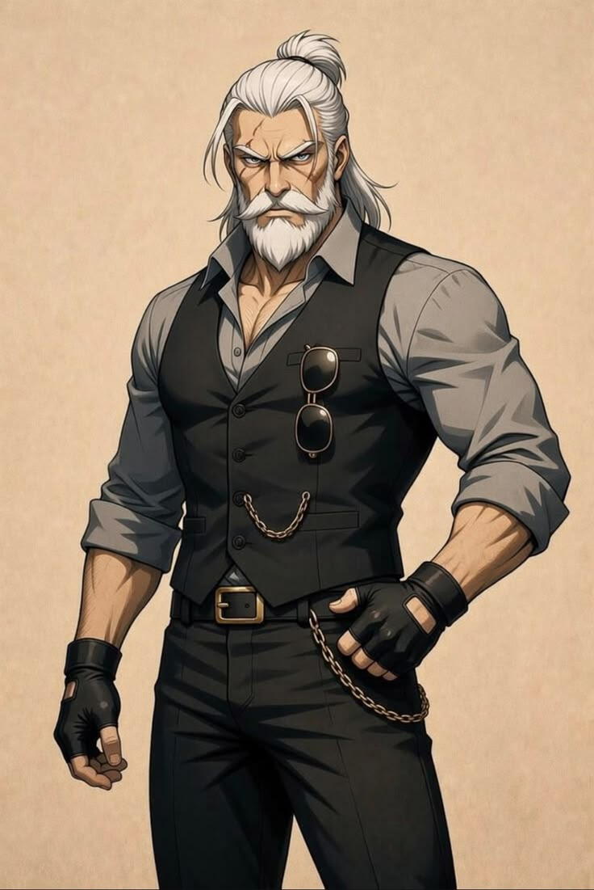

A roupa que Valk faz questão que ele use.

### Descrição visual

- **Camisa cinza** manga longa, mangas dobradas no antebraço.
- **Colete / waistcoat preto** entalhado, botões, óculos escuros no bolso do peito.
- **Calça preta** social/reta; cinto com fivela dourada/escura.
- **Corrente de bolso** dourada ou prateada; **luvas fingerless** pretas (toque “ainda é street”).
- Barba feita; cabelo prata penteado ou preso baixo; pele cuidada (hidratante — Valk).

Ryan acha exagero.

Valk insiste.

---

## Evento Formal

Quando realmente precisa impressionar. Valk escolhe o nível:

| Nível | Arquivo | Notas |
| ----- | ------- | ----- |
| Formal sem gravata (default dele) | `great_style.jpg` | Colete street + camisa — ver [Cliente Corporativo](#cliente-corporativo) |
| Formal completo (Valk forçou) | `valk_terno_preto.jpg` | Terno + gravata — ver [Formal Valk](#formal-valk-terno) |

**Referência (default):** `great_style.jpg`

**Referência (Valk / terno):** `valk_terno_preto.jpg`

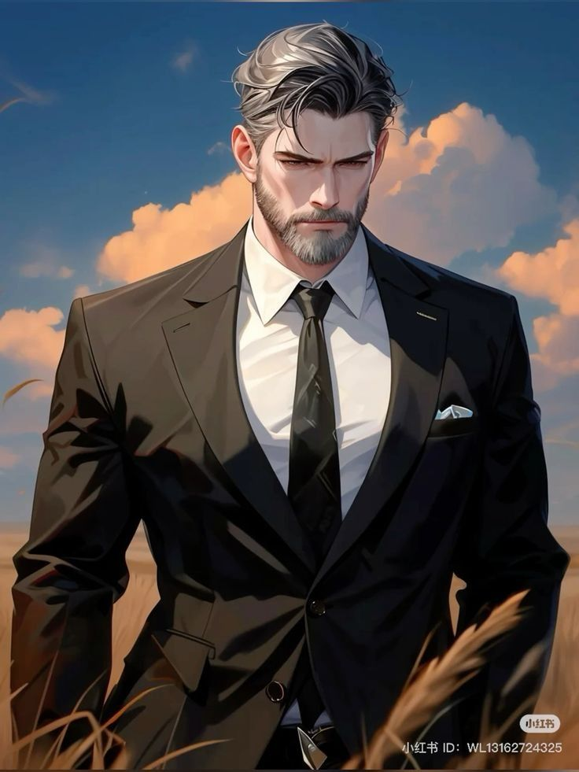

### Descrição visual

**Default (`great_style`):**

- Base do cliente corporativo + **blazer técnico** escuro por cima do colete (se a ocasião exigir).
- Camisa branca ou grafite; calça social; botas sociais escuras.
- **Sem gravata** — Ryan simplesmente não gosta.

**Quando Valk sobe o nível (`valk_terno_preto`):**

- Terno preto completo, camisa branca, **gravata preta**, lenço de bolso.
- Barba e cabelo arrumados (ela insistiu).
- Ele veste, reclama baixinho, e usa. Catálogo completo: [Ryan by Valk → Formal](#formal-valk-terno).

---

# RYAN BY VALK

Peças que **Valk** escolheu e separou para ele.

Ryan não escolhe essas roupas.  
Ele veste porque são confortáveis e porque foi ela quem deu.  
Valk é quem decide como ele fica nelas (aberta, fechada, mais justa, etc.).

Ele não adapta a roupa conforme quem está em casa.  
Se está confortável e foi ela quem deixou, ele usa.

---

## Camisa Verde Militar (aberta/fechada)

**Referência:** `valk_camisa_verde_militar.jpg`

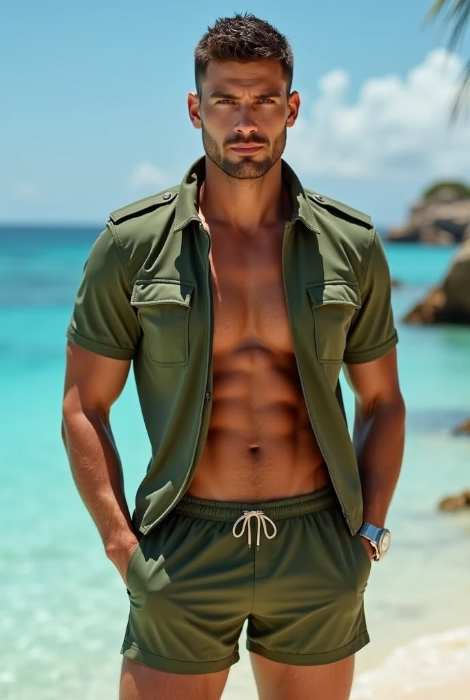

### Descrição visual

- **Camisa utilitária verde-oliva** manga curta, zip frontal, bolsos no peito, ombros com alças.
- Por baixo: peito à mostra quando aberta; pode fechar o zip até o peito ou quase todo.
- **Shorts oliva** leves (drawstring) — look de casa/calor, não de job.
- Relógio no pulso (opcional).

### Dinâmica Valk

- Escolhida por Valk.
- Ryan veste **fechada por padrão**.
- Valk costuma **abrir** quando estão sozinhos.
- Ela ajusta o zip; ele não discute.

### Uso

- Casa, safehouse, momentos em que ela separa a roupa.
- Não é “roupa de sair” nem look Wireghost.

---

## Camiseta / Long Sleeve justa

**Referências:**

| Peça | Arquivo |
| ---- | ------- |
| Long sleeve cinza (V-neck) | `valk_longsleeve_cinza.jpg` |
| Tee branca justa | `valk_tee_branca_justa.jpg` |
| Tee cinza justa | `valk_tee_cinza_justa.jpg` |

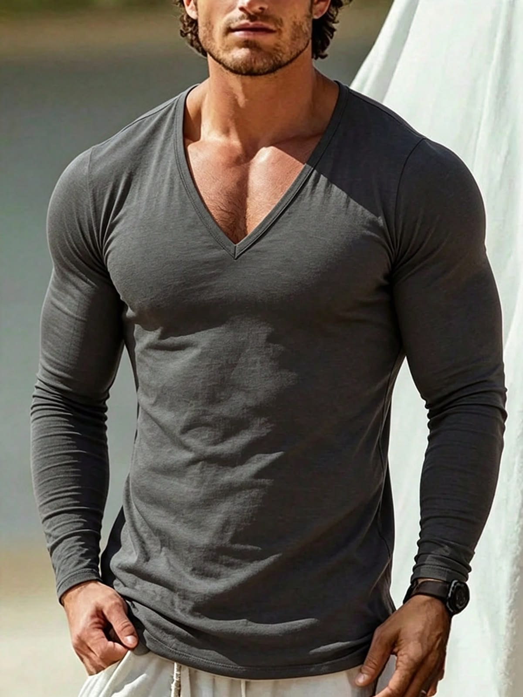

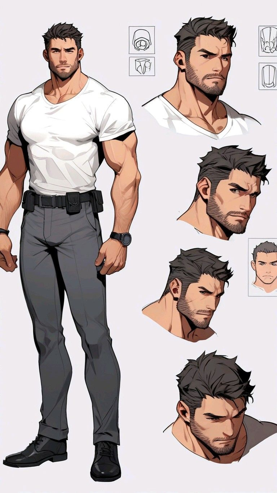

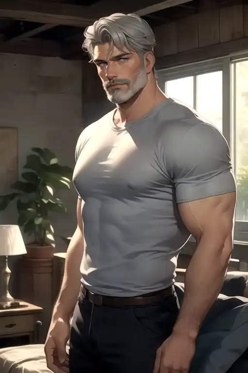

### Descrição visual

- Peças **limpas e justas** (cinza, preta ou branca na família).
- Long sleeve: decote em V, tecido fino que marca o tronco, manga colada.
- Tees: manga curta justa + calça escura/reta (cinza ou preta) quando o ref for full-body.
- Zero estampa barulhenta; visual “ele nem pensou nisso”.

### Dinâmica Valk

- Peças que ele usa sem pensar.
- Confortáveis e que **Valk gosta de ver nele**.
- Ela separa a cor; ele veste.

### Uso

- Casa, safehouse, oficina leve, downtime.
- Base sob casaco/blazer quando Valk monta algo mais apresentável.

---

## Tank Top preto + calça

**Referência:** `valk_tank_preto_calca.jpg`

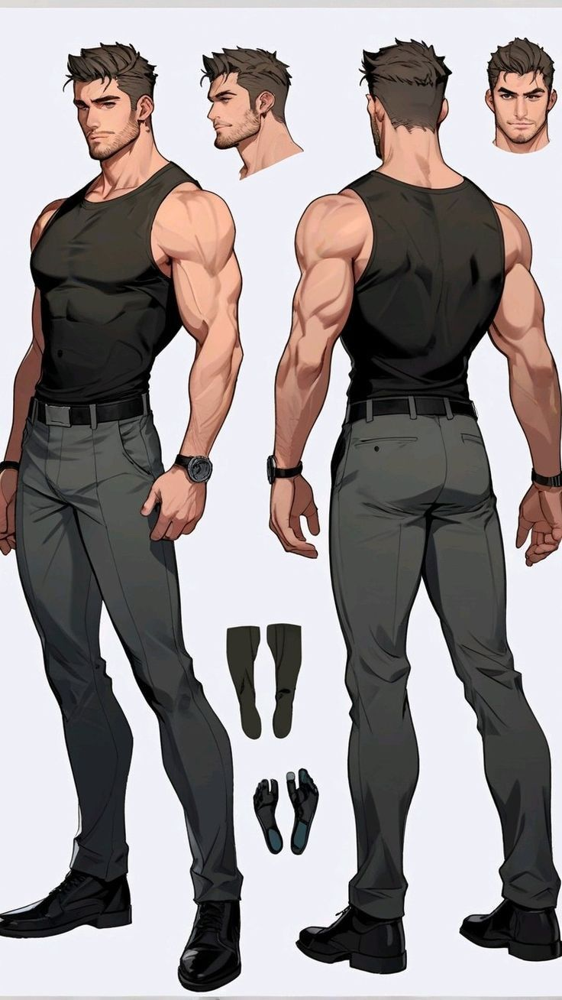

### Descrição visual

- **Tank / regata preta** justa (ombros e braços à mostra).
- **Calça cinza ou escura** reta, cinto simples.
- Sapato/bota limpa quando o ref pede full-body.
- Silhueta funcional — não é o cargo tático do `worker.jpg`, é a versão “Valk separou e está limpa”.

### Uso

- Oficina quente, casa, ou quando Valk separa para ele não suar de graça.
- Próximo do trabalho pesado/treino, mas **sem** o kit de bolsos e luvas de job.

---

## Shorts e peças curtas

**Referências:**

| Peça | Arquivo |
| ---- | ------- |
| Shorts preto treino | `valk_shorts_preto.jpg` |
| Shorts vinho/marsala | `valk_shorts_vinho.jpg` |
| Tee preta + short + tênis | `casual_tee_shorts_preto.jpg` |
| Joggers pretos (peito nu / lounge) | `lounge_joggers_preto.jpg` |

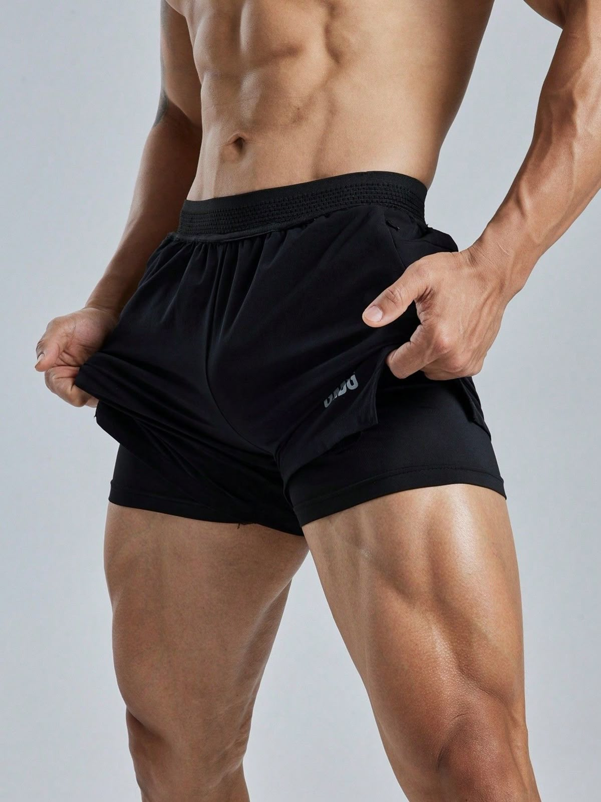

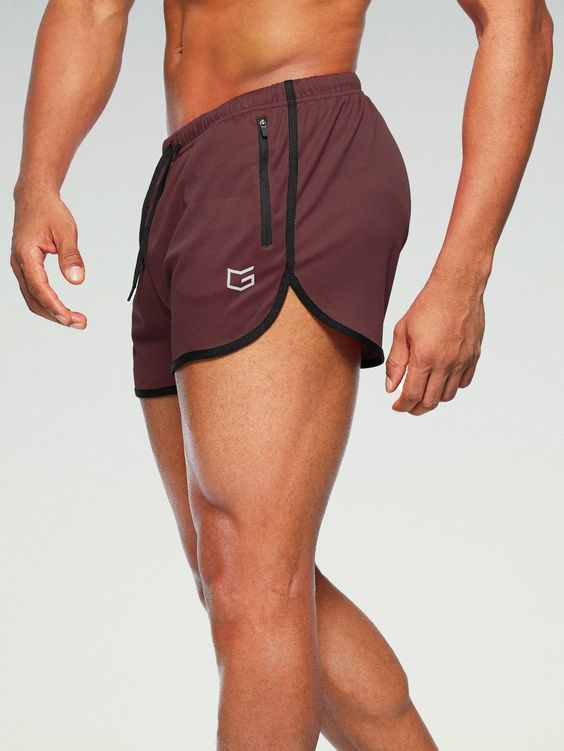

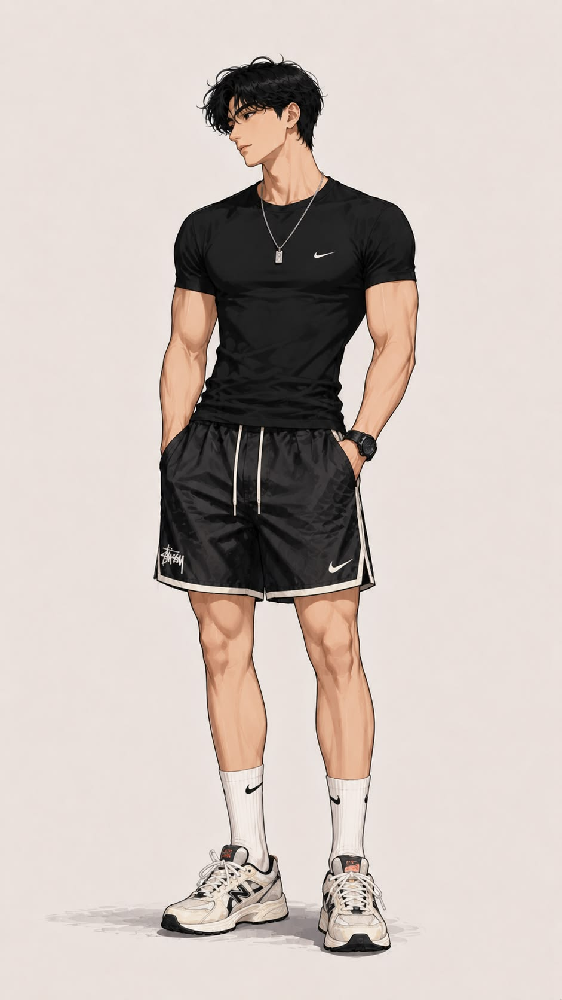

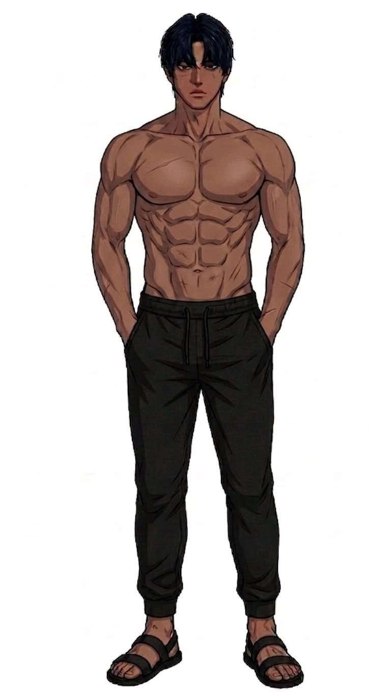

### Descrição visual

- Shorts atléticos curtos (preto ou vinho), elástico, às vezes com forro de compressão.
- Conjunto casual: tee preta justa + short preto com friso + meias e tênis.
- Lounge: joggers pretos com cordão, sandália ou pé descalço; peito nu se o calor/ambiente pedir.

### Uso

Usados principalmente:

- Para dormir
- Pós-intimidade
- Quando ele precisa sair **rápido** da tenda/safehouse para pegar alguma coisa

Não é “roupa de sair”. É o que ele veste quando **não quer se vestir de verdade**.

---

## Polo / peças mais apresentáveis

**Referências:**

| Peça | Arquivo |
| ---- | ------- |
| Polo cinza escuro | `valk_polo_cinza.jpg` |
| Gola alta preta justa | `valk_gola_alta_preta.jpg` |
| Blazer cinza + gola alta | `valk_blazer_cinza.jpg` |

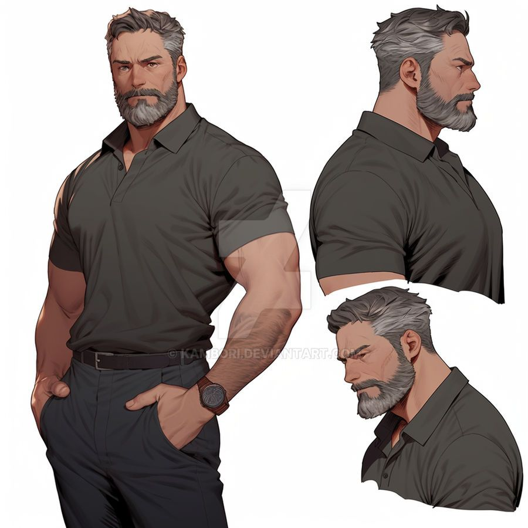

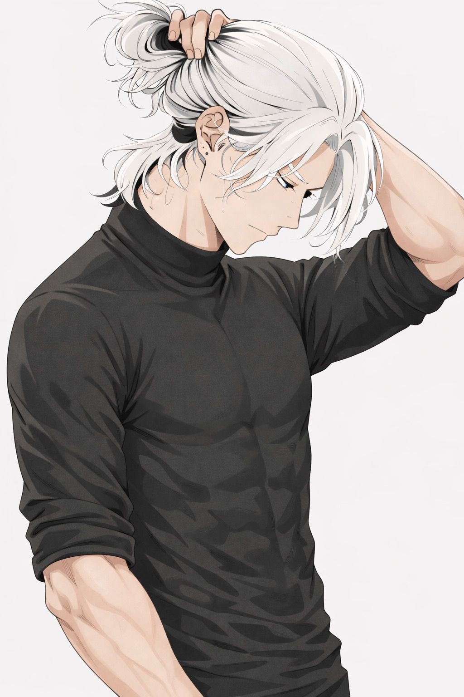

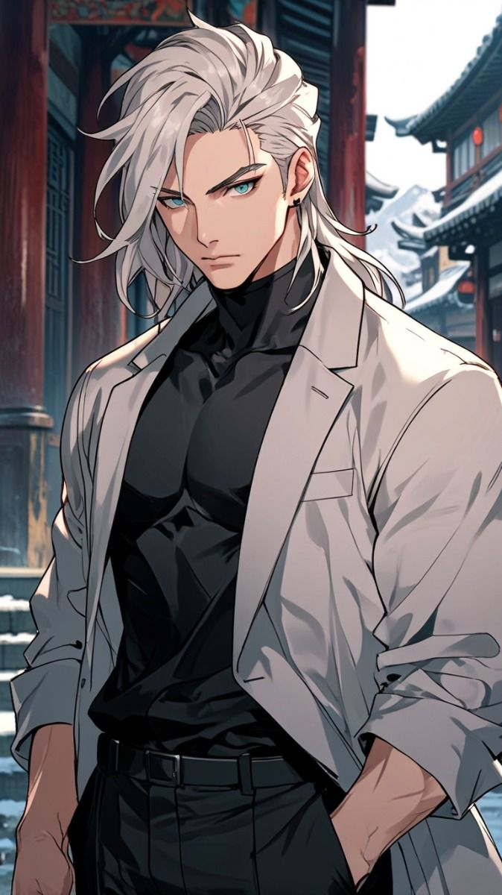

### Descrição visual

- **Polo** cinza/grafite, manga curta, caimento limpo no peito e ombros.
- **Gola alta preta** justa (manga ¾ ou longa) — base limpa sob blazer ou sozinha.
- **Blazer / casaco cinza claro** aberto sobre gola alta preta + calça preta e cinto — smart casual que Valk monta.

### Uso

Valk separa quando precisa que ele esteja um pouco mais apresentável (cliente, jantar, etc.).  
Ele veste sem opinião.

Complementa (não substitui) `camisa_gola_padre.jpg` e `great_style.jpg` do armário “funcional / NC”.

---

## Formal Valk (terno)

**Referência:** `valk_terno_preto.jpg`

### Descrição visual

- **Terno preto** completo: blazer entalhado, camisa branca, gravata preta, lenço de bolso.
- Barba e cabelo arrumados (Valk insistiu).
- Nível **acima** de `great_style.jpg` (colete street) — ocasião rara em que ela quer “engenheiro que fecha contrato”.

### Nota de personagem

Ryan **não gosta** de gravata. No armário dele, o default formal sem gravata continua sendo `great_style.jpg`.  
Este terno existe porque **Valk separou** — ele veste, reclama baixinho, e usa.

### Uso

- Evento formal extremo, cliente corporativo pesado, jantar onde “colete street” não passa.
- Não é look do dia a dia.

---

## Casaco cinza aberto (casa)

**Referência:** `valk_casaco_cinza_aberto.jpg`

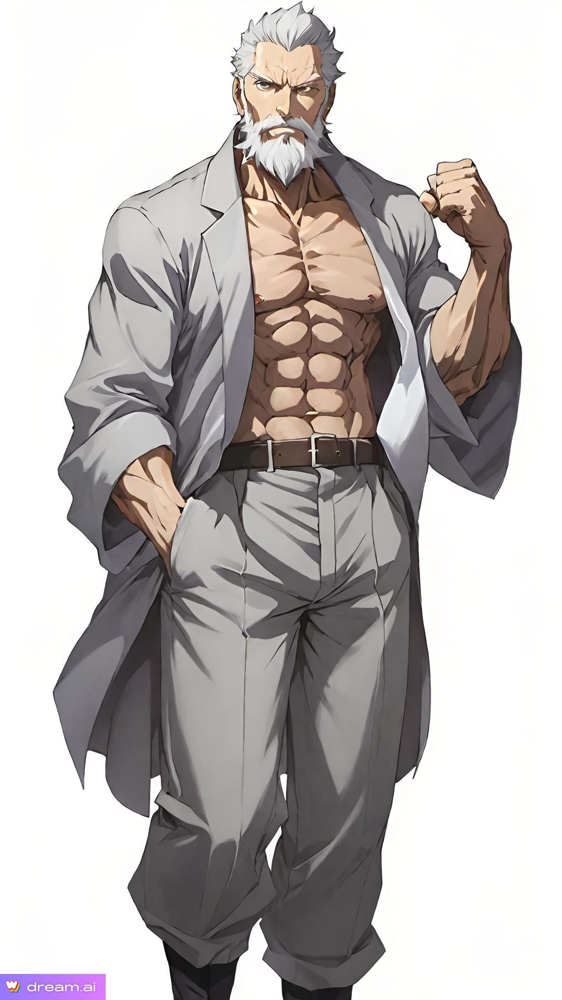

### Descrição visual

- **Casaco / sobretudo cinza** longo, aberto, peito à mostra.
- Calça cinza larga, cinto marrom, botas escuras.
- Visual de “ela abriu o casaco e ele deixou” — casa / safehouse / intimidade casual, não job.

### Dinâmica Valk

- Ela decide o quanto fica aberto.
- Ele só veste o que estava na cama.

### Uso

- Casa, pós-banho, cenas domésticas com Valk.
- Não usar como street em Night City sem ela ter montado o look de propósito.

---

## Dinâmica geral (Ryan by Valk)

- Ryan não monta look.
- Valk escolhe e deixa a roupa.
- Ele veste.
- Se ela abre, fecha ou ajusta, ele deixa.
- O critério dele é simples: **confortável + foi ela quem deu.**

Catálogo de looks **dele** (oficina, Wireghost, street que ele pegou sozinho): seções Badlands / Night City / Wireghost abaixo e acima.  
Este bloco é o **segundo armário** — o que tem a mão dela.

---

# WIREGHOST

## Operação Rápida

**Referência:** `quick_operator.jpg`

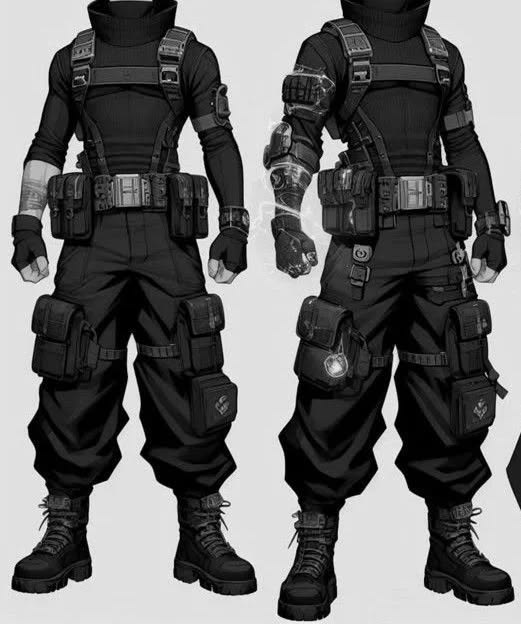

### Descrição visual

- Base preta total: **balaclava / face cover**, gola alta.
- **Harness / peitoral** com bolsas de munição e utilitários no peito e cintura.
- Mangas com **braçadeiras / proteções** (versão mais “armada” tem mais bulk e glow tech).
- Cargo tática com bolsos nas coxas e panturrilha; botas de combate.
- Luvas táticas; pouca silhueta solta — mobilidade para recon, escolta, incursão curta.

Usado para:

- reconhecimento;
- escolta;
- incursões rápidas.

Retrato full com Warden/Vespas: [techie - ryan_wireghost_voss.jpg](../imagens/techie%20-%20ryan_wireghost_voss.jpg).

---

## Operação Completa

**Referência:** `stealth_operator.jpg`

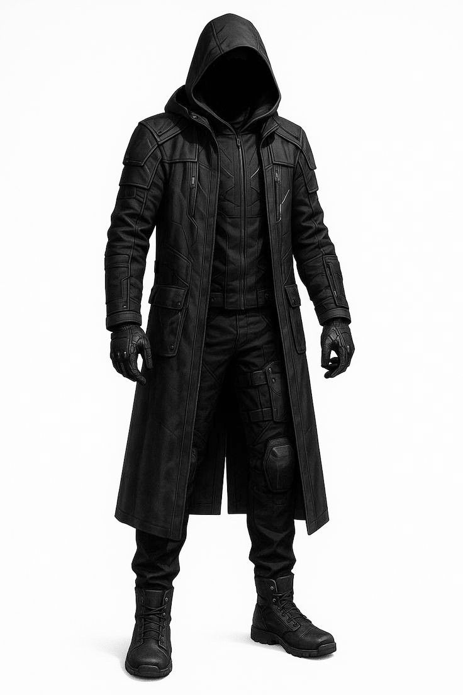

A identidade visual do Wireghost.

### Descrição visual

- **Casaco longo preto** com capuz (rosto em sombra / máscara).
- Peitoral tático com linhas geométricas / painéis sob o casaco.
- Calça tática com joelheiras; luvas e botas pretas.
- Silhueta de “fantasma urbano” — volume, sombra, zero rosto.
- Equipamento completo + drones (Warden nas costas no retrato canônico).

Nesse momento praticamente ninguém enxerga o Ryan.

Retrato full com Warden/Vespas: [techie - ryan_wireghost_voss.jpg](../imagens/techie%20-%20ryan_wireghost_voss.jpg).

---

# Paleta de cores

Ryan praticamente só compra:

- Grafite
- Preto
- Verde-oliva
- Cinza
- Azul-marinho / índigo
- Areia

Exceções (porque vieram em promoção):

- Branco (camisas de “casual limpo” e corporativo)
- Vinho
- Azul claro

Normalmente continuam guardadas — exceto o branco, que Valk puxa para NC.

---

# Hábitos

Ryan compra roupas em pacotes.

Exemplo:

> Promoção:
> 7 Henleys por preço de 6.

Resposta dele:

> "Ótimo. Já sei que essa camisa funciona."

Fim da análise.

---

# Relação com Valk

Ryan quase nunca escolhe roupa quando sai com Valk. Ela separa na cama; ele veste. Sem reclamar.

> "Se você gosta... eu gosto." · "Porque você fica feliz quando eu uso."

Ele não entende de moda. Ela entende — da mesma forma que ela confia nele em drone e chrome, ele confia nela no que veste.

**Catálogo das peças que ela monta:** [Ryan by Valk](#ryan-by-valk).

---

## Referências

- [Ficha Ryan](techie%20-%20ryan_wireghost_voss.md) · [Relacionamentos](../relacionamentos/ryan_relacionamentos.md) · [Mapa](../relacionamentos/mapa_relacional_geral.md)
- [Valk](nomad%20-%20lena_valk_kane.md) · [Registro](../sistema/registro_arquivos.md)
