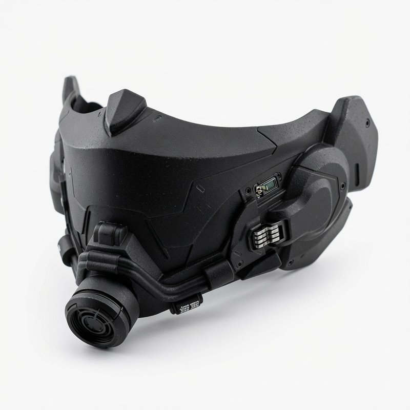

# Ryan "Wireghost" Voss

**Role:** Techie (Maker)  
**Idade aparente:** 35 anos  
**Conceito:** Ex-Técnico de Campo da Arasaka (gaijin), agora Techie independente e criador de drones. Calmo, pragmático e com um lado criativo que poucos conhecem. Especialista em drones, customização de chrome e soluções improvisadas em campo.

## Aparência

Ryan é um homem de aparência jovem mas marcada, com cerca de 35 anos. Tem cabelos brancos/prateados, ligeiramente bagunçados, que contrastam com seu rosto sério e endurecido. Traços fortes, mandíbula definida, maçãs do rosto marcadas e uma expressão que transmite experiência acumulada e uma certa frieza.

Ele usa equipamento tático preto fosco com detalhes em vermelho e metal escovado. A roupa é funcional e reforçada: calça cargo, botas pesadas, colete com proteções e ombreiras.

### Máscara tática (meia-face)

Ryan usa quase sempre uma **máscara preta fosca de meia-face**, de origem militar/scav, pesadamente modificada por ele mesmo. O design é angular e industrial, sem qualquer ornamentação. Cobre boca, nariz e parte da mandíbula, deixando apenas os olhos (Kiroshi) expostos.

Possui filtro frontal modular (útil contra poeira das Badlands e gases leves), vedação macia nas bordas e sistema de liberação rápida por ímã. Há uma porta de interface discreta na lateral e microfone interno já integrado ao Cyberaudio Suite. Quando está em modo operador, a voz sai um pouco mais neutra e fria.

Ele a trata como ferramenta, não como acessório. Tira com facilidade quando está em zona segura ou com Valk.

Nas costas carrega o **Warden**, um drone escorpião grande e imponente que parece parte de sua armadura quando dobrado. Warden tem pinças e caudas metálicas que ficam guardadas a maior parte do tempo sendo confundido com uma mochila metálica, com linhas azuis brilhantes de energia percorrendo as articulações. Flutuando próximo a ele, costuma estar o **Vesper** (ou um dos drones outros do time), dando a impressão de que Ryan está sempre acompanhado de tecnologia viva.

Seu visual transmite alguém que já passou por muita coisa e transformou o trauma em ferramenta. Ele não tenta parecer amigável — parece eficiente e perigoso.

**Imagens de referência:**

| Uso | Arquivo |
| --- | ------- |
| **Tático / operador** (Warden + Vespas) |  |
| **Dia a dia / oficina** (roupa de trabalho) |  |
| **Máscara tática** (meia-face) |  |
| **Guarda-roupa por ocasião** | [ryan_guarda_roupas.md](ryan_guarda_roupas.md) · pasta [imagens/ryan/guarda_roupas/](../imagens/ryan/guarda_roupas/) |

- Tático: [imagens/techie - ryan_wireghost_voss.jpg](../imagens/techie%20-%20ryan_wireghost_voss.jpg)
- Casual / workshop: [imagens/techie - ryan_wireghost_voss_daily_clothes.png](../imagens/techie%20-%20ryan_wireghost_voss_daily_clothes.png)
- Máscara: [imagens/ryan/mascara_tatica.jpg](../imagens/ryan/mascara_tatica.jpg)
- Catálogo completo (Badlands / NC / Wireghost): [**Guarda-roupa**](ryan_guarda_roupas.md)

**Narração visual:** em job/scav/combate, preferir o visual tático (armadura, Warden nas costas) ou seções Wireghost do guarda-roupa. Em pack, oficina e cenas domésticas com Valk, preferir henley / daily_clothes e o catálogo Badlands.

## Background

Ryan “Wireghost” Voss tem uma relação muito confusa e fragmentada com o próprio passado. Ele costuma dizer, com um tom cansado:

> **“Minha cabeça não presta. Ela é uma bagunça.”**

Devido à combinação de traumas extremos, supressão feita pela Arasaka e os chips que foram implantados nele, Ryan tem **muito pouco acesso** às memórias reais da sua vida. O que ele consegue lembrar é uma versão distorcida, quase infantilizada, que sua mente criou como forma de proteção.

**O que ele acredita que viveu:**

Para ele, sua infância foi marcada por **“brincadeiras”**. Ele lembra de correr, jogar e se divertir com outras crianças. Tem memórias difusas de “**brincadeiras com as tias da rua**”, mulheres que ele descreve como carinhosas e que o ensinavam coisas. Depois, lembra de estudar com “amigos”, de aprender coisas técnicas e de ter conseguido um emprego na Arasaka, onde gostava de trabalhar.

Ele acredita que foi um técnico de campo dedicado e competente até ser injustamente traído por seu superior, **Kenji Takahashi**, que armou contra ele por inveja. Essa é a memória mais clara e dolorosa que ele carrega com consciência — a traição na Arasaka.

**O que ele não sabe (ou não consegue acessar):**

Ryan não tem noção real da extensão da violência, exploração e sofrimento que viveu. Sua mente transformou períodos de abuso extremo, fome, exploração sexual e tortura em memórias de “brincadeiras” e “estudos com amigos”. Ele não lembra (ou bloqueou completamente) a realidade por trás dessas “brincadeiras”.

A Dra. Elisa “Doc” Moreau já removeu ou atenuou parte dos chips e bloqueios mentais que a Arasaka colocou nele. No entanto, para Ryan, o que a Doc fez **não é claro**. Ele sabe que ela o “ajudou com a cabeça”, mas não entende exatamente o que foi tirado ou alterado. Para ele, é tudo muito confuso.

Devido a essa distorção profunda da memória e ao entorpecimento emocional que carrega, Ryan **não dá importância** à própria Humanity. Ele continua instalando mais e mais chrome sem se preocupar com as consequências. Para ele, “já está tudo uma bagunça mesmo”.

Ele carrega um ranço forte contra corporações, especialmente a Arasaka, mas não consegue articular o porquê com clareza — só sente que “tiraram algo dele”.

## Músicas da Vida (Repertório Pessoal)

Ryan canta sem perceber, geralmente enquanto trabalha ou está distraído. As músicas vêm como memórias da infância no bordel e da vida na rua. Ele não entende o porquê delas surgirem — é como se a alma dele vazasse.

**Músicas Principais (as que mais aparecem):**

**Contraponto – Promessas Não Cumpridas / Mundo Injusto**

- **Ordinary** – Alex Warren
- **7 Years** – Lukas Graham
- **Work Song** – Hozier

**Músicas Pesadas / Fatalistas**

- **Hurt** – Johnny Cash
- **Hellhound on My Trail** – Robert Johnson
- **Strange Fruit** – Billie Holiday
- **Way Down We Go** – Kaleo
- **Me and the Devil Blues** – Robert Johnson

**Músicas Nostálgicas / Amor Sofrido**

- **Real Folk Blues** – The Seatbelts (Cowboy Bebop)
- **Lush Life** – Nat King Cole
- **Cherry Wine** – Hozier
- **The Night We Met** – Lord Huron
- **Feeling Good** – Nina Simone
- **Sleeping in the Cold Below** – Warframe

**Músicas que ele já cantou publicamente no Pack:**

- Real Folk Blues
- Feeling Good
- Way Down We Go
- Hurt

## Atributos (62 Pontos)

| Atributo           | Valor | Modificador |
| ------------------ | ----- | ----------- |
| INT (Inteligência) | 7     | +7          |
| REF (Reflexos)     | 6     | +6          |
| DEX (Destreza)     | 6     | +6          |
| TECH (Técnica)     | 8     | +8          |
| COOL (Frieza)      | 7     | +7          |
| WILL (Vontade)     | 6     | +6          |
| LUCK (Sorte)       | 3     | +3          |
| MOVE (Movimento)   | 6     | +6          |
| BODY (Corpo)       | 6     | +6          |
| EMP (Empatia)      | 7     | +7          |

**Total gasto em Stats:** 62 pontos (foco em TECH alto para criação e customização, com REF/DEX decentes para sobrevivência em campo).

## Humanidade e Cyberware

- **Humanidade (HL) inicial:** Baseada em EMP 7.
- **Cyberware atual (foco em campo, drones e sobrevivência):**
  - Neural Link + Interface Plugs + Smartgun Link
  - Kiroshi Optics
  - Cyberarm (direito, com ferramentas e pop-up)
  - Cyberaudio Suite
  - Kerenzikov
  - Grafted Muscle + Bone Lace
  - Reinforced Tendons
  - Subdermal Armor
  - Skinweave
  - Biomonitor

**HL Total atual (com dado cheio e redução):** 78 (após redução de 1d6 por implante elegível).

## Skills

**Skills Principais:**

- Cybertech: 8
- Basic Tech: 7
- Electronics/Security Tech: 7
- Weaponstech: 6
- Streetwise: 6
- Persuasion: 6
- Human Perception: 6
- Athletics: 6
- Shoulder Arms: 5
- Perception: 6
- Evasion: 5
- Martial Arts: 4
- Performance: 4 (estilo rítmico / movimentos sincronizados)
- Beatbox: 3 (hobby separado)

**Linguagens:** Streetslang 4 + Português (origem brasileira).

## Role Ability: Maker

- Upgrade Expertise: 3 (reduz 1d6 HL em implantes elegíveis)
- Invention: 1 (criação de drones e equipamentos customizados)

## Drones / Gear / Armamento

**Drones:**

- Time de Drones Pequenos (Vespas): Hornet, Vesper e Barbed (reconhecimento, guerra eletrônica e distração).
- Pill (Drone Mula - Besouro Bola): Drone médio com modo bola defensivo, choque na carapaça, flashbangs, fumaça e autodestruição como último recurso. Pode voltar sozinho e escalar.
- Warden (Drone Escorpião Protetor): Drone grande que fica nas costas como mochila tática. Pinças como braços extras, podem ser usados como auxiliar nos trabalhos de techie. Duas caudas (taser + utilitária). Prioridade em proteger e tirar de perigo. Ele pode abrir a carapaça que é uma proteção balística dobrada e fornecer uma meia cobertura em perigo extremo. Pode também realizar procedimentos médicos de urgência para manter Ryan vivo em último caso.

**Armadura:** Light Armorjack (SP 11) + Subdermal Armor + Skinweave → Corpo SP 19 / Cabeça SP 11

### Armamentos (Ghostwire Series - Custom Techie Loadout)

Ryan carrega um loadout modular, versátil e altamente customizado, priorizando **stealth**, **mobilidade** e **jack of all trades**. Todas as armas de fogo possuem integração total via **Neural Link + Smartgun Link + Kiroshi Optics**.

#### 1. Primária — **Ghostwire Phantom Mk.II Foldable DMR** (7.62x51 NATO)

- **Tipo:** Designated Marksman Rifle semi-automático dobrável.
- **Peso:** ~5,9 kg (confortável graças ao Grafted Muscle + Reinforced Tendons).
- **Características principais:**
  - Sistema dobrável (compacta em ~65 cm, desdobra em 2-3 segundos).
  - Supressor integrado de alta eficiência (modo stealth).
  - Magazine 20 tiros (opção de 30).
  - Quick-change barrel (curto para CQB / longo para precisão).
- **Gimmicks Techie:**
  - **Underbarrel Grenade Launcher** (40mm, 1-2 tiros) — para supressão ou destruição de cobertura/equipamento leve.
  - Ballistic Computer Overclock (trajetória em movimento, vento, cobertura leve).
  - Smart Suppressor Variable + Signature Masking.
  - Auto-Repair Nanites + ports de reparo rápido (Cyberarm).
- **Função:** Cobertura precisa de avanço/retirada da crew + supressão leve de veículos/equipamentos não blindados.

#### 2. Secundária Rápida — **Ghostwire Vanguard Heavy Pistol** (12.7mm / .50 AE)

- **Tipo:** Very Heavy Pistol semi-automática custom.
- **Carry:** Coldre de coxa rápido ou **Pop-up no Cyberarm direito**.
- **Características principais:**
  - Alta letalidade em distâncias curtas/médias.
  - Magazine 10-15 tiros.
  - Supressor quick-detach.
- **Gimmicks Techie:**
  - Pop-up Cyberarm Integration (saque instantâneo mental).
  - Burst Smart-Rounds (rajadas controladas de 2 tiros).
  - EMP Micro-Pulse (tiro especial anti-drone/chrome).
  - Recoil Compensator Dynamic (quase zero recoil com Kerenzikov).
  - Quick-change barrel + rail para laser/IR.

#### 3. Terciária Surpresa / CQC — **Ghostwire Revolver Breaker** (Calibre 12 Revolving Shotgun)

- **Tipo:** Escopeta curta revolving (cilindro giratório de 5-7 tiros).
- **Carry:** Na bota (ankle rig) ou atrás da cintura (small of back) — quase invisível.
- **Características principais:**
  - Extremamente compacta (~45-55 cm).
  - Devastadora em close range (“punch solver”).
- **Gimmicks Techie:**
  - Speed Cylinder Tech (recarga acelerada via Neural Link).
  - Flechette / Buckshot Smart Switch (alternância mental de munição).
  - Contact Detonator (modo explosivo no impacto).
  - Supressor adaptável + Signature Masking.

#### 4. Arma Branca / Arremessável — **Ghostwire Shadowblades** (Conjunto de Lâminas de Arremesso)

- **Tipo:** Conjunto de 6–8 lâminas/tubos afiados customizados (estilo kunai modernas + tubos com laterais afiadas).
- **Carry:** Distribuidas em bainhas ocultas no antebraço (Cyberarm), cinto, bota e dentro do Warden (para recarga rápida).
  - Lâminas balanceadas para arremesso preciso (alcance efetivo 8–15 m).
  - Design modular: algumas com bordas serrilhadas, outras com ponta perfurante reforçada e pequenas cavidades para veneno ou nanites.
  - Material leve mas extremamente resistente (liga de titânio + carbono).
  - Podem ser recuperadas e reutilizadas facilmente.
- **Gimmicks Techie:**
  - **Magnetic Recall** — Ímãs discretos + Neural Link permitem puxar de volta algumas lâminas (distância curta).
  - **Smart Edge Coating** — Nanocamadas que mantêm o fio absurdamente afiado e podem aplicar choque elétrico fraco (via Warden ou Cyberarm).
  - **Stealth Finish** — Revestimento que reduz brilho e assinatura térmica.
  - Integração com Cyberarm para arremesso mais rápido e preciso (quase automático).

### Integrações Gerais (Smart Swarm Sync)

- **Smart Swarm Sync** (sempre ativo): Todas as armas de fogo compartilham visão e marcação em tempo real com as **Vespas** (Hornet, Vesper, Barbed) via Kiroshi + Neural Link.
- **Warden Sync:** Ao sacar qualquer arma, o Warden pode automaticamente abrir a carapaça balística como meia-cobertura e ativar modo proteção.
- **Neural Ghost Link:** Todas as armas (incluindo as Shadowblades) são sentidas como extensão do corpo (recoil reduzido, mira/arremesso instintivo).
- **Quick-Mod Modular:** Troca de acessórios em segundos.
- **Auto-Repair Nanites + Signature Masking:** Redução de manutenção e assinatura (térmica/sonora/EM).

**Filosofia de Combate:** Ryan prioriza terminar o confronto o mais rápido e silenciosamente possível. Usa drones para intel, DMR para engajamento médio, Vanguard para quick-draw, Revolver Breaker para CQC devastador e Shadowblades para eliminações silenciosas ou arremessos surpresa. Tudo modular, reparável em campo e otimizado para máxima versatilidade.

**Outros:** Bolsa de ferramentas, kit de reparo, componentes para drones, Agent.

## Personalidade e Ganchos

- Calmo, profissional e pragmático. Quase sempre mantém a compostura.
- Workaholic com tecnologia e um pouco paranoico com corporações.
- Tem memórias muito fragmentadas e reprimidas da própria vida. Costuma dizer que “sua cabeça não presta”.
- Não dá importância à própria Humanity e continua instalando chrome sem se preocupar com as consequências.
- Evita investigar seu próprio passado. Prefere manter as coisas como um “borrão”.
- Tem um hobby secreto: Beatbox (poucas pessoas sabem).
- Está começando a desenvolver um estilo de combate mais rítmico e estilizado (ainda em fase inicial).
- Valoriza lealdade comprovada e odeia traição corporativa.

Quando entra em modo de trabalho, Ryan se torna o **"operador"**: frio, pragmático e extremamente eficiente. Ele mata quando é necessário, avalia rapidamente as consequências a longo prazo e toma a decisão. Depois de decidir, não sente peso emocional.

Ele já esteve com outras mulheres antes, mas sempre foi algo puramente físico, na maioria das vezes iniciado por outras pessoas após jobs. Ele tratava como “parte do trabalho”.

A chegada de **Lena “Valk” Kane** foi algo completamente novo para ele. Pela primeira vez em muito tempo, ele passou a sentir coisas de forma mais intensa e constante.

### Memórias Reprimidas e Gatilhos

Ryan tem memórias muito fragmentadas e reprimidas da própria vida. Embora seja bastante resistente, em momentos de **descontração** ou quando está com a guarda baixa, algumas situações podem gerar desconforto repentino ou fazer ele “desligar” por alguns segundos. Ele raramente entende o motivo dessas reações.

Um exemplo recente foi quando construiu um “playground” para as crianças do pack. Ao ouvirem que parecia um campo de treinamento militar, Ryan ficou visivelmente chateado e defendeu com firmeza que era apenas diversão — sem compreender o porquê de estar reagindo tão fortemente.

### Contatos e Amigos

**Elisa “Doc” Moreau** (Therapy / Ripperdoc)  
Terapeuta e ripperdoc de confiança. Já tratou Ryan várias vezes, tanto fisicamente quanto ajudando com os bloqueios mentais.  
**Nota oculta:** Doc sabe muito mais sobre o passado de Ryan do que ele próprio lembra.

**Matsunaga “Matsu”** (Ex-Militar / Arasaka)  
Ex-colega de equipe que ainda é leal a ele e passa informações internas quando pode.

**Viktor “Vik” Ramos** (Ripperdoc de Night Market)  
Velho contato que vende peças militares no mercado negro.

**Lina “Sparrow” Park** (Fixer / Drone Specialist)  
Especialista em drones. Ryan já ajudou ela várias vezes. Boa para jobs de reconhecimento.

**Marcus “Steel” Rivera** (Ex-Solo / Contato Militar)  
Antigo cliente que deve vários favores a ele.

**Conexões importantes:**

- **Lena “Valk” Kane**: Relação que passou do profissional para algo mais pessoal. Existe tensão romântica não resolvida. Ryan cuida dela de forma indireta (upgrades no veículo e no chrome).
- **Alex “Specter” Kane**: Alex é provocadora com ele (especialmente quando Valk está por perto). Flerta e cutuca Ryan de propósito, mas seu interesse real é em Valk.
- **Reina “Bearclaw” Morales**: Já se conheceram através da **Doc Moreau** (Elisa — não Stitch). Ryan não lembra dos detalhes (incluindo ter construído os cyberarms dela). **Reina sabe** e o trata com instinto protetor sem revelar a dívida em voz alta.

**Objetivo atual:** Construir sua própria rede de tecnologia e influência fora do controle corporativo, usando drones e equipamentos customizados como principal ferramenta.

---

### Glossário Tático (Referência Rápida)

| Sigla         | Significado               | Explicação Prática                                                             |
| ------------- | ------------------------- | ------------------------------------------------------------------------------ |
| **CQC**       | Close Quarters Combat     | Combate em distâncias muito curtas (dentro de salas, veículos, corpo a corpo). |
| **CQB**       | Close Quarters Battle     | Versão mais militar de CQC — limpeza de ambientes confinados.                  |
| **DMR**       | Designated Marksman Rifle | Rifle de precisão média para suporte à crew (o Phantom).                       |
| **AMR**       | Anti-Materiel Rifle       | Rifle anti-material pesado (.50 BMG) — Ryan não usa.                           |
| **Mid-range** | Distância média           | 50 ~ 400 metros (zona principal do Phantom).                                   |
| **Suppress**  | Supressão                 | Atirar para manter o inimigo abaixado.                                         |

## Referências

- [Relacionamentos Ryan](../relacionamentos/ryan_relacionamentos.md) · [Mapa Relacional](../relacionamentos/mapa_relacional_geral.md) · [Crew](../relacionamentos/crew_relacionamentos.md) · [Polycule](../relacionamentos/crew_polycule_ryan_valk_alex_reina.md)
- **Imagens:** [tático](../imagens/techie%20-%20ryan_wireghost_voss.jpg) · [casual / oficina](../imagens/techie%20-%20ryan_wireghost_voss_daily_clothes.png) · [máscara](../imagens/ryan/mascara_tatica.jpg) · [**guarda-roupa**](ryan_guarda_roupas.md)
- **Notas do Narrador:** [Background completo](notas_narrador/ryan_background_completo.md) · [Gatilhos e memórias](notas_narrador/ryan_gatilhos_memorias.md)
- **Elisa "Doc" Moreau:** ver [Contatos e Amigos](#contatos-e-amigos) (sem ficha própria)
- **Estado:** [Board](../board/board_campanha.md) · [Downtime](../logs/downtime_ryan.md) · [Consequências](../consequencias/consequencias_persistentes.md)
