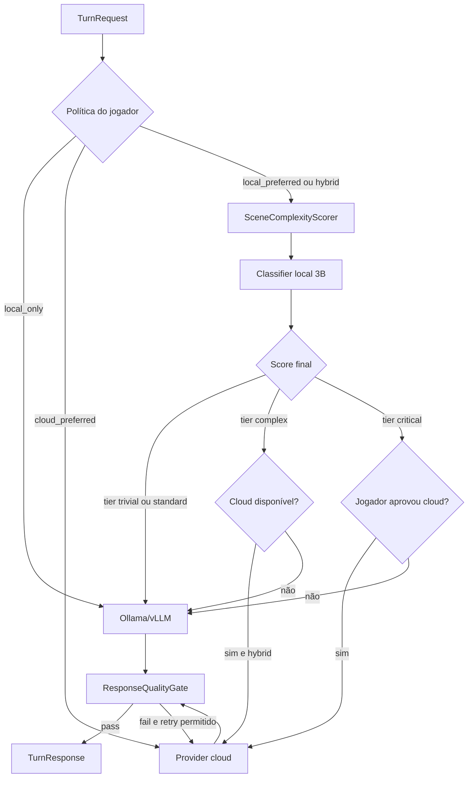
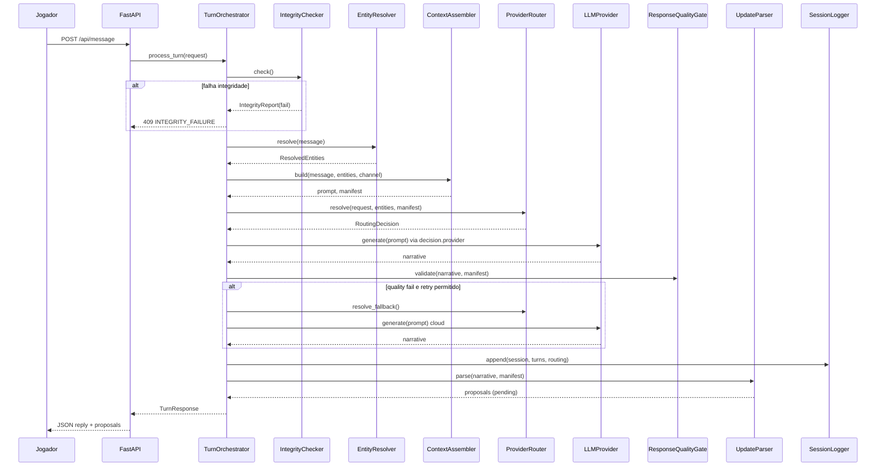
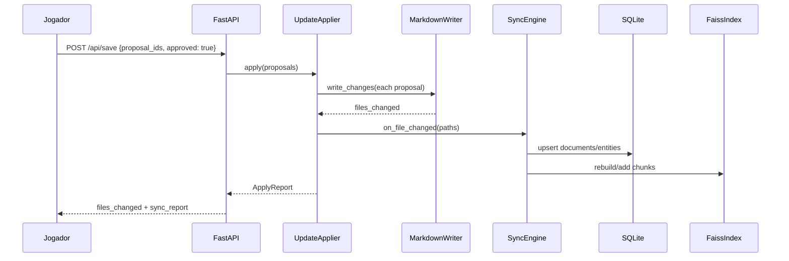

# Especificação Técnica v1.1 — Motor Narrativo Persistente

> **Base:** [especificacao_inicial.md](./especificacao_inicial.md)  
> **Campanha de referência:** repositório Cyberpunk RED (branch `feat/narracao-solo-mvp`)  
> **Objetivo deste documento:** permitir que outra IA gere o código-base de forma consistente, com contratos explícitos entre camadas.  
> **Changelog v1.1:** arquitetura LLM local (Ollama/vLLM), topologia Pi + laptop, estratégia de custo mínimo, `ProviderRouter` com escalonamento híbrido.

---

## 1. Escopo e versão

### 1.1 O que esta v1.1 cobre

| Área | Incluído | Fora de escopo (v1.2+) |
|------|----------|------------------------|
| Motor narrativo local (FastAPI) | Sim | Multi-jogador simultâneo |
| Markdown como fonte de verdade | Sim | Editor WYSIWYG |
| SQLite como índice estruturado | Sim | Replicação distribuída |
| Índice vetorial FAISS | Sim | Embeddings em GPU no Pi |
| **LLM local (Ollama/vLLM) como padrão** | **Sim** | Fine-tuning de modelos |
| Adaptadores LLM cloud (fallback opcional) | Sim | — |
| **ProviderRouter (local → cloud sob demanda)** | **Sim** | Billing automático de APIs |
| Topologia Raspberry + laptop | Sim | Cluster multi-nó |
| Docker Compose para dev/sessão | Sim | Kubernetes em produção |
| Front-end web (journal, ficha, chat) | Sim | App mobile nativo |
| Parser de atualização pós-narrativa | Contrato definido | Aplicação automática sem aprovação humana |
| Simulação off-screen de NPCs | Contrato de dados | Motor de simulação completo |

### 1.2 Relação com o MVP atual

O repositório já possui um protótipo funcional que **deve ser absorvido**, não descartado:

| MVP atual | Evolução na v1.0 |
|-----------|------------------|
| `scripts/narracao_engine.py` | Vira `motor/context/` + `motor/llm/` |
| `scripts/narracao_api.py` (http.server) | Substituído por `api/` (FastAPI) |
| `frontend/` | Mantido; consome nova API |
| Arquivos em `fichas/`, `board/`, `relacionamentos/` | Migrados para `campanha/` com frontmatter |
| `logs/journal/*.json` | Mantido; indexado no SQLite |
| Seleção de contexto por regex (`INTENT_RULES`) | Fase 1: regex; Fase 2: FAISS + entidades |

---

## 2. Arquitetura de alto nível

```text
┌─────────────────────────────────────────────────────────────────┐
│                         frontend/ (estático)                     │
│   index.html · app.js · styles.css                               │
└────────────────────────────┬────────────────────────────────────┘
                             │ HTTP/REST
┌────────────────────────────▼────────────────────────────────────┐
│                      api/ (FastAPI)                              │
│   routers: message, scene, context, journal, character, world    │
└────────────────────────────┬────────────────────────────────────┘
                             │
┌────────────────────────────▼────────────────────────────────────┐
│                   motor/ (Motor Narrativo)                       │
│  TurnOrchestrator · IntegrityChecker · ContextAssembler        │
│  ProviderRouter · ResponseQualityGate · EntityResolver          │
│  UpdateParser · UpdateValidator · SyncEngine                    │
└─────┬──────────────┬──────────────┬──────────────┬──────────────┘
      │              │              │              │
      ▼              ▼              ▼              ▼
 storage/      index/         llm/          campanha/
 (SQLite)      (FAISS)   (local+cloud)     (*.md)
                              │
                    ┌─────────┴─────────┐
                    ▼                   ▼
              Ollama/vLLM          Grok/OpenAI
              (GPU laptop)         (fallback opcional)
```

### 2.1 Princípio de dependência

```text
api → motor → (storage | index | llm | campanha)
```

- `api` **não** acessa SQLite nem Markdown diretamente.
- `motor` é a única camada que orquestra leitura/escrita de estado.
- `campanha/*.md` é a **fonte de verdade humana**; SQLite e FAISS são **derivados**.
- O **LLM narrativo nunca é fonte de memória** — local ou cloud apenas redige a partir do contexto montado pelo motor.
- **Provider padrão:** LLM local (`ollama`). Cloud só quando política de roteamento ou qualidade exigir.

### 2.2 Arquitetura LLM local e topologia de deploy

#### 2.2.1 Estratégia de custo

| Camada | Onde roda | Custo API |
|--------|-----------|-----------|
| Estado (`campanha/`, SQLite, journal) | Raspberry Pi 24/7 **ou** laptop | Zero |
| Montagem de contexto + FAISS | Laptop (sessão) | Zero |
| Embeddings (`MiniLM`) | Laptop CPU/GPU | Zero |
| **Narração principal** | Ollama/vLLM no laptop (RTX 4070) | Zero |
| Classificador de complexidade (3B) | Laptop CPU | Zero |
| Provider cloud | Somente se `ProviderRouter` escalar | Por token |

**Meta:** 95%+ dos turnos resolvidos localmente; cloud como exceção auditável.

#### 2.2.2 Topologia recomendada (Pi + laptop)

```text
┌─────────────────────────────────────────────────────────────┐
│ Raspberry Pi 4 (8 GB) — sempre ligado                         │
│  • campanha/ (git/rsync — fonte de verdade)                  │
│  • data/motor.db (réplica ou primária leve)                   │
│  • API read-only opcional (ficha, world, journal GET)         │
│  • SEM LLM, SEM Docker pesado                                 │
└───────────────────────────┬─────────────────────────────────┘
                            │ sync pré/pós sessão
                            ▼
┌─────────────────────────────────────────────────────────────┐
│ Laptop (64 GB, i7-12650H, RTX 4070) — durante a sessão      │
│  docker compose up                                            │
│  ┌─────────────┐  ┌──────────────┐  ┌─────────────────────┐  │
│  │ motor-api   │→ │ Ollama/vLLM  │  │ embedder (MiniLM)   │  │
│  │ :8787       │  │ 7B–8B Q4 GPU │  │ CPU ou GPU          │  │
│  └─────────────┘  └──────────────┘  └─────────────────────┘  │
│  frontend/ · FAISS rebuild · ProviderRouter                   │
└─────────────────────────────────────────────────────────────┘
```

**Modo desenvolvimento (sem Pi):** tudo no laptop com `docker compose -f deploy/docker-compose.yml`.

#### 2.2.3 Stack LLM local (hardware alvo: RTX 4070 8 GB VRAM)

| Papel | Modelo recomendado | Runtime | VRAM ~ |
|-------|-------------------|---------|--------|
| Narração principal | `llama3.1:8b-instruct-q4_K_M` | Ollama | 5–6 GB |
| Alternativa | `mistral:7b-instruct-q5_K_M` | Ollama | 5 GB |
| Alternativa | `qwen2.5:7b-instruct-q4_K_M` | Ollama | 5 GB |
| Classificador (router) | `phi3:mini` ou `qwen2.5:3b` | Ollama CPU | 0 GPU |
| Embeddings FAISS | `all-MiniLM-L6-v2` | sentence-transformers | opcional GPU |

**Não usar no Pi:** modelos de narração > 3B. No Pi, apenas API de estado e sync.

#### 2.2.4 Docker Compose (laptop)

Arquivo: `deploy/docker-compose.yml`

```yaml
services:
  motor:
    build: .
    ports: ["8787:8787"]
    volumes:
      - ./campanha:/app/campanha
      - ./data:/app/data
      - ./frontend:/app/frontend:ro
    environment:
      NARRACAO_PROVIDER: ollama
      LLM_ROUTING_POLICY: local_preferred
      OLLAMA_BASE_URL: http://ollama:11434
      OLLAMA_MODEL_NARRATION: llama3.1:8b-instruct-q4_K_M
      OLLAMA_MODEL_CLASSIFIER: phi3:mini
      EMBEDDER: local_minilm
    depends_on: [ollama]

  ollama:
    image: ollama/ollama:latest
    ports: ["11434:11434"]
    volumes: [ollama_data:/root/.ollama]
    deploy:
      resources:
        reservations:
          devices:
            - driver: nvidia
              count: 1
              capabilities: [gpu]

volumes:
  ollama_data:
```

Arquivo: `deploy/docker-compose.pi.yml` (somente motor leve, sem Ollama)

```yaml
services:
  motor:
    build: .
    ports: ["8787:8787"]
    volumes:
      - ./campanha:/app/campanha
      - ./data:/app/data
    environment:
      NARRACAO_PROVIDER: none
      LLM_ROUTING_POLICY: local_only
      # Pi não chama LLM; laptop assume na sessão
```

#### 2.2.5 Quem decide: local ou provider externo?

**Resposta curta:** o **Motor** decide via `ProviderRouter` — **não** o LLM narrativo sozinho.

Confiar apenas no autojulgamento do modelo (“consigo responder bem”) é **não confiável**: modelos locais tendem a superestimar capacidade e não têm visão do custo nem do histórico de falhas.

**Arquitetura de decisão em 4 camadas (ordem obrigatória):**

```text
1. Política do jogador (settings)     → local_only | local_preferred | hybrid | cloud_preferred
2. Heurísticas determinísticas        → complexidade da cena, tamanho do contexto, canal
3. Classificador local auxiliar (3B)  → tier: trivial | standard | complex | critical
4. Quality gate pós-resposta          → se falhar validação → 1 retry com cloud (se permitido)
```

O LLM local participa **somente** na camada 3 (classificador dedicado, prompt curto) e **nunca** como única fonte da decisão. O modelo de narração pode emitir um campo opcional `self_confidence` (0–1), usado como **sinal secundário com peso ≤ 0.15** na pontuação final.

**Fluxo de roteamento:**



**Heurísticas determinísticas (`SceneComplexityScorer`):**

| Fator | Peso | Exemplo |
|-------|------|---------|
| NPCs na cena (`board.md`) | +2 cada acima de 2 | 4 NPCs → +4 |
| `context_manifest.total_chars` > 20k | +3 | contexto pesado |
| Canal `gestor` com `extract_updates` | +2 | precisa JSON estruturado |
| Menção a combate / múltiplas rolagens | +3 | regex CPR |
| Arco emocional marcado no board | +1 | flag narrativa |
| Canal `narrador` off-record | −2 | cena mais simples |
| Mensagem < 80 chars, 0–1 NPC | −3 | turno trivial |

**Tiers e ação (política `local_preferred`):**

| Score | Tier | Ação padrão |
|-------|------|-------------|
| ≤ 2 | trivial | Local |
| 3–6 | standard | Local |
| 7–10 | complex | Local; cloud se `hybrid` e cloud configurado |
| ≥ 11 | critical | Perguntar jogador; cloud se aprovado |

**`ResponseQualityGate` (pós-geração, independente do provider):**

| Verificação | Falha → |
|-------------|---------|
| Menciona NPC não presente no manifest | retry ou escalar |
| Contradiz `board.md` (data/local) | retry ou escalar |
| Controla ações do protagonista (regex) | retry local |
| Resposta < 50 chars sem justificativa | retry |
| Bloco `UPDATE_PROPOSALS` inválido em modo gestor | retry |

Máximo **1 retry por turno**; se local falhar e política permitir → cloud. Registrar decisão em `provider_routing_log` (SQLite).

---

## 3. Estrutura de diretórios

### 3.1 Layout alvo do projeto

```text
cyberpunk-motor/
├── api/
│   ├── __init__.py
│   ├── main.py                 # FastAPI app, CORS, lifespan
│   ├── deps.py                 # injeção de dependências
│   ├── schemas.py              # Pydantic request/response
│   └── routers/
│       ├── message.py          # POST /api/message, /api/narracao, /api/narrador
│       ├── scene.py            # POST /api/scene
│       ├── context.py          # POST /api/context (preview de prompt)
│       ├── character.py        # GET /api/character-profile, /api/character-image
│       ├── journal.py          # CRUD /api/journal/{id}
│       ├── world.py            # GET /api/world, /api/timeline
│       ├── npc.py              # GET /api/npc/{id}
│       ├── search.py           # POST /api/search
│       ├── save.py             # POST /api/save (propostas aprovadas)
│       └── providers.py        # GET/POST providers, routing policy, preview
│
├── motor/
│   ├── __init__.py
│   ├── config.py               # Settings (pydantic-settings)
│   ├── turn_orchestrator.py    # fluxo principal de turno
│   ├── integrity_checker.py    # validação de arquivos obrigatórios
│   ├── entity_resolver.py      # extrai NPCs, locais, itens da mensagem
│   ├── context/
│   │   ├── assembler.py        # monta prompt em camadas
│   │   ├── layer.py            # enum + dataclass ContextLayer
│   │   ├── selector.py         # seleção híbrida regex + FAISS
│   │   ├── truncator.py        # limites de tokens/caracteres
│   │   └── intent_rules.py     # regras regex (legado MVP)
│   ├── markdown/
│   │   ├── parser.py           # frontmatter + árvore de seções
│   │   ├── writer.py           # gera/atualiza .md a partir de structs
│   │   ├── templates.py        # templates por tipo de entidade
│   │   └── sync_engine.py      # md ↔ sqlite ↔ faiss
│   ├── storage/
│   │   ├── database.py         # conexão SQLite, migrations
│   │   ├── repositories/       # um repo por agregado
│   │   └── models.py           # dataclasses / records de domínio
│   ├── index/
│   │   ├── faiss_index.py      # build, search, rebuild
│   │   └── embedder.py         # interface + implementações
│   ├── llm/
│   │   ├── base.py             # LLMProvider (Protocol)
│   │   ├── ollama.py           # LLM local (padrão)
│   │   ├── vllm.py             # LLM local alternativo (OpenAI-compatible)
│   │   ├── grok.py             # cloud fallback
│   │   ├── openai.py           # cloud fallback
│   │   ├── gemini.py
│   │   ├── none.py             # fallback estático
│   │   ├── factory.py          # resolve provider por config
│   │   ├── router.py           # ProviderRouter + SceneComplexityScorer
│   │   ├── quality_gate.py     # ResponseQualityGate
│   │   └── classifier.py       # classificador local 3B (tier de complexidade)
│   ├── update/
│   │   ├── parser.py           # extrai fatos da narrativa LLM
│   │   ├── validator.py        # guard-rails de consistência
│   │   ├── proposal.py         # UpdateProposal dataclass
│   │   └── applier.py          # aplica mudanças aprovadas
│   └── session/
│       ├── logger.py           # JSONL de turnos
│       └── journal_store.py    # JSON por personagem
│
├── campanha/                   # FONTE DE VERDADE (Markdown)
│   ├── meta/
│   │   ├── campanha.yaml       # id, nome, calendário, protagonista
│   │   └── registro_arquivos.md
│   ├── diretrizes/
│   │   ├── instrucoes_projeto.md
│   │   ├── diretrizes_ia.md
│   │   └── diretrizes_narrador.md
│   ├── regras/
│   │   └── sistema_cpr.md
│   ├── estado/
│   │   ├── board.md            # cena/missão atual
│   │   ├── dashboard.md        # resumo rápido
│   │   ├── heat.md
│   │   ├── reputacao.md
│   │   ├── economia.md
│   │   └── event_queue.md
│   ├── personagens/
│   │   └── ryan_wireghost_voss.md
│   ├── npcs/
│   │   ├── crew/
│   │   └── pack_badlands/
│   ├── faccoes/
│   ├── locais/
│   ├── itens/
│   ├── missoes/
│   ├── eventos/
│   ├── cronologia/
│   ├── relacionamentos/
│   ├── consequencias/
│   ├── memoria/
│   │   └── episodica/
│   └── logs/
│       ├── sessoes/
│       └── journal/
│
├── data/                       # DERIVADOS (não versionar no git)
│   ├── motor.db                # SQLite
│   ├── faiss/
│   │   ├── index.faiss
│   │   └── metadata.jsonl
│   └── sessions/
│       └── *.jsonl
│
├── frontend/                   # UI existente (adaptar API_BASE)
├── tests/
│   ├── unit/
│   ├── integration/
│   └── e2e/
├── deploy/
│   ├── docker-compose.yml      # laptop: motor + ollama + GPU
│   ├── docker-compose.pi.yml   # Pi: motor leve sem LLM
│   └── .env.example
├── scripts/
│   ├── migrate_legacy.py       # fichas/ → campanha/
│   ├── rebuild_index.py
│   ├── pull_models.sh          # ollama pull modelos recomendados
│   └── narracao_engine.py      # deprecado; wrapper CLI
├── pyproject.toml
└── README.md
```

### 3.2 Mapeamento do repositório legado

| Legado | Destino v1.0 |
|--------|--------------|
| `fichas/techie - ryan_wireghost_voss.md` | `campanha/personagens/ryan_wireghost_voss.md` |
| `fichas/*.md` (NPCs) | `campanha/npcs/**/*.md` |
| `board/board_campanha.md` | `campanha/estado/board.md` |
| `sistema/dashboard_contexto.md` | `campanha/estado/dashboard.md` |
| `relacionamentos/*.md` | `campanha/relacionamentos/*.md` |
| `heat.md`, `economia.md`, etc. | `campanha/estado/*.md` |
| `logs/journal/*.json` | `campanha/logs/journal/*.json` |
| `imagens/` | `campanha/assets/imagens/` (ou symlink) |

---

## 4. Módulos e classes

### 4.1 Convenções de código

- **Python 3.11+**
- **Constructor injection** em todas as classes de serviço
- Preferir `dataclass(frozen=True)` ou `record` para DTOs
- Tipagem explícita (`from __future__ import annotations`)
- Framework web: **FastAPI**
- ORM: **nenhum** na v1.0 — SQL direto via `sqlite3` ou `aiosqlite` com repositórios finos
- Config: `pydantic-settings` lendo `.env` e variáveis de ambiente

### 4.2 `motor/config.py`

```python
@dataclass(frozen=True)
class Settings:
    campanha_root: Path          # default: ./campanha
    data_root: Path              # default: ./data
    db_path: Path                # default: ./data/motor.db
    faiss_dir: Path              # default: ./data/faiss
    default_provider: str        # ollama | vllm | grok | openai | none
    llm_routing_policy: str      # local_only | local_preferred | hybrid | cloud_preferred
    max_context_chars: int       # default: 32000
    max_files_per_turn: int      # default: 12
    max_episodic_hours: int      # default: 48
    # LLM local
    ollama_base_url: str         # default: http://127.0.0.1:11434
    ollama_model_narration: str   # default: llama3.1:8b-instruct-q4_K_M
    ollama_model_classifier: str # default: phi3:mini
    vllm_base_url: str | None    # default: http://127.0.0.1:8000/v1
    vllm_model: str | None
    # LLM cloud (fallback)
    grok_bin: Path | None
    openai_api_key: str | None
    cloud_fallback_enabled: bool # default: False em local_only
    max_retries_per_turn: int    # default: 1
    # Rede / app
    host: str                    # default: 127.0.0.1
    port: int                    # default: 8787
    protagonist_id: str          # default: ryan_wireghost_voss
    deploy_profile: str          # laptop | raspberry | dev
```

### 4.3 `motor/turn_orchestrator.py`

Classe central. **Único ponto de entrada** para processar uma ação do jogador.

```python
class TurnOrchestrator:
    def __init__(
        self,
        settings: Settings,
        integrity: IntegrityChecker,
        entity_resolver: EntityResolver,
        context_assembler: ContextAssembler,
        provider_router: ProviderRouter,
        llm_factory: LLMProviderFactory,
        quality_gate: ResponseQualityGate,
        session_logger: SessionLogger,
        update_parser: UpdateParser,
        update_validator: UpdateValidator,
    ) -> None: ...

    async def process_turn(self, request: TurnRequest) -> TurnResponse:
        """
        Fluxo:
        1. integrity.check()
        2. entity_resolver.resolve(request.message)
        3. context_assembler.build(entities, request.mode, request.channel)
        4. provider_router.resolve(request, manifest) → RoutingDecision
        5. llm_factory.get(decision.provider).generate(prompt)
        6. quality_gate.validate(reply, manifest) → se fail e retry: passo 4–5 com fallback
        7. session_logger.append(turn) + routing_log
        8. update_parser.parse(reply) → proposals
        9. update_validator.validate(proposals)
        10. retornar TurnResponse (reply + proposals + routing; NÃO aplica automaticamente)
        """
```

**DTOs:**

```python
@dataclass(frozen=True)
class TurnRequest:
    message: str
    channel: Literal["narracao", "narrador", "gestor"]
    session_id: str | None
    protagonist_id: str
    provider_override: str | None = None       # force_local | force_cloud | ollama | grok | ...
    allow_cloud_escalation: bool | None = None   # None = usar política global
    extract_updates: bool = False

@dataclass(frozen=True)
class TurnResponse:
    reply: str
    channel: str
    provider: str                              # provider efetivo (ex: ollama)
    model: str | None
    session_id: str
    context_manifest: ContextManifest
    update_proposals: list[UpdateProposal]
    routing: RoutingDecision
    quality: QualityReport
    prompt_preview: str | None = None
    retried: bool = False
    estimated_cost_usd: float | None = None    # None se local
```

### 4.4 `motor/integrity_checker.py`

```python
class IntegrityChecker:
    MANDATORY_PATHS: ClassVar[list[str]] = [
        "diretrizes/instrucoes_projeto.md",
        "diretrizes/diretrizes_ia.md",
        "diretrizes/diretrizes_narrador.md",
        "estado/board.md",
        "estado/dashboard.md",
        "estado/heat.md",
        "estado/reputacao.md",
        "estado/economia.md",
        "estado/event_queue.md",
        "relacionamentos/mapa_relacional_geral.md",
        "consequencias/consequencias_persistentes.md",
    ]

    def check(self) -> IntegrityReport: ...
    def assert_ok(self) -> None: ...  # levanta IntegrityError
```

### 4.5 `motor/entity_resolver.py`

```python
@dataclass(frozen=True)
class ResolvedEntities:
    npc_ids: list[str]
    location_ids: list[str]
    faction_ids: list[str]
    item_ids: list[str]
    event_ids: list[str]
    keywords: list[str]
    confidence: float

class EntityResolver:
    def __init__(
        self,
        entity_index: EntityIndexRepository,
        alias_map: AliasMap,
    ) -> None: ...

    def resolve(self, message: str) -> ResolvedEntities:
        """
        Algoritmo em 3 passos:
        1. Match de aliases conhecidos (SQLite entity_aliases)
        2. Match regex de nomes capitalizados / apelidos da campanha
        3. Fallback: keywords para busca FAISS
        """
```

### 4.6 `motor/context/assembler.py`

```python
class ContextLayer(Enum):
    SYSTEM_RULES = 1
    GLOBAL_CONTEXT = 2
    WORLD_STATE = 3
    INVOLVED_NPCS = 4
    RELATIONSHIPS = 5
    RECENT_EVENTS = 6
    EPISODIC_MEMORY = 7
    CURRENT_SCENE = 8
    PLAYER_ACTION = 9

@dataclass(frozen=True)
class ContextBlock:
    layer: ContextLayer
    source_path: str
    section: str | None
    content: str
    priority: int
    char_count: int

@dataclass(frozen=True)
class ContextManifest:
    blocks: list[ContextBlock]
    total_chars: int
    truncated: bool
    entities: ResolvedEntities

class ContextAssembler:
    def build(
        self,
        message: str,
        entities: ResolvedEntities,
        channel: str,
        mode: str,
    ) -> tuple[str, ContextManifest]: ...
```

### 4.7 `motor/context/selector.py`

```python
class ContextSelector:
    def select_files(
        self,
        message: str,
        entities: ResolvedEntities,
    ) -> list[SelectedFile]:
        """
        Combina:
        - CORE_FILES (sempre)
        - INTENT_RULES (regex do MVP)
        - entity-linked files (SQLite document_links)
        - FAISS top-k (semântico)
        Deduplica e ranqueia por prioridade.
        """
```

### 4.8 `motor/markdown/parser.py`

```python
@dataclass(frozen=True)
class MarkdownDocument:
    path: str
    frontmatter: dict[str, Any]
    title: str
    intro_lines: list[str]
    sections: list[MarkdownSection]

@dataclass(frozen=True)
class MarkdownSection:
    title: str
    level: int          # 2-6
    content: str
    children: list[MarkdownSection]

class MarkdownParser:
    FRONTMATTER_PATTERN: ClassVar[re.Pattern]

    def parse(self, path: Path) -> MarkdownDocument: ...
    def parse_tree(self, text: str) -> MarkdownDocument: ...
    def extract_references(self, text: str) -> list[CrossRef]: ...
```

### 4.9 `motor/markdown/sync_engine.py`

```python
class SyncEngine:
    """Sincroniza campanha/*.md → SQLite + FAISS."""

    def full_sync(self) -> SyncReport: ...
    def sync_file(self, path: Path) -> None: ...
    def on_file_changed(self, path: Path) -> None: ...  # incremental
```

### 4.10 `motor/storage/repositories/`

Um repositório por agregado. Interface comum:

```python
class Repository(Protocol[T]):
    def get_by_id(self, entity_id: str) -> T | None: ...
    def list_all(self) -> list[T]: ...
    def upsert(self, entity: T) -> None: ...
    def delete(self, entity_id: str) -> None: ...
```

Repositórios concretos:

| Classe | Tabela(s) |
|--------|-----------|
| `CharacterRepository` | `characters` |
| `NpcRepository` | `npcs` |
| `FactionRepository` | `factions` |
| `LocationRepository` | `locations` |
| `RelationshipRepository` | `relationships`, `relationship_attributes` |
| `EventRepository` | `events` |
| `MissionRepository` | `missions` |
| `InventoryRepository` | `inventory_items` |
| `TimelineRepository` | `timeline_entries` |
| `ConsequenceRepository` | `consequences` |
| `EpisodicMemoryRepository` | `episodic_memory` |
| `DocumentRepository` | `documents`, `document_chunks` |
| `EntityAliasRepository` | `entity_aliases` |
| `JournalRepository` | `journal_entries` |
| `WorldStateRepository` | `world_state` |

### 4.11 `motor/llm/` — providers e roteamento

#### 4.11.1 `base.py`

```python
class LLMProvider(Protocol):
    name: str
    is_local: bool
    supports_structured_output: bool

    async def generate(
        self,
        prompt: str,
        *,
        temperature: float = 0.7,
        max_tokens: int = 4096,
        model: str | None = None,
    ) -> LLMResponse: ...

    async def healthcheck(self) -> bool: ...

@dataclass(frozen=True)
class LLMResponse:
    text: str
    provider: str
    model: str | None
    tokens_in: int | None
    tokens_out: int | None
    latency_ms: int
    self_confidence: float | None = None   # sinal opcional; peso baixo no router
```

#### 4.11.2 Implementações

| Classe | Arquivo | `is_local` | Uso |
|--------|---------|------------|-----|
| `OllamaProvider` | `ollama.py` | `True` | **Padrão** — narração e classificador |
| `VllmProvider` | `vllm.py` | `True` | Alternativa OpenAI-compatible |
| `GrokProvider` | `grok.py` | `False` | Fallback cloud |
| `OpenAIProvider` | `openai.py` | `False` | Fallback cloud |
| `NoneProvider` | `none.py` | `True` | Debug / Pi sem GPU |

```python
class OllamaProvider:
    async def generate(self, prompt, *, model=None, **kw) -> LLMResponse:
        # POST {base_url}/api/generate  JSON: {model, prompt, stream: false}
        ...

class LLMProviderFactory:
    def get(self, provider_name: str) -> LLMProvider: ...
    def list_available(self) -> list[ProviderInfo]: ...
```

#### 4.11.3 `router.py` — ProviderRouter

```python
@dataclass(frozen=True)
class RoutingDecision:
    provider: str              # ollama | grok | openai | ...
    model: str | None
    tier: Literal["trivial", "standard", "complex", "critical"]
    score: int
    reasons: list[str]         # auditoria legível
    policy: str
    escalated: bool            # True se subiu local→cloud
    requires_user_approval: bool

class SceneComplexityScorer:
    def score(
        self,
        request: TurnRequest,
        entities: ResolvedEntities,
        manifest: ContextManifest,
    ) -> int: ...

class ComplexityClassifier:
    """Modelo local pequeno (phi3:mini). NÃO narra — só classifica."""

    PROMPT_TEMPLATE: ClassVar[str] = """
    Classifique a complexidade narrativa desta ação de RPG.
    Retorne JSON: {"tier": "trivial|standard|complex|critical", "confidence": 0.0-1.0}
    Ação: {message}
    NPCs: {npc_ids}
    Contexto_chars: {total_chars}
    """

    async def classify(self, request: TurnRequest, manifest: ContextManifest) -> dict: ...

class ProviderRouter:
    def __init__(
        self,
        settings: Settings,
        scorer: SceneComplexityScorer,
        classifier: ComplexityClassifier,
        factory: LLMProviderFactory,
    ) -> None: ...

    async def resolve(
        self,
        request: TurnRequest,
        entities: ResolvedEntities,
        manifest: ContextManifest,
    ) -> RoutingDecision:
        """
        1. provider_override force_local → ollama
        2. provider_override force_cloud → cloud se configurado, senão erro
        3. policy local_only → ollama (falha se Ollama down)
        4. policy cloud_preferred → cloud se up, senão ollama
        5. local_preferred / hybrid:
           a. score = scorer.score(...)
           b. tier_classifier = classifier.classify(...)
           c. score_final = score + tier_bonus(tier_classifier) + 0.15 * self_confidence_future
           d. mapear tier → provider conforme tabela §2.2.5
        """

    async def resolve_fallback(
        self,
        original: RoutingDecision,
        quality_report: QualityReport,
    ) -> RoutingDecision | None:
        """Retorna cloud apenas se policy permitir e max_retries não excedido."""
```

#### 4.11.4 `quality_gate.py`

```python
@dataclass(frozen=True)
class QualityReport:
    passed: bool
    checks: list[QualityCheck]   # {name, passed, detail}

class ResponseQualityGate:
    def validate(
        self,
        reply: str,
        manifest: ContextManifest,
        channel: str,
    ) -> QualityReport: ...
```

### 4.12 `motor/update/`

```python
@dataclass(frozen=True)
class UpdateProposal:
    id: str
    target_path: str           # ex: campanha/estado/heat.md
    target_section: str | None
    change_type: Literal["append", "replace", "upsert_field", "insert_row"]
    payload: dict[str, Any]
    rationale: str
    confidence: float
    source_turn_id: str

class UpdateParser:
    def parse(self, narrative: str, manifest: ContextManifest) -> list[UpdateProposal]: ...

class UpdateValidator:
    def validate(self, proposals: list[UpdateProposal]) -> ValidationReport: ...

class UpdateApplier:
    """Só executa após aprovação explícita via POST /api/save."""

    def apply(self, approved: list[UpdateProposal]) -> ApplyReport: ...
```

### 4.13 `motor/index/faiss_index.py`

```python
@dataclass(frozen=True)
class ChunkMetadata:
    chunk_id: str
    document_id: str
    source_path: str
    section: str | None
    entity_ids: list[str]
    text_preview: str

class FaissIndex:
    def __init__(self, embedder: Embedder, index_dir: Path) -> None: ...

    def build(self, chunks: list[IndexedChunk]) -> None: ...
    def search(self, query: str, top_k: int = 8) -> list[SearchHit]: ...
    def add_chunks(self, chunks: list[IndexedChunk]) -> None: ...
    def remove_document(self, document_id: str) -> None: ...
```

### 4.14 `motor/session/`

```python
class SessionLogger:
    def append(self, session_id: str, turn: ChatTurn) -> None: ...
    def create_session(self) -> str: ...

@dataclass(frozen=True)
class ChatTurn:
    timestamp: str       # ISO-8601 UTC
    role: Literal["user", "assistant", "system"]
    message: str
    channel: str
    context_manifest: ContextManifest | None = None

class JournalStore:
    def list_entries(self, character_id: str) -> list[JournalEntry]: ...
    def add_entry(self, character_id: str, text: str, timestamp: str) -> JournalEntry: ...
    def delete_entry(self, character_id: str, entry_id: str) -> None: ...
```

---

## 5. Esquema SQLite (v1.0)

Arquivo: `data/motor.db`  
Engine: SQLite 3  
Charset: UTF-8  
Convenção de IDs: `snake_case` estável (ex: `ryan_wireghost_voss`, `lena_valk_kane`)

### 5.1 DDL completo

```sql
PRAGMA foreign_keys = ON;
PRAGMA journal_mode = WAL;

-- Metadados da campanha
CREATE TABLE campaigns (
    id              TEXT PRIMARY KEY,
    name            TEXT NOT NULL,
    calendar_start  TEXT,
    protagonist_id  TEXT NOT NULL,
    created_at      TEXT NOT NULL DEFAULT (datetime('now')),
    updated_at      TEXT NOT NULL DEFAULT (datetime('now'))
);

-- Documentos Markdown indexados
CREATE TABLE documents (
    id              TEXT PRIMARY KEY,
    path            TEXT NOT NULL UNIQUE,
    doc_type        TEXT NOT NULL,  -- character|npc|faction|location|state|log|rule|relationship|...
    title           TEXT,
    content_hash    TEXT NOT NULL,
    frontmatter_json TEXT,
    indexed_at      TEXT NOT NULL DEFAULT (datetime('now')),
    updated_at      TEXT NOT NULL DEFAULT (datetime('now'))
);

CREATE INDEX idx_documents_type ON documents(doc_type);
CREATE INDEX idx_documents_path ON documents(path);

-- Chunks para FAISS
CREATE TABLE document_chunks (
    id              TEXT PRIMARY KEY,
    document_id     TEXT NOT NULL REFERENCES documents(id) ON DELETE CASCADE,
    section         TEXT,
    chunk_index     INTEGER NOT NULL,
    text            TEXT NOT NULL,
    char_count      INTEGER NOT NULL,
    faiss_vector_id INTEGER
);

CREATE INDEX idx_chunks_document ON document_chunks(document_id);

-- Aliases para resolução de entidades
CREATE TABLE entity_aliases (
    id              INTEGER PRIMARY KEY AUTOINCREMENT,
    entity_id       TEXT NOT NULL,
    entity_type     TEXT NOT NULL,  -- character|npc|faction|location|item
    alias           TEXT NOT NULL,
    normalized      TEXT NOT NULL
);

CREATE UNIQUE INDEX idx_alias_unique ON entity_aliases(entity_type, normalized);

-- Personagens jogáveis
CREATE TABLE characters (
    id              TEXT PRIMARY KEY,
    name            TEXT NOT NULL,
    role            TEXT,
    document_id     TEXT REFERENCES documents(id),
    portrait_path   TEXT,
    is_protagonist  INTEGER NOT NULL DEFAULT 0
);

-- NPCs
CREATE TABLE npcs (
    id              TEXT PRIMARY KEY,
    name            TEXT NOT NULL,
    document_id     TEXT REFERENCES documents(id),
    faction_id      TEXT,
    location_id     TEXT,
    is_alive        INTEGER NOT NULL DEFAULT 1
);

-- Núcleo permanente do NPC (JSON estruturado)
CREATE TABLE npc_core (
    npc_id          TEXT PRIMARY KEY REFERENCES npcs(id) ON DELETE CASCADE,
    personality     TEXT,
    temperament     TEXT,
    values_json     TEXT,       -- JSON array
    goals_json      TEXT,
    traumas_json    TEXT,
    speech_style    TEXT,
    virtues_json    TEXT,
    flaws_json      TEXT,
    fears_json      TEXT,
    updated_at      TEXT NOT NULL DEFAULT (datetime('now'))
);

-- Estado atual do NPC (muda frequentemente)
CREATE TABLE npc_state (
    npc_id          TEXT PRIMARY KEY REFERENCES npcs(id) ON DELETE CASCADE,
    mood            TEXT,
    health_status   TEXT,
    location_id     TEXT,
    current_goal    TEXT,
    last_activity   TEXT,
    dominant_emotion TEXT,
    game_timestamp  TEXT,
    updated_at      TEXT NOT NULL DEFAULT (datetime('now'))
);

-- Facções
CREATE TABLE factions (
    id              TEXT PRIMARY KEY,
    name            TEXT NOT NULL,
    document_id     TEXT REFERENCES documents(id),
    reputation_global INTEGER DEFAULT 0
);

-- Locais
CREATE TABLE locations (
    id              TEXT PRIMARY KEY,
    name            TEXT NOT NULL,
    document_id     TEXT REFERENCES documents(id),
    parent_id       TEXT,
    faction_control TEXT
);

-- Relacionamentos (grafo)
CREATE TABLE relationships (
    id              TEXT PRIMARY KEY,
    source_id       TEXT NOT NULL,
    target_id       TEXT NOT NULL,
    rel_type        TEXT,           -- ally|rival|romantic|family|professional|...
    summary         TEXT,
    document_id     TEXT REFERENCES documents(id),
    updated_at      TEXT NOT NULL DEFAULT (datetime('now'))
);

CREATE UNIQUE INDEX idx_rel_pair ON relationships(source_id, target_id);

-- Atributos numéricos por relacionamento
CREATE TABLE relationship_attributes (
    id              INTEGER PRIMARY KEY AUTOINCREMENT,
    relationship_id TEXT NOT NULL REFERENCES relationships(id) ON DELETE CASCADE,
    attribute       TEXT NOT NULL,  -- trust|respect|admiration|loyalty|fear|anger|hatred|dependency|romance|moral_debt
    value           INTEGER NOT NULL CHECK (value BETWEEN 0 AND 100),
    updated_at      TEXT NOT NULL DEFAULT (datetime('now'))
);

CREATE UNIQUE INDEX idx_rel_attr ON relationship_attributes(relationship_id, attribute);

-- Histórico compartilhado (resumo, não dump completo)
CREATE TABLE relationship_history (
    id              INTEGER PRIMARY KEY AUTOINCREMENT,
    relationship_id TEXT NOT NULL REFERENCES relationships(id) ON DELETE CASCADE,
    summary         TEXT NOT NULL,
    game_timestamp  TEXT,
    created_at      TEXT NOT NULL DEFAULT (datetime('now'))
);

-- Eventos
CREATE TABLE events (
    id              TEXT PRIMARY KEY,
    code            TEXT,           -- E001
    title           TEXT NOT NULL,
    status          TEXT NOT NULL,  -- pending|active|resolved|potential
    priority        TEXT,
    document_id     TEXT REFERENCES documents(id),
    game_timestamp  TEXT,
    resolved_at     TEXT
);

-- Missões
CREATE TABLE missions (
    id              TEXT PRIMARY KEY,
    title           TEXT NOT NULL,
    status          TEXT NOT NULL,
    document_id     TEXT REFERENCES documents(id)
);

-- Inventário
CREATE TABLE inventory_items (
    id              TEXT PRIMARY KEY,
    owner_id        TEXT NOT NULL,
    owner_type      TEXT NOT NULL,  -- character|npc
    name            TEXT NOT NULL,
    quantity        INTEGER NOT NULL DEFAULT 1,
    metadata_json   TEXT
);

-- Cronologia
CREATE TABLE timeline_entries (
    id              TEXT PRIMARY KEY,
    game_timestamp  TEXT NOT NULL,
    title           TEXT NOT NULL,
    summary         TEXT,
    document_id     TEXT,
    entity_ids_json TEXT,           -- JSON array de IDs relacionados
    created_at      TEXT NOT NULL DEFAULT (datetime('now'))
);

CREATE INDEX idx_timeline_ts ON timeline_entries(game_timestamp);

-- Consequências permanentes
CREATE TABLE consequences (
    id              TEXT PRIMARY KEY,
    title           TEXT NOT NULL,
    description     TEXT,
    source_event_id TEXT,
    document_id     TEXT,
    is_active       INTEGER NOT NULL DEFAULT 1
);

-- Memória episódica (últimas N horas in-game)
CREATE TABLE episodic_memory (
    id              TEXT PRIMARY KEY,
    game_timestamp  TEXT NOT NULL,
    actor_id        TEXT,
    summary         TEXT NOT NULL,
    involved_ids_json TEXT,
    scene_id        TEXT,
    expires_at      TEXT,
    document_id     TEXT
);

CREATE INDEX idx_episodic_ts ON episodic_memory(game_timestamp);
CREATE INDEX idx_episodic_expires ON episodic_memory(expires_at);

-- Estado global do mundo (chave-valor tipado)
CREATE TABLE world_state (
    key             TEXT PRIMARY KEY,
    value_json      TEXT NOT NULL,
    updated_at      TEXT NOT NULL DEFAULT (datetime('now'))
);

-- Links documento ↔ entidade (para seleção de contexto)
CREATE TABLE document_links (
    id              INTEGER PRIMARY KEY AUTOINCREMENT,
    document_id     TEXT NOT NULL REFERENCES documents(id) ON DELETE CASCADE,
    entity_id       TEXT NOT NULL,
    entity_type     TEXT NOT NULL,
    link_reason     TEXT            -- primary_sheet|relationship|mention|state
);

CREATE INDEX idx_doc_links_entity ON document_links(entity_id, entity_type);

-- Journal do jogador
CREATE TABLE journal_entries (
    id              TEXT PRIMARY KEY,
    character_id    TEXT NOT NULL,
    timestamp       TEXT NOT NULL,
    text            TEXT NOT NULL,
    created_at      TEXT NOT NULL DEFAULT (datetime('now'))
);

CREATE INDEX idx_journal_character ON journal_entries(character_id);

-- Sessões de chat
CREATE TABLE chat_sessions (
    id              TEXT PRIMARY KEY,
    protagonist_id  TEXT NOT NULL,
    channel         TEXT NOT NULL,
    started_at      TEXT NOT NULL DEFAULT (datetime('now')),
    ended_at        TEXT
);

CREATE TABLE chat_turns (
    id              INTEGER PRIMARY KEY AUTOINCREMENT,
    session_id      TEXT NOT NULL REFERENCES chat_sessions(id),
    timestamp       TEXT NOT NULL,
    role            TEXT NOT NULL,
    message         TEXT NOT NULL,
    context_manifest_json TEXT,
    provider        TEXT
);

-- Propostas de atualização (auditoria)
CREATE TABLE update_proposals (
    id              TEXT PRIMARY KEY,
    session_id      TEXT,
    turn_id         INTEGER,
    target_path     TEXT NOT NULL,
    change_type     TEXT NOT NULL,
    payload_json    TEXT NOT NULL,
    status          TEXT NOT NULL DEFAULT 'pending',  -- pending|approved|rejected|applied
    created_at      TEXT NOT NULL DEFAULT (datetime('now')),
    applied_at      TEXT
);

-- Auditoria de roteamento LLM (local vs cloud)
CREATE TABLE provider_routing_log (
    id              INTEGER PRIMARY KEY AUTOINCREMENT,
    session_id      TEXT,
    turn_id         INTEGER,
    policy          TEXT NOT NULL,
    tier            TEXT NOT NULL,
    score           INTEGER NOT NULL,
    provider_used   TEXT NOT NULL,
    model_used      TEXT,
    escalated       INTEGER NOT NULL DEFAULT 0,
    retry_count     INTEGER NOT NULL DEFAULT 0,
    reasons_json    TEXT,
    quality_passed  INTEGER,
    estimated_cost_usd REAL,
    created_at      TEXT NOT NULL DEFAULT (datetime('now'))
);

CREATE INDEX idx_routing_session ON provider_routing_log(session_id);

-- Projeção FAISS (mapeamento vector_id → chunk_id)
CREATE TABLE faiss_vectors (
    vector_id       INTEGER PRIMARY KEY,
    chunk_id        TEXT NOT NULL UNIQUE REFERENCES document_chunks(id) ON DELETE CASCADE
);
```

### 5.2 Chaves em `world_state`

| key | Tipo JSON | Exemplo |
|-----|-----------|---------|
| `current_datetime` | string | `"2026-07-03T08:00:00"` |
| `current_location_id` | string | `"pack_badlands_camp"` |
| `weather` | object | `{"condition":"acid_rain","intensity":"light"}` |
| `heat_global` | string | `"medium"` |
| `active_scene_id` | string | `"scene_pack_morning"` |

---

## 6. Formato dos arquivos Markdown

### 6.1 Regras gerais

1. **UTF-8**, line endings LF.
2. Todo arquivo de entidade começa com **YAML frontmatter** delimitado por `---`.
3. Título H1 (`#`) = nome canônico da entidade.
4. Seções H2 (`##`) = blocos parseáveis pelo motor.
5. Links relativos entre arquivos: `[Label](../npcs/crew/valk.md)`.
6. Campos estruturados repetíveis usam **tabelas Markdown** ou listas com prefixo `- **Campo:** valor`.
7. O motor nunca altera comentários HTML nem blocos `> quote` sem proposta explícita.

### 6.2 Frontmatter padrão (entidades)

```yaml
---
id: ryan_wireghost_voss
type: character          # character|npc|faction|location|item|mission|event|state
name: Ryan "Wireghost" Voss
aliases: [Wireghost, Ryan Voss]
tags: [crew, techie, protagonist]
updated_at: 2026-07-03
source: human            # human|generated|imported
---
```

### 6.3 Personagem jogável (`campanha/personagens/*.md`)

**Seções obrigatórias (H2):**

| Seção | Conteúdo |
|-------|----------|
| `Aparência` | Texto livre + link de imagem |
| `Background` | História, memórias, segredos |
| `Atributos` | Tabela CPR (INT, REF, …) |
| `Humanidade e Cyberware` | HL, lista de implantes |
| `Skills` | Lista ou tabela |
| `Equipamento` | Armas, gear, drones |
| `Estado Atual` | HP, ferimentos, localização, humor *(mutável)* |

**Exemplo de tabela de atributos (parseável):**

```markdown
## Atributos (62 Pontos)

| Atributo | Valor | Modificador |
| -------- | ----- | ----------- |
| INT      | 7     | +7          |
| REF      | 6     | +6          |
```

O parser extrai para `characters` + JSON em `document_chunks`.

### 6.4 NPC (`campanha/npcs/**/*.md`)

**Seções obrigatórias:**

| Seção | Camada | Mutabilidade |
|-------|--------|--------------|
| `Núcleo Permanente` | Personalidade estável | Rara |
| `Personalidade` | Subseções: temperament, values, goals, traumas, speech | Rara |
| `Estado Atual` | mood, location, goal, emotion | **Alta** |
| `Relacionamento com Protagonista` | Resumo narrativo | Média |

**Formato do Núcleo Permanente:**

```markdown
## Núcleo Permanente

- **Personalidade:** Pragmática, leal, impulsiva sob pressão.
- **Temperamento:** Colérica moderada.
- **Valores:** Família escolhida, liberdade, honestidade brutal.
- **Objetivos:** Proteger o Pack; expandir influência nos Badlands.
- **Traumas:** Perda de comboio em 2044.
- **Modo de falar:** Direto, poucas palavras, sotaque local.
- **Virtudes:** Coragem, lealdade.
- **Defeitos:** Teimosia, ciúme.
- **Medos:** Abandono; corporações.
```

O sync engine mapeia campos `- **Campo:**` → colunas de `npc_core`.

**Formato do Estado Atual:**

```markdown
## Estado Atual

| Campo | Valor |
| ----- | ----- |
| Humor | Cansada |
| Localização | Tenda principal do Pack |
| Objetivo atual | Dormir; aguardar Ryan |
| Última atividade | Dormindo (03/07 manhã) |
| Emoção dominante | Afeto |
```

### 6.5 Relacionamento (`campanha/relacionamentos/*.md`)

```markdown
---
id: rel_ryan_valk
type: relationship
source_id: ryan_wireghost_voss
target_id: lena_valk_kane
rel_type: romantic
---

# Ryan → Lena "Valk" Kane

## Atributos

| Atributo | Valor |
| -------- | ----- |
| Confiança | 92 |
| Respeito | 88 |
| Admiração | 73 |
| Lealdade | 95 |
| Romance | 90 |
| Ódio | 0 |

## Histórico Compartilhado

- Ryan e Valk declararam amor mútuo (06/2026).
- Construíram rotina de intimidade e apoio emocional.
- Ryan saiu da tenda em silêncio (03/07 manhã) para não acordá-la.

## Estado Narrativo

**Status:** Namorando (consolidado)
**Última atualização:** 03/07/2026
```

Atributos da tabela → `relationship_attributes`. Bullets → `relationship_history`.

### 6.6 Estado do mundo (`campanha/estado/board.md`)

```markdown
---
id: board
type: state
scope: narrative
updated_at: 2026-07-03
---

# Board de Campanha

**Data Atual:** 03 de Julho de 2026 (manhã)
**Local:** Acampamento do Pack — área dos novatos

## Missão Atual

Texto livre descrevendo foco do protagonista.

## Pistas Confirmadas

- Item 1
- Item 2

## NPCs em Cena

| Nome | Papel | Relação | Notas |
| ---- | ----- | ------- | ----- |
| ... | ... | ... | ... |

## Facções Relevantes

...
```

### 6.7 Estado mecânico (`campanha/estado/heat.md`, `economia.md`, …)

Padrão comum:

```markdown
---
id: heat
type: state
scope: mechanical
---

# Sistema de Heat

**Heat Global:** Média

## Nível por Personagem

| Personagem | Nível | Justificativa |
| ---------- | ----- | ------------- |
| Ryan | Média | ... |
```

### 6.8 Memória episódica (`campanha/memoria/episodica/YYYY-MM-DD.md`)

```markdown
---
id: episodic_2026-07-03
type: episodic
game_date: 2026-07-03
expires_after_hours: 48
---

# Memória Episódica — 03/07/2026

| Hora (in-game) | Ator | Resumo |
| -------------- | ---- | ------ |
| 06:30 | ryan_wireghost_voss | Saiu da tenda sem acordar Valk |
| 07:00 | ryan_wireghost_voss | Observou novatos no acampamento |
```

### 6.9 Journal (`campanha/logs/journal/{character_id}.json`)

Formato JSON (não Markdown):

```json
[
  {
    "id": "ryan_wireghost_voss-1-123456",
    "timestamp": "07/07/2026, 11:14:44",
    "text": "Anotação do jogador"
  }
]
```

Regras:
- `id` = `{character_id}-{seq}-{hash6}`
- Persistido em JSON **e** espelhado em `journal_entries` (SQLite)
- O journal **não** é enviado ao LLM por padrão (canal exclusivo do jogador), exceto se o jogador pedir explicitamente no canal narrador

### 6.10 Log de sessão (`.jsonl`)

```json
{"timestamp":"2026-07-07T14:30:00Z","role":"user","message":"Observo os novatos","channel":"narracao"}
{"timestamp":"2026-07-07T14:30:05Z","role":"assistant","message":"...","channel":"narracao","provider":"grok"}
```

---

## 7. Índice vetorial (FAISS)

### 7.1 Estratégia de chunking

| Regra | Valor |
|-------|-------|
| Unidade | Seção H2 (ou H3 se H2 > 2000 chars) |
| Tamanho máximo | 1500 caracteres |
| Overlap | 100 caracteres entre chunks adjacentes |
| Metadados por chunk | `document_id`, `section`, `entity_ids`, `doc_type` |

### 7.2 Pipeline de indexação

```text
Markdown file
    → parse frontmatter + sections
    → split em chunks
    → embedder.embed(text) → vector float32[d]
    → FAISS IndexFlatIP (ou IndexHNSWFlat)
    → salvar data/faiss/index.faiss + metadata.jsonl
    → registrar em document_chunks + faiss_vectors
```

### 7.3 `metadata.jsonl` (uma linha por chunk)

```json
{"chunk_id":"chk_001","vector_id":0,"source_path":"campanha/npcs/pack_badlands/elias.md","section":"Estado Atual","entity_ids":["elias_recruit"],"doc_type":"npc"}
```

### 7.4 Embedder

```python
class Embedder(Protocol):
    dimension: int
    def embed(self, texts: list[str]) -> np.ndarray: ...
```

Implementações v1.0:
1. `LocalMiniLmEmbedder` — `sentence-transformers/all-MiniLM-L6-v2` (Raspberry Pi viável)
2. `OpenAIEmbedder` — `text-embedding-3-small` (opcional, nuvem)

---

## 8. API REST

Base URL: `http://{host}:{port}`  
Prefixo: `/api`  
Formato: JSON UTF-8  
Erros: `{"error": "mensagem", "code": "ERROR_CODE"}`

### 8.1 Compatibilidade com MVP existente

Os endpoints abaixo com prefixo `/api/narracao` e `/api/narrador` **devem ser mantidos** para não quebrar `frontend/app.js`.

### 8.2 Endpoints

#### `POST /api/message`

Endpoint canônico (substitui internamente narracao/narrador).

**Request:**

```json
{
  "message": "Vou verificar os novatos no acampamento",
  "channel": "narracao",
  "session_id": "sess_abc123",
  "protagonist_id": "ryan_wireghost_voss",
  "provider_override": null,
  "allow_cloud_escalation": null
}
```

**Response 200:**

```json
{
  "reply": "Texto narrativo...",
  "channel": "narracao",
  "provider": "ollama",
  "model": "llama3.1:8b-instruct-q4_K_M",
  "session_id": "sess_abc123",
  "context_manifest": {
    "files": ["campanha/estado/board.md", "campanha/npcs/pack_badlands/tomas.md"],
    "total_chars": 12400,
    "truncated": false,
    "entities": {
      "npc_ids": ["tomas_recruit"],
      "location_ids": ["pack_badlands_camp"]
    }
  },
  "routing": {
    "tier": "standard",
    "score": 4,
    "policy": "local_preferred",
    "escalated": false,
    "reasons": ["npc_count=1", "context_chars<20000", "classifier=standard"]
  },
  "quality": { "passed": true, "checks": [] },
  "retried": false,
  "estimated_cost_usd": null,
  "update_proposals": []
}
```

**`provider_override` aceitos:** `force_local`, `force_cloud`, `ollama`, `vllm`, `grok`, `openai`, `none`.

#### `POST /api/narracao` *(legado)*

Equivalente a `POST /api/message` com `"channel": "narracao"`.

#### `POST /api/narrador` *(legado)*

Equivalente a `POST /api/message` com `"channel": "narrador"`.

Modo narrador: prompt inclui instrução `OFF_RECORD: não alterar cronologia nem estado canônico`.

#### `POST /api/scene`

Define/atualiza a cena ativa.

**Request:**

```json
{
  "location_id": "pack_badlands_camp",
  "npc_ids": ["tomas_recruit", "elias_recruit", "mara_recruit"],
  "game_timestamp": "2026-07-03T08:00:00",
  "summary": "Ryan observa os novatos pela manhã"
}
```

**Response:** `{"scene_id": "scene_...", "world_state": {...}}`

#### `POST /api/context`

Retorna preview do prompt **sem chamar o LLM** (debug).

**Request:**

```json
{
  "message": "Como está o heat da crew?",
  "channel": "gestor"
}
```

**Response:**

```json
{
  "prompt": "# Sistema de Narracao...",
  "manifest": { "files": [...], "total_chars": 8200, "truncated": false }
}
```

#### `POST /api/search`

Busca semântica + estruturada.

**Request:**

```json
{
  "query": "relação Ryan Valk",
  "top_k": 8,
  "filters": { "doc_type": ["relationship", "npc"] }
}
```

**Response:**

```json
{
  "hits": [
    {
      "source_path": "campanha/relacionamentos/ryan_relacionamentos.md",
      "section": "Lena Valk Kane",
      "score": 0.89,
      "preview": "..."
    }
  ]
}
```

#### `POST /api/save`

Aplica propostas de atualização aprovadas pelo jogador.

**Request:**

```json
{
  "proposal_ids": ["prop_001", "prop_002"],
  "approved": true
}
```

**Response:**

```json
{
  "applied": 2,
  "files_changed": ["campanha/estado/heat.md"],
  "sync_report": { "sqlite": 2, "faiss_chunks_added": 1 }
}
```

#### `GET /api/world`

**Response:**

```json
{
  "current_datetime": "2026-07-03T08:00:00",
  "location": { "id": "pack_badlands_camp", "name": "Acampamento do Pack" },
  "weather": { "condition": "clear" },
  "heat_global": "medium",
  "active_events": ["E001", "E002"]
}
```

#### `GET /api/timeline?limit=20`

**Response:**

```json
{
  "entries": [
    {
      "id": "tl_001",
      "game_timestamp": "2026-06-23",
      "title": "Incursão noturna Raffen",
      "summary": "..."
    }
  ]
}
```

#### `GET /api/npc/{id}`

**Response:**

```json
{
  "id": "elias_recruit",
  "name": "Elias",
  "core": { "personality": "...", "goals": ["..."] },
  "state": { "mood": "Motivado", "location_id": "pack_badlands_camp" },
  "relationships": [
    { "target_id": "ryan_wireghost_voss", "trust": 75, "summary": "..." }
  ],
  "source_path": "campanha/npcs/pack_badlands/elias.md"
}
```

#### `GET /api/character-profile`

Compatível com MVP. Retorna árvore de seções parseada do protagonista.

#### `GET /api/character-image/{id}`

Retorna imagem binária (JPEG/PNG).

#### `GET /api/journal/{character_id}`

**Response:**

```json
{
  "characterId": "ryan_wireghost_voss",
  "storage": "campanha/logs/journal/ryan_wireghost_voss.json",
  "entries": [{ "id": "...", "timestamp": "...", "text": "..." }]
}
```

#### `POST /api/journal/{character_id}`

**Request:** `{"text": "...", "timestamp": "..."}`  
**Response 201:** lista completa de entries.

#### `DELETE /api/journal/{character_id}/{entry_id}`

Remove entrada. **Response 200:** lista atualizada.

#### `GET /api/npc-asset?name={name}&gender={gender}` *(legado MVP)*

Retorna URLs de token e imagem do NPC.

#### `GET /api/providers`

**Response:**

```json
{
  "default": "ollama",
  "routing_policy": "local_preferred",
  "cloud_fallback_enabled": false,
  "available": [
    { "id": "ollama", "label": "Ollama (local)", "is_local": true, "healthy": true },
    { "id": "vllm", "label": "vLLM (local)", "is_local": true, "healthy": false },
    { "id": "none", "label": "Desativado", "is_local": true, "healthy": true },
    { "id": "grok", "label": "Grok (cloud)", "is_local": false, "healthy": true },
    { "id": "openai", "label": "OpenAI (cloud)", "is_local": false, "healthy": false }
  ]
}
```

#### `POST /api/providers/select`

**Request:** `{"provider": "ollama"}`  
Define provider **padrão** em runtime (não exige reiniciar servidor). O `ProviderRouter` ainda pode escalar por turno conforme política.

#### `POST /api/routing/policy`

**Request:**

```json
{
  "policy": "local_preferred",
  "cloud_fallback_enabled": true
}
```

**Valores de `policy`:** `local_only` | `local_preferred` | `hybrid` | `cloud_preferred`

#### `POST /api/routing/preview`

Simula decisão de roteamento **sem chamar LLM narrativo**.

**Request:** `{"message": "...", "channel": "narracao"}`

**Response:**

```json
{
  "decision": {
    "provider": "ollama",
    "tier": "standard",
    "score": 5,
    "reasons": ["heuristic:npc_count=2", "classifier:standard"],
    "requires_user_approval": false
  },
  "would_escalate_to_cloud": false
}
```

Usado pelo front-end para exibir: *"Este turno usará modelo local"* ou *"Cena complexa — usar cloud?"*.

### 8.3 Códigos de erro

| HTTP | code | Quando |
|------|------|--------|
| 400 | `INVALID_REQUEST` | JSON inválido ou campo obrigatório ausente |
| 404 | `NOT_FOUND` | Entidade/arquivo não existe |
| 409 | `INTEGRITY_FAILURE` | Arquivos obrigatórios ausentes |
| 422 | `VALIDATION_ERROR` | Proposta de update inválida |
| 502 | `LLM_PROVIDER_ERROR` | Falha no provider externo |
| 503 | `LLM_UNAVAILABLE` | Ollama/cloud down ou saldo esgotado |
| 409 | `ROUTING_BLOCKED` | `local_only` mas cloud solicitado, ou `force_cloud` sem API key |

---

## 9. Fluxo de execução

### 9.1 Turno de narração (sequência)



### 9.2 Aplicação de atualizações (após aprovação)



### 9.3 Inicialização do servidor

```text
1. Carregar Settings (.env)
2. Abrir SQLite; rodar migrations se necessário
3. Se data/faiss/index.faiss ausente → SyncEngine.full_sync()
4. Registrar providers em LLMProviderFactory
5. Montar TurnOrchestrator com DI
6. Subir FastAPI + servir frontend/ como StaticFiles
7. Expor /api/providers com provider ativo
```

### 9.4 Canais de operação

| Canal | `channel` | Modo interno | Altera estado? | Enviado ao LLM? |
|-------|-----------|--------------|----------------|-----------------|
| Narração principal | `narracao` | `narrador` | Propostas (não auto) | Sim |
| Narrador privado | `narrador` | `narrador` + OFF_RECORD | Não | Sim |
| Gestor | `gestor` | `gestor` | Propostas (não auto) | Sim |

---

## 10. Algoritmo de montagem de contexto

### 10.1 Constantes

```python
CORE_FILES = [
    "diretrizes/instrucoes_projeto.md",
    "diretrizes/diretrizes_narrador.md",
    "estado/dashboard.md",
    "estado/board.md",
]

MECHANICAL_STATE_FILES = [
    "estado/heat.md",
    "estado/reputacao.md",
    "estado/economia.md",
    "estado/event_queue.md",
    "consequencias/consequencias_persistentes.md",
]

MAX_CONTEXT_CHARS = 32_000
MAX_FILE_CHARS = 4_000
MAX_EPISODIC_ENTRIES = 12
FAISS_TOP_K = 6
```

### 10.2 Pseudocódigo completo

```text
FUNÇÃO build_context(message, channel, protagonist_id):

  # ── Fase 1: Resolução de entidades ──
  entities ← EntityResolver.resolve(message)
  # entities = {npc_ids, location_ids, faction_ids, item_ids, keywords}

  # ── Fase 2: Seleção de arquivos candidatos ──
  candidates ← conjunto vazio

  ADICIONAR candidates, CORE_FILES

  SE channel == "narrador":
    ADICIONAR candidates, ["diretrizes/diretrizes_ia.md"]
    # OFF_RECORD: não incluir memória episódica nem board em mutação
  SENÃO:
    ADICIONAR candidates, MECHANICAL_STATE_FILES

  # 2a. Regras por intenção (regex — legado MVP)
  PARA CADA (pattern, files) EM INTENT_RULES:
    SE pattern.search(message):
      ADICIONAR candidates, files

  # 2b. Arquivos ligados a entidades (SQLite document_links)
  PARA CADA entity_id EM entities.npc_ids + entities.location_ids:
    links ← DocumentRepository.find_by_entity(entity_id)
    ADICIONAR candidates, links.paths

  # 2c. Busca semântica FAISS
  query ← message + " " + join(entities.keywords)
  hits ← FaissIndex.search(query, top_k=FAISS_TOP_K)
  PARA CADA hit EM hits:
    ADICIONAR candidates, hit.source_path

  # 2d. Protagonista sempre presente em narração
  SE channel != "narrador":
    ADICIONAR candidates, [protagonist_sheet_path]
    ADICIONAR candidates, [protagonist_relationships_path]

  candidates ← deduplicar(candidates)
  candidates ← ordenar_por_prioridade(candidates, entities)

  # ── Fase 3: Construção em camadas ──
  blocks ← lista vazia

  blocks += carregar_camada(SYSTEM_RULES,
    arquivos=["diretrizes/diretrizes_narrador.md"],
    max_chars=2000)

  blocks += carregar_camada(GLOBAL_CONTEXT,
    arquivos=["diretrizes/instrucoes_projeto.md", "regras/sistema_cpr.md"],
    max_chars=3000)

  SE channel != "narrador":
    blocks += carregar_camada(WORLD_STATE,
      arquivos=intersecção(candidates, MECHANICAL_STATE_FILES + ["estado/board.md"]),
      max_chars=6000)

    blocks += carregar_camada(CURRENT_SCENE,
      seções=["Missão Atual", "NPCs em Cena", "Pistas Confirmadas"],
      arquivo="estado/board.md",
      max_chars=3000)

  blocks += carregar_camada(INVOLVED_NPCS,
    para_cada npc_id EM entities.npc_ids:
      arquivo ← npc_repository.document_path(npc_id)
      seções ← ["Núcleo Permanente", "Estado Atual"]
      extrair(arquivo, seções, max_chars=1500))

  blocks += carregar_camada(RELATIONSHIPS,
    para_cada npc_id EM entities.npc_ids:
      rel ← relationship_repository.between(protagonist_id, npc_id)
      incluir_atributos_e_histórico(rel, max_chars=800))

  SE channel != "narrador":
    blocks += carregar_camada(RECENT_EVENTS,
      events ← event_repository.active(limit=5)
      incluir(events))

    blocks += carregar_camada(EPISODIC_MEMORY,
      entries ← episodic_repository.since(hours=MAX_EPISODIC_HOURS, limit=MAX_EPISODIC_ENTRIES)
      incluir(entries))

  blocks += carregar_camada(PLAYER_ACTION,
    conteúdo=message,
    max_chars=500)

  # ── Fase 4: Truncagem global ──
  total ← sum(block.char_count for block in blocks)
  SE total > MAX_CONTEXT_CHARS:
    blocks ← truncar_por_prioridade(blocks, MAX_CONTEXT_CHARS)
    truncated ← true
  SENÃO:
    truncated ← false

  # ── Fase 5: Montagem do prompt ──
  prompt ← """
  # Sistema de Narracao Solo - Prompt Orquestrado

  ## Regras obrigatorias
  - Se nao estiver registrado nos arquivos, nao trate como fato canonico.
  - Cite quais arquivos sustentam cada decisao importante.
  - Nao controle acoes do protagonista.
  {SE channel == "narrador": "- OFF_RECORD: conversa fora da cronologia. Nao altere estado."}

  ## Perfil de operacao
  {mode_hint(channel)}

  ## Pergunta do usuario
  {message}

  ## Contexto carregado
  {para cada block em blocks: formatar(block)}
  """

  manifest ← ContextManifest(blocks, total, truncated, entities)
  RETORNAR (prompt, manifest)
```

### 10.3 Prioridade de truncagem (quando exceder limite)

Ordem de **remoção** (primeiro removido = menor prioridade):

1. Chunks FAISS de baixo score
2. Memória episódica mais antiga
3. Eventos resolvidos
4. Seções secundárias de NPCs (manter `Estado Atual`)
5. Background completo de personagens
6. **Nunca remover:** CORE_FILES, ação do jogador, regras do narrador

### 10.4 INTENT_RULES (legado — manter até FAISS estar estável)

```python
INTENT_RULES = [
    (r"\b(heat|exposicao|perseguicao)\b", ["estado/heat.md", "estado/event_queue.md"]),
    (r"\b(reputacao|faccao|faccoes)\b", ["estado/reputacao.md", "faccoes/faccoes_geral.md"]),
    (r"\b(economia|grana|eddies|recursos)\b", ["estado/economia.md"]),
    (r"\b(valk|alex|reina|kaz|doc|jax|reyes|elias|mara|tomas)\b", ["relacionamentos/"]),
    (r"\b(pulso|off-screen|downtime)\b", ["memoria/episodica/", "diretrizes/pulso_procedimento.md"]),
]
```

---

## 11. Parser de atualização pós-narrativa

### 11.1 Formato esperado do LLM (contrato de saída)

Quando em modo gestor ou quando `extract_updates=true`, o prompt inclui instrução para o LLM **opcionalmente** anexar bloco estruturado:

```markdown
---UPDATE_PROPOSALS---
```json
[
  {
    "target_path": "campanha/estado/heat.md",
    "target_section": "Nível por Personagem",
    "change_type": "insert_row",
    "payload": {"personagem": "Ryan", "nivel": "Alta", "justificativa": "..."},
    "rationale": "Operação expôs a crew",
    "confidence": 0.85
  }
]
```
```

### 11.2 Pipeline do UpdateParser

```text
1. Separar texto narrativo do bloco UPDATE_PROPOSALS
2. Se bloco ausente: tentar extração heurística (opcional, v1.1)
3. Validar JSON contra schema UpdateProposal
4. Para cada proposta:
   a. Verificar target_path existe ou é criável
   b. Verificar change_type compatível com seção
   c. Validator checa consistência cruzada:
      - heat não pode baixar sem justificativa temporal
      - relacionamento não pode mudar >20 pontos em um turno
      - NPC não pode mudar de localização sem cena de viagem
5. Marcar status=pending em update_proposals (SQLite)
6. Retornar ao cliente; NÃO aplicar
```

---

## 12. Configuração e variáveis de ambiente

```env
# .env — perfil laptop (sessão com LLM local)
CAMPANHA_ROOT=./campanha
DATA_ROOT=./data
DEPLOY_PROFILE=laptop

# Provider padrão: LLM local
NARRACAO_PROVIDER=ollama
LLM_ROUTING_POLICY=local_preferred
CLOUD_FALLBACK_ENABLED=false
MAX_RETRIES_PER_TURN=1

# Ollama
OLLAMA_BASE_URL=http://127.0.0.1:11434
OLLAMA_MODEL_NARRATION=llama3.1:8b-instruct-q4_K_M
OLLAMA_MODEL_CLASSIFIER=phi3:mini

# vLLM (opcional)
VLLM_BASE_URL=
VLLM_MODEL=

# Cloud (opcional — só se hybrid/cloud_preferred)
GROK_BIN=C:\Users\Dante\.grok\bin\grok.exe
OPENAI_API_KEY=

# App
NARRACAO_API_HOST=127.0.0.1
NARRACAO_API_PORT=8787
PROTAGONIST_ID=ryan_wireghost_voss
MAX_CONTEXT_CHARS=32000
EMBEDDER=local_minilm
```

**Perfil Raspberry (`DEPLOY_PROFILE=raspberry`):**

```env
NARRACAO_PROVIDER=none
LLM_ROUTING_POLICY=local_only
# Sem OLLAMA_BASE_URL — LLM roda no laptop na sessão
```

---

## 13. Testes mínimos exigidos

| Camada | Teste | Critério |
|--------|-------|----------|
| `MarkdownParser` | parse ficha real | Seções H2 corretas |
| `EntityResolver` | "Vou falar com Valk" | `npc_ids` contém `lena_valk_kane` |
| `ContextAssembler` | mensagem sobre heat | manifest inclui `estado/heat.md` |
| `SyncEngine` | sync ficha → SQLite | row em `documents` + `characters` |
| `FaissIndex` | search "hidroponia" | retorna chunk de Elias |
| `JournalStore` | add + delete | JSON e SQLite consistentes |
| API e2e | Playwright existente | 9+ testes passando |
| `UpdateValidator` | proposta +20 trust | rejeita ou flag |
| `ProviderRouter` | mensagem trivial | `ollama`, tier `trivial` |
| `ProviderRouter` | 4 NPCs + combate, `hybrid` | escala ou pede aprovação |
| `ResponseQualityGate` | NPC inventado na resposta | `passed=false` |
| `OllamaProvider` | healthcheck | `true` com container up |
| API | `POST /api/routing/preview` | JSON com `decision` sem LLM narrativo |

---

## 14. Plano de migração (legado → v1.1)

```text
Fase 0 — Preparação
  ├── Criar estrutura campanha/ e data/
  ├── Implementar Settings + Database migrations
  └── Script migrate_legacy.py

Fase 1 — Paridade com MVP
  ├── FastAPI com endpoints legados (/api/narracao, /api/narrador, journal, ficha)
  ├── ContextAssembler com INTENT_RULES (regex)
  └── Frontend apontando para FastAPI (mesma porta 8787)

Fase 2 — Indexação
  ├── SyncEngine full_sync
  ├── FAISS + EntityResolver com aliases
  └── POST /api/search

Fase 3 — Atualização assistida
  ├── UpdateParser + UpdateValidator
  ├── POST /api/save com aprovação
  └── UI para revisar propostas

Fase 4 — LLM local (laptop)
  ├── OllamaProvider + docker-compose.yml
  ├── ProviderRouter + ComplexityClassifier
  ├── ResponseQualityGate
  └── Política local_preferred como padrão

Fase 5 — Raspberry Pi
  ├── docker-compose.pi.yml (motor sem LLM)
  ├── Sync campanha/ Pi ↔ laptop
  └── systemd unit para motor leve

Fase 6 — Híbrido opcional
  ├── Cloud fallback em hybrid
  ├── UI: preview de roteamento + aprovação em tier critical
  └── Métricas em provider_routing_log
```

---

## 15. Definição de pronto (DoD) — v1.1

O sistema v1.1 está pronto quando:

1. `docker compose -f deploy/docker-compose.yml up` sobe motor + Ollama + frontend em `8787`.
2. `POST /api/message` narra com **Ollama local** por padrão (`estimated_cost_usd: null`).
3. `POST /api/routing/preview` retorna decisão auditável sem gastar tokens de narração.
4. Canal `narrador` funciona localmente sem alterar estado canônico.
5. Journal e ficha funcionam como no MVP (incluindo e2e).
6. `scripts/rebuild_index.py` reconstrói SQLite + FAISS a partir de `campanha/`.
7. `IntegrityChecker` bloqueia turnos se arquivos obrigatórios faltarem.
8. Propostas de update são validadas e só persistidas após `POST /api/save`.
9. Com `LLM_ROUTING_POLICY=local_only`, nenhum turno chama cloud.
10. Com `hybrid` + quality gate fail, no máximo 1 retry cloud por turno, logado em `provider_routing_log`.
11. Trocar `ollama` → `grok` exige apenas config/factory — sem mudança no motor narrativo.

---

## 16. Referências

- [Especificação Inicial](./especificacao_inicial.md)
- [Arquitetura MVP](../sistema/arquitetura_narracao_solo.md)
- Código legado: `scripts/narracao_engine.py`, `scripts/narracao_api.py`, `frontend/`

---

*Documento gerado para implementação consistente. Versão: 1.1 — 2026-07-07.*