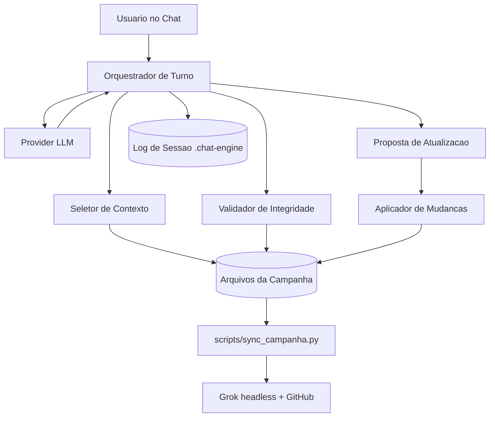

# Sistema de Narracao Solo - Arquitetura Base

Documento de arquitetura para evoluir este repositório em um sistema de narracao com automacao inteligente e interacao natural via chat.

## Objetivo

Criar um motor que:

- respeite o canon dos arquivos (estado verificavel)
- responda com fluidez em chat (modo narrador)
- proponha e aplique atualizacoes com rastreabilidade (modo gestor)
- automatize sync, resumo de sessao e manutencao de estado

## Principios

1. Estado externo verificavel: sem fato fora dos arquivos.
2. Duas personas operacionais: gestor (consistencia) e narrador (experiencia).
3. Automacao com trilha de auditoria: logs de turnos e diffs.
4. Mudancas de arquivo sempre explicitas e reversiveis.

## Componentes

## Fluxo de turno

1. Checar integridade minima.
2. Classificar intencao da mensagem.
3. Carregar contexto essencial + contexto por intencao.
4. Montar prompt com regras operacionais.
5. Consultar provider de chat.
6. Registrar log do turno.
7. Se houver alteracao de estado: gerar proposta de update por arquivo.

## Modos de operacao

## Modo Gestor

- foco: consistencia, impactos e arquivos a atualizar
- saida esperada: checklist objetivo + proposta de diffs

## Modo Narrador

- foco: cena, opcao de acao do jogador e consequencias plausiveis
- restricao: nao controlar protagonista nem inventar canon

## Contratos de dados

## Sessao de chat

- caminho: `.chat-engine/sessions/session-YYYYMMDD-HHMMSS.jsonl`
- formato: um objeto JSON por linha com `timestamp`, `role`, `message`

## Prompt consolidado

- contem: regras obrigatorias + pergunta do usuario + blocos de contexto
- limite: truncar arquivos longos para manter responsividade

## Integracoes atuais

- `scripts/sync_campanha.py`: sincronizacao Grok shares, delta e commit/push
- `scripts/prompts/atualizar-sessao.md`: instrucoes de update da campanha

## Integracoes recomendadas (proxima fase)

1. Router semantico por intents (substituir regex por classificador).
2. Normalizador de propostas em estrutura JSON antes de editar arquivos.
3. Guard-rails de consistencia cruzada:
   - board x dashboard x consequencias
   - relacionamentos x reputacao
   - event_queue x heat
4. Gerador automatico de resumo de sessao com secao de arquivos alterados.

## Roadmap incremental

1. MVP operacional:
   - usar `scripts/narracao_engine.py` para chat com contexto inteligente
   - manter `sync_campanha.py` como pipeline de automacao offline
2. Fase 2:
   - adicionar aprovacao humana por lote de arquivos
   - criar testes de regressao para consistencia de estado
3. Fase 3:
   - painel web simples para timeline de eventos, fila e relacoes
   - observabilidade (metricas de latencia, custo e taxa de conflito)

## Definicao de pronto (DoD)

Uma interacao esta pronta quando:

- resposta do chat cita base de estado coerente
- toda mudanca de arquivo foi proposta de forma explicita
- log de sessao foi salvo
- nao houve contradicao com `sistema/instrucoes_projeto.md`

## Tracking tecnico

- [status_projeto.md](../projeto/status_projeto.md) — fases, backlog, decisao de deploy
- [plano_implementacao_e_testes.md](../projeto/plano_implementacao_e_testes.md) — testes por fase

## Referencias

- [Instrucoes do Projeto](instrucoes_projeto.md)
- [Diretrizes IA](diretrizes_ia.md)
- [Diretrizes Narrador](diretrizes_narrador.md)
- [Como Atualizar Arquivos](como_atualizar_arquivos.md)
