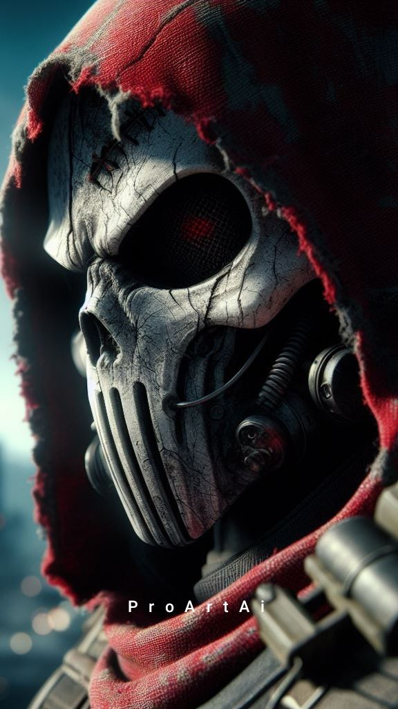

# Echo — Exposição, Void List e Heat

**SoT** de como a Media da crew move **reputação anti-corp** vs **Heat Global** vs **Heat individual**.  
**Arquivos ligados:** [heat.md](../heat.md) · [reputacao.md](../reputacao.md) · [ficha Echo](../fichas/media%20-%20emilia_echo_rivera.md) · [The Mule](../fichas/vehicle%20-%20the_mule.md)

**Última atualização:** 2026-09-05 (kit transmissão: caveira Void List + espartana Prometheus)

---

## 1. Princípios

| Princípio | Texto |
| --------- | ----- |
| Arma de dois gumes | Mais jobs, respeito na rua, medo nas corps **vs** caça e vigilância |
| Echo não gera Heat só por existir | Heat sobe com **exposição específica, pública ou identificável** |
| Escudo da marca | Corps caçam a **Void List**, não necessariamente cada rosto o tempo todo |
| Vidas paralelas | Heat individual baixo + marca pública = vida “normal” relativa no Time of the Red |
| Esfriar | Pack, mobilidade, silêncio, tempo, lavagem (ver §5 e heat.md) |

---

## 2. Marca e camadas de identidade

| Camada | Nome | Quem conhece | Função |
| ------ | ---- | ------------ | ------ |
| **Pública** (rua / Media / corps) | **Void List** | Quem ouve boato ou lê vazamento | Marca **vazia**: pesquisa não acha rastros concretos. “A **Void List** fez X.” |
| **Interna** (crew + Kaz) | **Null** | Só quem está dentro | Código de safehouse / projeto. “Estamos no **Null**”, “volta pro **Null**.” |

**Narrador:**

- Vazar **Void List** → reputação e Heat **de marca** (Global), não de pessoa.  
- **Null** em headline = quase **Nível 4** (base/projeto). **Nunca** default.  
- Apodos de rua antigos (“os da torre”, “os que limparam a BT”) podem coexistir; a Echo **redireciona** para Void List quando puder.

---

## 3. Regra de ouro (inegociável)

> **Exposição de detalhes individuais é inaceitável.**  
> Rosto, nome real, street name fixo, chrome único, rotina, Pack/base, Mule identificável, **Null** → **risco real de morte**.

| Quem | Postura |
| ---- | ------- |
| Crew / Ryan (default) | **Veto** a Nível **3–4** sem decisão explícita de plot |
| Echo insiste em rosto/handle/dossiê | **Tensão de equipe** (conflito de cena), não só +Heat silencioso |
| Echo no padrão correto | Edita rostos/detalhes **ou** pede **máscaras físicas** no job |

### Propaganda preferida (função > pessoa)

| Preferir | Evitar |
| -------- | ------ |
| “A **solo** fechou o perímetro” | “Reina Bearclaw…” |
| “A **netrunner** abriu o nó” | “Specter / Alex…” |
| “O **tech** manteve os drones” | “Wireghost…” |
| “A **nomad** estava a postos” | “Valk…” |
| “O **fixer** arranjou o job” | Kaz em boato de rua |
| “A **medtech** tirou gente da mesa” | Stitch / Doc confusão |
| “A **media**…” (se ela se mostrar) | Só se for escolha consciente de N3 |
| “O **Prometheus**…” | **Só** se ele estiver de **espartana** neste job (mensagem dele no ar) |
| Apelido pejorativo / qualquer coisa (Echo inventa) | “Prometheus” / Leo / Leopold **na caveira** |
| Redirecionar para **Void List** | Herói individual |

Quanto mais **genérico no indivíduo** e mais **forte na marca**, melhor: **Rep ↑** e **Heat individual ↓**.

---

## 4. Níveis de vazamento (0–4)

| Nível | Nome | Conteúdo típico | Rep anti-corp / rua | Heat Global | Heat Individual | Risco de caça |
| ----- | ---- | --------------- | ------------------- | ----------- | --------------- | ------------- |
| **0** | Arquivo morto | Nada público; material interno ou engavetado | 0 | 0 | 0 | nulo |
| **1** | **Fantasma / Void List** | Marca + op genérica; **funções** (“a solo”, “o tech”); sem rosto/handle/Pack/Mule/Null | ↑↑ | ↑ leve–moderado | **baixo** | baixo–médio |
| **2** | Headline sem rosto | Drama, falha de corp, silhueta, voz alterada, Void List em destaque | ↑↑↑ | ↑↑ | médio se estilo único vazar | médio |
| **3** | Rosto / handle | Identifica 1+ membros | ↑↑↑↑ | ↑↑↑ | **alto** nos citados | alto |
| **4** | Dossiê | Null, Pack, rotas, chrome, rotina, contatos | misto (rua ama, corp caça) | ↑↑↑↑ | **muito alto** | caça / morte |

### Defaults de mesa

| Situação | Nível |
| -------- | ----- |
| Echo age **sem consulta** | **1** (Fantasma + funções + Void List) |
| Job pediu propaganda / chantagem narrativa | **2** (crew pode frear) |
| **3–4** | Só com **decisão explícita** ou Echo **forçando tensão** |

### Degraus de Heat (usar escala já do heat.md)

| Nível do vazamento | Heat Global (típico) | Heat Individual (citados) | Notas |
| ------------------ | -------------------- | ------------------------- | ----- |
| 1 | Mantém ou ↑ leve | Sem mudança | Preferir “sem delta” se já estava em Média e vazamento foi limpo |
| 2 | ↑ 1 degrau se viral / corp ofendida | ↑ leve se estilo identifica | |
| 3 | ↑ 1–2 degraus | ↑ 1–2 nos citados | **Veto padrão** |
| 4 | Alta / threshold | ↑ forte + event_queue | Crise |

Sempre anotar em `heat.md` com **1 linha de justificativa**. Reputação: delta em `reputacao.md` (rua/fixers ↑; corp ofendida ↓ hostil).

---

## 5. Modo Fantasma vs Headline

| Modo | Níveis | Quando |
| ---- | ------ | ------ |
| **Fantasma** | 0–1 (às vezes 2) | **Default.** Marca cresce; vidas paralelas ok |
| **Headline** | 2–3 (4 só plot) | Guerra de narrativa, chantagem, job pediu face da Void List |

A Echo **gosta** de Headline (personalidade). A crew **freia** com frequência (“Plano B espetacular”). Usar como **tensão**, não como punição aleatória.

---

## 6. Lavagem de reputação

Objetivo: **Rep ↑** com quem importa e **Heat individual** estável ou caindo.

| Tática | Efeito |
| ------ | ------ |
| Atribuir tudo à **Void List** | Sucesso da marca, não de Wireghost/Valk |
| **Função > pessoa** | Script padrão de propaganda |
| Inimigo como monstro | Foco na falha da corp/Raffen |
| Tempo + silêncio | Esfriar (heat.md) |
| Pack como sombra | Mobilidade / desinformação (**sem** citar Null) |
| Falsas pistas / outra “lista” | Corp caça o fantasma errado (risco se descobrirem) |
| Kaz limpa boato | Favor / euro |
| Echo corrige narrativa | Blur tardio / “não eram esses rostos” — melhor cedo |

**Lavagem não apaga** Nível 3–4 já feito; só mitiga e compra tempo.

---

## 7. SOP de op (anti-exposição)

Jobs filmáveis / com Echo em campo:

- [ ] **Máscaras** se for gravar — kit **caveira** (abaixo), não retrato  
- [ ] Echo **edita** rostos e chrome único no pós  
- [ ] **Mule** sem takes “nu”: camadas anti-ID, ângulo, vanity no cut; **Alex**: contramedidas NET / anti-dox no veículo e no feed  
- [ ] Script de voz: **funções + Void List**, zero street names (exceção Prometheus = §7.1)  
- [ ] Sem Null, Pack, base, rotas no material  

Quebra do SOP → nível efetivo sobe (ex.: 1 vira 2, 2 vira 3).

### 7.1 Kit de transmissão (caveira / espartana)

Só em job que **vai ao ar** (Echo e/ou Prometheus no feed). Não é uniforme de downtime nem de toda op.

**Origem:** Echo pediu ao Ryan uma máscara para essas transmissões. Leo pentelhou o design até virar **caveira**. A crew não se importa com o desenho — só que a identidade fique oculta. Echo **odeia** o visual e **não raramente muda a dela** (outra máscara, blur, corte). SOP continua: rosto oculto > modelo.

**Pintura:** Leo **repinta as caveiras a cada job**. Silhueta igual, tinta nova. Não vira logo de gangue fixa.

| Quem | No feed | Como a Echo chama |
| ---- | ------- | ----------------- |
| Crew (default) | Caveira (pintura daquele job) | **Função:** a solo, o tech, a nomad, a netrunner, a medtech, o fixer, a media |
| **Prometheus de espartana** | Elmo espartano fechado + pano escuro por baixo | **Prometheus** — o handle público. Não é Leopold. |
| **Prometheus de caveira** | Caveira igual à crew | Echo inventa **apelido pejorativo** ou qualquer coisa. Nunca Prometheus, nunca Leo. Típico em **jobs mais perigosos** (ele perdeu a discussão). |

**Quando a espartana entra:** só se o job for **relevante para ele transmitir que está fazendo** — a mensagem é dele (chama, “o fogo não é deles”), e ainda é um job da crew. Visibilidade no **Prometheus**, SOP no resto. Discussão **em cena**: caveira ou espartana.

Ryan: meia-face tática = hábito de operador. Caveira = kit de **câmera** que ele fabricou. Não confundir.

**F23** · [ficha Leopold](../fichas/rockerboy%20-%20leopold_habsbruck.md) · caveira: [transmissao_caveira.jpg](../imagens/crew/transmissao_caveira.jpg) · espartana: [prometheus_espartana.jpg](../imagens/leopold/prometheus_espartana.jpg)

---

## 8. Exemplos canônicos

| Vazamento | Nível | Efeito resumido |
| --------- | ----- | --------------- |
| “A **Void List** limpou a torre; a solo e o tech fizeram o trabalho” | 1 | Rep ↑↑ · Global ↑ mod · ind. baixo |
| Void List + funções + **Prometheus** (espartana; job da mensagem dele) | 1–2 | Rep marca + visibilidade do handle; **não** dox de Leopold |
| Caveira no Leo + apelido pejorativo da Echo | 1 | Handle Prometheus **fora** do corte |
| Mini-doc dramático, silhuetas, marca Void List | 2 | Rep ↑↑↑ · Global ↑↑ |
| “Wireghost e a Nomad…” + rostos | 3 | **Veto padrão**; se forçar: ind. alto + tensão crew |
| Mapa do Pack / “Null” no ar | 4 | Crise · event_queue · risco de morte |

---

## 9. Estado atual (preencher em heat + aqui)

| Campo | Valor |
| ----- | ----- |
| Marca pública | **Void List** |
| Código interno | **Null** (crew + Kaz) |
| Modo padrão Echo | **Fantasma (N1)** |
| Último vazamento | — (data · nível · 1 linha) |

---

## 10. Referências

- [Heat](../heat.md) · [Reputação](../reputacao.md) · [Event Queue](../event_queue.md)  
- [Echo](../fichas/media%20-%20emilia_echo_rivera.md) · [Mule](../fichas/vehicle%20-%20the_mule.md) · [Alex](../fichas/netrunner%20-%20alex_specter_kane.md) · [Prometheus](../fichas/rockerboy%20-%20leopold_habsbruck.md) § máscaras  
- Atualização pós-sessão: [como_atualizar_arquivos.md](como_atualizar_arquivos.md)
